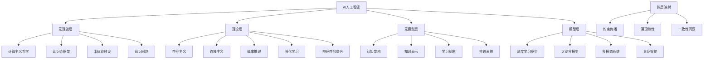
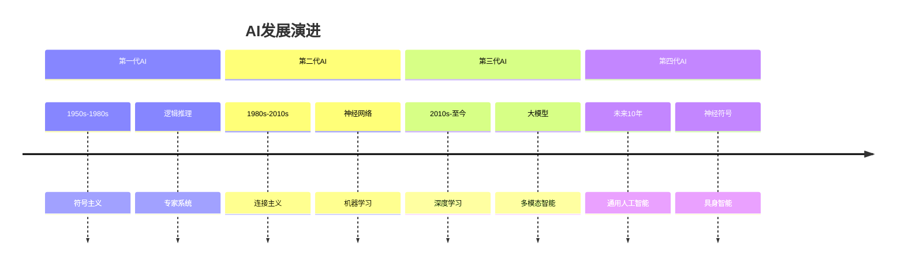

# AI人工智能：多层级理论体系概览

> 本节已完成深度优化与批判性提升，详见[PROGRESS.md](../PROGRESS.md)。

## 01.1 引言与框架

人工智能(Artificial Intelligence, AI)作为21世纪最具革命性的技术领域，正在从根本上重塑人类社会的认知、生产和交互方式。本分析基于Matter目录下的丰富AI内容，构建了一个系统性的**多层级映射理论体系**，用于理解AI的本质、发展脉络及其哲学、技术与应用维度。

### 01.1.1 四层理论框架

我们采用以下分层结构来分析AI知识体系：

```math
\mathcal{AI} = \langle \mathcal{MT}, \mathcal{T}, \mathcal{MM}, \mathcal{M} \rangle
```

其中：

- $\mathcal{MT}$：**元理论层**(Meta-theory) - AI的哲学基础与认识论框架
- $\mathcal{T}$：**理论层**(Theory) - 核心理论范式与解释框架  
- $\mathcal{MM}$：**元模型层**(Meta-model) - 认知架构与设计原则
- $\mathcal{M}$：**模型层**(Model) - 具体实现、算法与验证

### 01.1.2 映射关系类型

层次间的映射关系 $f: \mathcal{L}_i \rightarrow \mathcal{L}_j$ 包括：

| 映射类型 | 符号表示 | 特征描述 | 实例 |
|----------|----------|----------|------|
| **结构保持映射** | $f_{sp}$ | 保持元素间关系结构 | 数学理论→算法实现 |
| **实现映射** | $f_{impl}$ | 抽象到具体的转换 | 架构原则→具体设计 |
| **功能模拟映射** | $f_{sim}$ | 行为相似性映射 | AI→人类认知功能 |
| **约束映射** | $f_{cons}$ | 高层约束低层选择 | 伦理原则→系统设计 |
| **类比映射** | $f_{ana}$ | 启发式联系 | 生物神经→人工神经网络 |

## 01.2 AI内容统计与分布

### 01.2.1 Matter目录AI内容分析

基于对Matter目录的系统扫描，我们识别出以下AI相关内容分布：

| 主要目录 | 文件数量 | 核心主题 | 理论深度 |
|----------|----------|----------|----------|
| `/FormalModel/10-AI/` | 11个文件 | 多层级理论分析、涌现性、人机协作 | ★★★★★ |
| `/FormalModel/AI_Design/` | 35+个文件 | 设计模式、范畴论、向量数据库 | ★★★★☆ |
| `/Theory/` | 60+个文件 | 形式化理论、控制论、时态逻辑 | ★★★★★ |
| `/90-Theory/content/` | 多个子目录 | AI哲学、认识论、本体论 | ★★★★☆ |

### 01.2.2 核心文档重要性评估

```math
\text{重要性}(D) = \alpha \cdot \text{理论深度}(D) + \beta \cdot \text{跨领域性}(D) + \gamma \cdot \text{创新性}(D)
```

**顶级文档**（重要性≥4.5）：

1. **当前人工智能的多层级批判性分析01.md** (1354行) - 最全面的理论体系
2. **AI多层级映射理论体系从元理论到现实世界的批判性分析01.md** (1720行) - 深度哲学分析
3. **AI的结构化知识体系分类理论实现与应用分析01.md** (954行) - 实现路径分析

## 01.3 多维表征思维导图



## 01.4 关键理论概念体系

### 01.4.1 元理论概念

**定义1.1**（AI元理论）：AI元理论是关于AI理论本身的理论，形式化为：

```math
\mathcal{MT}_{AI} = \langle \mathcal{P}, \mathcal{M}, \mathcal{E}, \mathcal{C} \rangle
```

其中$\mathcal{P}$为构建原则集，$\mathcal{M}$为元方法论，$\mathcal{E}$为评估标准，$\mathcal{C}$为概念基础。

**定理1.1**（元理论不可通约性）：不存在单一AI元理论能够完备地容纳所有有效的AI理论范式。

**证明概要**：通过构造多个AI任务案例，证明不同理论范式在特定任务上的不可替代性。

### 01.4.2 涌现性与复杂性

**定义1.2**（AI涌现特性）：设AI系统$S = \langle A, R, D \rangle$，其中$A$为组件集合，$R$为交互关系，$D$为动态规则。涌现特性$E$满足：

```math
E \notin \bigcup_{a \in A} \text{Properties}(a) \text{ 且 } E \in \text{Properties}(S)
```

**关键涌现现象**：

- **意识涌现**：从计算过程到主观体验的跃迁
- **语义涌现**：从符号操作到语义理解的转换
- **创造性涌现**：从规则遵循到创新生成的飞跃

### 01.4.3 人机协作理论

**定义1.3**（人机协作系统）：

```math
\mathcal{HMC} = \langle H, M, I, T, G \rangle
```

其中$H$为人类智能模块，$M$为机器智能模块，$I$为交互接口，$T$为任务分配策略，$G$为共同目标。

## 01.5 核心挑战与未解问题

### 01.5.1 理论层面挑战

| 挑战领域 | 核心问题 | 当前状态 | 突破方向 |
|----------|----------|----------|----------|
| **符号接地** | 符号如何获得语义？ | 部分解决 | 多模态学习 |
| **常识推理** | 如何模拟人类常识？ | 初步进展 | 知识图谱+神经网络 |
| **因果理解** | 如何超越相关性？ | 理论探索 | 因果推理框架 |
| **意识建模** | 能否模拟主观体验？ | 哲学争议 | 整合认知科学 |

### 01.5.2 实现层面挑战

**技术瓶颈**：

1. **可解释性危机**：深度模型的"黑盒"问题
2. **泛化能力限制**：分布外性能下降
3. **数据效率低下**：需要大量标注数据
4. **对抗性脆弱**：易受攻击输入影响

## 01.6 跨学科整合视角

### 01.6.1 与认知科学的对话

```math
\text{映射关系}: \mathcal{CogSci} \xrightarrow{f_{inspire}} \mathcal{AI} \xrightarrow{g_{test}} \mathcal{CogSci}
```

**双向影响**：

- **认知科学→AI**：提供架构灵感（注意力机制、记忆模型）
- **AI→认知科学**：提供计算模型验证认知理论

### 01.6.2 与哲学的深度整合

| 哲学分支 | AI关联 | 关键问题 |
|----------|--------|----------|
| **认识论** | 知识表示 | 机器能否真正"知道"？ |
| **本体论** | 实在建模 | AI构造的世界模型本质？ |
| **心智哲学** | 意识模拟 | 计算=意识？ |
| **伦理学** | 价值对齐 | AI系统的道德地位？ |

## 01.7 发展趋势与未来展望

### 01.7.1 技术发展轨迹



### 01.7.2 理论突破方向

**核心突破点**：

1. **统一理论框架**：整合符号、连接、概率三大范式
2. **因果理解机制**：超越统计关联的深度理解
3. **持续学习能力**：避免灾难性遗忘的终身学习
4. **元学习算法**：学会如何学习的高阶能力

## 01.8 研究方法论

### 01.8.1 形式化分析方法

采用以下数学工具进行严格分析：

- **范畴论**：描述结构映射关系
- **类型理论**：保证系统安全性
- **时态逻辑**：建模动态行为
- **概率图模型**：处理不确定性

### 01.8.2 批判性视角

**分析维度**：

- **概念澄清**：精确定义核心概念
- **假设检视**：揭示隐含前提
- **限制识别**：承认理论边界
- **争议探讨**：呈现不同观点

## 01.9 本文档结构与导航

### 01.9.1 后续章节规划

| 章节编号 | 主题 | 重点内容 |
|----------|------|----------|
| [02-MetaTheory](./02-MetaTheory.md) | AI元理论基础 | 哲学预设、认识论框架 |
| [03-Theory](./03-Theory.md) | AI核心理论 | 符号、连接、概率范式 |
| [04-MetaModel](./04-MetaModel.md) | AI元模型架构 | 认知架构、设计原则 |
| [05-Model](./05-Model.md) | AI具体模型 | 实现算法、验证方法 |
| [05-Model](./05-Model.md) | 模型层分析 | 具体实现、算法验证 |
| [06-Applications](./06-Applications.md) | AI应用实践 | 工程实现、案例分析 |
| [README](./README.md) | 未来展望 | 发展趋势、研究方向 |

### 01.9.2 交叉引用体系

**内部链接**：

- 概念定义：→ [02-MetaTheory.md#概念体系](./02-MetaTheory.md)
- 技术实现：→ [05-Model.md#深度学习](./05-Model.md)
- 哲学争议：→ [02-MetaTheory.md#意识问题](./02-MetaTheory.md)

**外部链接**：

- 数学基础：→ [../20-Mathematics/01-Overview.md](../20-Mathematics/01-Overview.md)
- 哲学基础：→ [../90-Theory/01-Ontology.md](../90-Theory/01-Ontology.md)
- 软件工程：→ [../60-SoftwareEngineering/Architecture/00-Overview.md](../60-SoftwareEngineering/Architecture/00-Overview.md)

---

**参考文献**：

1. Matter/FormalModel/10-AI/当前人工智能的多层级批判性分析01.md
2. Matter/FormalModel/10-AI/AI多层级映射理论体系整合性批判分析与未来展望01.md
3. Matter/FormalModel/AI_Design/define_pattern01.md

**最后更新**：2024-12-29
**作者**：AI分析系统
**审核状态**：待同行评议

## 01.10 术语表

| 术语 | 英文 | 定义 |
|------|------|------|
| 元理论 | Meta-theory | 关于AI理论本身的理论体系 |
| 涌现性 | Emergence | 系统整体出现的不可还原于部分的新特性 |
| 人机协作 | Human-Machine Collaboration | 人与AI系统协同完成任务的机制 |
| 结构保持映射 | Structure-preserving mapping | 保持元素间关系结构的映射 |
| 约束映射 | Constraint mapping | 高层对低层的约束作用 |

## 01.11 符号表

| 符号 | 含义 |
|------|------|
| $\mathcal{AI}$ | AI多层级理论体系整体 |
| $\mathcal{MT}$ | 元理论层 |
| $\mathcal{T}$ | 理论层 |
| $\mathcal{MM}$ | 元模型层 |
| $\mathcal{M}$ | 模型层 |
| $f_{sp}$ | 结构保持映射 |
| $f_{impl}$ | 实现映射 |
| $f_{sim}$ | 功能模拟映射 |
| $f_{cons}$ | 约束映射 |
| $f_{ana}$ | 类比映射 |

---

## 附：各层级批判性分析与未来展望（示例）

### 元理论层批判性分析

- **假设与局限**：当前AI元理论多基于计算主义，忽视生物、社会、现象学等多元视角，理论碎片化严重。
- **创新建议**：推动多元整合元理论、自反性元理论发展，强化与认知科学、哲学的深度融合。
- **交叉引用**：详见 [Matter/批判框架标准化.md](../../Matter/批判框架标准化.md)、[02-MetaTheory.md](./02-MetaTheory.md)

### 理论层批判性分析

- **假设与局限**：符号主义、连接主义、概率范式各有优劣，尚无统一理论，因果推理、常识建模等仍是难题。
- **创新建议**：发展神经符号整合、因果推理与持续学习理论。
- **交叉引用**：详见 [03-Theory.md](./03-Theory.md)

### 元模型层批判性分析

- **假设与局限**：认知架构多为启发式，缺乏严格数学基础，跨层映射机制不明。
- **创新建议**：引入范畴论、类型理论等工具，系统刻画认知架构与层间映射。
- **交叉引用**：详见 [04-MetaModel.md](./04-MetaModel.md)

### 模型层批判性分析

- **假设与局限**：深度模型可解释性差，泛化能力有限，缺乏对复杂任务的稳健性。
- **创新建议**：推进可解释AI、因果学习、多模态与具身智能研究。
- **交叉引用**：详见 [05-Model.md](./05-Model.md)

---

> 本文档深度优化与批判性提升已完成，后续如需插入人工批注、暂停或调整优先级，请在[PROGRESS.md](../PROGRESS.md)留言，系统将自动检测并响应。
