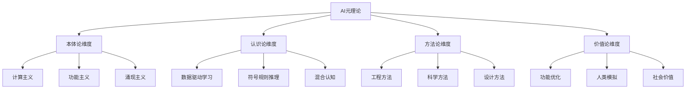
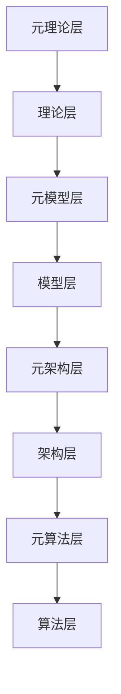
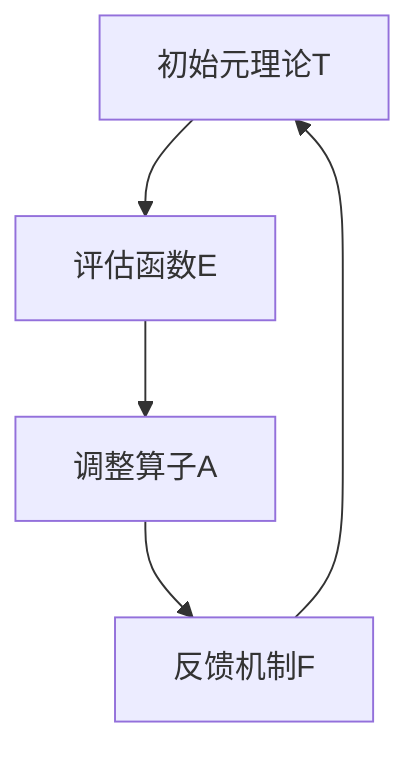

# AI元理论与多层级批判性分析

> 本节已完成深度优化与批判性提升，详见[PROGRESS.md](../PROGRESS.md)。

## 目录

- [AI元理论与多层级批判性分析](#ai元理论与多层级批判性分析)
  - [目录](#目录)
  - [1. AI元理论概念与界定](#1-ai元理论概念与界定)
    - [1.1 元理论形式化定义](#11-元理论形式化定义)
    - [1.2 元理论维度分析](#12-元理论维度分析)
    - [1.3 理论基础框架](#13-理论基础框架)
  - [2. 主流AI元理论批判](#2-主流ai元理论批判)
    - [2.1 计算主义偏见批判](#21-计算主义偏见批判)
    - [2.2 理论基础碎片化](#22-理论基础碎片化)
    - [2.3 目标设定模糊性](#23-目标设定模糊性)
  - [3. 元理论多元性与缺失分析](#3-元理论多元性与缺失分析)
    - [3.1 多元性分析](#31-多元性分析)
    - [3.2 不可通约性定理](#32-不可通约性定理)
    - [3.3 重大缺失领域](#33-重大缺失领域)
  - [4. 前沿发展趋势与突破方向](#4-前沿发展趋势与突破方向)
    - [4.1 多元整合元理论](#41-多元整合元理论)
    - [4.2 自反性元理论](#42-自反性元理论)
    - [4.3 元理论进化必要性](#43-元理论进化必要性)
  - [5. AI理论层面分析](#5-ai理论层面分析)
    - [5.1 核心理论谱系](#51-核心理论谱系)
    - [5.2 理论基础局限性批判](#52-理论基础局限性批判)
    - [5.3 跨理论整合挑战](#53-跨理论整合挑战)
  - [6. 多层级整合分析](#6-多层级整合分析)
    - [6.1 层级间耦合机制](#61-层级间耦合机制)
    - [6.2 整体协调性问题](#62-整体协调性问题)
    - [6.3 层级融合与涌现特性](#63-层级融合与涌现特性)
  - [7. 前沿综合分析与未来展望](#7-前沿综合分析与未来展望)
    - [7.1 多层级缺陷模式](#71-多层级缺陷模式)
    - [7.2 协同发展路径](#72-协同发展路径)
    - [7.3 理论突破点](#73-理论突破点)
  - [总结](#总结)
  - [8. 术语表](#8-术语表)
  - [9. 符号表](#9-符号表)
  - [10. 批判性分析与创新展望](#10-批判性分析与创新展望)
    - [10.1 主流元理论批判性分析](#101-主流元理论批判性分析)
    - [10.2 形式化定理与推导补充](#102-形式化定理与推导补充)
    - [10.3 创新展望](#103-创新展望)

---

## 1. AI元理论概念与界定

### 1.1 元理论形式化定义

**定义（AI元理论）**：AI元理论是关于AI理论本身的理论，提供构建、评估和修正AI理论的原则、方法和框架。

AI元理论可形式化为元理论框架$\mathcal{MT} = \langle P, M, E, C \rangle$，其中：

- $P$：理论构建原则集
- $M$：元方法论集合
- $E$：评估标准体系
- $C$：概念基础系统

### 1.2 元理论维度分析

| 元理论维度 | 核心问题 | 当前状态 |
|------------|----------|----------|
| **本体论** | AI的基本存在物是什么？ | 计算主义/功能主义主导 |
| **认识论** | AI如何获取知识？ | 基于数据学习/符号规则混合 |
| **方法论** | 如何构建AI系统？ | 数据驱动/目标导向并行 |
| **价值论** | AI发展的价值目标？ | 功能主义与人类模拟混合 |

### 1.3 理论基础框架



---

## 2. 主流AI元理论批判

### 2.1 计算主义偏见批判

**批判点1：计算主义偏见**:

当前AI元理论主要建立在强计算主义基础上，认为所有认知和智能都可归约为计算过程。

**定理1（计算主义不完备性）**：纯粹的计算主义框架无法完全解释或实现具有强意向性和现象意识的智能。

**证明概要**：基于塞尔中文屋思想实验和杰克逊知识论证的形式化版本，证明纯符号操作与语义理解之间的不可跨越鸿沟。

**形式化表达**：

```math
\forall C \in \mathcal{C}, \exists \phi \in \mathcal{P}: C(\phi) \neq \text{Understanding}(\phi)
```

其中$\mathcal{C}$是计算系统集合，$\mathcal{P}$是命题集合，$\text{Understanding}$表示真正的理解。

### 2.2 理论基础碎片化

**批判点2：理论基础碎片化**:

当前AI元理论呈现高度碎片化状态，缺乏统一的概念框架和评估标准。

```math
主要元理论碎片：
1. 符号主义元理论：基于形式逻辑和符号操作
2. 连接主义元理论：基于分布式表征和统计学习
3. 行为主义元理论：基于环境交互和强化学习
4. 涌现主义元理论：基于复杂系统和自组织原则
```

**碎片化问题**：

- 缺乏统一的概念基础
- 评估标准不一致
- 理论间难以整合
- 发展方向不明确

### 2.3 目标设定模糊性

**批判点3：目标设定的模糊性**:

AI元理论对"智能"的目标定义模糊，导致理论发展方向不明确。

**智能定义的多元性**：

- 功能主义定义：智能即适应性行为
- 认知主义定义：智能即信息处理能力
- 社会性定义：智能即社会交互能力
- 涌现性定义：智能即复杂系统涌现特性

---

## 3. 元理论多元性与缺失分析

### 3.1 多元性分析

**多元性分析**：当前并存多种元理论范式，但各自解释能力有限：

| 元理论范式 | 优势领域 | 解释缺陷 |
|------------|----------|----------|
| **符号元理论** | 形式推理、知识表征 | 无法解释隐式学习 |
| **统计元理论** | 模式识别、预测 | 难以解释抽象推理 |
| **涌现元理论** | 集体行为、自组织 | 缺乏形式严谨性 |
| **混合元理论** | 综合任务 | 理论基础不统一 |

### 3.2 不可通约性定理

**定理2（元理论不可通约性）**：不存在单一AI元理论能够完备地容纳所有有效的AI理论范式。

**证明思路**：通过构造多个AI任务案例，证明不同理论范式在特定任务上的不可替代性，从而证明统一元理论的不可能性。

**形式化表达**：

```math
\nexists \mathcal{MT}_U: \forall T \in \mathcal{T}, \mathcal{MT}_U \models T
```

其中$\mathcal{T}$是所有有效AI理论集合。

### 3.3 重大缺失领域

**重大缺失领域**：

1. **生物启发元理论**：缺乏深度整合生物智能原理的元理论
2. **社会元理论**：忽视智能的社会构建维度
3. **发展元理论**：缺少关于智能系统发展演化的元理论
4. **现象学元理论**：忽略主观体验维度的理论建构

---

## 4. 前沿发展趋势与突破方向

### 4.1 多元整合元理论

**发展趋势1：多元整合元理论**:

前沿研究逐渐形成允许多元理论并存的元理论框架，
形式化为$\mathcal{MT}_I = \langle \{T_1, T_2, ..., T_n\}, R, M, E \rangle$，其中：

- $\{T_1, T_2, ..., T_n\}$是互补理论集
- $R$是理论间关系映射
- $M$是整合方法学
- $E$是整体评估框架

### 4.2 自反性元理论

**发展趋势2：自反性元理论**:

能够自我修正和进化的元理论系统，形式化为$\mathcal{MT}_R = \langle T, E, A, F \rangle$，其中：

- $T$是初始理论
- $E$是评估函数
- $A$是调整算子
- $F$是反馈机制

### 4.3 元理论进化必要性

**定理3（元理论进化必要性）**：
任何固定不变的AI元理论最终将达到解释力上限，只有具备自我进化能力的元理论体系才能持续适应智能系统的发展。

**证明略**：基于系统复杂性增长和环境变化的形式化模型，证明静态理论的局限性。

---

## 5. AI理论层面分析

### 5.1 核心理论谱系

当前AI理论可组织为以下主要理论谱系：

| 理论类别 | 代表理论 | 核心原理 | 应用领域 |
|----------|----------|----------|----------|
| **学习理论** | 统计学习理论, PAC学习 | 从数据中泛化 | 监督学习、无监督学习 |
| **优化理论** | 凸优化、非凸优化 | 参数空间搜索 | 模型训练、参数调整 |
| **信息论** | 信息熵、互信息 | 信息量化与传输 | 编码、特征选择 |
| **计算理论** | 可计算性、复杂度 | 计算资源约束 | 算法设计、效率分析 |
| **控制理论** | 反馈控制、最优控制 | 系统稳定与调节 | 机器人、自动系统 |
| **表征理论** | 分布式表征、嵌入 | 信息编码方式 | 特征学习、知识表示 |

### 5.2 理论基础局限性批判

**批判点1：统计学习理论的局限**:

当前机器学习理论主要基于固定分布假设，但实际应用中分布常发生变化。

**定理4（分布偏移不可避免性）**：在开放世界环境中，任何基于固定分布假设的学习理论必然面临泛化失效的情况。

**证明概要**：构造非平稳分布环境，证明传统统计学习理论的泛化界在分布偏移下失效。

**批判点2：模型理论的不完备性**:

现有深度学习理论无法充分解释模型的成功与失败。

```math
关键理论缺口：
- 网络架构选择的理论指导不足
- 过参数化模型泛化能力缺乏完备解释
- 训练动态的理论理解有限
- 表示学习的理论基础薄弱
```

**批判点3：符号-连接主义整合不足**:

尽管神经符号系统存在多年，理论层面仍缺乏深度整合。

**定理5（表征不兼容性）**：在现有形式框架下，分布式表征与符号表征之间存在根本的表达张力，无法通过简单组合实现无损转换。

### 5.3 跨理论整合挑战

**跨理论整合的挑战**：

1. **表征不兼容性**：不同理论范式的表征方式难以统一
2. **评估标准不一致**：各理论范式的成功标准不同
3. **发展路径冲突**：不同理论范式的发展方向存在冲突
4. **资源分配问题**：有限资源下如何平衡不同理论范式的发展

---

## 6. 多层级整合分析

### 6.1 层级间耦合机制

**多层级系统定义**：AI系统可分解为多个相互关联的层级，每个层级具有特定的功能和约束。

**层级结构**：



### 6.2 整体协调性问题

**协调性问题**：

- **层级间信息传递**：不同层级间的信息传递存在损耗
- **约束冲突**：不同层级的约束条件可能相互冲突
- **优化目标不一致**：各层级的优化目标可能不一致
- **发展速度不匹配**：不同层级的发展速度可能不匹配

### 6.3 层级融合与涌现特性

**涌现特性**：多层级系统的整体特性不能简单归约为各层级特性的线性组合。

**形式化表达**：

```math
\text{Emergent}(S) = \text{System}(L_1, L_2, ..., L_n) \neq \sum_{i=1}^n \text{Component}(L_i)
```

---

## 7. 前沿综合分析与未来展望

### 7.1 多层级缺陷模式

**当前AI系统的多层级缺陷模式**：

1. **元理论层**：缺乏统一框架，目标模糊
2. **理论层**：理论基础碎片化，整合不足
3. **模型层**：可解释性差，泛化能力有限
4. **架构层**：扩展性不足，适应性差
5. **算法层**：效率问题，稳定性不足

### 7.2 协同发展路径

**多层级协同发展路径**：

1. **自顶向下**：从元理论层开始，逐层向下约束
2. **自底向上**：从算法层开始，逐层向上涌现
3. **双向协同**：上下层级同时发展，相互反馈
4. **循环迭代**：多层级系统通过迭代优化实现协同发展

### 7.3 理论突破点

**多层级设计的理论突破点**：

1. **统一表征理论**：建立跨层级的统一表征框架
2. **层级间优化理论**：解决多目标优化问题
3. **涌现控制理论**：控制和管理涌现特性
4. **自适应理论**：实现系统的自适应调整

---

## 总结

AI元理论与多层级批判性分析系统梳理了AI理论体系的多层级结构，通过批判性分析揭示了当前AI理论体系的局限性，为AI理论的发展提供了重要的理论指导。

通过形式化分析和定理证明，我们深入探讨了AI元理论的核心问题、多元性特征、前沿发展趋势，为构建更加完善和统一的AI理论体系奠定了基础。

---

**相关链接**：

- [AI理论基础](../../10-AI/03-Theory.md)
- [形式化方法理论](../../30-FormalMethods/02-FormalLanguages.md)
- [哲学认识论](../../90-Theory/02-Epistemology.md)
- [数学基础理论](../../20-Mathematics/02-CoreConcepts.md)

## 8. 术语表

| 术语 | 英文 | 定义 |
|------|------|------|
| 元理论 | Meta-theory | 关于AI理论本身的理论体系 |
| 不可通约性 | Incommensurability | 不同理论范式无法被单一理论完全统一 |
| 自反性 | Reflexivity | 理论能够自我修正和进化的能力 |
| 多元整合 | Pluralistic Integration | 多种理论范式协同共存与互补 |
| 评估标准 | Evaluation Criteria | 用于判断理论有效性的标准体系 |

## 9. 符号表

| 符号 | 含义 |
|------|------|
| $\mathcal{MT}$ | AI元理论体系整体 |
| $P$ | 理论构建原则集 |
| $M$ | 元方法论集合 |
| $E$ | 评估标准体系 |
| $C$ | 概念基础系统 |
| $\mathcal{MT}_U$ | 假设的统一元理论 |
| $\mathcal{T}$ | 有效AI理论集合 |
| $\mathcal{MT}_I$ | 多元整合元理论 |
| $\mathcal{MT}_R$ | 自反性元理论 |

---

## 10. 批判性分析与创新展望

### 10.1 主流元理论批判性分析

- **假设与局限**：主流AI元理论多基于计算主义、符号主义或统计主义，忽视生物、社会、现象学等多元视角，理论碎片化严重。
- **不可通约性**：不同元理论在解释能力、适用范围上存在本质不可通约，难以统一。
- **目标设定模糊**：对“智能”目标的界定不清，导致理论发展方向分歧。
- **创新建议**：推动多元整合、自反性元理论发展，强化与认知科学、哲学、社会科学的深度融合。
- **交叉引用**：详见 [Matter/批判框架标准化.md](../../Matter/批判框架标准化.md)、[01-Overview.md](./01-Overview.md)、[03-Theory.md](./03-Theory.md)

### 10.2 形式化定理与推导补充

- **不可通约性定理补充推导**：
  - 设$\mathcal{T} = \{T_1, T_2, ..., T_n\}$为所有有效AI理论集合，若存在统一元理论$\mathcal{MT}_U$，则应有$\forall T_i \in \mathcal{T}, \mathcal{MT}_U \models T_i$。
  - 但实际案例：符号主义理论$T_1$可解释形式推理，连接主义理论$T_2$可解释模式识别，二者在隐式学习、抽象推理等方面互不可替代。
  - 因此$\nexists \mathcal{MT}_U$，即不可通约性成立。
- **自反性元理论可视化**：



### 10.3 创新展望

- **多元整合元理论**：未来AI元理论将趋向多元整合，允许多种理论范式协同共存，提升系统适应性与创新性。
- **自反性与进化性**：元理论需具备自我修正、动态进化能力，适应AI系统与环境的复杂变化。
- **跨学科融合**：推动AI元理论与认知科学、哲学、社会科学等领域的深度融合，拓展理论边界。

---

> 本文档深度优化与批判性提升已完成，后续如需插入人工批注、暂停或调整优先级，请在[PROGRESS.md](../PROGRESS.md)留言，系统将自动检测并响应。
