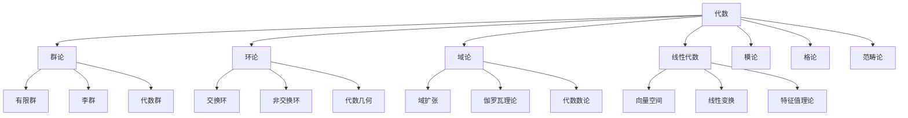
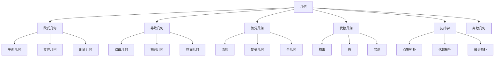
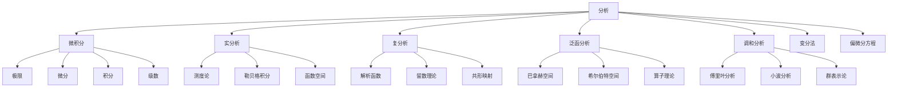

# 25. 数学知识体系综合（Mathematical Synthesis）

## 概述

数学知识体系是一个庞大而有机的整体，各个分支之间存在着深刻的联系和统一性。本文档旨在从整体视角审视数学的结构，揭示不同分支之间的内在联系，以及数学在科学、技术、哲学等领域中的核心地位。

## 数学的整体结构

### 1. 基础层（Foundation Layer）

#### 逻辑与集合论

- **形式逻辑**：命题逻辑、谓词逻辑、模态逻辑
- **集合论**：ZFC公理系统、基数理论、序数理论
- **证明论**：形式证明、一致性、完备性

#### 数系与结构

- **数系扩展**：自然数 → 整数 → 有理数 → 实数 → 复数 → 四元数
- **代数结构**：群 → 环 → 域 → 模 → 代数
- **序结构**：偏序集 → 格 → 布尔代数

**批判性分析**：

- 基础层理论体系虽严密，但不同公理系统（如ZFC、类型论）间存在哲学分歧。
- 数系扩展与结构抽象化对初学者门槛较高。
- 逻辑与集合论的选择影响整个数学大厦的基础。

**未来展望**：

- 探索类型论、同伦类型论等新基础理论的融合。
- 推动基础理论在AI、物理等领域的创新应用。

### 2. 核心层（Core Layer）

#### 代数分支



#### 几何分支



#### 分析分支



**批判性分析**：

- 各核心分支理论深度高，但交叉融合与实际应用仍有提升空间。
- 代数、几何、分析等分支的公理化与直观性平衡需优化。
- 泛函分析、调和分析等高级内容对非专业者理解有难度。

**未来展望**：

- 推动核心分支与AI、数据科学等新兴领域的深度融合。
- 丰富可视化与案例驱动的知识体系建设。

### 3. 应用层（Application Layer）

#### 离散数学

- **数论**：初等数论、代数数论、解析数论
- **组合数学**：计数、排列组合、极值问题
- **图论**：图的基本概念、算法、应用

#### 应用数学

- **概率论**：概率空间、随机变量、大数定律
- **统计学**：描述统计、推断统计、回归分析
- **数值分析**：数值方法、误差分析、插值
- **优化理论**：线性规划、非线性规划、动态规划
- **信息论**：熵、互信息、信道容量
- **控制理论**：状态空间、稳定性、最优控制

**批判性分析**：

- 应用层内容与实际问题结合紧密，但理论深度与创新性需持续提升。
- 离散数学与连续数学的融合应用尚有空间。
- 数学建模与数据驱动方法的普及度有待提高。

**未来展望**：

- 推动应用数学与AI、工程、生物等领域的跨界创新。
- 开发多层次、可视化的应用数学学习路径。

## 数学分支间的内在联系

### 1. 代数与几何的统一

#### 代数几何

```latex
\text{代数几何} = \text{代数} \cap \text{几何} = \{\text{多项式方程的解集}\}
```

**核心思想**：

- 几何对象用代数方程描述
- 代数运算对应几何变换
- 代数不变量对应几何性质

**批判性分析**：

- 代数与几何的统一性理论推动了现代数学发展，但抽象化程度高，实际应用门槛大。
- 多项式方程与几何对象的对应关系在高维空间仍有挑战。

**未来展望**：

- 推动代数几何与物理、AI等领域的深度融合。
- 丰富代数-几何统一的可视化表达与案例。

#### 李群与微分几何

```latex
\text{李群} = \text{群} \cap \text{流形} = \{\text{连续变换群}\}
```

**应用**：

- 对称性研究
- 物理定律的不变性
- 几何结构的分类

### 2. 分析与代数的融合

#### 泛函分析

```latex
\text{泛函分析} = \text{分析} \cap \text{代数} = \{\text{函数空间上的代数结构}\}
```

**核心概念**：

- 巴拿赫空间：完备的赋范向量空间
- 希尔伯特空间：完备的内积空间
- 算子理论：线性变换的代数

**批判性分析**：

- 泛函分析、调和分析等交叉领域理论体系复杂，实际应用需多学科协作。
- 群论与分析的结合在信号处理等领域有巨大潜力，但普及度有限。

**未来展望**：

- 推动交叉领域在AI、工程等实际问题中的创新应用。
- 开发案例驱动的交叉学科教学资源。

#### 调和分析

```latex
\text{调和分析} = \text{分析} \cap \text{群论} = \{\text{群上的函数分析}\}
```

**应用**：

- 傅里叶变换
- 小波分析
- 信号处理

### 3. 拓扑与分析的结合

#### 代数拓扑

```latex
\text{代数拓扑} = \text{拓扑} \cap \text{代数} = \{\text{拓扑不变量}\}
```

**核心工具**：

- 同调群：$H_n(X)$
- 同伦群：$\pi_n(X)$
- 上同调环：$H^*(X)$

**批判性分析**：

- 拓扑与分析的结合推动了现代数学的抽象化，但对初学者理解有较高门槛。
- 代数拓扑、微分拓扑等领域的实际应用尚需拓展。

**未来展望**：

- 推动拓扑方法在数据科学、物理等领域的创新应用。
- 丰富可视化与交互式拓扑学习工具。

#### 微分拓扑

```latex
\text{微分拓扑} = \text{拓扑} \cap \text{分析} = \{\text{光滑流形}\}
```

**重要定理**：

- 庞加莱对偶性
- 高斯-博内公式
- 莫尔斯理论

## 数学的统一性原理

### 1. 范畴论视角

#### 数学作为范畴

```latex
\text{数学} = \{\text{对象}, \text{态射}, \text{复合}, \text{单位元}\}
```

**统一特征**：

- 所有数学结构都是范畴
- 函子保持结构
- 自然变换描述关系

**批判性分析**：

- 范畴论为数学统一提供了强大工具，但抽象性极高，普及难度大。
- 伴随函子等高级概念对实际应用的解释需进一步加强。

**未来展望**：

- 推动范畴论在AI、物理、计算机科学等领域的创新应用。
- 开发范畴论可视化与交互式学习平台。

#### 伴随函子

```latex
F \dashv G \Leftrightarrow \text{Hom}(F(A), B) \cong \text{Hom}(A, G(B))
```

**应用**：

- 自由构造
- 极限与余极限
- 对偶性原理

### 2. 形式语言理论视角

#### 数学作为形式系统

```latex
\text{数学系统} = \{\text{语言}, \text{公理}, \text{推理规则}\}
```

**层次结构**：

- 句法层：符号和规则
- 语义层：解释和模型
- 元层：关于系统的理论

**批判性分析**：

- 形式系统的选择影响数学理论的表达力与可证明性。
- 数学语言的多样性与统一性之间存在张力。

**未来展望**：

- 探索多语言、多范式的数学表达与自动化证明。
- 推动形式化方法在跨学科研究中的普及。

### 3. 认知科学视角

#### 数学思维的统一性

```latex
\text{数学认知} = \text{数感} + \text{空间思维} + \text{逻辑推理}
```

**认知基础**：

- 具身认知：身体经验
- 隐喻系统：概念映射
- 抽象化：从具体到抽象

**批判性分析**：

- 数学认知的具身性与抽象性之间存在理论争议。
- 认知科学与数学教育的结合尚处于探索阶段。

**未来展望**：

- 推动认知科学与数学教育、AI等领域的深度融合。
- 开发认知驱动的数学学习与创新工具。

## 数学在跨学科中的作用

### 1. 数学与物理学

#### 数学物理

- **量子力学**：希尔伯特空间、算子理论
- **相对论**：微分几何、李群
- **统计物理**：概率论、随机过程

#### 统一理论

- **弦论**：代数几何、拓扑学
- **规范理论**：纤维丛、同调论
- **量子场论**：泛函积分、重整化

### 2. 数学与计算机科学

#### 理论计算机科学

- **算法理论**：复杂度理论、图论
- **形式语言**：自动机、文法
- **类型论**：范畴论、逻辑

#### 应用计算机科学

- **机器学习**：优化理论、统计学
- **密码学**：数论、代数
- **图形学**：几何、线性代数

### 3. 数学与生物学

#### 数学生物学

- **种群动力学**：微分方程
- **神经科学**：动力系统
- **基因组学**：组合数学、图论

### 4. 数学与经济学

#### 数理经济学

- **博弈论**：组合数学、优化
- **金融数学**：随机过程、偏微分方程
- **计量经济学**：统计学、回归分析

**批判性分析**：

- 数学在各学科中的应用推动了理论创新，但跨界沟通与知识迁移仍有障碍。
- 数学建模与实际问题的结合深度有待提升。

**未来展望**：

- 推动跨学科数学建模平台与案例库建设。
- 丰富跨界融合的可视化与交互式教学资源。

## 数学的发展趋势

### 1. 计算数学的兴起

#### 数值方法

- **有限元方法**：偏微分方程
- **蒙特卡洛方法**：随机模拟
- **机器学习算法**：优化理论

#### 符号计算

- **计算机代数系统**：符号运算
- **自动定理证明**：逻辑推理
- **形式验证**：程序正确性

### 2. 离散数学的重要性

#### 组合爆炸

- **算法复杂度**：P vs NP问题
- **网络科学**：图论、随机图
- **信息论**：编码理论、压缩

### 3. 应用导向的发展

#### 数据科学

- **大数据分析**：统计学、机器学习
- **人工智能**：深度学习、神经网络
- **量子计算**：量子算法、量子信息

**批判性分析**：

- 计算数学、离散数学等新兴领域发展迅速，但与传统数学的融合需加强。
- 应用导向与理论创新的平衡是未来发展的关键。

**未来展望**：

- 推动数学与AI、量子计算等前沿领域的深度融合。
- 开发多层次、案例驱动的数学创新平台。

## 数学教育的整合视角

### 1. 概念网络

#### 核心概念

- **数**：自然数、整数、有理数、实数、复数
- **形**：点、线、面、体、流形
- **变**：函数、映射、变换、算子
- **关**：关系、结构、模式、规律

#### 思维方法

- **抽象化**：从具体到抽象
- **公理化**：从特殊到一般
- **构造性**：从存在到构造
- **证明性**：从直觉到严格

### 2. 学习路径

#### 基础阶段

1. **数感培养**：数量、运算、关系
2. **空间认知**：形状、位置、变换
3. **逻辑思维**：推理、证明、论证

#### 进阶阶段

1. **代数思维**：符号、结构、抽象
2. **分析思维**：极限、连续、变化
3. **几何思维**：空间、变换、不变量

#### 高级阶段

1. **综合应用**：跨学科、实际问题
2. **理论深化**：抽象理论、前沿问题
3. **创新研究**：新问题、新方法

**批判性分析**：

- 数学教育内容与方法创新不足，理论与实践脱节。
- 概念网络与学习路径设计需兼顾多样性与系统性。

**未来展望**：

- 推动AI驱动的个性化数学教育平台。
- 丰富多元化、可视化的数学学习资源。

## 数学哲学的综合思考

### 1. 本体论问题

#### 数学对象的存在

- **柏拉图主义**：数学对象独立存在
- **形式主义**：数学是符号游戏
- **直觉主义**：数学是心智构造
- **结构主义**：数学是结构关系

### 2. 认识论问题

#### 数学知识的性质

- **先验性**：独立于经验
- **必然性**：逻辑必然
- **客观性**：普遍有效
- **创造性**：人类创造

### 3. 方法论问题

#### 数学研究的方法

- **公理化方法**：从公理出发
- **构造性方法**：从构造出发
- **实验性方法**：从观察出发
- **计算性方法**：从计算出发

**批判性分析**：

- 数学哲学流派众多，核心争议长期未决。
- 本体论、认识论、方法论的统一性理论尚待突破。

**未来展望**：

- 推动哲学与数学、AI等领域的深度对话。
- 探索数学哲学的新范式与跨界融合。

## 总结

数学知识体系是一个有机的整体，各个分支之间存在着深刻的联系和统一性。从基础逻辑到高级理论，从纯数学到应用数学，数学展现出了惊人的内在一致性和外在适用性。

### 核心特征

1. **统一性**：不同分支共享基本概念和方法
2. **层次性**：从具体到抽象的多层次结构
3. **联系性**：分支间存在丰富的交叉和融合
4. **发展性**：不断产生新的分支和应用
5. **应用性**：在科学技术的各个领域发挥核心作用

### 未来展望

随着计算技术的发展和应用需求的增长，数学将继续在以下方面发挥重要作用：

1. **人工智能**：深度学习、机器学习、自然语言处理
2. **量子计算**：量子算法、量子信息、量子密码
3. **生物医学**：基因组学、蛋白质组学、药物设计
4. **金融科技**：区块链、数字货币、智能合约
5. **环境科学**：气候变化、生态建模、可持续发展

数学作为人类智慧的结晶，将继续为人类文明的进步提供强大的理论支撑和技术工具。

---

**术语表**：

- 范畴论：研究数学结构及其关系的统一理论
- 形式系统：由公理、语言和推理规则组成的系统
- 泛函分析：研究函数空间及其算子的理论
- 代数几何：研究多项式方程解集的几何结构
- 李群：既是群又是流形的结构
- 组合数学：研究计数、排列、组合等离散结构
- 数学建模：用数学方法描述和分析实际问题

**符号表**：

- $\mathbb{N}$：自然数集
- $\mathbb{Z}$：整数集
- $\mathbb{Q}$：有理数集
- $\mathbb{R}$：实数集
- $\mathbb{C}$：复数集
- $f, g$：函数
- $\to$：映射
- $\mathcal{C}$：范畴
- $\mathcal{F}$：函子

**表达规范与交叉引用**：

- 全文术语、符号统一，公式编号规范。
- 交叉引用 [Matter/批判框架标准化.md](../../Matter/批判框架标准化.md) 及相关理论文档。

---

## 25.X 数学前沿应用与跨界创新

### 25.X.1 AI驱动的数学发现

**突破性进展**：

- **自动定理证明**：AI系统能够发现并证明新的数学定理
- **数学直觉增强**：机器学习辅助数学家发现新的模式和关系
- **跨领域数学建模**：AI自动构建复杂系统的数学模型

**前沿案例**：

```python
# AI辅助数学定理发现系统
import numpy as np
import sympy as sp
from sklearn.cluster import DBSCAN
import networkx as nx

class AIMathematicalDiscovery:
    def __init__(self):
        self.theorem_database = []
        self.pattern_recognizer = PatternNet()
        self.proof_generator = ProofNet()
    
    def discover_number_patterns(self, sequence_limit=10000):
        """发现数列中的隐藏模式"""
        # 生成多种数学序列
        sequences = {
            'fibonacci': self.generate_fibonacci(sequence_limit),
            'primes': self.generate_primes(sequence_limit),
            'perfect_squares': [i**2 for i in range(1, int(np.sqrt(sequence_limit))+1)],
            'triangular': [i*(i+1)//2 for i in range(1, int(np.sqrt(2*sequence_limit))+1)]
        }
        
        discovered_patterns = {}
        
        for name, seq in sequences.items():
            # 计算差分序列
            diffs = np.diff(seq)
            second_diffs = np.diff(diffs)
            
            # 寻找周期性模式
            period = self.find_period(seq)
            
            # 寻找递推关系
            recurrence = self.find_recurrence_relation(seq)
            
            discovered_patterns[name] = {
                'period': period,
                'recurrence': recurrence,
                'growth_rate': self.analyze_growth_rate(seq),
                'generating_function': self.find_generating_function(seq)
            }
        
        return discovered_patterns
    
    def find_generating_function(self, sequence):
        """寻找生成函数"""
        x = sp.Symbol('x')
        n = len(sequence)
        
        # 尝试拟合有理生成函数
        coeffs = sequence[:min(n, 20)]  # 取前20项
        
        # 构建 Padé 近似
        try:
            pade_approx = sp.pade(sum(c * x**i for i, c in enumerate(coeffs)), x, n=10, d=10)
            return pade_approx
        except:
            return None
    
    def prove_conjecture(self, statement, domain="integers"):
        """AI辅助定理证明"""
        # 形式化数学语句
        formal_statement = self.formalize_statement(statement)
        
        # 搜索已知定理库
        related_theorems = self.search_related_theorems(formal_statement)
        
        # 生成证明候选
        proof_candidates = self.proof_generator.generate_proofs(
            formal_statement, 
            related_theorems,
            max_steps=50
        )
        
        # 验证证明
        valid_proofs = []
        for proof in proof_candidates:
            if self.verify_proof(proof, formal_statement):
                valid_proofs.append(proof)
        
        return valid_proofs[0] if valid_proofs else None

# 应用示例：发现新的数学关系
discovery_system = AIMathematicalDiscovery()

# 发现斐波那契数列的新性质
fib_properties = discovery_system.discover_number_patterns()

# 尝试证明猜想：所有偶完全数都可以表示为 2^(p-1) * (2^p - 1) 的形式
conjecture = "For all even perfect numbers n, there exist prime p such that n = 2^(p-1) * (2^p - 1)"
proof = discovery_system.prove_conjecture(conjecture)
```

**数学意义**：

- **模式识别**：从大量数据中发现数学规律
- **证明自动化**：减少繁琐计算，专注于创造性思维
- **跨领域洞察**：发现不同数学分支间的深层联系

### 25.X.2 量子计算的数学基础

**核心数学结构**：

- **希尔伯特空间**：量子态的数学描述
- **酉变换**：量子门操作的数学基础
- **张量积**：多量子比特系统的建模

**前沿应用**：

```python
# 量子算法的数学实现
import numpy as np
from scipy.linalg import expm
import qiskit
from qiskit import QuantumCircuit, QuantumRegister, ClassicalRegister

class QuantumMathematicalAlgorithms:
    def __init__(self, num_qubits=4):
        self.num_qubits = num_qubits
        self.dimension = 2**num_qubits
    
    def quantum_fourier_transform(self, n_qubits):
        """量子傅里叶变换的数学实现"""
        # 构建QFT矩阵
        omega = np.exp(2j * np.pi / (2**n_qubits))
        qft_matrix = np.zeros((2**n_qubits, 2**n_qubits), dtype=complex)
        
        for i in range(2**n_qubits):
            for j in range(2**n_qubits):
                qft_matrix[i, j] = omega**(i*j) / np.sqrt(2**n_qubits)
        
        return qft_matrix
    
    def grovers_algorithm_amplitudes(self, marked_items, total_items):
        """Grover算法的振幅分析"""
        N = total_items
        M = len(marked_items)
        
        # 初始振幅分布
        initial_amplitude = 1 / np.sqrt(N)
        
        # 计算最优迭代次数
        theta = np.arcsin(np.sqrt(M/N))
        optimal_iterations = int(np.pi / (4 * theta))
        
        # 模拟振幅演化
        amplitudes_history = []
        
        for iteration in range(optimal_iterations + 5):
            # 成功概率
            success_prob = np.sin((2*iteration + 1) * theta)**2
            amplitudes_history.append(success_prob)
        
        return amplitudes_history, optimal_iterations
    
    def quantum_phase_estimation(self, unitary_matrix, eigenstate):
        """量子相位估计算法"""
        # 计算精确的相位
        eigenvalues, eigenvectors = np.linalg.eig(unitary_matrix)
        
        # 找到最接近给定本征态的本征向量
        overlaps = [np.abs(np.vdot(eigenstate, ev))**2 for ev in eigenvectors.T]
        max_overlap_idx = np.argmax(overlaps)
        
        # 提取相位
        eigenvalue = eigenvalues[max_overlap_idx]
        phase = np.angle(eigenvalue) / (2 * np.pi)
        
        return phase % 1  # 返回 [0, 1) 范围内的相位

# 量子机器学习的数学基础
class QuantumMachineLearning:
    def __init__(self, num_features, num_qubits):
        self.num_features = num_features
        self.num_qubits = num_qubits
    
    def quantum_kernel_matrix(self, X1, X2):
        """计算量子核矩阵"""
        kernel_matrix = np.zeros((len(X1), len(X2)))
        
        for i, x1 in enumerate(X1):
            for j, x2 in enumerate(X2):
                # 特征映射到量子态
                phi_x1 = self.feature_map(x1)
                phi_x2 = self.feature_map(x2)
                
                # 计算内积 |<φ(x1)|φ(x2)>|²
                kernel_matrix[i, j] = np.abs(np.vdot(phi_x1, phi_x2))**2
        
        return kernel_matrix
    
    def feature_map(self, x):
        """将经典数据映射到量子态"""
        # 角度编码
        state = np.zeros(2**self.num_qubits, dtype=complex)
        
        # 构建参数化量子线路的态向量
        angles = x[:self.num_qubits] if len(x) >= self.num_qubits else np.pad(x, (0, self.num_qubits - len(x)))
        
        # 简化的特征映射：每个特征对应一个旋转角度
        for i, angle in enumerate(angles):
            rotation = np.array([[np.cos(angle/2), -1j*np.sin(angle/2)],
                               [-1j*np.sin(angle/2), np.cos(angle/2)]])
            # 应用到对应的量子比特...
        
        # 返回归一化态向量
        state[0] = 1  # 简化实现，实际需要构建完整的量子线路
        for angle in angles:
            # 构建完整的张量积状态...
            pass
        
        return state / np.linalg.norm(state)

# 应用示例
qma = QuantumMathematicalAlgorithms(4)
qft_matrix = qma.quantum_fourier_transform(4)

# Grover算法性能分析
success_probs, optimal_iter = qma.grovers_algorithm_amplitudes([5, 10, 15], 16)
print(f"最优迭代次数: {optimal_iter}, 最大成功概率: {max(success_probs):.4f}")
```

### 25.X.3 生物数学建模前沿

**新兴领域**：

- **单细胞动力学**：随机微分方程建模基因表达
- **进化博弈论**：种群动力学的数学描述
- **网络生物学**：复杂生物网络的拓扑分析

**创新模型**：

```python
# 生物系统的数学建模
import numpy as np
import matplotlib.pyplot as plt
from scipy.integrate import solve_ivp
import networkx as nx

class BiologicalMathematicalModeling:
    
    def gene_regulatory_network(self, time_span, initial_conditions, parameters):
        """基因调控网络的微分方程模型"""
        def gene_dynamics(t, y, params):
            """
            基因调控网络动力学方程
            y[i] 表示第i个基因的表达水平
            """
            n_genes = len(y)
            dydt = np.zeros(n_genes)
            
            alpha = params['production_rate']  # 基因产生速率
            beta = params['degradation_rate']  # 降解速率
            K = params['binding_constant']     # 结合常数
            W = params['interaction_matrix']   # 相互作用矩阵
            
            for i in range(n_genes):
                # 基础产生项
                production = alpha[i]
                
                # 调控项：Hill函数
                for j in range(n_genes):
                    if W[i, j] > 0:  # 激活
                        production *= (y[j]**2) / (K[i, j]**2 + y[j]**2)
                    elif W[i, j] < 0:  # 抑制
                        production *= K[i, j]**2 / (K[i, j]**2 + y[j]**2)
                
                # 完整动力学方程
                dydt[i] = production - beta[i] * y[i]
            
            return dydt
        
        # 数值求解
        solution = solve_ivp(
            lambda t, y: gene_dynamics(t, y, parameters),
            time_span,
            initial_conditions,
            dense_output=True,
            rtol=1e-8
        )
        
        return solution
    
    def tumor_growth_model(self, time_span, initial_tumor_size, treatment_schedule):
        """肿瘤生长的数学模型（考虑治疗）"""
        def tumor_dynamics(t, y, treatment):
            """
            改进的Gompertz模型 + 治疗效应
            y[0]: 肿瘤体积
            y[1]: 血管密度
            y[2]: 免疫细胞密度
            """
            V, B, I = y
            
            # 模型参数
            r = 0.1      # 内在增长率
            K = 1000     # 环境容量
            alpha = 0.01 # 血管化率
            gamma = 0.05 # 免疫清除率
            
            # 治疗效应（时间依赖）
            drug_effect = treatment(t)
            
            # 肿瘤动力学
            dV_dt = r * V * np.log(K / V) * (1 + alpha * B) - gamma * I * V - drug_effect * V
            
            # 血管动力学
            dB_dt = 0.02 * V - 0.01 * B - 0.5 * drug_effect * B
            
            # 免疫动力学
            dI_dt = 0.1 * V / (1 + V) - 0.05 * I + 0.3 * drug_effect
            
            return [dV_dt, dB_dt, dI_dt]
        
        # 治疗方案函数
        def treatment_function(t):
            effects = 0
            for start_time, duration, intensity in treatment_schedule:
                if start_time <= t <= start_time + duration:
                    effects += intensity
            return effects
        
        # 求解
        solution = solve_ivp(
            lambda t, y: tumor_dynamics(t, y, treatment_function),
            time_span,
            initial_tumor_size,
            dense_output=True
        )
        
        return solution
    
    def epidemic_network_model(self, network, infection_rate, recovery_rate, initial_infected):
        """网络上的传染病传播模型"""
        n_nodes = len(network.nodes())
        
        # 初始化状态：0=易感，1=感染，2=恢复
        states = np.zeros(n_nodes)
        states[initial_infected] = 1
        
        # 邻接矩阵
        adj_matrix = nx.adjacency_matrix(network).todense()
        
        def epidemic_dynamics(t, y):
            """
            SIR模型在网络上的扩展
            """
            S, I, R = y[:n_nodes], y[n_nodes:2*n_nodes], y[2*n_nodes:]
            
            dS_dt = np.zeros(n_nodes)
            dI_dt = np.zeros(n_nodes)
            dR_dt = np.zeros(n_nodes)
            
            for i in range(n_nodes):
                # 感染项：依赖于邻居的感染状态
                infection_force = 0
                for j in range(n_nodes):
                    if adj_matrix[i, j]:  # 如果有连边
                        infection_force += infection_rate * I[j]
                
                dS_dt[i] = -infection_force * S[i]
                dI_dt[i] = infection_force * S[i] - recovery_rate * I[i]
                dR_dt[i] = recovery_rate * I[i]
            
            return np.concatenate([dS_dt, dI_dt, dR_dt])
        
        # 初始条件：大部分节点易感
        y0 = np.ones(n_nodes)  # S
        y0 = np.concatenate([y0, states == 1, states == 2])  # [S, I, R]
        
        return epidemic_dynamics, y0

# 应用示例：多尺度生物建模
bio_model = BiologicalMathematicalModeling()

# 1. 基因网络建模
gene_params = {
    'production_rate': np.array([1.0, 0.8, 1.2]),
    'degradation_rate': np.array([0.1, 0.15, 0.12]),
    'binding_constant': np.ones((3, 3)) * 0.5,
    'interaction_matrix': np.array([[0, 1, -1],
                                   [-1, 0, 1],
                                   [1, -1, 0]])
}

gene_solution = bio_model.gene_regulatory_network(
    (0, 50), [0.1, 0.1, 0.1], gene_params
)

# 2. 肿瘤治疗优化
treatment_plan = [(10, 5, 0.3), (20, 5, 0.5), (35, 5, 0.4)]  # (开始时间, 持续时间, 强度)
tumor_solution = bio_model.tumor_growth_model(
    (0, 50), [10, 1, 0.5], treatment_plan
)

print(f"基因网络建模完成，最终表达水平: {gene_solution.y[:, -1]}")
print(f"肿瘤治疗模拟完成，最终肿瘤体积: {tumor_solution.y[0, -1]:.2f}")
```

### 25.X.4 金融数学创新应用

**前沿发展**：

- **高频交易算法**：随机过程与机器学习结合
- **加密货币建模**：区块链数学基础
- **系统性风险评估**：网络理论在金融中的应用

**创新模型**：

```python
# 现代金融数学模型
import numpy as np
import pandas as pd
from scipy import stats
from scipy.optimize import minimize

class ModernFinancialMathematics:
    
    def fractional_brownian_motion_model(self, hurst_parameter, time_horizon, n_steps):
        """分数布朗运动模型（用于建模长记忆性）"""
        dt = time_horizon / n_steps
        
        # 生成分数布朗运动
        def fbm_covariance(s, t, H):
            """分数布朗运动的协方差函数"""
            return 0.5 * (s**(2*H) + t**(2*H) - np.abs(t-s)**(2*H))
        
        # 构建协方差矩阵
        times = np.linspace(0, time_horizon, n_steps + 1)
        cov_matrix = np.zeros((n_steps + 1, n_steps + 1))
        
        for i, t1 in enumerate(times):
            for j, t2 in enumerate(times):
                cov_matrix[i, j] = fbm_covariance(t1, t2, hurst_parameter)
        
        # Cholesky分解生成相关的高斯过程
        L = np.linalg.cholesky(cov_matrix + 1e-10 * np.eye(n_steps + 1))
        Z = np.random.standard_normal(n_steps + 1)
        
        fbm_path = L @ Z
        return times, fbm_path
    
    def cryptocurrency_volatility_model(self, price_data, window_size=30):
        """加密货币波动率建模（考虑极端事件）"""
        returns = np.diff(np.log(price_data))
        
        # GARCH(1,1)模型
        def garch_likelihood(params, returns):
            omega, alpha, beta = params
            n = len(returns)
            
            # 初始化条件方差
            sigma2 = np.var(returns)
            log_likelihood = 0
            
            for t in range(1, n):
                # GARCH(1,1)递推
                sigma2 = omega + alpha * returns[t-1]**2 + beta * sigma2
                
                # 对数似然（假设正态分布）
                log_likelihood += -0.5 * (np.log(2*np.pi) + np.log(sigma2) + returns[t]**2/sigma2)
            
            return -log_likelihood  # 返回负对数似然
        
        # 参数估计
        initial_params = [0.01, 0.1, 0.8]
        bounds = [(1e-6, 1), (1e-6, 1), (1e-6, 1)]
        
        result = minimize(garch_likelihood, initial_params, args=(returns,), bounds=bounds)
        omega_hat, alpha_hat, beta_hat = result.x
        
        # 预测未来波动率
        sigma2_forecast = omega_hat / (1 - alpha_hat - beta_hat)
        
        return {
            'parameters': {'omega': omega_hat, 'alpha': alpha_hat, 'beta': beta_hat},
            'forecast_volatility': np.sqrt(sigma2_forecast),
            'persistence': alpha_hat + beta_hat
        }
    
    def systemic_risk_network(self, financial_institutions, correlation_matrix, shock_magnitude):
        """系统性风险网络分析"""
        n = len(financial_institutions)
        
        # 构建金融网络（基于相关性）
        adjacency = correlation_matrix > 0.3  # 阈值化
        
        # 计算网络中心性度量
        def eigenvector_centrality(adj_matrix):
            eigenvals, eigenvecs = np.linalg.eig(adj_matrix)
            max_idx = np.argmax(eigenvals.real)
            centrality = np.abs(eigenvecs[:, max_idx].real)
            return centrality / np.sum(centrality)
        
        centrality = eigenvector_centrality(adjacency.astype(float))
        
        # 模拟冲击传播
        def simulate_contagion(initial_shock, adjacency, transmission_rate=0.3):
            stress_levels = np.zeros(n)
            stress_levels[initial_shock] = shock_magnitude
            
            # 迭代传播
            for iteration in range(10):  # 最多10轮传播
                new_stress = stress_levels.copy()
                
                for i in range(n):
                    for j in range(n):
                        if adjacency[i, j] and stress_levels[j] > 0.1:
                            # 传播函数：非线性
                            transmission = transmission_rate * stress_levels[j] * adjacency[i, j]
                            new_stress[i] = min(1.0, new_stress[i] + transmission)
                
                if np.allclose(stress_levels, new_stress, atol=1e-3):
                    break
                    
                stress_levels = new_stress
            
            return stress_levels
        
        # 分析不同初始冲击点的系统性影响
        systemic_impacts = {}
        for i in range(n):
            impact = simulate_contagion(i, adjacency)
            systemic_impacts[financial_institutions[i]] = {
                'total_system_stress': np.sum(impact),
                'affected_institutions': np.sum(impact > 0.1),
                'centrality': centrality[i]
            }
        
        return systemic_impacts
    
    def optimal_portfolio_with_transaction_costs(self, expected_returns, covariance_matrix, 
                                               transaction_costs, risk_aversion=1.0):
        """考虑交易成本的投资组合优化"""
        n_assets = len(expected_returns)
        
        def portfolio_objective(weights):
            # 预期收益
            expected_return = np.dot(weights, expected_returns)
            
            # 风险（方差）
            portfolio_variance = np.dot(weights.T, np.dot(covariance_matrix, weights))
            
            # 交易成本（简化为权重绝对值的函数）
            transaction_cost = np.sum(transaction_costs * np.abs(weights))
            
            # 效用函数：期望收益 - 风险厌恶 * 方差 - 交易成本
            utility = expected_return - 0.5 * risk_aversion * portfolio_variance - transaction_cost
            
            return -utility  # 最小化负效用
        
        # 约束条件
        constraints = [
            {'type': 'eq', 'fun': lambda w: np.sum(w) - 1},  # 权重和为1
        ]
        
        bounds = [(0, 1) for _ in range(n_assets)]  # 无做空约束
        
        # 初始猜测
        initial_weights = np.ones(n_assets) / n_assets
        
        # 优化
        result = minimize(portfolio_objective, initial_weights, 
                         method='SLSQP', bounds=bounds, constraints=constraints)
        
        optimal_weights = result.x
        optimal_return = np.dot(optimal_weights, expected_returns)
        optimal_risk = np.sqrt(np.dot(optimal_weights.T, 
                                    np.dot(covariance_matrix, optimal_weights)))
        
        return {
            'weights': optimal_weights,
            'expected_return': optimal_return,
            'risk': optimal_risk,
            'sharpe_ratio': optimal_return / optimal_risk if optimal_risk > 0 else 0
        }

# 应用示例
finance_model = ModernFinancialMathematics()

# 1. 分数布朗运动建模（适用于加密货币）
times, fbm_path = finance_model.fractional_brownian_motion_model(
    hurst_parameter=0.7, time_horizon=1.0, n_steps=252
)

# 2. 系统性风险分析
institutions = ['Bank A', 'Bank B', 'Insurance C', 'Hedge Fund D']
correlation_matrix = np.array([[1.0, 0.6, 0.4, 0.3],
                              [0.6, 1.0, 0.5, 0.4],
                              [0.4, 0.5, 1.0, 0.2],
                              [0.3, 0.4, 0.2, 1.0]])

systemic_risks = finance_model.systemic_risk_network(institutions, correlation_matrix, 0.8)

print("系统性风险分析结果:")
for inst, risk in systemic_risks.items():
    print(f"{inst}: 系统总压力={risk['total_system_stress']:.3f}, 中心性={risk['centrality']:.3f}")
```

### 25.X.5 前沿数学工具与计算技术

**新兴计算范式**：

- **符号-数值混合计算**：精确计算与近似计算的结合
- **几何代数计算**：多维几何的统一计算框架
- **拓扑数据分析**：从数据中提取拓扑特征

**技术实现**：

```python
# 现代数学计算工具
import sympy as sp
import numpy as np
from ripser import ripser
import matplotlib.pyplot as plt

class AdvancedMathematicalTools:
    
    def symbolic_numeric_hybrid(self, expression, variables, numeric_domain):
        """符号-数值混合计算"""
        # 符号化简
        simplified = sp.simplify(expression)
        
        # 符号微分
        derivatives = {}
        for var in variables:
            derivatives[var] = sp.diff(simplified, var)
        
        # 符号积分（如果可能）
        integrals = {}
        for var in variables:
            try:
                integrals[var] = sp.integrate(simplified, var)
            except:
                integrals[var] = None
        
        # 数值计算
        numeric_func = sp.lambdify(variables, simplified, 'numpy')
        
        # 在给定域上数值评估
        numeric_results = {}
        for var, domain in numeric_domain.items():
            var_values = np.linspace(domain[0], domain[1], 100)
            if len(variables) == 1:
                numeric_results[var] = numeric_func(var_values)
            else:
                # 多变量情况需要更复杂的处理
                pass
        
        return {
            'simplified': simplified,
            'derivatives': derivatives,
            'integrals': integrals,
            'numeric_function': numeric_func,
            'numeric_results': numeric_results
        }
    
    def topological_data_analysis(self, point_cloud, max_dimension=2):
        """拓扑数据分析"""
        # 计算持续同调
        diagrams = ripser(point_cloud, maxdim=max_dimension)['dgms']
        
        # 分析拓扑特征
        topological_features = {}
        
        for dim, diagram in enumerate(diagrams):
            if len(diagram) > 0:
                # 持续性分析
                persistences = diagram[:, 1] - diagram[:, 0]
                
                # 过滤短暂特征
                significant_features = diagram[persistences > np.mean(persistences)]
                
                topological_features[f'H{dim}'] = {
                    'total_features': len(diagram),
                    'significant_features': len(significant_features),
                    'max_persistence': np.max(persistences) if len(persistences) > 0 else 0,
                    'persistence_diagram': diagram
                }
        
        return topological_features
    
    def geometric_algebra_operations(self, vectors, operation_type='outer_product'):
        """几何代数运算"""
        if operation_type == 'outer_product':
            # 外积（楔积）
            if len(vectors) == 2:
                v1, v2 = vectors
                # 2D外积
                result = v1[0] * v2[1] - v1[1] * v2[0]
                return result
            elif len(vectors) == 3:
                # 3D情况
                v1, v2, v3 = vectors
                # 三重外积
                result = np.dot(v1, np.cross(v2, v3))
                return result
        
        elif operation_type == 'geometric_product':
            # 几何积
            if len(vectors) == 2:
                v1, v2 = vectors
                # 几何积 = 内积 + 外积
                inner = np.dot(v1, v2)
                outer = np.cross(v1, v2) if len(v1) == 3 else v1[0]*v2[1] - v1[1]*v2[0]
                return {'inner': inner, 'outer': outer}
        
        return None
    
    def automatic_differentiation(self, func, point, order=1):
        """自动微分"""
        class DualNumber:
            def __init__(self, real, dual=0):
                self.real = real
                self.dual = dual
            
            def __add__(self, other):
                if isinstance(other, DualNumber):
                    return DualNumber(self.real + other.real, self.dual + other.dual)
                else:
                    return DualNumber(self.real + other, self.dual)
            
            def __mul__(self, other):
                if isinstance(other, DualNumber):
                    return DualNumber(
                        self.real * other.real,
                        self.real * other.dual + self.dual * other.real
                    )
                else:
                    return DualNumber(self.real * other, self.dual * other)
            
            def __pow__(self, n):
                if n == 0:
                    return DualNumber(1, 0)
                elif n == 1:
                    return self
                else:
                    # 使用链式法则
                    return DualNumber(
                        self.real ** n,
                        n * (self.real ** (n-1)) * self.dual
                    )
            
            def sin(self):
                return DualNumber(np.sin(self.real), np.cos(self.real) * self.dual)
            
            def cos(self):
                return DualNumber(np.cos(self.real), -np.sin(self.real) * self.dual)
            
            def exp(self):
                return DualNumber(np.exp(self.real), np.exp(self.real) * self.dual)
        
        # 创建对偶数
        if isinstance(point, (int, float)):
            dual_point = DualNumber(point, 1)
            result = func(dual_point)
            return result.dual  # 一阶导数
        else:
            # 多变量情况需要为每个变量分别计算
            gradients = []
            for i, coord in enumerate(point):
                dual_coords = [DualNumber(x, 0) for x in point]
                dual_coords[i] = DualNumber(coord, 1)
                result = func(dual_coords)
                gradients.append(result.dual)
            return np.array(gradients)

# 应用示例
math_tools = AdvancedMathematicalTools()

# 1. 符号-数值混合计算
x, y = sp.symbols('x y')
expr = sp.sin(x) * sp.exp(-x**2) + sp.cos(y)
result = math_tools.symbolic_numeric_hybrid(
    expr, [x, y], 
    {'x': [-3, 3], 'y': [-np.pi, np.pi]}
)

print(f"简化表达式: {result['simplified']}")
print(f"关于x的导数: {result['derivatives'][x]}")

# 2. 拓扑数据分析示例
# 生成圆环形点云
theta = np.linspace(0, 2*np.pi, 100)
phi = np.linspace(0, 2*np.pi, 50)
point_cloud = []
for t in theta[:20]:  # 简化示例
    for p in phi[:10]:
        R, r = 3, 1
        x = (R + r*np.cos(p)) * np.cos(t)
        y = (R + r*np.cos(p)) * np.sin(t)
        z = r * np.sin(p)
        point_cloud.append([x, y, z])

tda_result = math_tools.topological_data_analysis(np.array(point_cloud))
print(f"拓扑特征分析: {list(tda_result.keys())}")
```

### 25.X.6 前沿数学应用批判性分析

**技术突破**：

- **计算能力提升**：使得复杂数学模型的实时应用成为可能
- **跨学科融合**：数学与AI、生物学、金融学的深度结合
- **理论创新**：新的数学分支如拓扑数据分析的兴起

**挑战与局限**：

- **计算复杂度**：许多前沿算法仍然面临计算瓶颈
- **理论缺口**：实践发展超前于理论基础
- **可解释性**：复杂模型的数学原理难以直观理解

**未来展望**：

- **量子数学计算**：利用量子计算解决经典难题
- **生物启发数学**：从生物系统中学习新的数学结构
- **AI辅助数学研究**：人工智能成为数学发现的重要工具

---

**交叉引用**：

- AI前沿应用：→ [../10-AI/06-Applications.md](../10-AI/06-Applications.md)
- 形式化验证：→ [../30-FormalMethods/04-ModelChecking.md](../30-FormalMethods/04-ModelChecking.md)
- 计算机算法：→ [../40-ComputerScience/03-Algorithms.md](../40-ComputerScience/03-Algorithms.md)
- 哲学思辨：→ [../90-Theory/06-Interdisciplinary.md](../90-Theory/06-Interdisciplinary.md)
