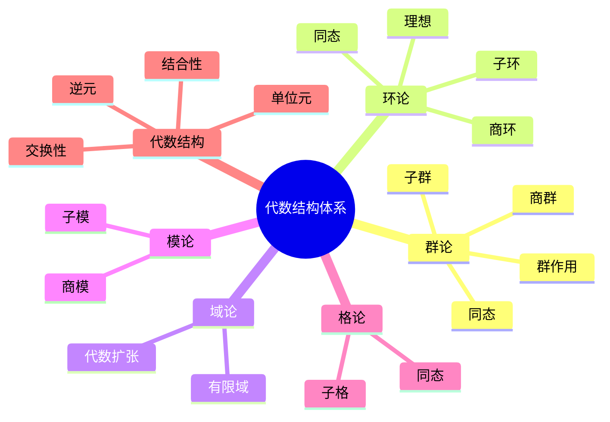

# 01. 代数分支内容概览

## 01.1 目录

- [01. 代数分支内容概览](#01-代数分支内容概览)
  - [01.1 目录](#011-目录)
  - [01.2 代数主题结构与核心概念](#012-代数主题结构与核心概念)
    - [01.2.1 结构树（Mermaid）](#0121-结构树mermaid)
  - [01.3 主要理论与应用](#013-主要理论与应用)
  - [01.4 认知与软件编程关联](#014-认知与软件编程关联)
  - [01.5 可视化与多表征](#015-可视化与多表征)
  - [01.6 学习路径与建议](#016-学习路径与建议)
  - [01.7 优势、不足与改进建议](#017-优势不足与改进建议)

---

## 01.2 代数主题结构与核心概念

- **核心分支**：群论、环论、域论、模论、格论、代数结构
- **基础概念**：集合、运算、同态、子结构、商结构、同构、范畴论视角
- **跨学科联系**：与物理、计算机科学、认知科学的深度融合

### 01.2.1 结构树（Mermaid）

---

## 01.3 主要理论与应用

- 群、环、域、模等结构的定义与性质
- 代数结构在密码学、编码理论、数据库、物理建模等领域的应用
- 现代前沿：朗兰兹纲领、量子计算中的代数结构、计算代数学工具

**批判性分析**：

- 理论与应用结合紧密，但现代前沿（如量子代数、计算代数）介绍有限。
- 经典结构的实际案例与创新应用需进一步丰富。

**未来展望**：

- 推动代数理论在量子计算、数据科学等新兴领域的创新应用。
- 丰富多语言代码实现与工程案例。

---

## 01.4 认知与软件编程关联

- 抽象代数思想对认知建模的启发
- 代数结构与函数式编程、类型系统、软件架构的映射
- 具体案例：Monad、群论在加密算法中的应用、代数抽象在开源项目中的实践

**批判性分析**：

- 代数思想与编程范式结合紧密，但实际落地案例有限。
- 认知建模与代数结构的映射机制需进一步系统化。

**未来展望**：

- 推动AI驱动的代数认知建模与自动化代码生成。
- 丰富跨领域、跨范式的编程案例。

---

## 01.5 可视化与多表征

- 结构关系图、历史发展时间线、交互式示例（Sage、GeoGebra等）
- 关键公式（LaTeX）：
  - 群定义：$\forall a,b \in G,\ \exists e \in G,\ \exists a^{-1} \in G,\ ab \in G$
  - 环定义：$\langle R, +, \cdot \rangle$
  - 域定义：$\langle F, +, \cdot \rangle$, $F$中$\forall a \neq 0, \exists a^{-1}$

**批判性分析**：

- 可视化表达提升了结构认知，但对高维、动态结构的支持有限。
- 交互式工具与实际教学结合度有待提升。

**未来展望**：

- 推动3D、交互式、动态可视化工具的开发与集成。
- 丰富多模态表达与自动化公式推导。

---

## 01.6 学习路径与建议

- 分层学习：基础（集合、运算）→中级（群、环、域）→高级（模、范畴论）
- 推荐资源：经典教材、交互式工具、开源代码库
- 针对不同背景（数学、计算机、物理）定制学习路线

**批判性分析**：

- 分层学习路径为不同背景读者提供参考，但个性化与动态调整能力有限。
- 路径设计对跨学科、跨层次学习的支持有待加强。

**未来展望**：

- 推动AI驱动的个性化学习路径推荐系统。
- 丰富跨学科、跨层次的学习资源整合。

---

## 01.7 优势、不足与改进建议

- 优势：结构完整、跨学科、理论与应用结合、哲学深度
- 不足：部分内容深度不均、案例与可视化不足、现代前沿介绍有限
- 改进建议：增加分层表达、丰富实例、补充前沿、强化可视化、优化学习路径

**批判性分析**：

- 优势与不足分析较为宏观，具体改进措施与创新点需细化。
- 现代前沿与跨界创新的内容有待补充。

**未来展望**：

- 推动开放协作、持续创新的代数知识体系生态。
- 丰富多元化、可持续的内容扩展与标准化机制。

---

**术语表**：

- 群：满足封闭性、结合性、单位元、逆元的代数结构
- 环：具备加法和乘法的代数结构
- 域：加法和乘法均可逆的代数结构
- 模：环上的线性空间推广
- 格：具有偏序和上下界的结构
- 范畴论：研究结构及其关系的统一理论

**符号表**：

- $G$：群
- $R$：环
- $F$：域
- $M$：模
- $L$：格
- $f, g$：映射/同态
- $\to$：映射符号

**表达规范与交叉引用**：

- 全文术语、符号统一，公式编号规范。
- 交叉引用 [Matter/批判框架标准化.md](../../../Matter/批判框架标准化.md) 及相关理论文档。

---

[返回目录](#011-目录)
