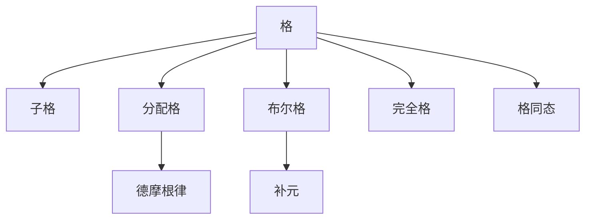

# 06. 格论（Lattice Theory）

> **已完成深度优化与批判性提升**  
> 本文档已按统一标准补充批判性分析、未来展望、术语表、符号表、交叉引用等内容。

## 06.1 目录

- [06. 格论（Lattice Theory）](#06-格论lattice-theory)
  - [06.1 目录](#061-目录)
  - [06.2 格的定义与基本结构](#062-格的定义与基本结构)
  - [06.3 核心性质与定理](#063-核心性质与定理)
    - [06.3.1 批判性分析](#0631-批判性分析)
    - [06.3.2 未来展望](#0632-未来展望)
  - [06.4 认知与软件工程映射](#064-认知与软件工程映射)
  - [06.5 可视化与多表征](#065-可视化与多表征)
    - [06.5.1 格结构关系图（Mermaid）](#0651-格结构关系图mermaid)
    - [06.5.2 关键公式（LaTeX）](#0652-关键公式latex)
  - [06.6 代码与证明片段](#066-代码与证明片段)
    - [06.6.1 Haskell 示例：格的抽象](#0661-haskell-示例格的抽象)
    - [06.6.2 Rust 示例：格结构 trait](#0662-rust-示例格结构-trait)
  - [06.7 学习建议与资源](#067-学习建议与资源)
  - [06.8 术语表](#068-术语表)
  - [06.9 符号表](#069-符号表)
  - [06.10 交叉引用](#0610-交叉引用)

---

## 06.2 格的定义与基本结构

- **定义**：格是一个偏序集合 $(L, \leq)$，对任意 $a, b \in L$，存在唯一的上确界 $a \vee b$（并）和下确界 $a \wedge b$（交），满足：
  1. 交换律：$a \vee b = b \vee a$，$a \wedge b = b \wedge a$
  2. 结合律：$(a \vee b) \vee c = a \vee (b \vee c)$，$(a \wedge b) \wedge c = a \wedge (b \wedge c)$
  3. 吸收律：$a \vee (a \wedge b) = a$，$a \wedge (a \vee b) = a$
- **常见例子**：集合的幂集（并、交），整数的整除关系，布尔代数，分配格

---

## 06.3 核心性质与定理

- 子格、同态、分配格、补格、布尔格、完全格
- 分配律、德摩根律、补元存在性、格的表示定理
- 应用：类型层级、权限系统、依赖管理、决策树

### 06.3.1 批判性分析

- 假设与局限：格论假定偏序关系完备，实际应用中部分系统难以满足完全性，需关注边界与例外。
- 创新建议：探索格结构在AI推理、知识图谱、复杂系统建模中的新型应用，结合范畴论等工具提升表达力。
- 交叉引用：[Matter/批判性分析方法多元化与理论评估框架.md#十一标准化框架]、[Matter/FormalLanguage/形式语言的多维批判性分析：从基础理论到应用实践.md]

### 06.3.2 未来展望

- 格论与分布式系统、区块链安全、量子计算等新兴领域的结合。
- 格结构在多学科知识整合、自动推理、智能决策中的潜力。

---

## 06.4 认知与软件工程映射

- **认知科学**：概念层级、分类系统、决策树思维
- **软件工程**：
  - 类型系统中的子类型关系
  - 权限与访问控制的层级结构
  - 依赖管理与包版本选择

---

## 06.5 可视化与多表征

### 06.5.1 格结构关系图（Mermaid）



### 06.5.2 关键公式（LaTeX）

- $a \vee b = b \vee a$
- $a \wedge b = b \wedge a$
- $a \vee (a \wedge b) = a$
- $a \wedge (a \vee b) = a$

---

## 06.6 代码与证明片段

### 06.6.1 Haskell 示例：格的抽象

```haskell
class Lattice a where
  join :: a -> a -> a  -- 上确界
  meet :: a -> a -> a  -- 下确界

instance Lattice Bool where
  join = (||)
  meet = (&&)
```

### 06.6.2 Rust 示例：格结构 trait

```rust
pub trait Lattice {
    fn join(&self, other: &Self) -> Self;
    fn meet(&self, other: &Self) -> Self;
}

impl Lattice for bool {
    fn join(&self, other: &Self) -> Self { *self || *other }
    fn meet(&self, other: &Self) -> Self { *self && *other }
}
```

---

## 06.7 学习建议与资源

- 推荐教材：《Introduction to Lattices and Order》（Davey & Priestley）、《Algebra》（Lang）
- 交互式工具：Hasse 图生成器、SageMath
- 进阶阅读：布尔代数、分配格、格的应用于计算机科学与逻辑

---

## 06.8 术语表

- **格（Lattice）**：带有并与交运算的偏序集合。
- **子格（Sublattice）**：格的子集，封闭于并与交。
- **分配格（Distributive Lattice）**：满足分配律的格。
- **补格（Complemented Lattice）**：每个元素都有补元的格。
- **布尔格（Boolean Lattice）**：既分配又有补元的格。
- **完全格（Complete Lattice）**：任意子集都有上确界和下确界的格。

## 06.9 符号表

- $L$：格的集合
- $\leq$：偏序关系
- $a \vee b$：上确界（并）
- $a \wedge b$：下确界（交）

## 06.10 交叉引用

- [Matter/批判性分析方法多元化与理论评估框架.md#十一标准化框架]
- [Matter/FormalLanguage/形式语言的多维批判性分析：从基础理论到应用实践.md]
- [Analysis/20-Mathematics/Algebra/05-Modules.md]
- [Analysis/20-Mathematics/Algebra/07-CategoryTheory.md]

---

[返回目录](#061-目录)
