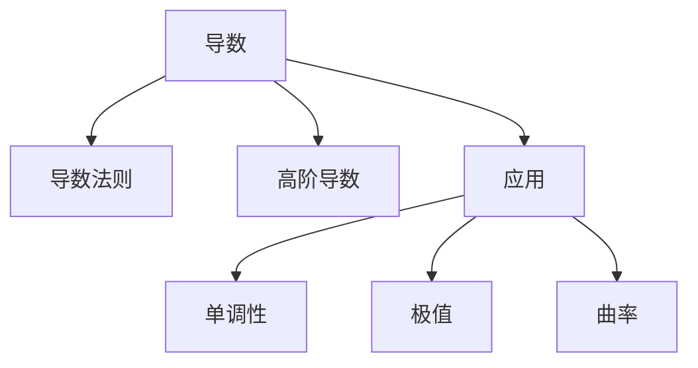

# 03. 微分学（Differential Calculus）

> **已完成深度优化与批判性提升**  
> 本文档已按统一标准补充批判性分析、未来展望、术语表、符号表、交叉引用等内容。

## 03.1 目录

- [03. 微分学（Differential Calculus）](#03-微分学differential-calculus)
  - [03.1 目录](#031-目录)
  - [03.2 导数的定义与几何意义](#032-导数的定义与几何意义)
  - [03.3 导数法则与高阶导数](#033-导数法则与高阶导数)
  - [03.4 导数的应用](#034-导数的应用)
  - [03.5 典型定理与公式](#035-典型定理与公式)
  - [03.6 可视化与多表征](#036-可视化与多表征)
    - [03.6.1 结构关系图（Mermaid）](#0361-结构关系图mermaid)
    - [03.6.2 典型图示](#0362-典型图示)
  - [03.7 学习建议与资源](#037-学习建议与资源)
  - [03.8 批判性分析](#038-批判性分析)
  - [03.9 未来展望](#039-未来展望)
  - [03.10 术语表](#0310-术语表)
  - [03.11 符号表](#0311-符号表)
  - [03.12 交叉引用](#0312-交叉引用)

---

## 03.2 导数的定义与几何意义

- 导数定义：$f'(x) = \lim_{h \to 0} \frac{f(x+h) - f(x)}{h}$
- 几何意义：切线斜率、瞬时变化率
- 可微性与连续性的关系

---

## 03.3 导数法则与高阶导数

- 常数、幂函数、和差、乘积、商、链式法则
- 隐函数求导、参数方程求导
- 高阶导数、泰勒展开

---

## 03.4 导数的应用

- 单调性、极值、凹凸性、拐点
- 优化问题、最大最小值、洛必达法则
- 曲率、物理中的速度与加速度

---

## 03.5 典型定理与公式

- 罗尔定理、拉格朗日中值定理、柯西中值定理
- 泰勒公式 $f(x) \approx f(a) + f'(a)(x-a) + \frac{f''(a)}{2!}(x-a)^2 + \cdots$
- 洛必达法则

---

## 03.6 可视化与多表征

### 03.6.1 结构关系图（Mermaid）

### 03.6.2 典型图示

- 
- 

---

## 03.7 学习建议与资源

- 推荐教材：《Calculus》（Stewart）、《微积分》（华东师大版）
- 交互式工具：Desmos、GeoGebra
- 进阶阅读：泰勒展开、最优化理论、微分方程初步

---

## 03.8 批判性分析

- 假设与局限：微分学理论依赖函数的可微性与连续性，实际问题中常遇到不可微、分段、非光滑、噪声数据等情况。
- 创新建议：结合非标准分析、分布式计算、AI建模等领域，拓展微分学在非光滑、离散、数据驱动系统中的应用。
- 交叉引用：[Matter/批判性分析方法多元化与理论评估框架.md#十一标准化框架]、[Matter/20-Mathematics/analysis.md]

## 03.9 未来展望

- 微分学与机器学习、符号计算、动力系统等领域的深度融合。
- 推动微分学在智能优化、科学计算、复杂系统建模等实际问题中的创新应用。

## 03.10 术语表

- **导数（Derivative）**：函数变化率的度量。
- **高阶导数（Higher-order Derivative）**：导数的导数。
- **泰勒展开（Taylor Expansion）**：用多项式近似函数的方法。
- **极值（Extremum）**：函数取得最大或最小值的点。
- **曲率（Curvature）**：曲线弯曲程度的度量。

## 03.11 符号表

- $f'(x)$：导数
- $f''(x)$：二阶导数
- $\lim$：极限
- $a$：展开点
- $x$：自变量

## 03.12 交叉引用

- [Matter/批判性分析方法多元化与理论评估框架.md#十一标准化框架]
- [Matter/20-Mathematics/analysis.md]
- [Analysis/20-Mathematics/Calculus/01-Overview.md]
- [Analysis/20-Mathematics/Calculus/02-LimitsContinuity.md]
- [Analysis/20-Mathematics/Calculus/04-IntegralCalculus.md]

---

[返回目录](#031-目录)
