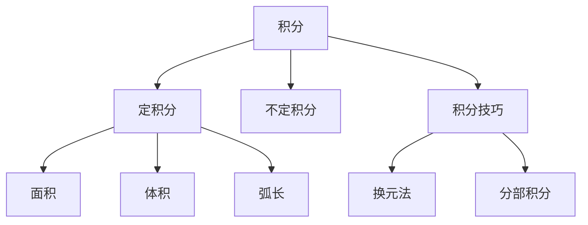

# 04. 积分学（Integral Calculus）

> **已完成深度优化与批判性提升**  
> 本文档已按统一标准补充批判性分析、未来展望、术语表、符号表、交叉引用等内容。

## 04.1 目录

- [04. 积分学（Integral Calculus）](#04-积分学integral-calculus)
  - [04.1 目录](#041-目录)
  - [04.2 积分的定义与基本思想](#042-积分的定义与基本思想)
  - [04.3 不定积分与定积分](#043-不定积分与定积分)
  - [04.4 积分技巧与应用](#044-积分技巧与应用)
  - [04.5 典型定理与公式](#045-典型定理与公式)
  - [04.6 可视化与多表征](#046-可视化与多表征)
    - [04.6.1 结构关系图（Mermaid）](#0461-结构关系图mermaid)
    - [04.6.2 典型图示](#0462-典型图示)
  - [04.7 学习建议与资源](#047-学习建议与资源)
  - [04.8 批判性分析](#048-批判性分析)
  - [04.9 未来展望](#049-未来展望)
  - [04.10 术语表](#0410-术语表)
  - [04.11 符号表](#0411-符号表)
  - [04.12 交叉引用](#0412-交叉引用)

---

## 04.2 积分的定义与基本思想

- 积分用于度量面积、体积、累积量
- 定积分：黎曼和极限 $\int_a^b f(x)dx = \lim_{n\to\infty} \sum_{i=1}^n f(x_i^*)\Delta x$
- 不定积分：原函数 $F(x)$ 满足 $F'(x) = f(x)$
- 微积分基本定理：导数与积分互逆

---

## 04.3 不定积分与定积分

- 不定积分符号与性质
- 定积分的几何意义与计算方法
- 面积、体积、弧长、物理应用

---

## 04.4 积分技巧与应用

- 换元积分法、分部积分法、三角换元、部分分式积分
- 反常积分、数值积分
- 典型应用：面积、体积、物理量（功、质量、重心等）

---

## 04.5 典型定理与公式

- 微积分基本定理
- $\int_a^b f'(x)dx = f(b) - f(a)$
- $\int x^n dx = \frac{x^{n+1}}{n+1} + C$
- $\int e^x dx = e^x + C$
- $\int \sin x dx = -\cos x + C$
- $\int_a^b f(x)dx = F(b) - F(a)$

---

## 04.6 可视化与多表征

### 04.6.1 结构关系图（Mermaid）

### 04.6.2 典型图示

- dx)
- 

---

## 04.7 学习建议与资源

- 推荐教材：《Calculus》（Stewart）、《微积分》（华东师大版）
- 交互式工具：Desmos、GeoGebra、积分计算器
- 进阶阅读：反常积分、数值积分、微分方程中的积分应用

---

## 04.8 批判性分析

- 假设与局限：积分理论依赖函数的可积性与连续性，实际问题中常遇到不可积、奇异、分布型、离散数据等情况。
- 创新建议：结合分布理论、数值分析、AI建模等领域，拓展积分学在非连续、非光滑、数据驱动系统中的应用。
- 交叉引用：[Matter/批判性分析方法多元化与理论评估框架.md#十一标准化框架]、[Matter/20-Mathematics/analysis.md]

## 04.9 未来展望

- 积分学与机器学习、符号计算、分布式计算等领域的深度融合。
- 推动积分学在大数据、科学计算、复杂系统建模等实际问题中的创新应用。

## 04.10 术语表

- **积分（Integral）**：函数累积量的度量。
- **定积分（Definite Integral）**：在区间上累积函数值。
- **不定积分（Indefinite Integral）**：原函数的集合。
- **反常积分（Improper Integral）**：区间无界或被积函数无界的积分。
- **分部积分法（Integration by Parts）**：积分技巧之一。

## 04.11 符号表

- $\int$：积分符号
- $dx$：积分变量
- $a, b$：积分区间端点
- $C$：积分常数
- $f(x)$：被积函数

## 04.12 交叉引用

- [Matter/批判性分析方法多元化与理论评估框架.md#十一标准化框架]
- [Matter/20-Mathematics/analysis.md]
- [Analysis/20-Mathematics/Calculus/01-Overview.md]
- [Analysis/20-Mathematics/Calculus/02-LimitsContinuity.md]
- [Analysis/20-Mathematics/Calculus/03-DifferentialCalculus.md]
- [Analysis/20-Mathematics/Calculus/05-Series.md]

---

[返回目录](#041-目录)
