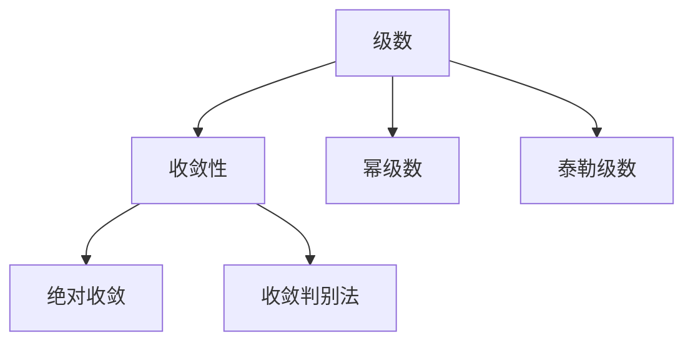

# 05. 无穷级数（Infinite Series）

> **已完成深度优化与批判性提升**  
> 本文档已按统一标准补充批判性分析、未来展望、术语表、符号表、交叉引用等内容。

## 05.1 目录

- [05. 无穷级数（Infinite Series）](#05-无穷级数infinite-series)
  - [05.1 目录](#051-目录)
  - [05.2 级数的定义与收敛性](#052-级数的定义与收敛性)
  - [05.3 幂级数与泰勒级数](#053-幂级数与泰勒级数)
  - [05.4 收敛判别法](#054-收敛判别法)
  - [05.5 典型定理与公式](#055-典型定理与公式)
  - [05.6 可视化与多表征](#056-可视化与多表征)
  - [05.7 批判性分析](#057-批判性分析)
  - [05.8 未来展望](#058-未来展望)
  - [05.9 术语表](#059-术语表)
  - [05.10 符号表](#0510-符号表)
  - [05.11 交叉引用](#0511-交叉引用)
  - [05.12 学习建议与资源](#0512-学习建议与资源)

---

## 05.2 级数的定义与收敛性

- 数列、部分和、级数的定义
- 收敛与发散，收敛级数的和
- 绝对收敛与条件收敛

---

## 05.3 幂级数与泰勒级数

- 幂级数 $\sum a_n x^n$ 的收敛半径
- 泰勒级数、麦克劳林级数
- 典型函数的级数展开（如 $e^x, \sin x, \cos x$）

---

## 05.4 收敛判别法

- 比较判别法、比值判别法、根判别法、交错级数判别法
- 绝对收敛与条件收敛的判别

---

## 05.5 典型定理与公式

- $\sum_{n=1}^\infty \frac{1}{n^2} = \frac{\pi^2}{6}$
- $e^x = \sum_{n=0}^\infty \frac{x^n}{n!}$
- $\sin x = \sum_{n=0}^\infty \frac{(-1)^n}{(2n+1)!}x^{2n+1}$
- $\cos x = \sum_{n=0}^\infty \frac{(-1)^n}{(2n)!}x^{2n}$

---

## 05.6 可视化与多表征

### 05.6.1 结构关系图（Mermaid）

### 05.6.2 典型图示

- 
- 

---

## 05.7 批判性分析

- 级数理论在经典数学分析中地位突出，但实际应用中对收敛性的严格要求导致部分“发散级数”在物理、工程等领域仍有实际意义（如重整化、渐近展开）。
- 传统收敛判别法多针对实数域，现代数学（如泛函分析、分布理论）对级数的推广与泛化值得关注。
- 级数的可视化与交互式探索工具有限，初学者对收敛/发散的直观理解仍有障碍。
- 级数与现代AI、数据科学中的序列建模、信号处理等领域存在潜在联系，需进一步挖掘。

---

## 05.8 未来展望

- 推动级数理论与数值分析、计算数学、AI序列建模等领域的深度融合。
- 丰富级数的可视化、交互式教学与自动化判别工具，提升学习体验。
- 探索发散级数、渐近级数在物理、工程、数据科学中的创新应用。
- 推动级数理论在高维、泛函空间、概率论等领域的推广与创新。

---

## 05.9 术语表

- **级数（Series）**：数列部分和的极限。
- **收敛（Convergence）**：级数部分和趋于有限值。
- **发散（Divergence）**：级数部分和不趋于有限值。
- **绝对收敛（Absolute Convergence）**：$\sum |a_n|$ 收敛。
- **条件收敛（Conditional Convergence）**：$\sum a_n$ 收敛但 $\sum |a_n|$ 发散。
- **幂级数（Power Series）**：形如 $\sum a_n x^n$ 的级数。
- **泰勒级数（Taylor Series）**：函数在某点的幂级数展开。
- **收敛半径（Radius of Convergence）**：幂级数收敛的区间半径。

---

## 05.10 符号表

- $a_n$：级数的第 $n$ 项
- $S_n$：前 $n$ 项和
- $\sum$：求和符号
- $R$：收敛半径
- $e^x, \sin x, \cos x$：典型级数展开对象

---

## 05.11 交叉引用

- [Matter/批判框架标准化.md]
- [Matter/FormalLanguage/形式语言的多维批判性分析：从基础理论到应用实践.md]
- [Analysis/20-Mathematics/Calculus/04-IntegralCalculus.md]
- [Analysis/20-Mathematics/Calculus/06-MultivariableCalculus.md]
- [Analysis/20-Mathematics/Algebra/07-CategoryTheory.md]

---

## 05.12 学习建议与资源

- 推荐教材：《Calculus》（Stewart）、《Principles of Mathematical Analysis》（Rudin）
- 交互式工具：Desmos、GeoGebra、级数可视化工具
- 进阶阅读：傅里叶级数、函数空间中的级数、实分析中的级数理论

[返回目录](#051-目录)
