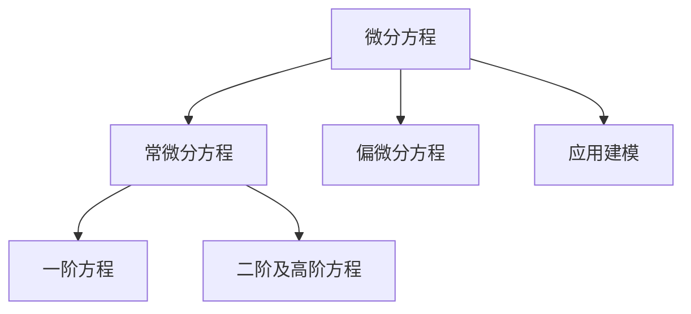

# 07. 微分方程（Differential Equations）

> **已完成深度优化与批判性提升**  
> 本文档已按统一标准补充批判性分析、未来展望、术语表、符号表、交叉引用等内容。

## 07.1 目录

- [07. 微分方程（Differential Equations）](#07-微分方程differential-equations)
  - [07.1 目录](#071-目录)
  - [07.2 微分方程的基本概念与分类](#072-微分方程的基本概念与分类)
  - [07.3 一阶微分方程](#073-一阶微分方程)
  - [07.4 二阶及高阶微分方程](#074-二阶及高阶微分方程)
  - [07.5 典型应用与建模](#075-典型应用与建模)
  - [07.6 典型定理与公式](#076-典型定理与公式)
  - [07.7 可视化与多表征](#077-可视化与多表征)
  - [07.8 批判性分析](#078-批判性分析)
  - [07.9 未来展望](#079-未来展望)
  - [07.10 术语表](#0710-术语表)
  - [07.11 符号表](#0711-符号表)
  - [07.12 交叉引用](#0712-交叉引用)
  - [07.13 学习建议与资源](#0713-学习建议与资源)

---

## 07.2 微分方程的基本概念与分类

- 微分方程的定义、阶数、线性与非线性
- 初值问题、边值问题
- 常微分方程（ODE）、偏微分方程（PDE）

---

## 07.3 一阶微分方程

- 可分离变量方程、齐次方程、线性方程、恰当方程
- 积分因子法、变量代换法
- 典型例题与解法

---

## 07.4 二阶及高阶微分方程

- 二阶常系数齐次与非齐次线性方程
- 特征方程法、常数变易法、降阶法
- 简单的高阶方程与系统

---

## 07.5 典型应用与建模

- 物理中的运动方程、谐振子、人口模型、放射性衰变
- 电路、流体、热传导等工程建模

---

## 07.6 典型定理与公式

- 一阶线性方程通解 $y' + p(x)y = q(x)$
- 二阶常系数齐次方程 $y'' + ay' + by = 0$
- 拉普拉斯变换、特解与通解

---

## 07.7 可视化与多表征

### 07.7.1 结构关系图（Mermaid）

### 07.7.2 典型图示

- 
- 

---

## 07.8 批判性分析

- 微分方程理论是连接数学与现实世界的桥梁，但实际问题常涉及非线性、复杂边界、参数不确定等，经典解析法适用范围有限。
- 数值解法虽已高度发展，但误差分析、稳定性、收敛性等问题在工程实践中常被低估。
- 偏微分方程（PDE）在物理、工程、金融等领域应用广泛，但高维PDE的解析与数值解仍是重大挑战。
- 微分方程与AI、数据科学中的动态建模、时序预测等领域存在深度融合空间。

---

## 07.9 未来展望

- 推动微分方程理论与机器学习、数据驱动建模、科学计算等领域的深度融合。
- 丰富高维PDE、非线性系统的数值方法与自动化分析工具。
- 探索微分方程在复杂系统、智能控制、生命科学等领域的创新应用。
- 推动微分方程理论在泛函分析、动力系统、混沌理论等前沿领域的推广与创新。

---

## 07.10 术语表

- **微分方程（Differential Equation）**：包含未知函数及其导数的方程。
- **常微分方程（ODE）**：只含一个自变量的微分方程。
- **偏微分方程（PDE）**：含多个自变量的微分方程。
- **初值问题（IVP）**：给定初始条件的微分方程问题。
- **边值问题（BVP）**：给定边界条件的微分方程问题。
- **特解/通解**：满足特定条件/一般形式的解。
- **拉普拉斯变换**：将微分方程转化为代数方程的工具。

---

## 07.11 符号表

- $y, y', y''$：未知函数及其导数
- $x, t$：自变量（空间/时间）
- $p(x), q(x)$：系数函数
- $\lambda$：特征值
- $L$：微分算子
- $f(x, y)$：方程右端项

---

## 07.12 交叉引用

- [Matter/批判性分析方法多元化与理论评估框架.md#十一标准化框架]
- [Matter/FormalLanguage/形式语言的多维批判性分析：从基础理论到应用实践.md]
- [Analysis/20-Mathematics/Calculus/06-MultivariableCalculus.md]
- [Analysis/20-Mathematics/Calculus/08-FunctionalAnalysis.md]
- [Analysis/20-Mathematics/Algebra/07-CategoryTheory.md]

---

## 07.13 学习建议与资源

- 推荐教材：《微分方程教程》（丁同仁）、《Elementary Differential Equations》（Boyce & DiPrima）
- 交互式工具：Desmos、GeoGebra、微分方程数值解算器
- 进阶阅读：偏微分方程、动力系统、混沌理论、数值方法

[返回目录](#071-目录)
