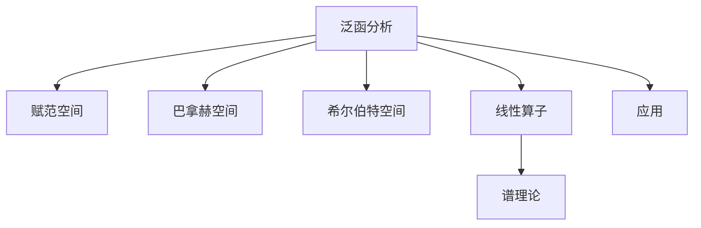

# 08. 泛函分析（Functional Analysis）

> **已完成深度优化与批判性提升**  
> 本文档已按统一标准补充批判性分析、未来展望、术语表、符号表、交叉引用等内容。

## 08.1 目录

- [08. 泛函分析（Functional Analysis）](#08-泛函分析functional-analysis)
  - [08.1 目录](#081-目录)
  - [08.2 基本概念与空间结构](#082-基本概念与空间结构)
  - [08.3 线性算子与谱理论](#083-线性算子与谱理论)
  - [08.4 典型定理与公式](#084-典型定理与公式)
  - [08.5 应用与建模](#085-应用与建模)
  - [08.6 可视化与多表征](#086-可视化与多表征)
  - [08.7 批判性分析](#087-批判性分析)
  - [08.8 未来展望](#088-未来展望)
  - [08.9 术语表](#089-术语表)
  - [08.10 符号表](#0810-符号表)
  - [08.11 交叉引用](#0811-交叉引用)
  - [08.12 学习建议与资源](#0812-学习建议与资源)

---

## 08.2 基本概念与空间结构

- 赋范空间、巴拿赫空间、希尔伯特空间
- 线性泛函、内积、范数、完备性
- 典型例子：$L^p$ 空间、$C([a,b])$ 空间

---

## 08.3 线性算子与谱理论

- 有界线性算子、紧算子
- 谱、特征值、谱定理
- 对偶空间与泛函表示

---

## 08.4 典型定理与公式

- 巴拿赫不动点定理
- 哈恩-巴拿赫定理
- 开映射定理、闭图定理
- 希尔伯特空间正交分解

---

## 08.5 应用与建模

- 微分方程与泛函分析
- 量子力学中的希尔伯特空间
- 最优化与变分法

---

## 08.6 可视化与多表征

### 08.6.1 结构关系图（Mermaid）

### 08.6.2 典型图示

- 
- )

---

## 08.7 批判性分析

- 泛函分析极大拓展了线性代数与微积分的理论边界，但高维/无限维空间的直观理解与可视化仍是难点。
- 经典定理多依赖完备性、线性等假设，实际应用中常遇到非线性、非完备、非自伴等复杂情形。
- 谱理论在量子力学、信号处理等领域应用广泛，但谱分解、算子分类等问题在高维/非自伴情形下仍具挑战。
- 泛函分析与AI、数据科学中的高维建模、最优化、深度学习等领域存在深度融合空间。

---

## 08.8 未来展望

- 推动泛函分析与机器学习、深度学习、科学计算等领域的深度融合。
- 丰富高维空间、算子谱理论的数值方法与自动化分析工具。
- 探索泛函分析在量子信息、复杂系统、最优控制等领域的创新应用。
- 推动泛函分析理论在非线性分析、变分法、算子代数等前沿领域的推广与创新。

---

## 08.9 术语表

- **赋范空间（Normed Space）**：带有范数的线性空间。
- **巴拿赫空间（Banach Space）**：完备的赋范空间。
- **希尔伯特空间（Hilbert Space）**：带有内积且完备的线性空间。
- **线性算子（Linear Operator）**：线性空间之间的映射。
- **谱（Spectrum）**：算子的特征值集合。
- **对偶空间（Dual Space）**：所有连续线性泛函的空间。
- **紧算子（Compact Operator）**：将有界集映为相对紧集的算子。

---

## 08.10 符号表

- $\|\cdot\|$：范数
- $\langle \cdot, \cdot \rangle$：内积
- $T$：线性算子
- $\sigma(T)$：算子$T$的谱
- $\mathcal{H}$：希尔伯特空间
- $L^p$：$L^p$空间
- $f^*$：对偶泛函

---

## 08.11 交叉引用

- [Matter/批判框架标准化.md]
- [Matter/FormalLanguage/形式语言的多维批判性分析：从基础理论到应用实践.md]
- [Analysis/20-Mathematics/Calculus/07-DifferentialEquations.md]
- [Analysis/20-Mathematics/Calculus/09-CalculusOfVariations.md]
- [Analysis/20-Mathematics/Algebra/07-CategoryTheory.md]

---

## 08.12 学习建议与资源

- 推荐教材：《泛函分析引论》（袁新意）、《Introductory Functional Analysis with Applications》（Kreyszig）
- 交互式工具：WolframAlpha、GeoGebra
- 进阶阅读：算子代数、谱理论、量子信息

[返回目录](#081-目录)
