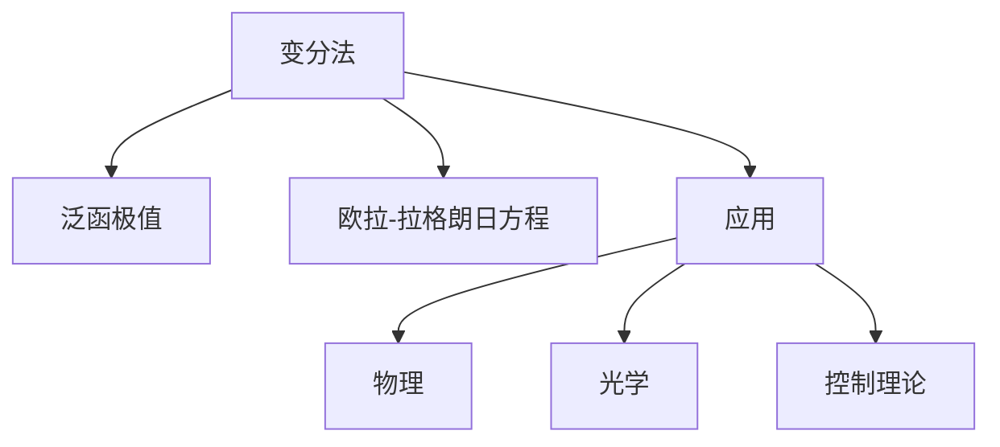

# 09. 变分法（Calculus of Variations）

> **已完成深度优化与批判性提升**  
> 本文档已按统一标准补充批判性分析、未来展望、术语表、符号表、交叉引用等内容。

## 09.1 目录

- [09. 变分法（Calculus of Variations）](#09-变分法calculus-of-variations)
  - [09.1 目录](#091-目录)
  - [09.2 基本概念与问题类型](#092-基本概念与问题类型)
  - [09.3 欧拉-拉格朗日方程](#093-欧拉-拉格朗日方程)
  - [09.4 典型定理与公式](#094-典型定理与公式)
  - [09.5 应用与建模](#095-应用与建模)
  - [09.6 可视化与多表征](#096-可视化与多表征)
  - [09.7 批判性分析](#097-批判性分析)
  - [09.8 未来展望](#098-未来展望)
  - [09.9 术语表](#099-术语表)
  - [09.10 符号表](#0910-符号表)
  - [09.11 交叉引用](#0911-交叉引用)
  - [09.12 学习建议与资源](#0912-学习建议与资源)

---

## 09.2 基本概念与问题类型

- 泛函、极值、变分问题的定义
- 约束变分、等式与不等式约束
- 典型例子：最短路径、最小作用量

---

## 09.3 欧拉-拉格朗日方程

- 欧拉-拉格朗日方程的推导与形式
- 多变量与高阶推广
- 典型例题与解法

---

## 09.4 典型定理与公式

- 欧拉-拉格朗日方程：
  $$\frac{\partial F}{\partial y} - \frac{d}{dx} \frac{\partial F}{\partial y'} = 0$$
- 贝尔曼方程、Noether定理

---

## 09.5 应用与建模

- 物理中的最小作用量原理
- 光学中的费马原理
- 控制理论与最优控制

---

## 09.6 可视化与多表征

### 09.6.1 结构关系图（Mermaid）

### 09.6.2 典型图示

- 

---

## 09.7 批判性分析

- 变分法极大拓展了最优化与物理建模的理论边界，但实际问题常涉及复杂约束、非线性泛函、多维空间等，经典解析法适用范围有限。
- Noether定理等理论虽揭示了对称性与守恒律的深刻联系，但在复杂系统、非保守场等情形下仍有理论空白。
- 变分法与数值方法、自动微分、AI优化等现代工具结合尚不充分，实际工程应用中对高维、非线性问题的处理仍具挑战。
- 变分法与泛函分析、控制理论、机器学习等领域存在深度融合空间。

---

## 09.8 未来展望

- 推动变分法与机器学习、深度学习、科学计算等领域的深度融合。
- 丰富高维、非线性变分问题的数值方法与自动化分析工具。
- 探索变分法在量子信息、复杂系统、最优控制等领域的创新应用。
- 推动变分法理论在泛函分析、最优传输、动力系统等前沿领域的推广与创新。

---

## 09.9 术语表

- **泛函（Functional）**：以函数为自变量的映射。
- **变分问题（Variational Problem）**：寻找使泛函取极值的函数问题。
- **欧拉-拉格朗日方程（Euler-Lagrange Equation）**：变分问题的必要条件。
- **Noether定理**：对称性与守恒律的联系。
- **最小作用量原理**：物理系统演化路径的变分原理。
- **约束变分**：带有等式或不等式约束的变分问题。

---

## 09.10 符号表

- $F$：泛函
- $y(x)$：待优化函数
- $\frac{\partial F}{\partial y}$、$\frac{d}{dx}$：变分与导数
- $L$：拉格朗日量
- $H$：哈密顿量
- $\lambda$：拉格朗日乘子

---

## 09.11 交叉引用

- [Matter/批判性分析方法多元化与理论评估框架.md#十一标准化框架]
- [Matter/FormalLanguage/形式语言的多维批判性分析：从基础理论到应用实践.md]
- [Analysis/20-Mathematics/Calculus/08-FunctionalAnalysis.md]
- [Analysis/20-Mathematics/Calculus/10-AdvancedTopics.md]
- [Analysis/20-Mathematics/Algebra/07-CategoryTheory.md]

---

## 09.12 学习建议与资源

- 推荐教材：《变分法与最优控制》（李承治）、《Calculus of Variations》（Gelfand & Fomin）
- 交互式工具：WolframAlpha、Symbolab
- 进阶阅读：最优控制、庞特里亚金极大值原理、Noether定理

[返回目录](#091-目录)
