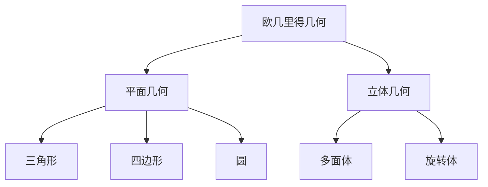

# 02. 欧几里得几何（Euclidean Geometry）

## 02.1 目录

- [02. 欧几里得几何（Euclidean Geometry）](#02-欧几里得几何euclidean-geometry)
  - [02.1 目录](#021-目录)
  - [02.2 欧几里得几何的定义与基本结构](#022-欧几里得几何的定义与基本结构)
  - [02.3 公理体系与基本元素](#023-公理体系与基本元素)
  - [02.4 经典定理与性质](#024-经典定理与性质)
  - [02.5 可视化与多表征](#025-可视化与多表征)
    - [02.5.1 结构关系图（Mermaid）](#0251-结构关系图mermaid)
    - [02.5.2 关键公式（LaTeX）](#0252-关键公式latex)
  - [02.6 代码与证明片段](#026-代码与证明片段)
    - [02.6.1 Python 示例：计算三角形面积](#0261-python-示例计算三角形面积)
    - [02.6.2 Haskell 示例：勾股定理验证](#0262-haskell-示例勾股定理验证)
  - [02.7 学习建议与资源](#027-学习建议与资源)

---

## 02.2 欧几里得几何的定义与基本结构

- 研究平面和三维空间中点、线、面、体的性质。
- 基于欧几里得公理体系，强调度量（长度、角度）、位置、形状的研究。
- 主要对象：三角形、多边形、圆、多面体等。

---

## 02.3 公理体系与基本元素

- **欧几里得五大公设**：
  1. 两点确定一条直线。
  2. 一条线段可以无限延长。
  3. 以任意点为圆心、任意线段为半径可以作圆。
  4. 所有直角都相等。
  5. （平行公设）在同一平面内，过直线外一点有且只有一条直线与已知直线平行。
- **基本元素**：点、直线、平面、角、圆、多边形、多面体。

---

## 02.4 经典定理与性质

- 勾股定理、三角形内角和定理、相似三角形判定、圆周角定理、正多边形性质、欧拉公式 $V-E+F=2$（多面体）等。
- 角平分线定理、中线定理、垂心、外心、内心、重心等特殊点性质。

---

## 02.5 可视化与多表征

### 02.5.1 结构关系图（Mermaid）



### 02.5.2 关键公式（LaTeX）

- 勾股定理：$a^2 + b^2 = c^2$
- 三角形面积：$S = \frac{1}{2}ab\sin C$
- 欧拉公式：$V - E + F = 2$

---

## 02.6 代码与证明片段

### 02.6.1 Python 示例：计算三角形面积

```python
def triangle_area(a, b, angle_C_rad):
    from math import sin
    return 0.5 * a * b * sin(angle_C_rad)
```

### 02.6.2 Haskell 示例：勾股定理验证

```haskell
isRightTriangle :: Double -> Double -> Double -> Bool
isRightTriangle a b c = abs (a^2 + b^2 - c^2) < 1e-6
```

---

## 02.7 学习建议与资源

- 推荐教材：《欧几里得原本》、《Geometry: Euclid and Beyond》（Hartshorne）
- 交互式工具：GeoGebra、Desmos
- 进阶阅读：欧几里得几何的公理化、平面几何竞赛题、几何构造与证明方法

---

[返回目录](#021-目录)
