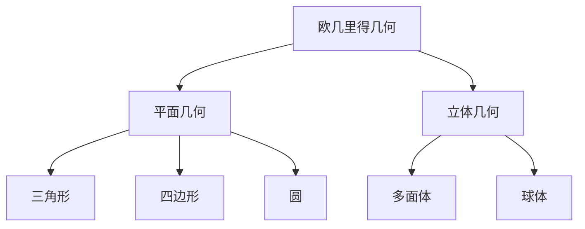

# 03. 欧几里得几何（Euclidean Geometry）

## 03.1 目录

- [03. 欧几里得几何（Euclidean Geometry）](#03-欧几里得几何euclidean-geometry)
  - [03.1 目录](#031-目录)
  - [03.2 公理体系与基本结构](#032-公理体系与基本结构)
  - [03.3 平面几何](#033-平面几何)
  - [03.4 立体几何](#034-立体几何)
  - [03.5 尺规作图与经典问题](#035-尺规作图与经典问题)
  - [03.6 典型定理与性质](#036-典型定理与性质)
  - [03.7 可视化与多表征](#037-可视化与多表征)
    - [03.7.1 结构关系图（Mermaid）](#0371-结构关系图mermaid)
    - [03.7.2 典型作图与公式](#0372-典型作图与公式)
  - [03.8 学习建议与资源](#038-学习建议与资源)

---

## 03.2 公理体系与基本结构

- 欧几里得公理体系（五大公设）
- 点、线、面、角、距离、面积等基本元素
- 平行公设及其历史意义

---

## 03.3 平面几何

- 三角形、四边形、多边形、圆等基本图形
- 角平分线、中线、高线、垂直平分线
- 相似、全等、对称、旋转、反射

---

## 03.4 立体几何

- 多面体、棱柱、棱锥、球体、圆柱、圆锥
- 体积与表面积公式
- 投影与截面

---

## 03.5 尺规作图与经典问题

- 尺规作图的基本操作（作垂线、平分线、圆等）
- 三等分角、倍立方、化圆为方等古典难题
- 不可作性的证明（高斯、伽罗瓦理论）

---

## 03.6 典型定理与性质

- 毕达哥拉斯定理、三角形内角和、圆周角定理、正多边形性质
- 欧拉公式 $V - E + F = 2$
- 相似比与面积、体积关系

---

## 03.7 可视化与多表征

### 03.7.1 结构关系图（Mermaid）

### 03.7.2 典型作图与公式

- 
- $a^2 + b^2 = c^2$
- $S = \frac{1}{2}ab\sin C$
- $V_{\text{sphere}} = \frac{4}{3}\pi r^3$

---

## 03.8 学习建议与资源

- 推荐教材：《欧几里得原本》《Geometry: Euclid and Beyond》
- 交互式工具：GeoGebra、动态几何软件
- 进阶阅读：欧几里得几何的公理化、不可作性证明、与非欧几何的对比

---

[返回目录](#031-目录)
