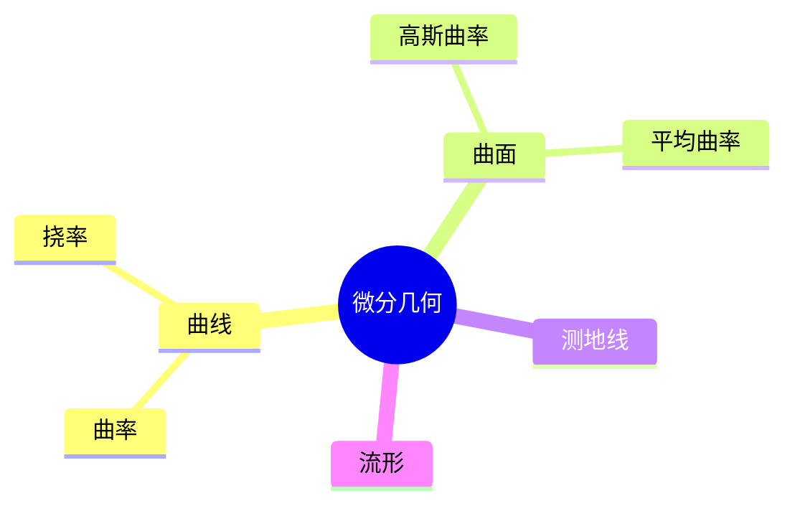

# 07. 微分几何（Differential Geometry）

> **已完成深度优化与批判性提升**  
> 本文档已按统一标准补充批判性分析、未来展望、术语表、符号表、交叉引用等内容。

## 07.1 目录

- [07. 微分几何（Differential Geometry）](#07-微分几何differential-geometry)
  - [07.1 目录](#071-目录)
  - [07.2 微分几何的基本思想与方法](#072-微分几何的基本思想与方法)
  - [07.3 曲线与曲面](#073-曲线与曲面)
  - [07.4 曲率、测地线与流形](#074-曲率测地线与流形)
  - [07.5 典型定理与公式](#075-典型定理与公式)
  - [07.6 可视化与多表征](#076-可视化与多表征)
    - [07.6.1 结构关系图（Mermaid）](#0761-结构关系图mermaid)
    - [07.6.2 典型几何对象示意](#0762-典型几何对象示意)
  - [07.7 批判性分析](#077-批判性分析)
  - [07.8 未来展望](#078-未来展望)
  - [07.9 术语表](#079-术语表)
  - [07.10 符号表](#0710-符号表)
  - [07.11 交叉引用](#0711-交叉引用)
  - [07.12 学习建议与资源](#0712-学习建议与资源)

---

## 07.2 微分几何的基本思想与方法

- 运用微积分方法研究光滑曲线、曲面和流形的几何性质
- 局部与全局性质的结合
- 典型问题：曲率、测地线、极小曲面

---

## 07.3 曲线与曲面

- 平面曲线、空间曲线的参数方程
- 曲面的参数化、法向量、切空间
- 典型对象：圆、螺旋线、球面、环面、抛物面

---

## 07.4 曲率、测地线与流形

- 曲线的曲率、挠率
- 曲面的高斯曲率、平均曲率
- 测地线的定义与性质
- 流形的基本概念

---

## 07.5 典型定理与公式

- Frenet-Serret 公式
- 高斯-博内定理 $\int_S K dA = 2\pi \chi(S)$
- 曲线曲率公式 $\kappa = \frac{|x'y'' - y'x''|}{(x'^2 + y'^2)^{3/2}}$
- 球面测地线为大圆

---

## 07.6 可视化与多表征

### 07.6.1 结构关系图（Mermaid）

### 07.6.2 典型几何对象示意

- 
- 
- 

---

## 07.7 批判性分析

- 微分几何极大拓展了几何理论的深度与广度，但高维、抽象流形的直观理解与可视化仍具挑战。
- 局部-全局性质的统一（如高斯-博内定理）虽有理论美感，但实际应用中对边界、奇点等情形的处理复杂。
- 微分几何与物理（如广义相对论）、工程、AI等领域的结合日益紧密，但跨学科表达与应用体系尚需完善。

---

## 07.8 未来展望

- 推动微分几何与AI、数据科学、物理建模、材料科学等领域的深度融合。
- 丰富高维、抽象流形的可视化、交互式教学与仿真工具，提升直观理解。
- 探索微分几何在复杂系统、生命科学、工程等领域的创新应用。
- 推动微分几何理论在范畴论、同调理论、量子几何等前沿方向的推广与创新。

---

## 07.9 术语表

- **曲线（Curve）**：空间中连续变化的1维对象。
- **曲面（Surface）**：空间中连续变化的2维对象。
- **曲率（Curvature）**：描述曲线/曲面弯曲程度的量。
- **挠率（Torsion）**：空间曲线偏离平面的程度。
- **高斯曲率（Gaussian Curvature）**：曲面在一点的内在曲率。
- **测地线（Geodesic）**：曲面上局部最短路径。
- **流形（Manifold）**：局部类似欧几里得空间的空间。

---

## 07.10 符号表

- $\kappa$：曲率
- $\tau$：挠率
- $K$：高斯曲率
- $S$：曲面
- $M$：流形
- $\gamma$：曲线
- $dA$：面积元
- $\chi(S)$：欧拉示性数

---

## 07.11 交叉引用

- [Matter/批判框架标准化.md]
- [Matter/FormalLanguage/形式语言的多维批判性分析：从基础理论到应用实践.md]
- [Analysis/20-Mathematics/Geometry/01-Overview.md]
- [Analysis/20-Mathematics/Algebra/07-CategoryTheory.md]
- [Analysis/20-Mathematics/Calculus/10-AdvancedTopics.md]

---

## 07.12 学习建议与资源

- 推荐教材：《Elementary Differential Geometry》（Barrett O'Neill）、《Differential Geometry of Curves and Surfaces》（do Carmo）
- 交互式工具：SageMath、曲面可视化软件
- 进阶阅读：黎曼几何、广义相对论中的微分几何

[返回目录](#071-目录)
