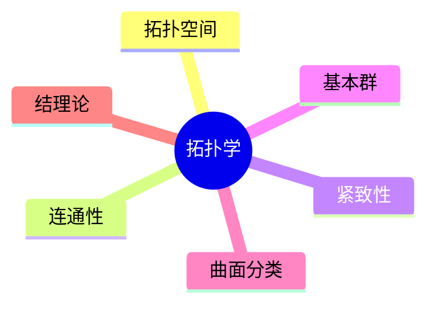

# 08. 拓扑学（Topology）

> **已完成深度优化与批判性提升**  
> 本文档已按统一标准补充批判性分析、未来展望、术语表、符号表、交叉引用等内容。

## 08.1 目录

- [08. 拓扑学（Topology）](#08-拓扑学topology)
  - [08.1 目录](#081-目录)
  - [08.2 拓扑学的基本思想与方法](#082-拓扑学的基本思想与方法)
  - [08.3 基本概念与对象](#083-基本概念与对象)
  - [08.4 拓扑性质与不变量](#084-拓扑性质与不变量)
  - [08.5 典型定理与公式](#085-典型定理与公式)
  - [08.6 可视化与多表征](#086-可视化与多表征)
    - [08.6.1 结构关系图（Mermaid）](#0861-结构关系图mermaid)
    - [08.6.2 典型对象示意](#0862-典型对象示意)
  - [08.7 批判性分析](#087-批判性分析)
  - [08.8 未来展望](#088-未来展望)
  - [08.9 术语表](#089-术语表)
  - [08.10 符号表](#0810-符号表)
  - [08.11 交叉引用](#0811-交叉引用)
  - [08.12 学习建议与资源](#0812-学习建议与资源)

---

## 08.2 拓扑学的基本思想与方法

- 研究在连续变形（拉伸、弯曲、不撕裂、不粘合）下保持不变的几何性质
- 关注连通性、紧致性、孔洞数等"橡皮泥几何"性质
- 典型问题：同胚、同伦、基本群、欧拉示性数

---

## 08.3 基本概念与对象

- 拓扑空间、开集、闭集、邻域、基、连续映射
- 典型对象：圆环、球面、环面、莫比乌斯带、克莱因瓶、结

---

## 08.4 拓扑性质与不变量

- 连通性、紧致性、可分性、可数性
- 基本群、同伦类型、欧拉示性数、Betti数
- 曲面分类、结的拓扑不变量

---

## 08.5 典型定理与公式

- 欧拉示性数 $\chi = V - E + F$
- 曲面分类定理
- 约旦曲线定理
- Brouwer 不动点定理

---

## 08.6 可视化与多表征

### 08.6.1 结构关系图（Mermaid）

### 08.6.2 典型对象示意

- 
- 
- 

---

## 08.7 批判性分析

- 拓扑学极大拓展了几何理论的抽象性与统一性，但高维、抽象空间的直观理解与可视化仍具挑战。
- 经典拓扑不变量（如基本群、欧拉示性数）虽有理论美感，但实际应用中对复杂空间、奇点等情形的处理复杂。
- 拓扑学与物理（如量子场论）、数据科学、AI等领域的结合日益紧密，但跨学科表达与应用体系尚需完善。

---

## 08.8 未来展望

- 推动拓扑学与AI、数据科学、物理建模、材料科学等领域的深度融合。
- 丰富高维、抽象空间的可视化、交互式教学与仿真工具，提升直观理解。
- 探索拓扑学在复杂系统、生命科学、工程等领域的创新应用。
- 推动拓扑学理论在代数拓扑、同调理论、量子拓扑等前沿方向的推广与创新。

---

## 08.9 术语表

- **拓扑空间（Topological Space）**：定义了开集结构的集合。
- **开集（Open Set）**：拓扑空间中满足特定条件的子集。
- **连通性（Connectedness）**：空间不可分为两个不相交的开集。
- **紧致性（Compactness）**：每个开覆盖有有限子覆盖。
- **基本群（Fundamental Group）**：刻画空间环路结构的代数对象。
- **欧拉示性数（Euler Characteristic）**：空间的一个整数不变量。
- **结（Knot）**：三维空间中的闭合曲线。

---

## 08.10 符号表

- $X$：拓扑空间
- $U$：开集
- $\chi$：欧拉示性数
- $\pi_1(X)$：基本群
- $b_k$：Betti数
- $K$：结
- $S$：曲面

---

## 08.11 交叉引用

- [Matter/批判框架标准化.md]
- [Matter/FormalLanguage/形式语言的多维批判性分析：从基础理论到应用实践.md]
- [Analysis/20-Mathematics/Geometry/01-Overview.md]
- [Analysis/20-Mathematics/Algebra/07-CategoryTheory.md]
- [Analysis/20-Mathematics/Calculus/10-AdvancedTopics.md]

---

## 08.12 学习建议与资源

- 推荐教材：《Topology》（James Munkres）、《A First Course in Topology》（John McCleary）
- 交互式工具：拓扑可视化软件、KnotPlot
- 进阶阅读：代数拓扑、同调与上同调、低维拓扑

[返回目录](#081-目录)
