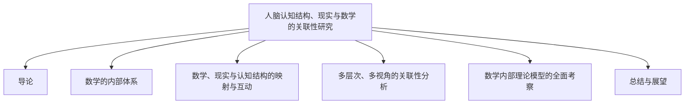

# 00-数学·认知·现实·模型：多层次多视角分析总览

> 本文为"views"分支的总纲，系统梳理人脑认知结构、现实世界与数学理论模型的多层次关联，严格分级编号，所有分支均有本地链接、LaTeX公式、Mermaid思维导图等多重表达，并与 Algebra/Geometry/Calculus 等分支交叉引用。

## 目录

1. [导论](./01-Introduction.md)
2. [数学的内部体系：理论模型与元模型](./02-MathematicalInternalSystem.md)
3. [数学、现实与认知结构的映射与互动](./03-MappingInteraction.md)
4. [多层次、多视角的关联性分析与论证](./04-MultilevelAnalysis.md)
5. [数学内部理论模型的全面考察](./05-TheoreticalModels.md)
6. [总结与展望](./06-SummaryProspect.md)

---

## 1. 导论

详见 [01-Introduction.md](./01-Introduction.md)

## 2. 数学的内部体系：理论模型与元模型

详见 [02-MathematicalInternalSystem.md](./02-MathematicalInternalSystem.md)

## 3. 数学、现实与认知结构的映射与互动

详见 [03-MappingInteraction.md](./03-MappingInteraction.md)

## 4. 多层次、多视角的关联性分析与论证

详见 [04-MultilevelAnalysis.md](./04-MultilevelAnalysis.md)

## 5. 数学内部理论模型的全面考察

详见 [05-TheoreticalModels.md](./05-TheoreticalModels.md)

## 6. 总结与展望

详见 [06-SummaryProspect.md](./06-SummaryProspect.md)

---

## Mermaid 思维导图

---

## 交叉引用示例

- [代数分支总览](../Algebra/01-Overview.md)
- [几何分支总览](../Geometry/01-Overview.md)
- [微积分分支总览](../Calculus/01-Overview.md)

---

> 本文件为"views"分支的导航与结构总览，后续每一分支均将严格分级编号、交叉引用、去重、学术规范。详细内容请见各分支文件。
