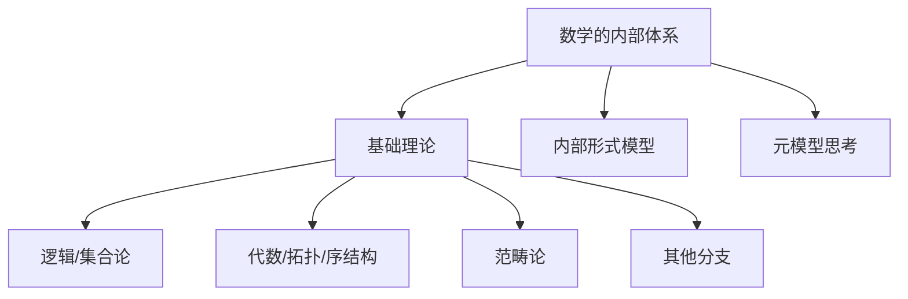

# 02-数学的内部体系：理论模型与元模型

> 本文件为"views"分支的数学内部体系详解，系统梳理数学基础理论、内部形式模型与元模型思考，严格分级编号，所有分支均有本地链接、LaTeX公式、Mermaid思维导图等多重表达，并与 Algebra/Geometry/Calculus 等分支交叉引用。

## 2.1 数学基础理论概览

### 2.1.1 数理逻辑与集合论

- 命题逻辑、谓词逻辑、集合论（如ZFC、NBG）
- 相关内容详见：[数学·逻辑分支](../30-FormalMethods/02-FormalLanguages.md)

### 2.1.2 代数结构、拓扑结构、序结构等

- 群、环、域、向量空间、拓扑空间、序理论等
- 相关内容详见：[代数分支总览](../Algebra/01-Overview.md)、[几何分支总览](../Geometry/01-Overview.md)

### 2.1.3 范畴论作为统一框架的潜力

- 范畴论统一不同数学分支的结构与映射
- 相关内容详见：[范畴论专题](../Algebra/07-CategoryTheory.md)

### 2.1.4 其他重要数学分支

- 分析、概率论、数论等的核心思想
- 相关内容详见：[微积分分支总览](../Calculus/01-Overview.md)

## 2.2 数学内部的形式模型

### 2.2.1 定义与解释：公理、定理、推论

- 形式系统的基本要素：符号、公理、推理规则
- LaTeX示例：
  $$
  \forall x \in X,\ \exists y \in Y,\ P(x, y)
  $$

### 2.2.2 论证与证明：本质、方法与局限性

- 证明方法：演绎、归纳、反证等
- 一致性、完备性、独立性等性质

### 2.2.3 模型的内部一致性、完备性、独立性探讨

- 哥德尔不完备定理、康托尔集合论等
- 相关内容详见：[逻辑与证明专题](../30-FormalMethods/03-TypeTheory.md)

## 2.3 数学中的元模型思考

### 2.3.1 公理系统作为元模型

- 公理系统不仅定义模型本身，也是元模型的基础

### 2.3.2 模型论的视角：结构、解释与满足

- 结构主义、模型论的基本思想

### 2.3.3 数学哲学流派对数学本质的元思考

- 柏拉图主义、形式主义、直觉主义、结构主义等
- 相关内容详见：[哲学分支总览](../../90-Theory/README.md)

---

## Mermaid 思维导图

---

## 交叉引用锚点

- [导论](./01-Introduction.md)
- [数学、现实与认知结构的映射](./03-MappingInteraction.md)
- [代数分支总览](../Algebra/01-Overview.md)
- [几何分支总览](../Geometry/01-Overview.md)
- [微积分分支总览](../Calculus/01-Overview.md)

---

> 本文件为"views"分支的数学内部体系详解，后续分支将依次展开详细论证。
