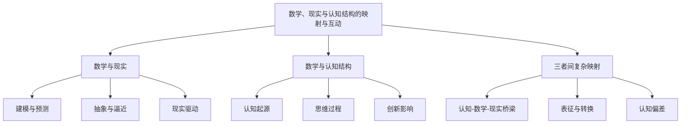

# 03-数学、现实与认知结构的映射与互动

> 本文件为"views"分支的数学、现实与认知结构映射详解，系统梳理三者间的复杂互动，严格分级编号，所有分支均有本地链接、LaTeX公式、Mermaid思维导图等多重表达，并与 Algebra/Geometry/Calculus 等分支交叉引用。

## 3.1 数学与现实（Mathematics and Reality）

### 3.1.1 数学在描述、解释和预测现实中的作用

- 物理学、经济学、工程学等领域的数学建模
- 现实世界问题驱动数学理论发展

### 3.1.2 数学模型的抽象与现实的逼近

- 数学模型的有效性与局限性
- "数学的无理有效性"再思考

### 3.1.3 现实问题对数学发展的驱动

- 现实需求推动新理论、新工具的产生

## 3.2 数学与人脑认知结构（Mathematics and Cognitive Structure）

### 3.2.1 数学概念的认知起源与发展

- 数、空间、无限等概念的认知基础
- 皮亚杰理论等认知发展模型

### 3.2.2 数学思维与认知过程

- 抽象、逻辑推理、模式识别等
- 数学直觉与形式化推理的关系

### 3.2.3 认知结构对数学学习、理解与创造的影响

- 认知结构影响数学创新与理解的深度

## 3.3 三者间的复杂映射关系

### 3.3.1 认知结构如何建构数学以理解现实

- 数学作为认知与现实之间的桥梁

### 3.3.2 数学的表征与转换

- 从现实观察到认知抽象，再到数学形式化的过程

### 3.3.3 认知偏差与数学客观性的张力

- 认知偏差对数学建模与解释的影响

---

## Mermaid 思维导图

---

## 交叉引用锚点

- [导论](./01-Introduction.md)
- [数学的内部体系](./02-MathematicalInternalSystem.md)
- [多层次、多视角的关联性分析](./04-MultilevelAnalysis.md)
- [代数分支总览](../Algebra/01-Overview.md)
- [几何分支总览](../Geometry/01-Overview.md)
- [微积分分支总览](../Calculus/01-Overview.md)

---

> 本文件为"views"分支的数学、现实与认知结构映射详解，后续分支将依次展开详细论证。
