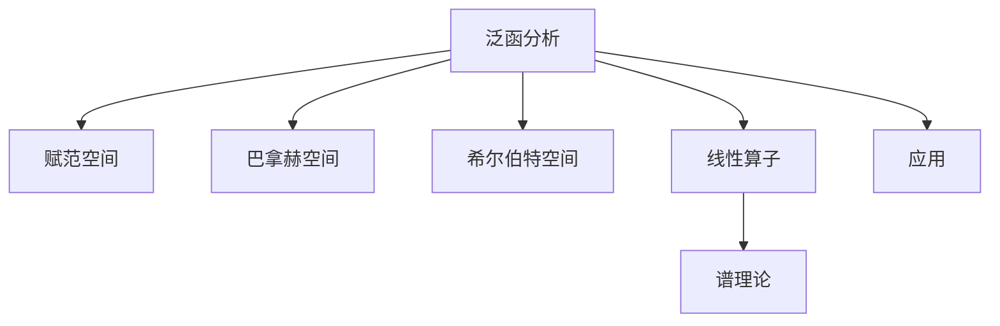

# 05. 泛函分析（Functional Analysis）

## 05.1 目录

- [05. 泛函分析（Functional Analysis）](#05-泛函分析functional-analysis)
  - [05.1 目录](#051-目录)
  - [05.2 赋范空间与巴拿赫空间](#052-赋范空间与巴拿赫空间)
  - [05.3 希尔伯特空间与内积空间](#053-希尔伯特空间与内积空间)
  - [05.4 线性算子与谱理论](#054-线性算子与谱理论)
  - [05.5 典型定理与公式](#055-典型定理与公式)
  - [05.6 可视化与多表征](#056-可视化与多表征)
    - [05.6.1 结构关系图（Mermaid）](#0561-结构关系图mermaid)
    - [05.6.2 典型图示](#0562-典型图示)
  - [05.7 应用与建模](#057-应用与建模)
  - [05.8 学习建议与资源](#058-学习建议与资源)

---

## 05.2 赋范空间与巴拿赫空间

- 赋范空间、范数、距离、完备性
- 巴拿赫空间的定义与性质
- 典型例子：$L^p$ 空间、$C([a,b])$ 空间

---

## 05.3 希尔伯特空间与内积空间

- 内积空间、正交性、投影
- 希尔伯特空间的定义与性质
- $l^2$ 空间、Fourier分析

---

## 05.4 线性算子与谱理论

- 有界线性算子、紧算子
- 谱、特征值、谱定理
- 对偶空间与泛函表示

---

## 05.5 典型定理与公式

- 巴拿赫不动点定理
- 哈恩-巴拿赫定理
- 开映射定理、闭图定理
- 希尔伯特空间正交分解

---

## 05.6 可视化与多表征

### 05.6.1 结构关系图（Mermaid）

### 05.6.2 典型图示

- 
- )

---

## 05.7 应用与建模

- 微分方程与泛函分析
- 量子力学中的希尔伯特空间
- 最优化与变分法

---

## 05.8 学习建议与资源

- 推荐教材：《泛函分析引论》（袁新意）、《Introductory Functional Analysis with Applications》（Kreyszig）
- 交互式工具：WolframAlpha、GeoGebra
- 进阶阅读：算子代数、谱理论、量子信息

---

[返回总览](./01-Overview.md)
