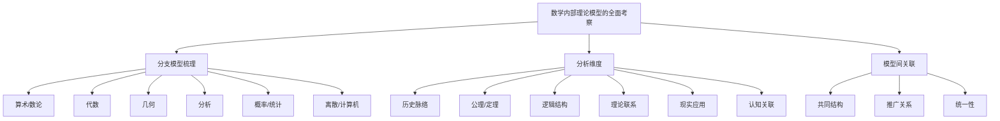

# 05-数学内部理论模型的全面考察

> 本文件为"views"分支的数学内部理论模型全面考察，系统梳理主要数学分支的核心理论模型、分析维度与模型间关联性，严格分级编号，所有分支均有本地链接、LaTeX公式、Mermaid思维导图等多重表达，并与 Algebra/Geometry/Calculus 等分支交叉引用。

## 5.1 主要数学分支的核心理论模型系统梳理

### 5.1.1 算术与数论中的模型

- 自然数、公理化算术、素数分布等
- 相关内容详见：[Algebra/01-Overview.md](../Algebra/01-Overview.md)

### 5.1.2 代数学中的模型

- 群、环、域、向量空间、模、格等
- 相关内容详见：[Algebra/02-Groups.md](../Algebra/02-Groups.md)、[Algebra/03-Rings.md](../Algebra/03-Rings.md)

### 5.1.3 几何学中的模型

- 欧氏几何、非欧几何、微分几何、拓扑学等
- 相关内容详见：[Geometry/01-Overview.md](../Geometry/01-Overview.md)

### 5.1.4 分析学中的模型

- 微积分、实分析、复分析、泛函分析等
- 相关内容详见：[Calculus/01-Overview.md](../Calculus/01-Overview.md)

### 5.1.5 概率论与数理统计中的模型

- 概率空间、分布、统计推断等
- 相关内容详见：[Probability/01-Overview.md](../Probability/01-Overview.md)

### 5.1.6 离散数学与计算机科学相关的数学模型

- 图论、组合、自动机、算法复杂性等
- 相关内容详见：[../Algebra/01-Overview.md](../Algebra/01-Overview.md)

## 5.2 理论模型的分析维度

### 5.2.1 历史渊源与发展脉络

- 主要理论模型的历史背景与演化

### 5.2.2 核心概念、公理与主要定理

- 以LaTeX公式展示典型公理/定理：
  $$
  a^2 + b^2 = c^2
  $$

### 5.2.3 内部逻辑结构与证明体系

- 形式化证明、推理规则、模型一致性

### 5.2.4 数学内部的应用与理论联系

- 不同理论模型间的交叉与统一

### 5.2.5 与现实世界现象的联系和应用

- 数学模型在物理、工程、经济等领域的应用

### 5.2.6 与认知结构的可能关联

- 数学理论模型与人类认知的互动

## 5.3 理论模型之间的关联性综合分析

### 5.3.1 跨理论的共同结构与思想

- 结构主义视角下的统一性

### 5.3.2 理论之间的相互奠基或推广关系

- 例：群论推广到环、域、范畴等

### 5.3.3 数学统一性的探讨

- 范畴论、结构主义等统一视角

---

## Mermaid 思维导图

---

## 交叉引用锚点

- [导论](./01-Introduction.md)
- [数学的内部体系](./02-MathematicalInternalSystem.md)
- [多层次、多视角的关联性分析](./04-MultilevelAnalysis.md)
- [代数分支总览](../Algebra/01-Overview.md)
- [几何分支总览](../Geometry/01-Overview.md)
- [微积分分支总览](../Calculus/01-Overview.md)

---

> 本文件为"views"分支的数学内部理论模型全面考察，后续分支将依次展开详细论证。
