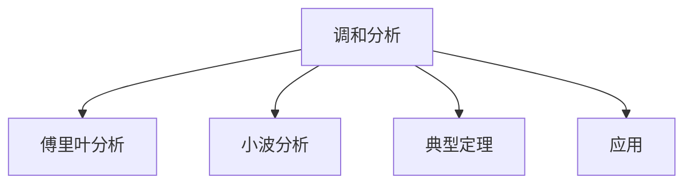

# 06. 调和分析（Harmonic Analysis）

## 06.1 目录

- [06. 调和分析（Harmonic Analysis）](#06-调和分析harmonic-analysis)
  - [06.1 目录](#061-目录)
  - [06.2 傅里叶级数与傅里叶变换](#062-傅里叶级数与傅里叶变换)
  - [06.3 小波分析与信号分解](#063-小波分析与信号分解)
  - [06.4 典型定理与公式](#064-典型定理与公式)
  - [06.5 可视化与多表征](#065-可视化与多表征)
    - [06.5.1 结构关系图（Mermaid）](#0651-结构关系图mermaid)
    - [06.5.2 典型图示](#0652-典型图示)
  - [06.6 应用与建模](#066-应用与建模)
  - [06.7 学习建议与资源](#067-学习建议与资源)

---

## 06.2 傅里叶级数与傅里叶变换

- 傅里叶级数的定义、正交性、收敛性
- 傅里叶变换、逆变换、性质
- 典型例子：周期函数、信号分解

---

## 06.3 小波分析与信号分解

- 小波变换的基本思想
- 典型小波（Haar、Daubechies等）
- 多分辨率分析、信号压缩

---

## 06.4 典型定理与公式

- 傅里叶级数展开公式
- 傅里叶变换与逆变换公式
- 帕塞瓦尔定理、卷积定理
- 小波分解公式

---

## 06.5 可视化与多表征

### 06.5.1 结构关系图（Mermaid）

### 06.5.2 典型图示

- %20=%20\int_{-\infty}^{\infty}f(x)e^{-2\pi%20ix\xi}dx)
- %20=%20\frac{1}{\sqrt{a}}\psi\left(\frac{x-b}{a}\right))

---

## 06.6 应用与建模

- 信号处理、图像压缩、数据分析
- 偏微分方程、量子力学中的谱分析

---

## 06.7 学习建议与资源

- 推荐教材：《Fourier Analysis》（Stein & Shakarchi）、《A Wavelet Tour of Signal Processing》（Mallat）
- 交互式工具：WolframAlpha、Matlab、Python（NumPy/SciPy）
- 进阶阅读：调和分析在AI、物理、工程中的应用

---

[返回总览](./01-Overview.md)
