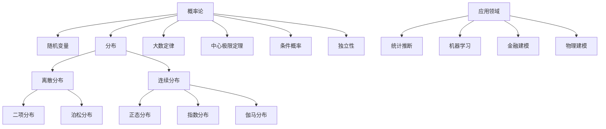

# 11. 概率论（Probability Theory）

## 11.1 目录

- [11. 概率论（Probability Theory）](#11-概率论probability-theory)
  - [11.1 目录](#111-目录)
  - [11.2 基本概念与历史](#112-基本概念与历史)
    - [11.2.1 定义与本质](#1121-定义与本质)
    - [11.2.2 历史发展](#1122-历史发展)
    - [11.2.3 认知映射](#1123-认知映射)
  - [11.3 核心理论](#113-核心理论)
    - [11.3.1 概率空间](#1131-概率空间)
    - [11.3.2 随机变量](#1132-随机变量)
    - [11.3.3 期望与方差](#1133-期望与方差)
  - [11.4 主要分支](#114-主要分支)
    - [11.4.1 离散概率](#1141-离散概率)
    - [11.4.2 连续概率](#1142-连续概率)
    - [11.4.3 多维概率](#1143-多维概率)
  - [11.5 典型定理与公式](#115-典型定理与公式)
    - [11.5.1 基本定理](#1151-基本定理)
    - [11.5.2 重要公式](#1152-重要公式)
  - [11.6 可视化与多表征](#116-可视化与多表征)
    - [11.6.1 结构关系图（Mermaid）](#1161-结构关系图mermaid)
    - [11.6.2 典型图示](#1162-典型图示)
  - [11.7 应用与建模](#117-应用与建模)
    - [11.7.1 统计推断](#1171-统计推断)
    - [11.7.2 机器学习与AI](#1172-机器学习与ai)
    - [11.7.3 金融与物理建模](#1173-金融与物理建模)
  - [11.8 学习建议与资源](#118-学习建议与资源)
    - [11.8.1 学习路径](#1181-学习路径)
    - [11.8.2 推荐资源](#1182-推荐资源)
    - [11.8.3 实践项目](#1183-实践项目)

---

## 11.2 基本概念与历史

### 11.2.1 定义与本质

**概率论**是研究随机现象数量规律的数学分支，为统计学、机器学习、金融学等提供理论基础。

**数学思维**:

- 不确定性量化思维
- 条件概率与独立性
- 随机性与确定性的统一

### 11.2.2 历史发展

- **17世纪**：帕斯卡、费马的概率论基础
- **18世纪**：贝叶斯定理、大数定律
- **19世纪**：中心极限定理、概率公理化
- **20世纪**：测度论基础、随机过程理论
- **现代**：随机分析、概率图模型

### 11.2.3 认知映射

**数学思维**:

- 不确定性量化思维
- 条件概率与独立性
- 随机性与确定性的统一

**软件工程映射**:

- 随机算法设计
- 概率数据结构
- 机器学习算法

---

## 11.3 核心理论

### 11.3.1 概率空间

**样本空间**:

```latex
\Omega \text{ - 所有可能结果的集合}
```

**事件域**:

```latex
\mathcal{F} \text{ - } \sigma \text{-代数，满足:}
```

- $\emptyset \in \mathcal{F}$
- $A \in \mathcal{F} \Rightarrow A^c \in \mathcal{F}$
- $A_i \in \mathcal{F} \Rightarrow \bigcup_{i=1}^{\infty} A_i \in \mathcal{F}$

**概率测度**:

```latex
P: \mathcal{F} \to [0,1] \text{ 满足:}
```

- $P(\emptyset) = 0, P(\Omega) = 1$
- 可列可加性：$P(\bigcup_{i=1}^{\infty} A_i) = \sum_{i=1}^{\infty} P(A_i)$

### 11.3.2 随机变量

**定义**:

```latex
X: \Omega \to \mathbb{R} \text{ 使得 } \{X \leq x\} \in \mathcal{F} \text{ for all } x
```

**分布函数**:

```latex
F_X(x) = P(X \leq x)
```

**概率密度函数**:

```latex
f_X(x) = \frac{d}{dx} F_X(x)
```

### 11.3.3 期望与方差

**期望**:

```latex
E[X] = \int_{-\infty}^{\infty} x f_X(x) dx
```

**方差**:

```latex
Var(X) = E[(X - E[X])^2] = E[X^2] - (E[X])^2
```

**协方差**:

```latex
Cov(X,Y) = E[(X - E[X])(Y - E[Y])]
```

---

## 11.4 主要分支

### 11.4.1 离散概率

**离散随机变量**:

```latex
P(X = x_i) = p_i, \quad \sum_{i=1}^{\infty} p_i = 1
```

**常见分布**:

- 伯努利分布：$P(X = 1) = p, P(X = 0) = 1-p$
- 二项分布：$P(X = k) = \binom{n}{k} p^k (1-p)^{n-k}$
- 泊松分布：$P(X = k) = \frac{\lambda^k e^{-\lambda}}{k!}$

### 11.4.2 连续概率

**连续随机变量**:

```latex
P(a \leq X \leq b) = \int_a^b f_X(x) dx
```

**常见分布**:

- 正态分布：$f(x) = \frac{1}{\sqrt{2\pi\sigma^2}} e^{-\frac{(x-\mu)^2}{2\sigma^2}}$
- 指数分布：$f(x) = \lambda e^{-\lambda x}$
- 均匀分布：$f(x) = \frac{1}{b-a}$ for $x \in [a,b]$

### 11.4.3 多维概率

**联合分布**:

```latex
F_{X,Y}(x,y) = P(X \leq x, Y \leq y)
```

**条件概率**:

```latex
P(Y = y | X = x) = \frac{P(X = x, Y = y)}{P(X = x)}
```

**独立性**:

```latex
X \perp Y \Leftrightarrow P(X = x, Y = y) = P(X = x) P(Y = y)
```

---

## 11.5 典型定理与公式

### 11.5.1 基本定理

**大数定律**:

```latex
\frac{1}{n} \sum_{i=1}^n X_i \xrightarrow{P} E[X] \text{ as } n \to \infty
```

**中心极限定理**:

```latex
\frac{\sum_{i=1}^n X_i - n\mu}{\sqrt{n}\sigma} \xrightarrow{d} N(0,1)
```

**贝叶斯定理**:

```latex
P(A|B) = \frac{P(B|A) P(A)}{P(B)}
```

### 11.5.2 重要公式

**全概率公式**:

```latex
P(B) = \sum_{i=1}^n P(B|A_i) P(A_i)
```

**切比雪夫不等式**:

```latex
P(|X - E[X]| \geq k\sigma) \leq \frac{1}{k^2}
```

**马尔可夫不等式**:

```latex
P(X \geq a) \leq \frac{E[X]}{a}
```

---

## 11.6 可视化与多表征

### 11.6.1 结构关系图（Mermaid）



### 11.6.2 典型图示

**概率分布可视化（Haskell）**:

```haskell
-- 正态分布与二项分布可视化
import Graphics.Gnuplot.Simple
import Data.List (genericLength)

normalDensity :: Double -> Double -> Double -> Double
normalDensity mu sigma x = (1 / (sigma * sqrt (2 * pi))) * exp (-(x - mu)^2 / (2 * sigma^2))

binomialPMF :: Int -> Double -> Int -> Double
binomialPMF n p k = fromIntegral (choose n k) * p^k * (1-p)^(n-k)
  where
    choose n k = product [n-k+1..n] `div` product [1..k]

plotDistributions :: IO ()
plotDistributions = do
    let xs = [-5, -4.8..5]
    plotList [] [(x, normalDensity 0 1 x) | x <- xs]
```

**条件概率流程图**:

```mermaid
graph LR
    A[已知事件A发生] --> B[计算P(B|A)]
    B --> C[联合概率P(A∩B)]
    C --> D[边缘概率P(A)]
    D --> E[输出条件概率]
```

**马尔可夫链转移（Rust）**:

```rust
// 简单马尔可夫链一步转移
fn markov_step(state: &[f64], trans: &[Vec<f64>]) -> Vec<f64> {
    let n = state.len();
    let mut next = vec![0.0; n];
    for i in 0..n {
        for j in 0..n {
            next[j] += state[i] * trans[i][j];
        }
    }
    next
}
```

---

## 11.7 应用与建模

### 11.7.1 统计推断

- 参数估计（极大似然、贝叶斯估计）
- 假设检验（显著性水平、p值）
- 区间估计（置信区间）

**Python示例：极大似然估计**:

```python
import numpy as np
from scipy.optimize import minimize

def mle_normal(data):
    def neg_log_likelihood(params):
        mu, sigma = params
        return -np.sum(-0.5 * np.log(2 * np.pi * sigma**2) - (data - mu)**2 / (2 * sigma**2))
    res = minimize(neg_log_likelihood, [0, 1], bounds=[(None, None), (1e-6, None)])
    return res.x
```

### 11.7.2 机器学习与AI

- 朴素贝叶斯分类器
- 隐马尔可夫模型（HMM）
- 蒙特卡洛方法（MCMC、采样）

**Rust示例：朴素贝叶斯分类器**:

```rust
// 简化版朴素贝叶斯分类器
fn naive_bayes_predict(features: &[f64], means: &[f64], vars: &[f64], priors: &[f64]) -> usize {
    let mut max_prob = f64::MIN;
    let mut best_class = 0;
    for (i, (&mean, &var)) in means.iter().zip(vars.iter()).enumerate() {
        let prob = priors[i] * (-0.5 * ((features[0] - mean).powi(2) / var + var.ln() + (2.0 * std::f64::consts::PI).ln())).exp();
        if prob > max_prob {
            max_prob = prob;
            best_class = i;
        }
    }
    best_class
}
```

### 11.7.3 金融与物理建模

- 金融风险建模（VaR、期权定价）
- 随机过程（布朗运动、随机微分方程）
- 物理系统中的概率建模（统计力学、量子概率）

**Scala示例：布朗运动仿真**:

```scala
import scala.util.Random

def brownianMotion(n: Int, dt: Double, mu: Double, sigma: Double): Array[Double] = {
  val rand = new Random()
  val path = Array.fill(n)(0.0)
  for (i <- 1 until n) {
    path(i) = path(i-1) + mu * dt + sigma * math.sqrt(dt) * rand.nextGaussian()
  }
  path
}
```

---

## 11.8 学习建议与资源

### 11.8.1 学习路径

1. **基础阶段**
   - 集合论基础
   - 微积分基础
   - 线性代数

2. **进阶阶段**
   - 测度论
   - 随机过程
   - 数理统计

3. **高级阶段**
   - 随机分析
   - 概率图模型
   - 随机控制

### 11.8.2 推荐资源

**经典教材**:

- 《Probability Theory》- A.N. Kolmogorov
- 《Probability and Measure》- Patrick Billingsley
- 《A First Course in Probability》- Sheldon Ross

**在线资源**:

- MIT OpenCourseWare: 6.436 Fundamentals of Probability
- Coursera: Probability and Statistics

**软件工具**:

- R: 统计计算
- Python: NumPy, SciPy
- Julia: Distributions.jl

### 11.8.3 实践项目

1. **统计建模**
   - 数据分布拟合
   - 假设检验实现
   - 回归分析

2. **机器学习应用**
   - 朴素贝叶斯分类器
   - 隐马尔可夫模型
   - 概率图模型

3. **金融建模**
   - 期权定价模型
   - 投资组合优化
   - 风险管理系统

---

**相关链接**:

- [10. 调和分析](./10-HarmonicAnalysis.md)
- [12. 统计学](./12-Statistics.md)
- [数学概览](../01-Overview.md)
