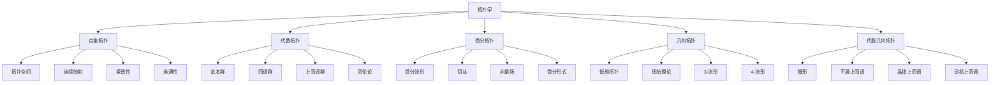

# 20. 拓扑学（Topology）

## 概述

拓扑学是研究几何图形在连续变形下保持不变性质的数学分支，被称为"橡皮几何学"。它研究空间的结构、连通性和连续性，是现代数学的重要基础。

## 历史背景

### 早期发展

- **欧拉**：柯尼斯堡七桥问题
- **高斯**：高斯-博内公式
- **黎曼**：黎曼曲面理论

### 现代拓扑学

- **庞加莱**：同伦论、基本群
- **布劳威尔**：不动点定理
- **亚历山大**：对偶性理论

### 当代发展

- **格罗滕迪克**：概形理论
- **瑟斯顿**：几何化猜想
- **佩雷尔曼**：庞加莱猜想证明

## 核心理论

### 1. 点集拓扑

#### 拓扑空间

**定义**: (X, \tau) \text{其中} \tau \subset \mathcal{P}(X) \text{满足：}
\begin{cases}
\emptyset, X \in \tau \\
U, V \in \tau \Rightarrow U \cap V \in \tau \\
\{U_i\}_{i \in I} \subset \tau \Rightarrow \bigcup_{i \in I} U_i \in \tau
\end{cases}

#### 连续映射

```latex
f: X \to Y \text{连续} \Leftrightarrow \forall V \text{开集}, f^{-1}(V) \text{开集}
```

#### 紧致性

```latex
\text{紧致空间：每个开覆盖都有有限子覆盖}
```

### 2. 代数拓扑

#### 基本群

```latex
\pi_1(X, x_0) = \{\text{基于} x_0 \text{的环路同伦类}\}
```

**群运算：**

```latex
[\alpha] \cdot [\beta] = [\alpha \cdot \beta]
```

#### 同调群

```latex
H_n(X) = \frac{\ker \partial_n}{\text{im } \partial_{n+1}}
```

**链复形：**

```latex
\cdots \to C_{n+1} \xrightarrow{\partial_{n+1}} C_n \xrightarrow{\partial_n} C_{n-1} \to \cdots
```

#### 同伦论

```latex
\text{同伦：} H: X \times [0,1] \to Y \text{连续}
```

### 3. 微分拓扑

#### 微分流形

```latex
M \text{是} n\text{维微分流形} \Leftrightarrow \text{局部同胚于} \mathbb{R}^n
```

#### 切空间

```latex
T_p M = \{\text{在} p \text{点的切向量}\}
```

#### 微分形式

```latex
\omega = \sum_{i_1 < \cdots < i_k} a_{i_1\cdots i_k} dx^{i_1} \wedge \cdots \wedge dx^{i_k}
```

## 主要分支

### 1. 点集拓扑1

- 拓扑空间
- 连续映射
- 紧致性
- 连通性

### 2. 代数拓扑1

- 基本群
- 同调群
- 上同调群
- 同伦论

### 3. 微分拓扑1

- 微分流形
- 切丛
- 向量场
- 微分形式

### 4. 几何拓扑

- 低维拓扑
- 纽结理论
- 3-流形
- 4-流形

### 5. 代数几何拓扑

- 概形
- 平展上同调
- 晶体上同调
- 动机上同调

## 典型定理与公式

### 布劳威尔不动点定理

```latex
\text{每个连续映射} f: D^n \to D^n \text{都有不动点}
```

### 庞加莱对偶性

```latex
H_k(M) \cong H^{n-k}(M) \quad \text{对于} n\text{维紧致流形}
```

### 高斯-博内公式

```latex
\int_M K \, dA = 2\pi \chi(M)
```

### 莫尔斯不等式

```latex
\sum_{k=0}^{n} (-1)^k c_k \geq \sum_{k=0}^{n} (-1)^k b_k
```

### 塞尔谱序列

```latex
E_2^{p,q} = H^p(B; H^q(F)) \Rightarrow H^{p+q}(E)
```

## 可视化与多表征

### 拓扑学分支关系图（Mermaid）



### 典型图示

**基本群与覆盖空间（Haskell）**:

```haskell
-- 基本群的循环表示
fundamentalGroup :: Int -> [[Int]]
fundamentalGroup n = filter ((==0) . sum) $ sequence (replicate n [-1,1])

-- 覆盖空间的简单枚举
coveringSpaces :: Int -> [[Int]]
coveringSpaces n = sequence (replicate n [0,1])
```

**同伦变形流程图**:


**莫比乌斯带可视化（Python）**:

```python
import numpy as np
import matplotlib.pyplot as plt
from mpl_toolkits.mplot3d import Axes3D

theta = np.linspace(0, 2 * np.pi, 100)
w = np.linspace(-0.5, 0.5, 20)
Theta, W = np.meshgrid(theta, w)
R = 1 + W * np.cos(Theta / 2)
X = R * np.cos(Theta)
Y = R * np.sin(Theta)
Z = W * np.sin(Theta / 2)

fig = plt.figure()
ax = fig.add_subplot(111, projection='3d')
ax.plot_surface(X, Y, Z, cmap='viridis')
plt.title('莫比乌斯带')
plt.show()
```

---

## 应用与建模

### 拓扑学在科学与工程中的应用

- 数据分析中的拓扑数据分析（TDA）
- 物理学中的拓扑绝缘体与量子场论
- 生物学中的分子拓扑与蛋白质折叠
- 机器人运动规划中的配置空间
- 计算机科学中的网络拓扑与分布式系统

**Python示例：TDA中的持久同调计算**:

```python
import numpy as np
from ripser import ripser
from persim import plot_diagrams

# 随机点云
X = np.random.rand(100, 2)
result = ripser(X)
plot_diagrams(result['dgms'], show=True)
```

### 拓扑优化与工程设计

- 结构优化中的拓扑优化方法
- 材料科学中的微结构设计
- 图像处理中的拓扑滤波

**Rust示例：简单拓扑优化结构生成**:

```rust
// 生成二维网格的拓扑结构（占位示例）
fn generate_topology(n: usize, m: usize) -> Vec<Vec<u8>> {
    let mut grid = vec![vec![1; m]; n];
    for i in 0..n {
        for j in 0..m {
            if (i + j) % 3 == 0 { grid[i][j] = 0; }
        }
    }
    grid
}
```

### 拓扑学与可视化

- 三维建模与几何可视化
- 网络结构的拓扑可视化
- 动态系统的相空间分析

**Scala示例：三维结点可视化数据结构**:

```scala
case class Node3D(x: Double, y: Double, z: Double)
case class Edge3D(from: Node3D, to: Node3D)
case class Graph3D(nodes: List[Node3D], edges: List[Edge3D])
```

---

## 学习建议与资源

### 经典教材

1. **《代数拓扑》** - 艾伦·哈彻尔
2. **《微分拓扑》** - 米尔诺
3. **《点集拓扑》** - 门格尔
4. **《同伦论》** - 怀特黑德

### 在线资源

- **nLab**：范畴论和拓扑学维基
- **MathOverflow**：拓扑学讨论
- **arXiv**：拓扑学预印本

### 研究前沿

- **几何化猜想**：3-流形分类
- **朗兰兹纲领**：几何与数论
- **镜像对称**：弦论与代数几何

---

**拓扑学**作为现代数学的核心分支，不仅具有深刻的数学内涵，在物理学、计算机科学等领域也有广泛应用。从点集拓扑到代数拓扑，拓扑学展现了数学的抽象美和实用价值。
