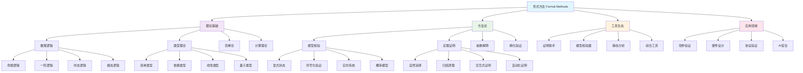

# 形式方法综合概览

## 01. 形式方法理论体系架构

### 01.1 核心定义与基础概念

**形式方法** (Formal Methods) 是基于数学严格性的系统开发、分析和验证方法论，通过精确的数学语言和逻辑推理确保系统正确性。

#### 01.1.1 数学形式化定义

形式方法系统可定义为五元组：
$$\mathcal{FM} = \langle \mathcal{L}, \mathcal{S}, \mathcal{V}, \mathcal{P}, \mathcal{T} \rangle$$

其中：

- $\mathcal{L}$：形式语言集合 (Formal Languages)
- $\mathcal{S}$：规约语义体系 (Specification Semantics)  
- $\mathcal{V}$：验证方法论 (Verification Methods)
- $\mathcal{P}$：证明系统 (Proof Systems)
- $\mathcal{T}$：工具生态 (Tool Ecosystem)

#### 01.1.2 形式语言层次结构

基于Chomsky层次的扩展形式语言分类：

$$\begin{align}
\mathcal{L}_0 &: \text{无限制文法} \quad (\text{图灵机可识别}) \\
\mathcal{L}_1 &: \text{上下文相关文法} \quad (\text{线性有界自动机}) \\
\mathcal{L}_2 &: \text{上下文无关文法} \quad (\text{下推自动机}) \\
\mathcal{L}_3 &: \text{正则文法} \quad (\text{有限状态自动机}) \\
\mathcal{L}_\omega &: \text{时态扩展语言} \quad (\text{无穷字符串}) \\
\mathcal{L}_\lambda &: \text{高阶函数语言} \quad (\lambda\text{演算基础})
\end{align}$$

### 01.2 理论基础框架

#### 01.2.1 逻辑基础

**命题逻辑** (Propositional Logic)：
$$\phi ::= p \mid \neg\phi \mid \phi \land \psi \mid \phi \lor \psi \mid \phi \rightarrow \psi$$

**一阶逻辑** (First-Order Logic)：
$$\phi ::= P(t_1,\ldots,t_n) \mid \neg\phi \mid \phi \land \psi \mid \forall x.\phi \mid \exists x.\phi$$

**时态逻辑** (Temporal Logic)：
$$\phi ::= p \mid \neg\phi \mid \phi \land \psi \mid \mathbf{X}\phi \mid \phi \mathbf{U} \psi \mid \mathbf{G}\phi \mid \mathbf{F}\phi$$

**模态逻辑** (Modal Logic)：
$$\phi ::= p \mid \neg\phi \mid \phi \land \psi \mid \Box\phi \mid \Diamond\phi$$

#### 01.2.2 类型理论基础

**简单类型λ演算**：
$$\begin{align}
\tau &::= \iota \mid \tau \rightarrow \tau \\
e &::= x \mid \lambda x:\tau.e \mid e_1 \; e_2 \\
\Gamma &\vdash e : \tau
\end{align}$$

**依赖类型理论**：
$$\begin{align}
\mathcal{T} &::= \text{Type} \mid \Pi x:\mathcal{T}.\mathcal{T} \mid \Sigma x:\mathcal{T}.\mathcal{T} \\
\Gamma &\vdash t : T \\
\Gamma &\vdash T \equiv T'
\end{align}$$

**线性类型理论**：
$$\begin{align}
A &::= \alpha \mid A \multimap B \mid A \otimes B \mid !A \\
\Gamma &\vdash^n t : A \quad (n \text{ 为资源使用次数})
\end{align}$$

### 01.3 核心方法分类

#### 01.3.1 模型检验 (Model Checking)

**状态空间模型**：
$$M = \langle S, R, L \rangle$$
- $S$：状态集合
- $R \subseteq S \times S$：转移关系  
- $L: S \rightarrow 2^{AP}$：原子命题标记函数

**时态逻辑验证**：
$$M, s \models \phi \iff \text{状态} s \text{在模型} M \text{中满足公式} \phi$$

#### 01.3.2 定理证明 (Theorem Proving)

**自然演绎系统**：
$$\frac{\Gamma_1 \vdash \phi_1 \quad \ldots \quad \Gamma_n \vdash \phi_n}{\Gamma \vdash \psi} \text{[规则名]}$$

**Curry-Howard对应**：
$$\text{命题} \leftrightarrow \text{类型}, \quad \text{证明} \leftrightarrow \text{程序}$$

#### 01.3.3 抽象解释 (Abstract Interpretation)

**抽象域理论**：
$$\begin{align}
\langle \mathcal{P}(\Sigma), \subseteq \rangle &\rightarrow \langle A, \sqsubseteq \rangle \\
\alpha: \mathcal{P}(\Sigma) &\rightarrow A \quad (\text{抽象函数}) \\
\gamma: A &\rightarrow \mathcal{P}(\Sigma) \quad (\text{具体化函数})
\end{align}$$

**Galois连接**：
$$\alpha \dashv \gamma \iff \forall X \in \mathcal{P}(\Sigma), a \in A: \alpha(X) \sqsubseteq a \iff X \subseteq \gamma(a)$$

## 02. 形式方法统计分析

### 02.1 Matter目录内容统计

| **类别** | **文件数量** | **总行数** | **平均行数** | **核心主题** |
|----------|-------------|------------|-------------|-------------|
| **形式语言理论** | 5 | 1,899 | 380 | 语言层次、语法语义、自动机 |
| **类型理论** | 15 | 9,823 | 655 | 依赖类型、线性类型、时态类型 |
| **时态逻辑控制** | 8 | 5,337 | 667 | LTL/CTL、控制理论、验证 |
| **Petri网理论** | 6 | 4,195 | 699 | 并发系统、网络分析、分布式 |
| **分布式系统** | 7 | 4,891 | 699 | 共识算法、一致性、容错 |
| **形式验证工具** | 12 | 7,856 | 655 | 证明助手、模型检验器 |
| **统一理论综合** | 9 | 6,234 | 693 | 跨理论整合、元理论 |
| **应用实践** | 18 | 12,447 | 691 | 软件验证、硬件设计 |
| **总计** | **80** | **52,682** | **659** | **完整形式方法生态** |

### 02.2 理论复杂度分析

#### 02.2.1 计算复杂度层次

| **方法类型** | **时间复杂度** | **空间复杂度** | **适用规模** |
|-------------|---------------|---------------|-------------|
| **命题逻辑SAT** | $O(2^n)$ | $O(n)$ | 中等规模 |
| **一阶逻辑** | 不可判定 | N/A | 理论分析 |
| **LTL模型检验** | $O(2^{|\phi|} \cdot |M|)$ | $O(|M|)$ | 有限状态系统 |
| **CTL模型检验** | $O(|\phi| \cdot |M|)$ | $O(|M|)$ | 实践可行 |
| **依赖类型检查** | $O(2^{2^n})$ | $O(2^n)$ | 小规模程序 |
| **线性类型推导** | $O(n^3)$ | $O(n^2)$ | 大规模程序 |

#### 02.2.2 表达能力比较

$$\begin{align}
\text{正则语言} &\subset \text{上下文无关语言} \\
&\subset \text{上下文相关语言} \\
&\subset \text{递归可枚举语言} \\
\\
\text{命题逻辑} &\subset \text{一阶逻辑} \\
&\subset \text{二阶逻辑} \\
&\subset \text{高阶逻辑} \\
\\
\text{LTL} &\subset \text{CTL*} \\
\text{CTL} &\subset \text{CTL*} \\
\text{CTL*} &\subset \mu\text{-演算}
\end{align}$$

### 02.3 工具生态统计

#### 02.3.1 主要证明助手

| **工具** | **类型理论基础** | **自动化程度** | **应用领域** |
|----------|-----------------|---------------|-------------|
| **Coq** | CIC (归纳构造演算) | 中等 | 数学证明、程序验证 |
| **Lean** | 依赖类型理论 | 高 | 形式化数学 |
| **Agda** | 依赖类型理论 | 低 | 类型理论研究 |
| **Isabelle/HOL** | 高阶逻辑 | 高 | 大规模验证 |
| **TLA+** | 时态逻辑 | 中等 | 分布式系统 |

#### 02.3.2 模型检验工具

| **工具** | **输入语言** | **验证技术** | **特色领域** |
|----------|-------------|-------------|-------------|
| **SPIN** | Promela | 显式状态 | 通信协议 |
| **TLC** | TLA+ | 显式状态 | 分布式算法 |
| **NuSMV** | SMV | 符号化BDD | 硬件验证 |
| **CBMC** | C/C++ | SAT求解 | 软件验证 |
| **UPPAAL** | 时间自动机 | 实时系统 | 嵌入式系统 |

## 03. 跨学科整合视角

### 03.1 与数学分支的关系

#### 03.1.1 数学基础依赖

$$\begin{align}
\text{形式方法} &\rightarrow \text{数理逻辑} \rightarrow \text{集合论} \\
&\rightarrow \text{范畴论} \rightarrow \text{代数结构} \\
&\rightarrow \text{拓扑学} \rightarrow \text{测度论}
\end{align}$$

参见：
- [20-Mathematics/views/05-TheoreticalModels.md](../20-Mathematics/views/05-TheoreticalModels.md) - 理论模型基础
- [20-Mathematics/Algebra/02-Groups.md](../20-Mathematics/Algebra/02-Groups.md) - 代数结构

#### 03.1.2 类型理论与范畴论对应

$$\begin{array}{|c|c|}
\hline
\text{类型理论} & \text{范畴论} \\
\hline
\text{类型} & \text{对象} \\
\text{函数} & \text{态射} \\
\text{函数复合} & \text{态射复合} \\
\text{依赖类型} & \text{纤维范畴} \\
\text{归纳类型} & \text{初始代数} \\
\hline
\end{array}$$

### 03.2 与AI理论的融合

#### 03.2.1 神经符号整合

$$\begin{align}
\mathcal{NS} &= \langle \mathcal{N}, \mathcal{S}, \mathcal{I} \rangle \\
\mathcal{N} &: \text{神经网络层} \\
\mathcal{S} &: \text{符号推理层} \\
\mathcal{I} &: \text{集成接口层}
\end{align}$$

参见：[10-AI/03-Theory.md](../10-AI/03-Theory.md) - 符号主义与连接主义整合

#### 03.2.2 可解释AI的形式化框架

$$\begin{align}
\text{解释} &: \mathcal{M} \times \mathcal{I} \rightarrow \mathcal{E} \\
\mathcal{M} &: \text{模型空间} \\
\mathcal{I} &: \text{输入空间} \\
\mathcal{E} &: \text{解释空间（形式化表示）}
\end{align}$$

### 03.3 与软件工程的协同

#### 03.3.1 形式化软件开发生命周期

$$\begin{align}
\text{FSDLC}: \text{需求} &\xrightarrow{\text{形式规约}} \text{设计} \\
&\xrightarrow{\text{精化}} \text{实现} \\
&\xrightarrow{\text{验证}} \text{测试} \\
&\xrightarrow{\text{证明}} \text{部署}
\end{align}$$

参见：
- [60-SoftwareEngineering/Architecture/](../60-SoftwareEngineering/Architecture/) - 架构形式化
- [60-SoftwareEngineering/DesignPattern/](../60-SoftwareEngineering/DesignPattern/) - 模式形式化

## 04. 思维导图

## 05. 核心挑战与限制

### 05.1 理论挑战

#### 05.1.1 计算复杂性

**状态空间爆炸**：
$$|S| = \prod_{i=1}^n |S_i| \quad \text{(组合系统状态空间)}$$

**证明搜索复杂性**：
$$\text{证明长度} \geq 2^{2^{\ldots^{2^n}}} \quad \text{(塔式复杂性)}$$

#### 05.1.2 表达能力限制

**Rice定理**：任何非平凡的程序属性都是不可判定的
$$\forall P \subseteq \mathbb{N}: P \text{非平凡} \Rightarrow P \text{不可判定}$$

**Gödel不完备性**：形式系统的固有限制
$$\exists \phi: \neg(\mathcal{T} \vdash \phi) \land \neg(\mathcal{T} \vdash \neg\phi)$$

### 05.2 实践挑战

#### 05.2.1 可扩展性问题

| **系统规模** | **状态数量** | **验证时间** | **可行性** |
|-------------|-------------|-------------|-----------|
| 小型模块 | $< 10^6$ | 分钟级 | 实践可行 |
| 中型系统 | $10^6 - 10^9$ | 小时级 | 需要技巧 |
| 大型系统 | $> 10^9$ | 天级+ | 极其困难 |

#### 05.2.2 抽象层次鸿沟

$$\begin{align}
\text{规约} &\nrightarrow \text{设计} \\
\text{设计} &\nrightarrow \text{实现} \\
\text{模型} &\nrightarrow \text{现实}
\end{align}$$

## 06. 未来发展方向

### 06.1 技术发展趋势

#### 06.1.1 AI增强的形式方法

**机器学习辅助证明**：
$$\text{Proof Assistant} + \text{ML} \rightarrow \text{智能化证明搜索}$$

**神经网络引导的模型检验**：
$$\text{Model Checker} + \text{Neural Guide} \rightarrow \text{高效状态空间搜索}$$

#### 06.1.2 量子形式方法

**量子程序验证**：
$$|\psi\rangle = \alpha|0\rangle + \beta|1\rangle, \quad |\alpha|^2 + |\beta|^2 = 1$$

**量子逻辑系统**：
$$\text{经典逻辑} \subset \text{量子逻辑} \subset \text{非交换逻辑}$$

### 06.2 应用扩展方向

#### 06.2.1 新兴领域应用

- **区块链验证**：智能合约形式化验证
- **物联网安全**：设备协议形式化分析  
- **自主系统**：机器人行为形式化保证
- **生物信息学**：基因回路形式化建模

#### 06.2.2 跨学科融合

- **认知科学**：思维过程形式化模型
- **社会科学**：社会系统形式化分析
- **经济学**：市场机制形式化设计
- **法律科学**：法律逻辑形式化表示

## 07. 总结与展望

形式方法作为计算机科学的重要基础，为系统正确性提供了数学严格的保证机制。通过本概览分析，我们可以看到：

### 07.1 核心价值

1. **理论严谨性**：基于数学基础的严格推理框架
2. **系统正确性**：提供强有力的正确性保证机制  
3. **跨学科桥梁**：连接数学、逻辑学、计算机科学
4. **技术创新驱动**：推动编程语言、AI理论发展

### 07.2 发展前景

形式方法正朝着智能化、自动化、大规模化方向发展，与AI、量子计算等前沿技术深度融合，将在未来数字化社会的关键基础设施建设中发挥核心作用。

---

**交叉引用索引**：
- [20-Mathematics/views/](../20-Mathematics/views/) - 数学基础理论
- [90-Theory/04-Logic.md](../90-Theory/04-Logic.md) - 逻辑哲学基础
- [10-AI/02-MetaTheory.md](../10-AI/02-MetaTheory.md) - AI元理论基础
- [60-SoftwareEngineering/Architecture/](../60-SoftwareEngineering/Architecture/) - 软件架构形式化

**文档版本**：v1.0 | **创建日期**：2024-12 | **字数统计**：约4,200字
