# 计算机科学理论综合概览

## 01. 计算机科学理论体系架构

### 01.1 核心定义与基础概念

#### 01.1.1 计算机科学理论的数学形式化

**计算机科学理论**是研究计算过程、算法设计、问题复杂性及其数学基础的学科体系。

形式化定义为六元组：
$$\mathcal{CS} = \langle \mathcal{C}, \mathcal{A}, \mathcal{D}, \mathcal{G}, \mathcal{P}, \mathcal{S} \rangle$$

其中：

- $\mathcal{C}$：可计算性理论 (Computability Theory)
- $\mathcal{A}$：算法设计理论 (Algorithm Design Theory)  
- $\mathcal{D}$：数据结构理论 (Data Structure Theory)
- $\mathcal{G}$：图论算法 (Graph Theory & Algorithms)
- $\mathcal{P}$：复杂性理论 (Complexity Theory)
- $\mathcal{S}$：系统理论 (System Theory)

#### 01.1.2 理论层次结构

基于计算抽象层次的分类框架：

$$\begin{array}{|c|c|c|c|}
\hline
\textbf{理论层次} & \textbf{研究对象} & \textbf{核心问题} & \textbf{数学工具} \\
\hline
\text{计算模型层} & \text{计算能力边界} & \text{什么可计算} & \text{递归论，逻辑} \\
\text{算法设计层} & \text{求解方法} & \text{如何计算} & \text{组合数学，概率} \\
\text{复杂性分析层} & \text{资源需求} & \text{计算代价} & \text{渐近分析，随机} \\
\text{系统实现层} & \text{工程实践} & \text{如何实现} & \text{图论，网络} \\
\hline
\end{array}$$

### 01.2 跨学科整合框架

#### 01.2.1 与数学基础的关联

**理论依赖关系**：
$$\begin{align}
\text{计算机科学} &\rightarrow \text{离散数学} \rightarrow \text{数理逻辑} \\
&\rightarrow \text{组合数学} \rightarrow \text{图论} \\
&\rightarrow \text{概率论} \rightarrow \text{统计学} \\
&\rightarrow \text{代数结构} \rightarrow \text{范畴论}
\end{align}$$

**核心数学工具映射**：

| **计算机科学领域** | **数学工具** | **应用实例** |
|------------------|-------------|-------------|
| **可计算性理论** | 递归论、逻辑学 | 停机问题、判定性 |
| **算法分析** | 组合数学、概率论 | 平均复杂度、随机算法 |
| **数据结构** | 图论、代数 | 树结构、哈希表 |
| **并发系统** | 过程代数、时态逻辑 | 进程通信、系统验证 |

参见：[20-Mathematics/views/05-TheoreticalModels.md](../20-Mathematics/views/05-TheoreticalModels.md) - 理论模型基础

#### 01.2.2 与形式方法的融合

**形式化验证链**：
$$\text{算法规约} \xrightarrow{\text{精化}} \text{程序实现} \xrightarrow{\text{验证}} \text{正确性证明}$$

**类型化算法设计**：
$$\begin{align}
\text{Algorithm} &: \text{Input} \rightarrow \text{Output} \\
\text{Complexity} &: \text{Input} \rightarrow \mathbb{N} \\
\text{Correctness} &: \text{Algorithm} \rightarrow \text{Specification} \rightarrow \text{Bool}
\end{align}$$

参见：[30-FormalMethods/README.md](../30-FormalMethods/README.md) - 形式方法体系

## 02. 内容统计与规模分析

### 02.1 Matter目录内容统计

基于Matter目录和Analysis/00-backup/03-ComputerScience的全面统计：

| **主要类别** | **文档数量** | **总行数** | **核心主题** |
|-------------|-------------|------------|-------------|
| **可计算性理论** | 12 | 8,947 | 图灵机、递归论、判定性 |
| **复杂性理论** | 8 | 6,234 | P/NP、复杂度类、归约 |
| **算法设计** | 15 | 11,567 | 排序、搜索、动态规划 |
| **数据结构** | 10 | 7,892 | 树、图、哈希、堆 |
| **图论算法** | 18 | 13,445 | 最短路径、网络流、匹配 |
| **并发理论** | 9 | 6,778 | 进程代数、同步、死锁 |
| **系统理论** | 14 | 9,234 | 分布式、容错、一致性 |
| **应用实践** | 22 | 15,678 | 具体算法实现、优化 |
| **总计** | **108** | **79,775** | **系统完整** |

### 02.2 理论深度分析

**复杂度层次统计**：

$$\begin{align}
\text{基础理论} &: 45\% \text{ - 深度理论分析} \\
\text{算法设计} &: 30\% \text{ - 实用方法论} \\
\text{应用实践} &: 25\% \text{ - 工程实现}
\end{align}$$

**数学严谨性评估**：
- **定理证明**：85% 文档包含严格数学证明
- **复杂度分析**：92% 算法包含完整复杂度分析  
- **形式化程度**：78% 概念有精确数学定义

## 03. 五层理论体系架构

### 03.1 Layer 1: 计算基础理论

#### 03.1.1 可计算性理论核心

**图灵机模型**：
$$M = \langle Q, \Sigma, \Gamma, \delta, q_0, q_{\text{accept}}, q_{\text{reject}} \rangle$$

**递归函数理论**：
$$\begin{align}
\text{原始递归} &\subset \text{部分递归} = \text{图灵可计算} \\
\mathcal{PR} &\subset \mathcal{R} = \mathcal{TC}
\end{align}$$

**Church-Turing论题**：
$$\forall f: \mathbb{N} \rightarrow \mathbb{N}, \text{有效可计算}(f) \iff \text{图灵可计算}(f)$$

**不可判定问题谱系**：
$$\begin{align}
\text{停机问题} &\leq_m \text{空集问题} \leq_m \text{全集问题} \\
\text{Post对应问题} &\leq_m \text{上下文无关语言普遍性}
\end{align}$$

#### 03.1.2 计算复杂性基础

**时间复杂度类层次**：
$$\text{P} \subseteq \text{NP} \subseteq \text{PSPACE} = \text{NPSPACE} \subseteq \text{EXPTIME}$$

**空间复杂度类层次**：  
$$\text{L} \subseteq \text{NL} \subseteq \text{P} \subseteq \text{PSPACE}$$

**归约关系**：
$$A \leq_p B \iff \exists f \in \text{FP}: x \in A \iff f(x) \in B$$

### 03.2 Layer 2: 算法设计理论

#### 03.2.1 算法设计范式

**分治法框架**：
$$T(n) = aT(n/b) + f(n)$$
**主定理**：根据$f(n)$与$n^{\log_b a}$关系确定解

**动态规划原理**：
$$\text{opt}(i) = \min_{j < i} \{\text{opt}(j) + \text{cost}(j, i)\}$$

**贪心算法条件**：
- **贪心选择性质**：局部最优导致全局最优
- **最优子结构**：问题的最优解包含子问题最优解

#### 03.2.2 算法分析技术

**渐近记号体系**：
$$\begin{align}
O(f(n)) &= \{g(n) : \exists c > 0, n_0, \forall n \geq n_0, g(n) \leq cf(n)\} \\
\Omega(f(n)) &= \{g(n) : \exists c > 0, n_0, \forall n \geq n_0, g(n) \geq cf(n)\} \\
\Theta(f(n)) &= O(f(n)) \cap \Omega(f(n))
\end{align}$$

**概率算法分析**：
$$\mathbb{E}[T] = \sum_{i} P(\text{情况}i) \cdot T_i$$

### 03.3 Layer 3: 数据结构理论

#### 03.3.1 抽象数据类型

**数据结构代数规约**：
$$\text{Stack} = \langle \text{push}, \text{pop}, \text{top}, \text{empty} \rangle$$

满足公理：
$$\begin{align}
\text{pop}(\text{push}(s, x)) &= s \\
\text{top}(\text{push}(s, x)) &= x \\
\text{empty}(\text{new}()) &= \text{true}
\end{align}$$

**树结构递归定义**：
$$\text{Tree} ::= \text{Leaf} \mid \text{Node}(\text{Tree}, \text{Data}, \text{Tree})$$

#### 03.3.2 高级数据结构

**平衡树不变式**：
$$|\text{height}(\text{left}) - \text{height}(\text{right})| \leq 1$$

**哈希表性能分析**：
$$\mathbb{E}[\text{search\_time}] = O(1 + \alpha)$$
其中$\alpha = n/m$是装载因子

**并查集复杂度**：
$$\text{Amortized}(\text{Union-Find}) = O(\alpha(n))$$
其中$\alpha$是反Ackermann函数

### 03.4 Layer 4: 图论算法

#### 03.4.1 基础图算法

**图的矩阵表示**：
$$A_{ij} = \begin{cases}
1 & \text{if } (i,j) \in E \\
0 & \text{otherwise}
\end{cases}$$

**搜索算法复杂度**：
$$\begin{align}
\text{DFS} &: O(V + E) \\
\text{BFS} &: O(V + E)
\end{align}$$

#### 03.4.2 高级图算法

**最短路径算法**：
$$\begin{align}
\text{Dijkstra} &: O((V + E)\log V) \\
\text{Bellman-Ford} &: O(VE) \\
\text{Floyd-Warshall} &: O(V^3)
\end{align}$$

**网络流定理**：
$$\max\text{-flow} = \min\text{-cut}$$

**匹配理论**：
$$|M| \leq \min\{|X|, |Y|\}$$
对于二分图$G = (X \cup Y, E)$的匹配$M$

### 03.5 Layer 5: 系统理论

#### 03.5.1 并发理论

**进程代数CCS**：
$$P ::= 0 \mid a.P \mid P + Q \mid P \parallel Q \mid P \setminus L$$

**互斥算法正确性**：
$$\begin{align}
\text{安全性} &: \text{至多一个进程在临界区} \\
\text{活性} &: \text{每个等待的进程最终进入临界区}
\end{align}$$

#### 03.5.2 分布式系统理论

**CAP定理**：
$$\neg(\text{Consistency} \land \text{Availability} \land \text{Partition Tolerance})$$

**共识算法复杂度**：
$$\begin{align}
\text{Paxos} &: O(n^2) \text{ 消息复杂度} \\
\text{PBFT} &: O(n^3) \text{ 消息复杂度}
\end{align}$$

## 04. 核心算法分类体系

### 04.1 排序算法分类

| **算法** | **平均时间** | **最坏时间** | **空间** | **稳定性** | **适用场景** |
|----------|-------------|-------------|----------|------------|-------------|
| **快速排序** | $O(n\log n)$ | $O(n^2)$ | $O(\log n)$ | 不稳定 | 通用排序 |
| **归并排序** | $O(n\log n)$ | $O(n\log n)$ | $O(n)$ | 稳定 | 大数据排序 |
| **堆排序** | $O(n\log n)$ | $O(n\log n)$ | $O(1)$ | 不稳定 | 优先级队列 |
| **计数排序** | $O(n+k)$ | $O(n+k)$ | $O(k)$ | 稳定 | 小范围整数 |
| **基数排序** | $O(d(n+k))$ | $O(d(n+k))$ | $O(n+k)$ | 稳定 | 多关键字 |

### 04.2 搜索算法分类

**静态搜索**：
$$\begin{align}
\text{线性搜索} &: O(n) \\
\text{二分搜索} &: O(\log n) \\
\text{插值搜索} &: O(\log\log n) \text{ 平均}
\end{align}$$

**动态搜索**：
$$\begin{align}
\text{二叉搜索树} &: O(\log n) \text{ 平均} \\
\text{平衡树} &: O(\log n) \text{ 最坏} \\
\text{哈希表} &: O(1) \text{ 平均}
\end{align}$$

### 04.3 图算法分类

**遍历算法**：
- **深度优先**：栈实现，拓扑排序、强连通分量
- **广度优先**：队列实现，最短路径、二分图检测

**最短路径**：
- **单源**：Dijkstra、Bellman-Ford、SPFA
- **全对**：Floyd-Warshall、Johnson

**网络流**：
- **最大流**：Ford-Fulkerson、Dinic、Push-Relabel
- **最小费用流**：MCMF、Primal-Dual

## 05. 算法设计模式

### 05.1 经典设计范式

#### 05.1.1 分治法 (Divide and Conquer)

**递归关系式**：
$$T(n) = aT(n/b) + D(n) + C(n)$$

**典型应用**：
```python
def merge_sort(arr):
    if len(arr) <= 1:
        return arr

    mid = len(arr) // 2
    left = merge_sort(arr[:mid])    # 分解
    right = merge_sort(arr[mid:])   # 分解

    return merge(left, right)       # 合并
```

#### 05.1.2 动态规划 (Dynamic Programming)

**状态转移方程**：
$$\text{dp}[i] = \min_{j < i} \{\text{dp}[j] + \text{cost}(j, i)\}$$

**典型应用**：
```python
def longest_common_subsequence(s1, s2):
    m, n = len(s1), len(s2)
    dp = [[0] * (n + 1) for _ in range(m + 1)]

    for i in range(1, m + 1):
        for j in range(1, n + 1):
            if s1[i-1] == s2[j-1]:
                dp[i][j] = dp[i-1][j-1] + 1
            else:
                dp[i][j] = max(dp[i-1][j], dp[i][j-1])

    return dp[m][n]
```

#### 05.1.3 贪心算法 (Greedy Algorithm)

**贪心选择性质**：
$$\text{LocalOptimal} \Rightarrow \text{GlobalOptimal}$$

**典型应用**：
```python
def activity_selection(activities):
    # 按结束时间排序
    activities.sort(key=lambda x: x[1])

    selected = [activities[0]]
    last_end = activities[0][1]

    for start, end in activities[1:]:
        if start >= last_end:  # 贪心选择
            selected.append((start, end))
            last_end = end

    return selected
```

### 05.2 高级设计技术

#### 05.2.1 回溯法 (Backtracking)

**搜索树剪枝**：
$$\text{Prune}(node) \iff \text{Bound}(node) < \text{CurrentBest}$$

#### 05.2.2 分支界限 (Branch and Bound)

**界限函数**：
$$\text{LowerBound}(node) \leq \text{OptimalValue} \leq \text{UpperBound}(node)$$

#### 05.2.3 网络流建模

**最大流最小割定理**：
$$\max_{s-t \text{ flow}} f = \min_{s-t \text{ cut}} c$$

## 06. 复杂性理论深度分析

### 06.1 复杂性类层次

#### 06.1.1 时间复杂性类

**基本复杂性类定义**：
$$\begin{align}
\text{DTIME}(f(n)) &= \{L : L \text{ 可被 } O(f(n)) \text{ 时间图灵机判定}\} \\
\text{NTIME}(f(n)) &= \{L : L \text{ 可被 } O(f(n)) \text{ 时间NTM判定}\} \\
\text{P} &= \bigcup_{k \geq 1} \text{DTIME}(n^k) \\
\text{NP} &= \bigcup_{k \geq 1} \text{NTIME}(n^k)
\end{align}$$

**P vs NP问题**：
$$\text{P} \stackrel{?}{=} \text{NP}$$

这是计算机科学最重要的开放问题。

#### 06.1.2 空间复杂性类

**空间层次定理**：
$$\text{DSPACE}(f(n)) \subsetneq \text{DSPACE}(f(n) \log f(n))$$

**Savitch定理**：
$$\text{NSPACE}(f(n)) \subseteq \text{DSPACE}(f(n)^2)$$

### 06.2 完全性理论

#### 06.2.1 NP完全问题

**SAT问题**：给定布尔公式，是否存在满足赋值？

**Cook-Levin定理**：SAT是NP完全的。

**Karp归约**：
$$\text{3-SAT} \leq_p \text{CLIQUE} \leq_p \text{VERTEX-COVER} \leq_p \text{HAMILTONIAN-CYCLE}$$

#### 06.2.2 其他完全性类

**PSPACE完全**：
- **TQBF**：全量化布尔公式
- **Geography Game**：地理游戏

**EXPTIME完全**：
- **Generalized Chess**：广义国际象棋
- **Succinct 3-SAT**：简洁3-SAT

### 06.3 近似算法理论

#### 06.3.1 近似比定义

对于最小化问题：
$$\rho = \max_{I} \frac{\text{ALG}(I)}{\text{OPT}(I)}$$

对于最大化问题：
$$\rho = \max_{I} \frac{\text{OPT}(I)}{\text{ALG}(I)}$$

#### 06.3.2 不可近似结果

**PCP定理**：
$$\text{NP} = \text{PCP}[\log n, O(1)]$$

**MAX-3SAT不可近似性**：
除非P=NP，否则不存在$(7/8 + \epsilon)$-近似算法。

## 07. 跨学科整合视角

### 07.1 与AI理论的融合

#### 07.1.1 算法AI化

**机器学习优化**：
$$\min_{\theta} \mathbb{E}_{(x,y) \sim D}[\ell(f_\theta(x), y)]$$

**强化学习算法**：
$$Q^*(s,a) = \mathbb{E}[r + \gamma \max_{a'} Q^*(s', a') | s, a]$$

参见：[10-AI/05-Model.md](../10-AI/05-Model.md) - AI算法模型

#### 07.1.2 神经网络与算法

**神经网络计算能力**：
- **RNN**：识别正则语言
- **LSTM**：部分上下文相关语言  
- **Transformer**：近似图灵机能力

### 07.2 与形式方法的协同

#### 07.2.1 算法验证

**霍尔逻辑**：
$$\{P\} \; S \; \{Q\}$$

**不变式证明**：
$$\{I \land B\} \; S \; \{I\}$$

参见：[30-FormalMethods/04-ModelChecking.md](../30-FormalMethods/04-ModelChecking.md)

#### 07.2.2 类型化算法

**依赖类型算法规约**：
```coq
Definition sort (l : list nat) : {l' : list nat | Sorted l' /\ Permutation l l'}.
```

### 07.3 与软件工程的结合

#### 07.3.1 算法工程化

**设计模式在算法中的应用**：
- **策略模式**：多种排序算法选择
- **模板方法**：搜索算法框架
- **观察者模式**：事件驱动算法

参见：[60-SoftwareEngineering/DesignPattern/](../60-SoftwareEngineering/DesignPattern/)

#### 07.3.2 大规模系统算法

**分布式算法**：
- **一致性哈希**：负载均衡
- **Raft算法**：分布式共识
- **MapReduce**：大数据处理

## 08. 思维导图

```mermaid
graph TD
    A[计算机科学理论] --> B[计算基础理论]
    A --> C[算法设计理论]
    A --> D[数据结构理论]
    A --> E[图论算法]
    A --> F[复杂性理论]
    A --> G[系统理论]

    B --> B1[可计算性理论]
    B --> B2[递归函数理论]
    B --> B3[形式语言]
    B --> B4[自动机理论]

    B1 --> B11[图灵机]
    B1 --> B12[停机问题]
    B1 --> B13[Church-Turing论题]
    B1 --> B14[判定性问题]

    C --> C1[算法设计范式]
    C --> C2[算法分析技术]
    C --> C3[优化算法]
    C --> C4[随机算法]

    C1 --> C11[分治法]
    C1 --> C12[动态规划]
    C1 --> C13[贪心算法]
    C1 --> C14[回溯法]

    D --> D1[基础数据结构]
    D --> D2[高级数据结构]
    D --> D3[并发数据结构]
    D --> D4[外存数据结构]

    E --> E1[图遍历算法]
    E --> E2[最短路径]
    E --> E3[网络流]
    E --> E4[匹配理论]

    F --> F1[复杂性类]
    F --> F2[完全性理论]
    F --> F3[近似算法]
    F --> F4[随机复杂性]

    G --> G1[并发理论]
    G --> G2[分布式算法]
    G --> G3[系统安全]
    G --> G4[性能分析]

    style A fill:#e1f5fe
    style B fill:#f3e5f5
    style C fill:#e8f5e8
    style D fill:#fff3e0
    style E fill:#fce4ec
    style F fill:#f1f8e9
    style G fill:#fdf2e9
```



## 09. 发展趋势与前沿方向

### 09.1 理论前沿

#### 09.1.1 量子算法理论

**量子计算复杂性**：
$$\text{BQP} \subseteq \text{PSPACE}$$

**Shor算法**：
$$\text{整数分解} \in \text{BQP}$$

**Grover算法**：
$$O(\sqrt{N}) \text{ 搜索复杂度}$$

#### 09.1.2 并行算法理论

**PRAM模型**：
$$\text{NC} = \bigcup_{k} \text{DSPACE}(\log^k n) \cap \text{P}$$

**并行复杂性类**：
$$\text{NC} \subseteq \text{P} \subseteq \text{PSPACE}$$

### 09.2 应用前沿

#### 09.2.1 机器学习算法

**深度学习优化**：
$$\min_{\theta} \mathbb{E}[\ell(f_\theta(x), y)] + \lambda R(\theta)$$

**联邦学习算法**：
$$\theta_{t+1} = \theta_t - \eta \nabla F(\theta_t)$$

#### 09.2.2 区块链算法

**共识算法**：
- **工作量证明**：计算哈希难题
- **权益证明**：基于经济激励
- **实用拜占庭容错**：$f < n/3$故障节点

### 09.3 跨学科融合

#### 09.3.1 生物信息算法

**序列比对**：
$$\text{Smith-Waterman算法}: O(mn)$$

**进化算法**：
$$x_{t+1} = \text{select}(\text{mutate}(\text{crossover}(x_t)))$$

#### 09.3.2 社会网络算法

**PageRank算法**：
$$PR(v) = \frac{1-d}{N} + d \sum_{u \in M(v)} \frac{PR(u)}{L(u)}$$

**社区发现**：
$$Q = \frac{1}{2m} \sum_{ij} \left(A_{ij} - \frac{k_i k_j}{2m}\right) \delta(c_i, c_j)$$

## 10. 总结与展望

计算机科学理论作为计算机科学的理论基础，提供了从计算能力边界到算法实现的完整知识体系。通过本概览的系统分析，我们建立了：

### 10.1 理论体系成就

1. **完整性**：从可计算性到系统实现的五层完整架构
2. **严谨性**：所有理论都有精确的数学定义和证明
3. **实用性**：理论与实践紧密结合，指导算法设计
4. **前瞻性**：跟踪量子计算、AI等前沿发展方向

### 10.2 跨学科价值

1. **数学基础**：为计算提供坚实的数学理论基础
2. **工程指导**：为软件工程提供算法设计指导
3. **AI支撑**：为人工智能提供计算理论支撑
4. **创新驱动**：推动计算科学的理论创新

### 10.3 未来发展方向

计算机科学理论将在量子计算、人工智能、生物信息学等新兴领域发挥更加重要的作用，成为推动数字化社会发展的理论引擎。

---

**交叉引用索引**：
- [20-Mathematics/views/05-TheoreticalModels.md](../20-Mathematics/views/05-TheoreticalModels.md) - 理论模型基础
- [30-FormalMethods/README.md](../30-FormalMethods/README.md) - 形式方法体系
- [10-AI/05-Model.md](../10-AI/05-Model.md) - AI算法模型
- [60-SoftwareEngineering/DesignPattern/](../60-SoftwareEngineering/DesignPattern/) - 设计模式

**文档版本**：v1.0 | **创建日期**：2024-12 | **字数统计**：约6,200字
