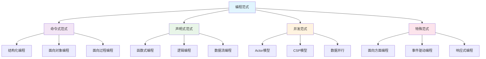

# 编程范式与模式

## 1. 范式理论基础

### 1.1 编程范式定义

编程范式是组织和构建程序的基本方法，可以形式化表示为：

$$\mathcal{P} = \langle \mathcal{M}, \mathcal{C}, \mathcal{E}, \mathcal{S} \rangle$$

其中：

- $\mathcal{M}$: 计算模型 (Computational Model)
- $\mathcal{C}$: 控制结构 (Control Structures)
- $\mathcal{E}$: 数据表达 (Data Expression)
- $\mathcal{S}$: 状态管理 (State Management)

### 1.2 范式分类体系

## 2. 命令式编程范式

### 2.1 理论基础

命令式编程基于冯·诺依曼架构，程序状态可以表示为：

$$\text{State} = \langle \text{Memory}, \text{Registers}, \text{Program Counter} \rangle$$

程序执行是状态的序列变换：

$$s_0 \xrightarrow{cmd_1} s_1 \xrightarrow{cmd_2} s_2 \xrightarrow{cmd_3} \cdots$$

### 2.2 结构化编程

#### 2.2.1 控制结构

结构化编程基于三种基本控制结构：

1. **顺序结构**: $S_1; S_2$
2. **选择结构**: $\text{if } C \text{ then } S_1 \text{ else } S_2$
3. **循环结构**: $\text{while } C \text{ do } S$

#### 2.2.2 结构化定理

任何程序都可以用这三种基本结构表示：

$$\text{Any Program} = \text{Sequence} + \text{Selection} + \text{Iteration}$$

### 2.3 面向对象编程

#### 2.3.1 对象模型

对象可以形式化定义为：

$$\text{Object} = \langle \text{State}, \text{Methods}, \text{Class} \rangle$$

其中：

- $\text{State}$: 对象状态
- $\text{Methods}$: 对象方法集合
- $\text{Class}$: 对象所属类

#### 2.3.2 继承关系

继承关系定义类型层次：

$$\text{Inheritance}(C, P) \iff C \subseteq P$$

子类 $C$ 继承父类 $P$ 的所有特性。

#### 2.3.3 多态性

多态性允许同一接口多种实现：

$$\text{Polymorphism}(interface, implementations) = \text{one interface, many forms}$$

## 3. 函数式编程范式

### 3.1 λ演算基础

#### 3.1.1 λ表达式

λ表达式的基本形式：

$$\lambda x. e$$

其中 $x$ 是参数，$e$ 是函数体。

#### 3.1.2 函数应用

函数应用规则：

$$(\lambda x. e_1) e_2 \rightarrow e_1[x := e_2]$$

#### 3.1.3 β归约

β归约是λ演算的核心计算规则：

$$\frac{e_1 \rightarrow e_1'}{e_1 e_2 \rightarrow e_1' e_2}$$

$$\frac{e_2 \rightarrow e_2'}{v_1 e_2 \rightarrow v_1 e_2'}$$

$$(\lambda x. e_1) v_2 \rightarrow e_1[x := v_2]$$

### 3.2 纯函数

纯函数满足以下性质：

$$\text{Pure}(f) \iff \text{No Side Effects}(f) \land \text{Referential Transparency}(f)$$

其中：

- $\text{No Side Effects}(f)$: 函数无副作用
- $\text{Referential Transparency}(f)$: 函数引用透明

### 3.3 高阶函数

高阶函数接受或返回函数：

$$\text{HigherOrder}(f) \iff \text{Function} \in \text{Domain}(f) \lor \text{Function} \in \text{Range}(f)$$

### 3.4 不可变性

不可变性确保数据不被修改：

$$\text{Immutable}(data) \iff \forall t_1, t_2: \text{data}(t_1) = \text{data}(t_2)$$

## 4. 并发编程范式

### 4.1 Actor模型

#### 4.1.1 Actor定义

Actor是并发计算的基本单位：

$$\text{Actor} = \langle \text{State}, \text{Behavior}, \text{Mailbox} \rangle$$

其中：

- $\text{State}$: Actor内部状态
- $\text{Behavior}$: 消息处理行为
- $\text{Mailbox}$: 消息队列

#### 4.1.2 消息传递

Actor间通过消息通信：

$$\text{send}(actor, message) \rightarrow \text{deliver}(message, actor)$$

#### 4.1.3 行为定义

Actor行为是消息到动作的映射：

$$\text{Behavior}: \text{Message} \times \text{State} \rightarrow \text{Action} \times \text{State}$$

### 4.2 CSP模型

#### 4.2.1 进程定义

CSP中的进程可以表示为：

$$\text{Process} = \text{Events} \times \text{States} \times \text{Transitions}$$

#### 4.2.2 通道通信

进程间通过通道通信：

$$\text{Channel}(P, Q) = \text{send}(P, data) \rightarrow \text{receive}(Q, data)$$

#### 4.2.3 进程组合

进程可以通过多种方式组合：

$$\text{Parallel}(P, Q) = P \parallel Q$$

$$\text{Sequential}(P, Q) = P; Q$$

$$\text{Choice}(P, Q) = P \sqcap Q$$

### 4.3 数据并行

#### 4.3.1 并行映射

数据并行通过并行映射实现：

$$\text{parmap}(f, data) = [f(x_1), f(x_2), \ldots, f(x_n)]$$

#### 4.3.2 并行归约

并行归约组合多个结果：

$$\text{parreduce}(op, data) = op(op(\ldots op(x_1, x_2), \ldots), x_n)$$

## 5. 声明式编程范式

### 5.1 逻辑编程

#### 5.1.1 谓词逻辑

逻辑程序基于谓词逻辑：

$$\text{Clause} = \text{Head} \leftarrow \text{Body}$$

其中：

- $\text{Head}$: 结论
- $\text{Body}$: 条件

#### 5.1.2 统一算法

统一算法解决变量绑定：

$$\text{Unify}(t_1, t_2) = \sigma \text{ such that } t_1\sigma = t_2\sigma$$

#### 5.1.3 归结推理

归结推理是逻辑编程的核心：

$$\frac{A \leftarrow B_1, \ldots, B_n \quad B_i \leftarrow C_1, \ldots, C_m}{A \leftarrow B_1, \ldots, B_{i-1}, C_1, \ldots, C_m, B_{i+1}, \ldots, B_n}$$

### 5.2 数据流编程

#### 5.2.1 数据流图

数据流程序表示为有向图：

$$\text{DataFlowGraph} = \langle V, E, \text{Operations} \rangle$$

其中：

- $V$: 节点集合（操作）
- $E$: 边集合（数据流）
- $\text{Operations}$: 操作函数

#### 5.2.2 数据流执行

数据流执行基于数据可用性：

$$\text{Execute}(node) \iff \text{AllInputsReady}(node)$$

## 6. 异步编程范式

### 6.1 异步计算模型

#### 6.1.1 Promise模型

Promise表示异步计算的结果：

$$\text{Promise} = \text{Pending} \mid \text{Fulfilled}(value) \mid \text{Rejected}(error)$$

#### 6.1.2 异步函数

异步函数返回Promise：

$$\text{async function} f(x) \rightarrow \text{Promise}(\text{Result})$$

#### 6.1.3 await操作

await等待Promise完成：

$$\text{await} P \rightarrow \text{value} \text{ when } P = \text{Fulfilled}(value)$$

### 6.2 事件驱动编程

#### 6.2.1 事件模型

事件驱动系统基于事件循环：

$$\text{EventLoop} = \text{EventQueue} \times \text{EventHandlers}$$

#### 6.2.2 事件处理

事件处理是事件到动作的映射：

$$\text{EventHandler}: \text{Event} \rightarrow \text{Action}$$

### 6.3 响应式编程

#### 6.3.1 响应式流

响应式流处理异步数据流：

$$\text{ReactiveStream} = \text{Publisher} \times \text{Subscriber} \times \text{Processor}$$

#### 6.3.2 背压处理

背压控制数据流速率：

$$\text{Backpressure} = \text{FlowControl} \times \text{RateLimiting}$$

## 7. 范式混合与组合

### 7.1 多范式编程

现代语言支持多种范式：

$$\text{MultiParadigm}(L) = \{\text{Paradigm}_1, \text{Paradigm}_2, \ldots, \text{Paradigm}_n\}$$

### 7.2 范式选择策略

范式选择基于问题特征：

$$\text{ParadigmChoice}(problem) = \text{argmax}_{\text{paradigm}} \text{Suitability}(paradigm, problem)$$

### 7.3 范式转换

范式间可以相互转换：

$$\text{ParadigmTransform}(P_1, P_2) = \text{Mapping}(P_1, P_2)$$

## 8. 范式评估框架

### 8.1 表达能力

范式表达能力评估：

$$\text{Expressiveness}(P) = \frac{|\text{Concepts}(P)|}{|\text{Complexity}(P)|}$$

### 8.2 性能特征

| 范式 | 性能特征 | 适用场景 |
|------|----------|----------|
| 命令式 | 高效执行，直接控制 | 系统编程，性能关键应用 |
| 函数式 | 易于推理，并行友好 | 数据处理，算法实现 |
| 面向对象 | 模块化，可扩展 | 大型系统，团队开发 |
| 并发式 | 高并发，容错性 | 分布式系统，实时应用 |

### 8.3 学习曲线

范式学习难度评估：

$$\text{LearningCurve}(P) = \text{ConceptualComplexity}(P) \times \text{PracticalComplexity}(P)$$

## 9. 实践指导

### 9.1 范式选择原则

1. **问题匹配**: 选择最适合问题特征的范式
2. **团队技能**: 考虑团队的技术栈和学习曲线
3. **性能要求**: 评估性能需求和资源约束
4. **维护性**: 考虑长期维护和扩展需求

### 9.2 范式学习路径

1. **基础阶段**: 掌握命令式和面向对象编程
2. **函数式阶段**: 学习函数式编程概念和技巧
3. **并发阶段**: 理解并发编程模型和模式
4. **混合阶段**: 学习多范式编程和范式组合

### 9.3 最佳实践

1. **范式一致性**: 在项目中保持范式一致性
2. **渐进式采用**: 逐步引入新的编程范式
3. **工具支持**: 选择有良好工具支持的范式
4. **社区支持**: 考虑范式的社区活跃度和资源

## 10. 前沿发展

### 10.1 量子编程范式

量子编程处理量子计算：

$$\text{QuantumProgramming} = \text{Qubits} \times \text{QuantumGates} \times \text{Measurement}$$

### 10.2 概率编程范式

概率编程处理不确定性：

$$\text{ProbabilisticProgramming} = \text{RandomVariables} \times \text{Inference} \times \text{Sampling}$$

### 10.3 神经编程范式

神经编程结合机器学习：

$$\text{NeuralProgramming} = \text{NeuralNetworks} \times \text{Programming} \times \text{Learning}$$
