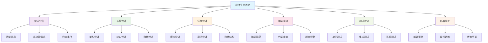

# 软件工程总览与理论基础

## 目录

- [软件工程总览与理论基础](#软件工程总览与理论基础)
  - [目录](#目录)
  - [1. 软件工程理论框架](#1-软件工程理论框架)
    - [1.1 软件工程定义](#11-软件工程定义)
    - [1.2 软件生命周期](#12-软件生命周期)
  - [2. 软件工程原理](#2-软件工程原理)
    - [2.1 模块化原理](#21-模块化原理)
    - [2.2 抽象原理](#22-抽象原理)
    - [2.3 封装原理](#23-封装原理)
    - [2.4 继承原理](#24-继承原理)
  - [3. 软件架构理论](#3-软件架构理论)
    - [3.1 架构定义](#31-架构定义)
    - [3.2 架构风格](#32-架构风格)
      - [3.2.1 分层架构](#321-分层架构)
      - [3.2.2 微服务架构](#322-微服务架构)
      - [3.2.3 事件驱动架构](#323-事件驱动架构)
    - [3.3 架构质量属性](#33-架构质量属性)
  - [4. 设计模式理论](#4-设计模式理论)
    - [4.1 模式定义](#41-模式定义)
    - [4.2 模式分类](#42-模式分类)
      - [4.2.1 创建型模式](#421-创建型模式)
      - [4.2.2 结构型模式](#422-结构型模式)
      - [4.2.3 行为型模式](#423-行为型模式)
    - [4.3 模式应用](#43-模式应用)
  - [5. 软件质量理论](#5-软件质量理论)
    - [5.1 质量模型](#51-质量模型)
    - [5.2 质量度量](#52-质量度量)
      - [5.2.1 代码质量度量](#521-代码质量度量)
      - [5.2.2 架构质量度量](#522-架构质量度量)
    - [5.3 质量保证](#53-质量保证)
  - [6. 软件测试理论](#6-软件测试理论)
    - [6.1 测试分类](#61-测试分类)
      - [6.1.1 按测试层次](#611-按测试层次)
      - [6.1.2 按测试类型](#612-按测试类型)
    - [6.2 测试覆盖率](#62-测试覆盖率)
    - [6.3 测试策略](#63-测试策略)
  - [7. 软件项目管理](#7-软件项目管理)
    - [7.1 项目生命周期](#71-项目生命周期)
    - [7.2 风险管理](#72-风险管理)
    - [7.3 资源管理](#73-资源管理)
  - [8. 软件工程方法论](#8-软件工程方法论)
    - [8.1 传统方法论](#81-传统方法论)
      - [8.1.1 瀑布模型](#811-瀑布模型)
      - [8.1.2 V模型](#812-v模型)
    - [8.2 敏捷方法论](#82-敏捷方法论)
      - [8.2.1 Scrum](#821-scrum)
      - [8.2.2 看板](#822-看板)
    - [8.3 DevOps方法论](#83-devops方法论)
  - [9. 软件工程工具](#9-软件工程工具)
    - [9.1 开发工具](#91-开发工具)
    - [9.2 管理工具](#92-管理工具)
  - [10. 软件工程趋势](#10-软件工程趋势)
    - [10.1 云原生](#101-云原生)
    - [10.2 人工智能](#102-人工智能)
    - [10.3 低代码/无代码](#103-低代码无代码)
  - [11. 实践指导](#11-实践指导)
    - [11.1 项目启动](#111-项目启动)
    - [11.2 开发过程](#112-开发过程)
    - [11.3 部署运维](#113-部署运维)
  - [12. 质量保证](#12-质量保证)
    - [12.1 代码质量](#121-代码质量)
    - [12.2 架构质量](#122-架构质量)
    - [12.3 过程质量](#123-过程质量)

## 1. 软件工程理论框架

### 1.1 软件工程定义

软件工程可以形式化定义为：

$$\mathcal{SE} = \langle \mathcal{P}, \mathcal{D}, \mathcal{I}, \mathcal{T}, \mathcal{M}, \mathcal{Q} \rangle$$

其中：

- $\mathcal{P}$: 过程管理 (Process Management)
- $\mathcal{D}$: 设计方法 (Design Methods)
- $\mathcal{I}$: 实现技术 (Implementation Techniques)
- $\mathcal{T}$: 测试策略 (Testing Strategies)
- $\mathcal{M}$: 维护方法 (Maintenance Methods)
- $\mathcal{Q}$: 质量保证 (Quality Assurance)

### 1.2 软件生命周期

## 2. 软件工程原理

### 2.1 模块化原理

模块化是软件工程的核心原理：

$$\text{Modularity}(S) = \frac{\text{Cohesion}(S)}{\text{Coupling}(S)}$$

其中：

- $\text{Cohesion}(S)$: 模块内聚度
- $\text{Coupling}(S)$: 模块耦合度

### 2.2 抽象原理

抽象是软件设计的基础：

$$\text{Abstraction}(C) = \text{Interface}(C) - \text{Implementation}(C)$$

### 2.3 封装原理

封装保护内部实现：

$$\text{Encapsulation}(M) = \text{Public}(M) + \text{Private}(M)$$

### 2.4 继承原理

继承实现代码复用：

$$\text{Inheritance}(C, P) = C \subseteq P$$

## 3. 软件架构理论

### 3.1 架构定义

软件架构可以表示为：

$$\text{Architecture} = \langle \text{Components}, \text{Connectors}, \text{Constraints} \rangle$$

### 3.2 架构风格

#### 3.2.1 分层架构

$$\text{LayeredArchitecture} = \text{Layer}_1 \rightarrow \text{Layer}_2 \rightarrow \cdots \rightarrow \text{Layer}_n$$

#### 3.2.2 微服务架构

$$\text{Microservices} = \{\text{Service}_1, \text{Service}_2, \ldots, \text{Service}_n\}$$

#### 3.2.3 事件驱动架构

$$\text{EventDriven} = \text{Publisher} \times \text{EventBus} \times \text{Subscriber}$$

### 3.3 架构质量属性

| 属性 | 定义 | 评估方法 |
|------|------|----------|
| 可维护性 | 修改软件的容易程度 | 代码复杂度分析 |
| 可扩展性 | 增加功能的容易程度 | 架构灵活性评估 |
| 可重用性 | 组件复用的程度 | 模块化程度分析 |
| 可测试性 | 测试的容易程度 | 测试覆盖率 |
| 性能 | 响应时间和吞吐量 | 性能测试 |
| 安全性 | 抵御攻击的能力 | 安全审计 |

## 4. 设计模式理论

### 4.1 模式定义

设计模式可以形式化定义为：

$$\text{Pattern} = \langle \text{Problem}, \text{Solution}, \text{Consequences} \rangle$$

### 4.2 模式分类

#### 4.2.1 创建型模式

$$\text{CreationalPatterns} = \{\text{Singleton}, \text{Factory}, \text{Builder}, \text{Prototype}, \text{AbstractFactory}\}$$

#### 4.2.2 结构型模式

$$\text{StructuralPatterns} = \{\text{Adapter}, \text{Bridge}, \text{Composite}, \text{Decorator}, \text{Facade}, \text{Flyweight}, \text{Proxy}\}$$

#### 4.2.3 行为型模式

$$\text{BehavioralPatterns} = \{\text{ChainOfResponsibility}, \text{Command}, \text{Iterator}, \text{Mediator}, \text{Memento}, \text{Observer}, \text{State}, \text{Strategy}, \text{TemplateMethod}, \text{Visitor}\}$$

### 4.3 模式应用

模式应用的质量评估：

$$\text{PatternQuality} = \text{Appropriateness} \times \text{Implementation} \times \text{Documentation}$$

## 5. 软件质量理论

### 5.1 质量模型

软件质量可以建模为：

$$\text{Quality} = \text{Functionality} \times \text{Reliability} \times \text{Usability} \times \text{Efficiency} \times \text{Maintainability} \times \text{Portability}$$

### 5.2 质量度量

#### 5.2.1 代码质量度量

$$\text{CodeQuality} = \frac{\text{Complexity}}{\text{Maintainability}} \times \text{TestCoverage} \times \text{Documentation}$$

#### 5.2.2 架构质量度量

$$\text{ArchitectureQuality} = \text{Modularity} \times \text{Scalability} \times \text{Performance} \times \text{Security}$$

### 5.3 质量保证

质量保证过程：

$$\text{QualityAssurance} = \text{Planning} \times \text{Execution} \times \text{Monitoring} \times \text{Improvement}$$

## 6. 软件测试理论

### 6.1 测试分类

#### 6.1.1 按测试层次

$$\text{TestingLevels} = \{\text{Unit}, \text{Integration}, \text{System}, \text{Acceptance}\}$$

#### 6.1.2 按测试类型

$$\text{TestingTypes} = \{\text{Functional}, \text{NonFunctional}, \text{Structural}, \text{Regression}\}$$

### 6.2 测试覆盖率

测试覆盖率定义：

$$\text{TestCoverage} = \frac{\text{ExecutedCode}}{\text{TotalCode}} \times 100\%$$

### 6.3 测试策略

测试策略选择：

$$\text{TestStrategy} = \text{Requirements} \times \text{Risk} \times \text{Resources} \times \text{Constraints}$$

## 7. 软件项目管理

### 7.1 项目生命周期

项目生命周期模型：

$$\text{ProjectLifecycle} = \text{Initiation} \rightarrow \text{Planning} \rightarrow \text{Execution} \rightarrow \text{Monitoring} \rightarrow \text{Closure}$$

### 7.2 风险管理

风险模型：

$$\text{Risk} = \text{Probability} \times \text{Impact}$$

### 7.3 资源管理

资源分配优化：

$$\text{ResourceAllocation} = \text{argmax}_{\text{allocation}} \text{Efficiency}(\text{allocation})$$

## 8. 软件工程方法论

### 8.1 传统方法论

#### 8.1.1 瀑布模型

$$\text{Waterfall} = \text{Requirements} \rightarrow \text{Design} \rightarrow \text{Implementation} \rightarrow \text{Testing} \rightarrow \text{Deployment}$$

#### 8.1.2 V模型

$$\text{VModel} = \text{Requirements} \leftrightarrow \text{AcceptanceTesting}$$

### 8.2 敏捷方法论

#### 8.2.1 Scrum

$$\text{Scrum} = \text{Sprint} \times \text{Backlog} \times \text{Retrospective}$$

#### 8.2.2 看板

$$\text{Kanban} = \text{ToDo} \rightarrow \text{InProgress} \rightarrow \text{Done}$$

### 8.3 DevOps方法论

$$\text{DevOps} = \text{Development} \times \text{Operations} \times \text{Automation}$$

## 9. 软件工程工具

### 9.1 开发工具

| 工具类型 | 功能 | 代表工具 |
|----------|------|----------|
| IDE | 集成开发环境 | IntelliJ IDEA, VS Code |
| 版本控制 | 代码版本管理 | Git, SVN |
| 构建工具 | 自动化构建 | Maven, Gradle |
| 测试工具 | 自动化测试 | JUnit, Selenium |

### 9.2 管理工具

| 工具类型 | 功能 | 代表工具 |
|----------|------|----------|
| 项目管理 | 任务跟踪 | Jira, Trello |
| 持续集成 | 自动化构建 | Jenkins, GitLab CI |
| 监控工具 | 系统监控 | Prometheus, Grafana |
| 日志工具 | 日志管理 | ELK Stack |

## 10. 软件工程趋势

### 10.1 云原生

云原生架构特征：

$$\text{CloudNative} = \text{Microservices} + \text{Containers} + \text{Orchestration} + \text{Observability}$$

### 10.2 人工智能

AI在软件工程中的应用：

$$\text{AISoftwareEngineering} = \text{CodeGeneration} + \text{Testing} + \text{Maintenance} + \text{Optimization}$$

### 10.3 低代码/无代码

低代码平台特征：

$$\text{LowCode} = \text{VisualDevelopment} + \text{ComponentLibrary} + \text{Automation}$$

## 11. 实践指导

### 11.1 项目启动

1. **需求分析**: 深入理解用户需求
2. **技术选型**: 选择合适的技术栈
3. **团队组建**: 组建合适的开发团队
4. **计划制定**: 制定详细的项目计划

### 11.2 开发过程

1. **代码规范**: 制定并遵循编码规范
2. **代码审查**: 实施代码审查制度
3. **持续集成**: 建立持续集成流程
4. **测试驱动**: 采用测试驱动开发

### 11.3 部署运维

1. **自动化部署**: 实现自动化部署流程
2. **监控告警**: 建立完善的监控体系
3. **日志管理**: 实施统一的日志管理
4. **性能优化**: 持续进行性能优化

## 12. 质量保证

### 12.1 代码质量

1. **静态分析**: 使用静态分析工具
2. **代码审查**: 实施同行代码审查
3. **单元测试**: 保持高测试覆盖率
4. **文档维护**: 保持文档的及时更新

### 12.2 架构质量

1. **架构评审**: 定期进行架构评审
2. **性能测试**: 进行全面的性能测试
3. **安全审计**: 定期进行安全审计
4. **可扩展性**: 确保架构的可扩展性

### 12.3 过程质量

1. **过程改进**: 持续改进开发过程
2. **度量分析**: 建立完善的度量体系
3. **知识管理**: 建立知识管理体系
4. **培训教育**: 定期进行团队培训
