# 设计模式与架构模式

## 目录

- [设计模式与架构模式](#设计模式与架构模式)
  - [目录](#目录)
  - [1. 设计模式理论基础](#1-设计模式理论基础)
    - [1.1 设计模式定义](#11-设计模式定义)
    - [1.2 模式分类体系](#12-模式分类体系)
  - [2. 创建型模式](#2-创建型模式)
    - [2.1 单例模式 (Singleton)](#21-单例模式-singleton)
      - [2.1.1 模式定义](#211-模式定义)
      - [2.1.2 Rust实现](#212-rust实现)
      - [2.1.3 应用场景](#213-应用场景)
    - [2.2 工厂方法模式 (Factory Method)](#22-工厂方法模式-factory-method)
      - [2.2.1 模式定义](#221-模式定义)
      - [2.2.2 Rust实现](#222-rust实现)
    - [2.3 抽象工厂模式 (Abstract Factory)](#23-抽象工厂模式-abstract-factory)
      - [2.3.1 模式定义](#231-模式定义)
      - [2.3.2 Rust实现](#232-rust实现)
  - [3. 结构型模式](#3-结构型模式)
    - [3.1 适配器模式 (Adapter)](#31-适配器模式-adapter)
      - [3.1.1 模式定义](#311-模式定义)
      - [3.1.2 Rust实现](#312-rust实现)
    - [3.2 装饰器模式 (Decorator)](#32-装饰器模式-decorator)
      - [3.2.1 模式定义](#321-模式定义)
      - [3.2.2 Rust实现](#322-rust实现)
    - [3.3 代理模式 (Proxy)](#33-代理模式-proxy)
      - [3.3.1 模式定义](#331-模式定义)
      - [3.3.2 Rust实现](#332-rust实现)
  - [4. 行为型模式](#4-行为型模式)
    - [4.1 观察者模式 (Observer)](#41-观察者模式-observer)
      - [4.1.1 模式定义](#411-模式定义)
      - [4.1.2 Rust实现](#412-rust实现)
    - [4.2 策略模式 (Strategy)](#42-策略模式-strategy)
      - [4.2.1 模式定义](#421-模式定义)
      - [4.2.2 Rust实现](#422-rust实现)
    - [4.3 状态模式 (State)](#43-状态模式-state)
      - [4.3.1 模式定义](#431-模式定义)
      - [4.3.2 Rust实现](#432-rust实现)
  - [5. 并发设计模式](#5-并发设计模式)
    - [5.1 Actor模型](#51-actor模型)
      - [5.1.1 模式定义](#511-模式定义)
      - [5.1.2 Rust实现](#512-rust实现)
    - [5.2 生产者-消费者模式](#52-生产者-消费者模式)
      - [5.2.1 模式定义](#521-模式定义)
      - [5.2.2 Rust实现](#522-rust实现)
  - [6. 分布式设计模式](#6-分布式设计模式)
    - [6.1 熔断器模式 (Circuit Breaker)](#61-熔断器模式-circuit-breaker)
      - [6.1.1 模式定义](#611-模式定义)
      - [6.1.2 Rust实现](#612-rust实现)
    - [6.2 服务发现模式](#62-服务发现模式)
      - [6.2.1 模式定义](#621-模式定义)
      - [6.2.2 Rust实现](#622-rust实现)
  - [7. 工作流设计模式](#7-工作流设计模式)
    - [7.1 状态机模式](#71-状态机模式)
      - [7.1.1 模式定义](#711-模式定义)
      - [7.1.2 Rust实现](#712-rust实现)
  - [8. 模式应用指导](#8-模式应用指导)
    - [8.1 模式选择原则](#81-模式选择原则)
    - [8.2 模式组合](#82-模式组合)
    - [8.3 反模式识别](#83-反模式识别)
  - [9. 最佳实践](#9-最佳实践)
    - [9.1 模式实现](#91-模式实现)
    - [9.2 性能考虑](#92-性能考虑)
    - [9.3 可维护性](#93-可维护性)
  - [10. 前沿发展](#10-前沿发展)
    - [10.1 函数式设计模式](#101-函数式设计模式)
    - [10.2 响应式设计模式](#102-响应式设计模式)
    - [10.3 微服务设计模式](#103-微服务设计模式)

## 1. 设计模式理论基础

### 1.1 设计模式定义

设计模式可以形式化定义为：

$$\text{DesignPattern} = \langle \text{Problem}, \text{Solution}, \text{Consequences}, \text{Context} \rangle$$

其中：

- $\text{Problem}$: 要解决的问题
- $\text{Solution}$: 解决方案
- $\text{Consequences}$: 使用后果
- $\text{Context}$: 应用场景

### 1.2 模式分类体系

```mermaid
graph TD
    A[设计模式分类] --> B[创建型模式]
    A --> C[结构型模式]
    A --> D[行为型模式]
    A --> E[并发模式]
    A --> F[分布式模式]
    A --> G[工作流模式]
    
    B --> B1[单例模式]
    B --> B2[工厂模式]
    B --> B3[建造者模式]
    B --> B4[原型模式]
    B --> B5[抽象工厂]
    
    C --> C1[适配器模式]
    C --> C2[桥接模式]
    C --> C3[组合模式]
    C --> C4[装饰器模式]
    C --> C5[外观模式]
    C --> C6[享元模式]
    C --> C7[代理模式]
    
    D --> D1[责任链模式]
    D --> D2[命令模式]
    D --> D3[迭代器模式]
    D --> D4[中介者模式]
    D --> D5[备忘录模式]
    D --> D6[观察者模式]
    D --> D7[状态模式]
    D --> D8[策略模式]
    D --> D9[模板方法]
    D --> D10[访问者模式]
    
    style A fill:#e1f5fe
    style B fill:#f3e5f5
    style C fill:#e8f5e8
    style D fill:#fff3e0
    style E fill:#fce4ec
    style F fill:#f1f8e9
    style G fill:#fdf2e9
```



## 2. 创建型模式

### 2.1 单例模式 (Singleton)

#### 2.1.1 模式定义

单例模式确保一个类只有一个实例，并提供全局访问点：

$$\text{Singleton}(C) = \exists! x \in C : \text{Instance}(x)$$

#### 2.1.2 Rust实现

```rust
use std::sync::{Mutex, Once, ONCE_INIT};
use once_cell::sync::Lazy;

// 使用once_cell的线程安全单例
static GLOBAL_CONFIG: Lazy<Mutex<Config>> = Lazy::new(|| {
    Mutex::new(Config::load_default())
});

#[derive(Debug)]
struct Config {
    setting: String,
}

impl Config {
    fn load_default() -> Self {
        Config { setting: "default".to_string() }
    }
    
    fn get_instance() -> &'static Mutex<Config> {
        &GLOBAL_CONFIG
    }
}
```

#### 2.1.3 应用场景

- 全局配置管理
- 日志记录器
- 数据库连接池
- 缓存管理器

### 2.2 工厂方法模式 (Factory Method)

#### 2.2.1 模式定义

工厂方法定义创建对象的接口，让子类决定实例化哪个类：

$$\text{FactoryMethod} = \text{Creator} \times \text{Product} \times \text{Factory}$$

#### 2.2.2 Rust实现

```rust
// 产品trait
trait Product {
    fn operation(&self) -> String;
}

// 具体产品
struct ConcreteProductA;
impl Product for ConcreteProductA {
    fn operation(&self) -> String {
        "ConcreteProductA operation".to_string()
    }
}

struct ConcreteProductB;
impl Product for ConcreteProductB {
    fn operation(&self) -> String {
        "ConcreteProductB operation".to_string()
    }
}

// 创建者trait
trait Creator {
    fn create_product(&self) -> Box<dyn Product>;
}

// 具体创建者
struct ConcreteCreatorA;
impl Creator for ConcreteCreatorA {
    fn create_product(&self) -> Box<dyn Product> {
        Box::new(ConcreteProductA)
    }
}

struct ConcreteCreatorB;
impl Creator for ConcreteCreatorB {
    fn create_product(&self) -> Box<dyn Product> {
        Box::new(ConcreteProductB)
    }
}
```

### 2.3 抽象工厂模式 (Abstract Factory)

#### 2.3.1 模式定义

抽象工厂提供创建相关对象家族的接口：

$$\text{AbstractFactory} = \{\text{Factory}_1, \text{Factory}_2, \ldots, \text{Factory}_n\} \times \{\text{Product}_1, \text{Product}_2, \ldots, \text{Product}_m\}$$

#### 2.3.2 Rust实现

```rust
// 抽象产品A
trait AbstractProductA {
    fn operation_a(&self) -> String;
}

// 抽象产品B
trait AbstractProductB {
    fn operation_b(&self) -> String;
}

// 具体产品
struct ConcreteProductA1;
impl AbstractProductA for ConcreteProductA1 {
    fn operation_a(&self) -> String {
        "ConcreteProductA1 operation".to_string()
    }
}

struct ConcreteProductB1;
impl AbstractProductB for ConcreteProductB1 {
    fn operation_b(&self) -> String {
        "ConcreteProductB1 operation".to_string()
    }
}

// 抽象工厂
trait AbstractFactory {
    fn create_product_a(&self) -> Box<dyn AbstractProductA>;
    fn create_product_b(&self) -> Box<dyn AbstractProductB>;
}

// 具体工厂
struct ConcreteFactory1;
impl AbstractFactory for ConcreteFactory1 {
    fn create_product_a(&self) -> Box<dyn AbstractProductA> {
        Box::new(ConcreteProductA1)
    }
    
    fn create_product_b(&self) -> Box<dyn AbstractProductB> {
        Box::new(ConcreteProductB1)
    }
}
```

## 3. 结构型模式

### 3.1 适配器模式 (Adapter)

#### 3.1.1 模式定义

适配器模式使不兼容的接口能够协同工作：

$$\text{Adapter}(T, A) = \text{Interface}(T) \rightarrow \text{Interface}(A)$$

#### 3.1.2 Rust实现

```rust
// 目标接口
trait Target {
    fn request(&self) -> String;
}

// 被适配的类
struct Adaptee {
    specific_request: String,
}

impl Adaptee {
    fn specific_request(&self) -> String {
        self.specific_request.clone()
    }
}

// 适配器
struct Adapter {
    adaptee: Adaptee,
}

impl Adapter {
    fn new(adaptee: Adaptee) -> Self {
        Adapter { adaptee }
    }
}

impl Target for Adapter {
    fn request(&self) -> String {
        // 将特定请求转换为目标接口
        format!("Adapter: {}", self.adaptee.specific_request())
    }
}
```

### 3.2 装饰器模式 (Decorator)

#### 3.2.1 模式定义

装饰器模式动态地给对象添加新功能：

$$\text{Decorator}(C) = C \times \text{AdditionalBehavior}$$

#### 3.2.2 Rust实现

```rust
// 组件trait
trait Component {
    fn operation(&self) -> String;
}

// 具体组件
struct ConcreteComponent;
impl Component for ConcreteComponent {
    fn operation(&self) -> String {
        "ConcreteComponent".to_string()
    }
}

// 装饰器基类
struct Decorator {
    component: Box<dyn Component>,
}

impl Decorator {
    fn new(component: Box<dyn Component>) -> Self {
        Decorator { component }
    }
}

impl Component for Decorator {
    fn operation(&self) -> String {
        format!("Decorator({})", self.component.operation())
    }
}

// 具体装饰器
struct ConcreteDecoratorA {
    decorator: Decorator,
}

impl ConcreteDecoratorA {
    fn new(component: Box<dyn Component>) -> Self {
        ConcreteDecoratorA {
            decorator: Decorator::new(component)
        }
    }
}

impl Component for ConcreteDecoratorA {
    fn operation(&self) -> String {
        format!("ConcreteDecoratorA({})", self.decorator.operation())
    }
}
```

### 3.3 代理模式 (Proxy)

#### 3.3.1 模式定义

代理模式为其他对象提供一种代理以控制对这个对象的访问：

$$\text{Proxy}(S) = \text{AccessControl}(S) \times \text{Interface}(S)$$

#### 3.3.2 Rust实现

```rust
// 服务接口
trait Service {
    fn request(&self) -> String;
}

// 真实服务
struct RealService;
impl Service for RealService {
    fn request(&self) -> String {
        "RealService response".to_string()
    }
}

// 代理
struct Proxy {
    real_service: Option<RealService>,
}

impl Proxy {
    fn new() -> Self {
        Proxy { real_service: None }
    }
    
    fn lazy_init(&mut self) {
        if self.real_service.is_none() {
            self.real_service = Some(RealService);
        }
    }
}

impl Service for Proxy {
    fn request(&self) -> String {
        // 这里需要可变引用，实际实现中可能需要内部可变性
        "Proxy: Access control and caching".to_string()
    }
}
```

## 4. 行为型模式

### 4.1 观察者模式 (Observer)

#### 4.1.1 模式定义

观察者模式定义对象间的一对多依赖关系：

$$\text{Observer} = \text{Subject} \times \{\text{Observer}_1, \text{Observer}_2, \ldots, \text{Observer}_n\}$$

#### 4.1.2 Rust实现

```rust
use std::collections::HashMap;
use std::sync::{Arc, Mutex};

// 观察者trait
trait Observer {
    fn update(&self, data: &str);
}

// 主题trait
trait Subject {
    fn attach(&mut self, observer: Arc<dyn Observer>);
    fn detach(&mut self, observer: Arc<dyn Observer>);
    fn notify(&self);
}

// 具体主题
struct ConcreteSubject {
    observers: Vec<Arc<dyn Observer>>,
    data: String,
}

impl ConcreteSubject {
    fn new() -> Self {
        ConcreteSubject {
            observers: Vec::new(),
            data: String::new(),
        }
    }
    
    fn set_data(&mut self, data: String) {
        self.data = data;
        self.notify();
    }
}

impl Subject for ConcreteSubject {
    fn attach(&mut self, observer: Arc<dyn Observer>) {
        self.observers.push(observer);
    }
    
    fn detach(&mut self, _observer: Arc<dyn Observer>) {
        // 简化实现，实际中需要比较和移除
    }
    
    fn notify(&self) {
        for observer in &self.observers {
            observer.update(&self.data);
        }
    }
}

// 具体观察者
struct ConcreteObserver {
    name: String,
}

impl ConcreteObserver {
    fn new(name: String) -> Self {
        ConcreteObserver { name }
    }
}

impl Observer for ConcreteObserver {
    fn update(&self, data: &str) {
        println!("Observer {} received: {}", self.name, data);
    }
}
```

### 4.2 策略模式 (Strategy)

#### 4.2.1 模式定义

策略模式定义算法家族，分别封装起来，让它们之间可以互相替换：

$$\text{Strategy} = \{\text{Algorithm}_1, \text{Algorithm}_2, \ldots, \text{Algorithm}_n\}$$

#### 4.2.2 Rust实现

```rust
// 策略trait
trait Strategy {
    fn algorithm(&self, data: &str) -> String;
}

// 具体策略
struct ConcreteStrategyA;
impl Strategy for ConcreteStrategyA {
    fn algorithm(&self, data: &str) -> String {
        format!("StrategyA: {}", data.to_uppercase())
    }
}

struct ConcreteStrategyB;
impl Strategy for ConcreteStrategyB {
    fn algorithm(&self, data: &str) -> String {
        format!("StrategyB: {}", data.to_lowercase())
    }
}

// 上下文
struct Context {
    strategy: Box<dyn Strategy>,
}

impl Context {
    fn new(strategy: Box<dyn Strategy>) -> Self {
        Context { strategy }
    }
    
    fn execute_strategy(&self, data: &str) -> String {
        self.strategy.algorithm(data)
    }
    
    fn set_strategy(&mut self, strategy: Box<dyn Strategy>) {
        self.strategy = strategy;
    }
}
```

### 4.3 状态模式 (State)

#### 4.3.1 模式定义

状态模式允许对象在内部状态改变时改变其行为：

$$\text{State} = \{\text{State}_1, \text{State}_2, \ldots, \text{State}_n\} \times \text{Transitions}$$

#### 4.3.2 Rust实现

```rust
// 状态trait
trait State {
    fn handle(&self) -> String;
    fn next_state(self: Box<Self>) -> Box<dyn State>;
}

// 具体状态
struct StateA;
impl State for StateA {
    fn handle(&self) -> String {
        "Handling in State A".to_string()
    }
    
    fn next_state(self: Box<Self>) -> Box<dyn State> {
        Box::new(StateB)
    }
}

struct StateB;
impl State for StateB {
    fn handle(&self) -> String {
        "Handling in State B".to_string()
    }
    
    fn next_state(self: Box<Self>) -> Box<dyn State> {
        Box::new(StateA)
    }
}

// 上下文
struct Context {
    state: Box<dyn State>,
}

impl Context {
    fn new() -> Self {
        Context {
            state: Box::new(StateA),
        }
    }
    
    fn request(&mut self) -> String {
        let result = self.state.handle();
        self.state = self.state.next_state();
        result
    }
}
```

## 5. 并发设计模式

### 5.1 Actor模型

#### 5.1.1 模式定义

Actor模型是并发计算的基本单位：

$$\text{Actor} = \langle \text{State}, \text{Behavior}, \text{Mailbox} \rangle$$

#### 5.1.2 Rust实现

```rust
use tokio::sync::mpsc;
use std::sync::{Arc, Mutex};

// Actor消息
#[derive(Clone)]
enum Message {
    Increment,
    Get(oneshot::Sender<i32>),
}

// Actor
struct CounterActor {
    count: Arc<Mutex<i32>>,
    tx: mpsc::Sender<Message>,
}

impl CounterActor {
    fn new() -> Self {
        let (tx, mut rx) = mpsc::channel(100);
        let count = Arc::new(Mutex::new(0));
        
        // 启动actor任务
        let count_clone = Arc::clone(&count);
        tokio::spawn(async move {
            while let Some(message) = rx.recv().await {
                match message {
                    Message::Increment => {
                        let mut count = count_clone.lock().unwrap();
                        *count += 1;
                    }
                    Message::Get(sender) => {
                        let count = *count_clone.lock().unwrap();
                        let _ = sender.send(count);
                    }
                }
            }
        });
        
        CounterActor { count, tx }
    }
    
    async fn increment(&self) {
        let _ = self.tx.send(Message::Increment).await;
    }
    
    async fn get_count(&self) -> i32 {
        let (tx, rx) = oneshot::channel();
        let _ = self.tx.send(Message::Get(tx)).await;
        rx.await.unwrap()
    }
}
```

### 5.2 生产者-消费者模式

#### 5.2.1 模式定义

生产者-消费者模式协调生产者和消费者的工作：

$$\text{ProducerConsumer} = \text{Producer} \times \text{Queue} \times \text{Consumer}$$

#### 5.2.2 Rust实现

```rust
use tokio::sync::mpsc;
use std::time::Duration;

// 生产者
async fn producer(tx: mpsc::Sender<i32>) {
    for i in 0..10 {
        println!("Producing: {}", i);
        tx.send(i).await.unwrap();
        tokio::time::sleep(Duration::from_millis(100)).await;
    }
}

// 消费者
async fn consumer(mut rx: mpsc::Receiver<i32>) {
    while let Some(item) = rx.recv().await {
        println!("Consuming: {}", item);
        tokio::time::sleep(Duration::from_millis(200)).await;
    }
}

// 主函数
async fn producer_consumer_example() {
    let (tx, rx) = mpsc::channel(10);
    
    let producer_handle = tokio::spawn(producer(tx));
    let consumer_handle = tokio::spawn(consumer(rx));
    
    producer_handle.await.unwrap();
    consumer_handle.await.unwrap();
}
```

## 6. 分布式设计模式

### 6.1 熔断器模式 (Circuit Breaker)

#### 6.1.1 模式定义

熔断器模式防止级联故障：

$$\text{CircuitBreaker} = \text{Closed} \mid \text{Open} \mid \text{HalfOpen}$$

#### 6.1.2 Rust实现

```rust
use std::sync::{Arc, Mutex};
use std::time::{Duration, Instant};

#[derive(Debug, Clone)]
enum CircuitState {
    Closed,
    Open,
    HalfOpen,
}

struct CircuitBreaker {
    state: Arc<Mutex<CircuitState>>,
    failure_threshold: u32,
    timeout: Duration,
    last_failure_time: Arc<Mutex<Option<Instant>>>,
    failure_count: Arc<Mutex<u32>>,
}

impl CircuitBreaker {
    fn new(failure_threshold: u32, timeout: Duration) -> Self {
        CircuitBreaker {
            state: Arc::new(Mutex::new(CircuitState::Closed)),
            failure_threshold,
            timeout,
            last_failure_time: Arc::new(Mutex::new(None)),
            failure_count: Arc::new(Mutex::new(0)),
        }
    }
    
    async fn call<F, T, E>(&self, f: F) -> Result<T, E>
    where
        F: FnOnce() -> Result<T, E>,
    {
        let state = *self.state.lock().unwrap();
        
        match state {
            CircuitState::Open => {
                let last_failure = *self.last_failure_time.lock().unwrap();
                if let Some(time) = last_failure {
                    if time.elapsed() >= self.timeout {
                        // 尝试半开状态
                        *self.state.lock().unwrap() = CircuitState::HalfOpen;
                        return self.call(f).await;
                    }
                }
                Err(/* 自定义错误类型 */)
            }
            CircuitState::HalfOpen | CircuitState::Closed => {
                match f() {
                    Ok(result) => {
                        // 成功，重置状态
                        *self.state.lock().unwrap() = CircuitState::Closed;
                        *self.failure_count.lock().unwrap() = 0;
                        Ok(result)
                    }
                    Err(e) => {
                        // 失败，增加失败计数
                        let mut failure_count = self.failure_count.lock().unwrap();
                        *failure_count += 1;
                        *self.last_failure_time.lock().unwrap() = Some(Instant::now());
                        
                        if *failure_count >= self.failure_threshold {
                            *self.state.lock().unwrap() = CircuitState::Open;
                        }
                        Err(e)
                    }
                }
            }
        }
    }
}
```

### 6.2 服务发现模式

#### 6.2.1 模式定义

服务发现允许服务动态发现和注册：

$$\text{ServiceDiscovery} = \text{Registry} \times \text{Discovery} \times \text{LoadBalancing}$$

#### 6.2.2 Rust实现

```rust
use std::collections::HashMap;
use std::sync::{Arc, Mutex};
use std::net::SocketAddr;

#[derive(Clone, Debug)]
struct ServiceInstance {
    id: String,
    address: SocketAddr,
    health: bool,
}

struct ServiceRegistry {
    services: Arc<Mutex<HashMap<String, Vec<ServiceInstance>>>>,
}

impl ServiceRegistry {
    fn new() -> Self {
        ServiceRegistry {
            services: Arc::new(Mutex::new(HashMap::new())),
        }
    }
    
    fn register(&self, service_name: String, instance: ServiceInstance) {
        let mut services = self.services.lock().unwrap();
        services.entry(service_name).or_insert_with(Vec::new).push(instance);
    }
    
    fn discover(&self, service_name: &str) -> Option<Vec<ServiceInstance>> {
        let services = self.services.lock().unwrap();
        services.get(service_name).cloned()
    }
    
    fn deregister(&self, service_name: &str, instance_id: &str) {
        let mut services = self.services.lock().unwrap();
        if let Some(instances) = services.get_mut(service_name) {
            instances.retain(|instance| instance.id != instance_id);
        }
    }
}
```

## 7. 工作流设计模式

### 7.1 状态机模式

#### 7.1.1 模式定义

状态机模式管理对象的状态转换：

$$\text{StateMachine} = \langle \text{States}, \text{Transitions}, \text{InitialState} \rangle$$

#### 7.1.2 Rust实现

```rust
use std::collections::HashMap;

#[derive(Debug, Clone, PartialEq, Eq, Hash)]
enum OrderState {
    Pending,
    Confirmed,
    Shipped,
    Delivered,
    Cancelled,
}

#[derive(Debug)]
struct Order {
    id: String,
    state: OrderState,
    transitions: HashMap<OrderState, Vec<OrderState>>,
}

impl Order {
    fn new(id: String) -> Self {
        let mut transitions = HashMap::new();
        transitions.insert(OrderState::Pending, vec![OrderState::Confirmed, OrderState::Cancelled]);
        transitions.insert(OrderState::Confirmed, vec![OrderState::Shipped, OrderState::Cancelled]);
        transitions.insert(OrderState::Shipped, vec![OrderState::Delivered]);
        transitions.insert(OrderState::Delivered, vec![]);
        transitions.insert(OrderState::Cancelled, vec![]);
        
        Order {
            id,
            state: OrderState::Pending,
            transitions,
        }
    }
    
    fn can_transition_to(&self, new_state: &OrderState) -> bool {
        if let Some(allowed_states) = self.transitions.get(&self.state) {
            allowed_states.contains(new_state)
        } else {
            false
        }
    }
    
    fn transition_to(&mut self, new_state: OrderState) -> Result<(), String> {
        if self.can_transition_to(&new_state) {
            self.state = new_state;
            Ok(())
        } else {
            Err(format!("Invalid transition from {:?} to {:?}", self.state, new_state))
        }
    }
}
```

## 8. 模式应用指导

### 8.1 模式选择原则

1. **问题匹配**: 选择最适合解决当前问题的模式
2. **复杂度考虑**: 避免过度设计，选择最简单的解决方案
3. **团队熟悉度**: 考虑团队对模式的熟悉程度
4. **维护性**: 选择易于理解和维护的模式

### 8.2 模式组合

模式可以组合使用：

$$\text{PatternCombination} = \text{Pattern}_1 \times \text{Pattern}_2 \times \cdots \times \text{Pattern}_n$$

### 8.3 反模式识别

避免常见的设计反模式：

1. **过度工程**: 使用不必要的复杂模式
2. **模式滥用**: 强制使用不适合的模式
3. **忽略上下文**: 不考虑具体应用场景

## 9. 最佳实践

### 9.1 模式实现

1. **清晰命名**: 使用描述性的类和方法名
2. **文档注释**: 为模式实现添加详细注释
3. **单元测试**: 为模式实现编写测试用例
4. **示例代码**: 提供完整的使用示例

### 9.2 性能考虑

1. **内存使用**: 注意模式的内存开销
2. **性能影响**: 评估模式对性能的影响
3. **并发安全**: 确保模式在并发环境下的安全性

### 9.3 可维护性

1. **代码组织**: 良好的代码组织结构
2. **依赖管理**: 最小化模式间的依赖
3. **扩展性**: 设计时考虑未来的扩展需求

## 10. 前沿发展

### 10.1 函数式设计模式

结合函数式编程的设计模式：

$$\text{FunctionalPattern} = \text{Immutability} \times \text{HigherOrderFunctions} \times \text{PatternMatching}$$

### 10.2 响应式设计模式

响应式编程中的设计模式：

$$\text{ReactivePattern} = \text{Observable} \times \text{Observer} \times \text{Stream}$$

### 10.3 微服务设计模式

微服务架构中的设计模式：

$$\text{MicroservicePattern} = \text{ServiceMesh} \times \text{API Gateway} \times \text{EventSourcing}$$
