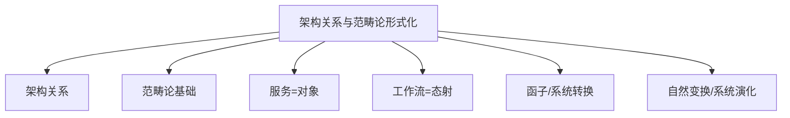

# 04-架构关系与范畴论形式化

> 本文件为架构分支的架构关系与范畴论形式化详解，系统梳理架构关系（关联、同构、等价、组合、聚合）、范畴论基础、服务与工作流的范畴表达、函子与系统转换、自然变换与系统演化等，严格分级编号，所有分支均有本地链接、LaTeX公式、Mermaid思维导图、代码示例等多重表达，并与分布式架构、工作流等分支交叉引用。

## 4.1 架构关系分析

### 4.1.1 关联关系

- 架构元素间的依赖、引用、调用等

### 4.1.2 同构关系

- 不同架构在结构和功能上的一一对应

### 4.1.3 等价关系

- 不同实现方案在功能或语义上的等价性

### 4.1.4 组合关系

- 架构元素的组合、复用、聚合

### 4.1.5 聚合关系

- 多个子系统或模块的聚合形成更大系统

## 4.2 范畴论基础

### 4.2.1 范畴定义

- 对象、态射、合成、恒等
- LaTeX示例：\( f: A \to B \)

### 4.2.2 服务作为对象

- 每个服务/模块视为范畴中的对象

### 4.2.3 工作流作为态射

- 工作流/流程视为对象间的态射

### 4.2.4 函子与系统转换

- 架构间的结构性映射

### 4.2.5 自然变换与系统演化

- 架构变迁、系统升级的范畴论表达

---

## Mermaid 思维导图

---

## 交叉引用锚点

- [架构分支总览](./00-Overview.md)
- [分布式架构与微服务设计](./01-DistributedMicroservices.md)
- [工作流理论与模式](./03-WorkflowTheory.md)
- [设计模式分支总览](../DesignPattern/00-Overview.md)

---

> 本文件为架构分支的架构关系与范畴论形式化详解，后续分支将依次展开详细论证。
