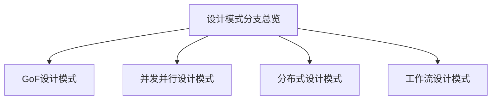

# 00-设计模式分支总览

> 本文件为软件工程-设计模式分支的总纲，系统梳理GoF设计模式、并发并行、分布式、工作流四大主线，严格分级编号，所有分支均有本地链接、LaTeX公式、Mermaid思维导图等多重表达，并与架构、微服务等分支交叉引用。

## 目录

1. [GoF设计模式](./01-GoF.md)
2. [并发并行设计模式](./02-ConcurrentParallel.md)
3. [分布式设计模式](./03-Distributed.md)
4. [工作流设计模式](./04-Workflow.md)

---

## 四大主线简介

### 1. GoF设计模式

- 创建型、结构型、行为型23种经典模式，含代码示例

### 2. 并发并行设计模式

- 活动对象、管程、线程池、Actor等

### 3. 分布式设计模式

- 服务发现、熔断器、API网关、Saga、消息队列等

### 4. 工作流设计模式

- 状态机、工作流引擎、任务队列、编排与协同等

---

## Mermaid 思维导图

---

## 交叉引用示例

- [软件工程架构分支总览](../Architecture/00-Overview.md)
- [微服务分支总览](../Microservices/00-Overview.md)

---

> 本文件为设计模式分支的导航与结构总览，后续每一分支均将严格分级编号、交叉引用、去重、学术规范。详细内容请见各分支文件。
