# 01-GoF设计模式

> 本文件为设计模式分支的GoF设计模式详解，系统梳理创建型、结构型、行为型23种经典模式，严格分级编号，所有分支均有本地链接、LaTeX公式、Mermaid思维导图、代码示例等多重表达，并与架构、微服务等分支交叉引用。

## 1.1 创建型模式（Creational Patterns）

### 1.1.1 单例模式（Singleton）

- 保证一个类仅有一个实例，并提供全局访问点
- 典型代码（Rust）：

```rust
// 见 design_pattern.md 示例
```

### 1.1.2 工厂方法模式（Factory Method）

- 定义创建对象的接口，让子类决定实例化哪一个类

### 1.1.3 抽象工厂模式（Abstract Factory）

- 提供一个创建一系列相关或相互依赖对象的接口

### 1.1.4 建造者模式（Builder）

- 将一个复杂对象的构建与其表示分离

### 1.1.5 原型模式（Prototype）

- 通过复制现有实例来创建新对象

## 1.2 结构型模式（Structural Patterns）

### 1.2.1 适配器模式（Adapter）

- 将一个类的接口转换成客户希望的另一个接口

### 1.2.2 桥接模式（Bridge）

- 将抽象部分与实现部分分离

### 1.2.3 组合模式（Composite）

- 将对象组合成树形结构以表示"部分-整体"层次

### 1.2.4 装饰器模式（Decorator）

- 动态地给对象添加职责

### 1.2.5 外观模式（Facade）

- 为子系统提供统一接口

### 1.2.6 享元模式（Flyweight）

- 运用共享技术有效支持大量细粒度对象

### 1.2.7 代理模式（Proxy）

- 为其他对象提供一种代理以控制对这个对象的访问

## 1.3 行为型模式（Behavioral Patterns）

### 1.3.1 责任链模式（Chain of Responsibility）

- 使多个对象都有机会处理请求

### 1.3.2 命令模式（Command）

- 将请求封装为对象

### 1.3.3 解释器模式（Interpreter）

- 给定语言定义其文法的一种表示，并定义一个解释器

### 1.3.4 迭代器模式（Iterator）

- 提供一种方法顺序访问聚合对象元素

### 1.3.5 中介者模式（Mediator）

- 用一个中介对象封装一系列对象交互

### 1.3.6 备忘录模式（Memento）

- 在不破坏封装性的前提下捕获并外部化对象内部状态

### 1.3.7 观察者模式（Observer）

- 定义对象间一种一对多依赖关系

### 1.3.8 状态模式（State）

- 允许对象在内部状态改变时改变其行为

### 1.3.9 策略模式（Strategy）

- 定义一系列算法，把它们封装起来

### 1.3.10 模板方法模式（Template Method）

- 定义一个操作中的算法骨架

### 1.3.11 访问者模式（Visitor）

- 表示一个作用于某对象结构中的各元素的操作

---

## Mermaid 思维导图

```mermaid
graph TD;
  GoF["GoF设计模式"]
  GoF1["创建型"]
  GoF2["结构型"]
  GoF3["行为型"]
  GoF-->GoF1
  GoF-->GoF2
  GoF-->GoF3
  GoF1a["单例"]
  GoF1b["工厂方法"]
  GoF1c["抽象工厂"]
  GoF1d["建造者"]
  GoF1e["原型"]
  GoF1-->GoF1a
  GoF1-->GoF1b
  GoF1-->GoF1c
  GoF1-->GoF1d
  GoF1-->GoF1e
  GoF2a["适配器"]
  GoF2b["桥接"]
  GoF2c["组合"]
  GoF2d["装饰器"]
  GoF2e["外观"]
  GoF2f["享元"]
  GoF2g["代理"]
  GoF2-->GoF2a
  GoF2-->GoF2b
  GoF2-->GoF2c
  GoF2-->GoF2d
  GoF2-->GoF2e
  GoF2-->GoF2f
  GoF2-->GoF2g
  GoF3a["责任链"]
  GoF3b["命令"]
  GoF3c["解释器"]
  GoF3d["迭代器"]
  GoF3e["中介者"]
  GoF3f["备忘录"]
  GoF3g["观察者"]
  GoF3h["状态"]
  GoF3i["策略"]
  GoF3j["模板方法"]
  GoF3k["访问者"]
  GoF3-->GoF3a
  GoF3-->GoF3b
  GoF3-->GoF3c
  GoF3-->GoF3d
  GoF3-->GoF3e
  GoF3-->GoF3f
  GoF3-->GoF3g
  GoF3-->GoF3h
  GoF3-->GoF3i
  GoF3-->GoF3j
  GoF3-->GoF3k
```



---

## 交叉引用锚点

- [设计模式总览](./00-Overview.md)
- [并发并行设计模式](./02-ConcurrentParallel.md)
- [分布式设计模式](./03-Distributed.md)
- [工作流设计模式](./04-Workflow.md)
- [软件工程架构分支总览](../Architecture/00-Overview.md)
- [微服务分支总览](../Microservices/00-Overview.md)

---

> 本文件为设计模式分支的GoF设计模式详解，后续分支将依次展开详细论证。
