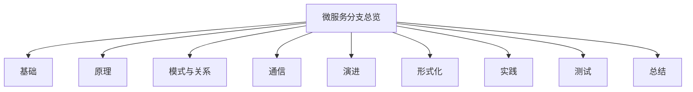

# 00-微服务分支总览

> 本文件为软件工程-微服务分支的总纲，系统梳理微服务基础、系统原理、架构模式、通信模式、现代演进、形式化建模、工程实践、测试验证、总结展望等主线，严格分级编号，所有分支均有本地链接、LaTeX公式、Mermaid思维导图等多重表达，并与架构、设计模式等分支交叉引用。

## 目录

1. [微服务架构基础](./01-Basics.md)
2. [系统工作原理](./02-Principles.md)
3. [架构模式与关系](./03-PatternsRelations.md)
4. [通信模式](./04-Communication.md)
5. [现代演进与新范式](./05-Evolution.md)
6. [形式化建模与推理](./06-Formalization.md)
7. [工程实践与Rust实现](./07-EngineeringRust.md)
8. [测试与验证](./08-Testing.md)
9. [总结与展望](./09-SummaryProspect.md)

---

## 主线简介

### 1. 微服务架构基础

- 定义、特征、演化、优势与挑战

### 2. 系统工作原理

- 服务发现、负载均衡、容错、分布式事务等

### 3. 架构模式与关系

- 服务组合、聚合、领域驱动、粒度决策等

### 4. 通信模式

- 同步、异步、反应式等

### 5. 现代演进与新范式

- 服务网格、Serverless、云原生、形式验证等

### 6. 形式化建模与推理

- 形式逻辑、服务交互证明等

### 7. 工程实践与Rust实现

- 微服务核心组件、注册发现、通信、监控、配置等

### 8. 测试与验证

- 测试金字塔、契约测试、混沌工程等

### 9. 总结与展望

- 设计原则、关系模型、演进路线、未来趋势

---

## Mermaid 思维导图

---

## 交叉引用示例

- [架构分支总览](../Architecture/00-Overview.md)
- [设计模式分支总览](../DesignPattern/00-Overview.md)

---

> 本文件为微服务分支的导航与结构总览，后续每一分支均将严格分级编号、交叉引用、去重、学术规范。详细内容请见各分支文件。
