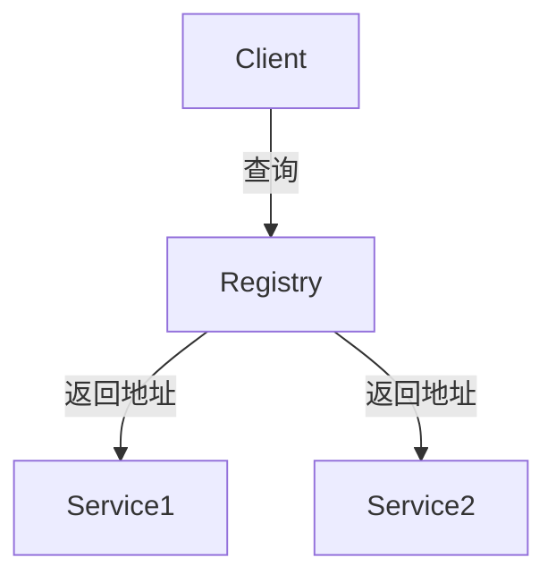
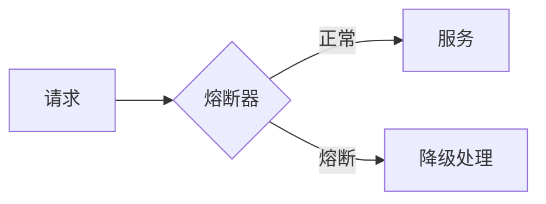
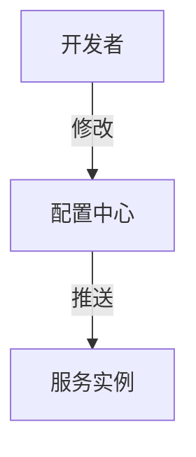

# 02-系统工作原理

> 本文件系统梳理微服务系统的核心工作原理，包括服务发现、负载均衡、容错机制、分布式事务、配置与管理等，所有内容严格分级编号，包含本地交叉引用、LaTeX公式、Mermaid思维导图等多重表达。

## 2.1 服务发现

服务发现（Service Discovery）用于动态感知和管理服务实例，常见实现包括注册中心（如 Consul、Eureka、etcd）。

- 形式化描述：
  $$
  \text{Registry} = \{ S_1, S_2, \ldots, S_n \},~S_i \in \text{Service}
  $$
  $$
  \text{Client} \xrightarrow{Query} \text{Registry} \xrightarrow{Address} S_i
  $$

- Mermaid 流程图：

## 2.2 负载均衡

负载均衡（Load Balancing）用于将请求合理分配到多个服务实例，提升系统吞吐与可用性。

- 常见算法：轮询、加权、最少连接、一致性哈希等。
- 交叉引用：[架构分支-分布式架构](../Architecture/01-DistributedMicroservices.md)

## 2.3 容错机制

容错机制（Fault Tolerance）保障系统在部分组件失效时仍能正常运行。

- 关键技术：熔断（Circuit Breaker）、限流、重试、降级。
- Mermaid 机制图：

## 2.4 分布式事务

分布式事务用于保障跨服务数据一致性。

- 典型协议：两阶段提交（2PC）、三阶段提交（3PC）、补偿事务（SAGA）。
- LaTeX公式：
  $$
  \text{GlobalTx} = \{ Tx_1, Tx_2, \ldots, Tx_n \},~\forall Tx_i,~\text{ACID约束}
  $$

## 2.5 配置与管理

微服务系统需支持集中化、动态化配置管理。

- 常用工具：Spring Cloud Config、Nacos、etcd。
- 配置变更流程：

---

## 本地交叉引用

- [微服务分支总览](./00-Overview.md)
- [微服务架构基础](./01-Basics.md)
- [架构分支-分布式架构](../Architecture/01-DistributedMicroservices.md)

---

> 本文件为微服务系统工作原理详细内容，后续将继续推进各主线分支的系统化整理。
