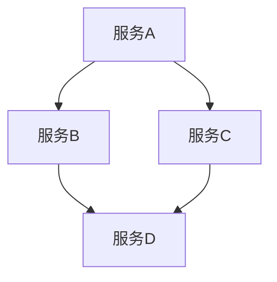
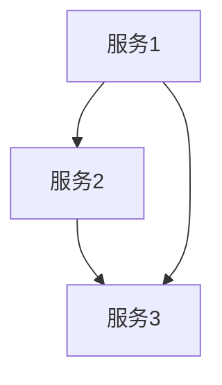

# 03-架构模式与关系

> 本文件系统梳理微服务架构中的核心模式与服务关系，包括服务组合、聚合与分解、领域驱动设计、服务粒度决策、服务间依赖等，所有内容严格分级编号，包含本地交叉引用、LaTeX公式、Mermaid思维导图等多重表达。

## 3.1 服务组合模式

服务组合（Service Composition）是指通过编排多个微服务以实现复杂业务流程。

- 典型模式：编排（Orchestration）、编织（Choreography）
- Mermaid 组合示意：

## 3.2 聚合与分解

- 服务聚合：将相关功能合并为一个服务，提升内聚性。
- 服务分解：将大服务拆分为更小的自治单元，提升灵活性。
- LaTeX形式化：
  $$
  S_{agg} = \bigcup_{i=1}^n S_i,~S_i~\text{为子服务}
  $$

## 3.3 领域驱动设计（DDD）

领域驱动设计（Domain-Driven Design, DDD）强调以业务领域为核心划分服务边界。

- 关键概念：限界上下文（Bounded Context）、聚合根、实体、值对象等。
- Mermaid DDD结构：

## 3.4 服务粒度决策

- 粒度过大：影响灵活性与可扩展性
- 粒度过小：增加通信与治理复杂度
- 决策原则：高内聚、低耦合、业务独立

## 3.5 服务间关系与依赖

- 依赖关系建模：
  $$
  G = (V, E),~V=\{S_1,\ldots,S_n\},~E=\{(S_i,S_j)|S_i\to S_j\}
  $$
- Mermaid 依赖关系图：

---

## 本地交叉引用

- [微服务分支总览](./00-Overview.md)
- [微服务架构基础](./01-Basics.md)
- [系统工作原理](./02-Principles.md)
- [架构分支-分布式架构](../Architecture/01-DistributedMicroservices.md)
- [设计模式分支-分布式模式](../DesignPattern/03-Distributed.md)

---

> 本文件为微服务架构模式与关系详细内容，后续将继续推进各主线分支的系统化整理。
