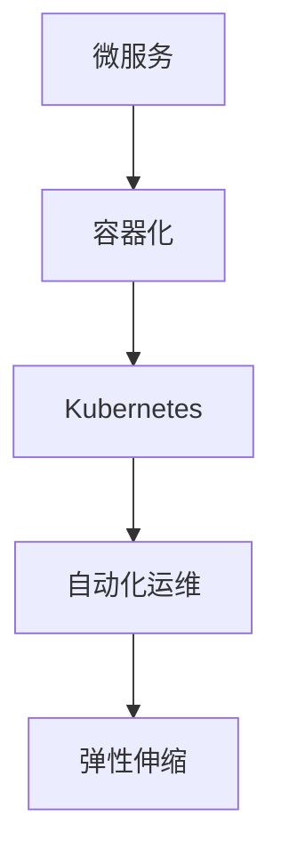

# 05-现代演进与新范式

> 本文件系统梳理微服务架构的现代演进与新范式，包括服务网格、Serverless、云原生、形式化验证与安全、未来趋势等，所有内容严格分级编号，包含本地交叉引用、LaTeX公式、Mermaid思维导图等多重表达。

## 5.1 服务网格（Service Mesh）演进

服务网格通过sidecar代理实现服务间通信治理，提升可观测性与安全性。

- 典型实现：Istio、Linkerd、Consul Connect
- Mermaid 服务网格演进图：

## 5.2 Serverless与FaaS

Serverless架构将资源管理与运维责任下沉至平台，开发者专注于业务逻辑。

- FaaS（Function as a Service）：以函数为最小部署单元，按需弹性伸缩。
- LaTeX形式化：
  $$
  \text{App} = \{ f_1, f_2, \ldots, f_n \},~f_i: \text{事件驱动函数}
  $$

## 5.3 云原生微服务

云原生（Cloud Native）强调弹性、可移植、自动化，微服务是其核心支柱之一。

- 关键技术：容器（Kubernetes）、DevOps、CI/CD、自动扩缩容
- Mermaid 云原生生态：

## 5.4 形式化验证与安全

- 形式化方法用于建模与验证微服务系统的正确性与安全性。
- 典型工具：模型检测（Model Checking）、Petri网、时序逻辑
- LaTeX公式：
  $$
  \forall s \in S,~\text{Spec}(s) \Rightarrow \text{Safe}(s)
  $$
- 交叉引用：[形式化建模分支](../../../../Matter/FormalModel/)

## 5.5 未来趋势与挑战

- 趋势：无服务器化、智能化、自动化治理、边缘计算
- 挑战：复杂性提升、可观测性、安全与合规、跨域治理

---

## 本地交叉引用

- [微服务分支总览](./00-Overview.md)
- [通信模式](./04-Communication.md)
- [架构分支-分布式架构](../Architecture/01-DistributedMicroservices.md)
- [形式化建模分支](../../../../Matter/FormalModel/)

---

> 本文件为微服务现代演进与新范式详细内容，后续将继续推进各主线分支的系统化整理。
