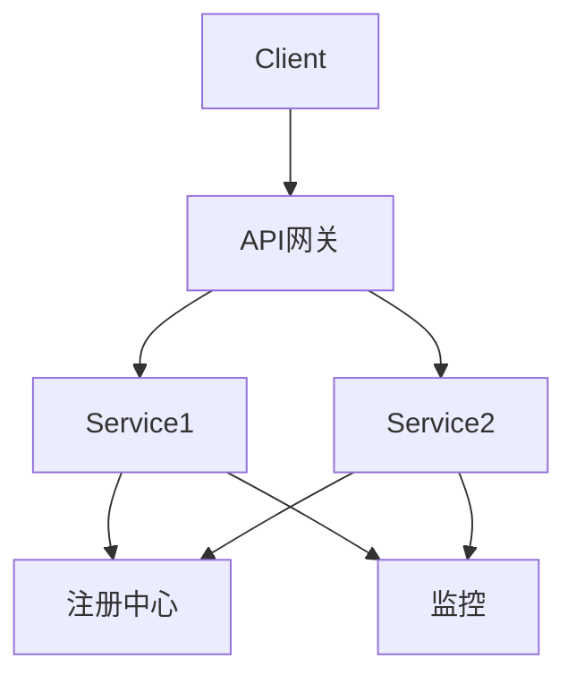
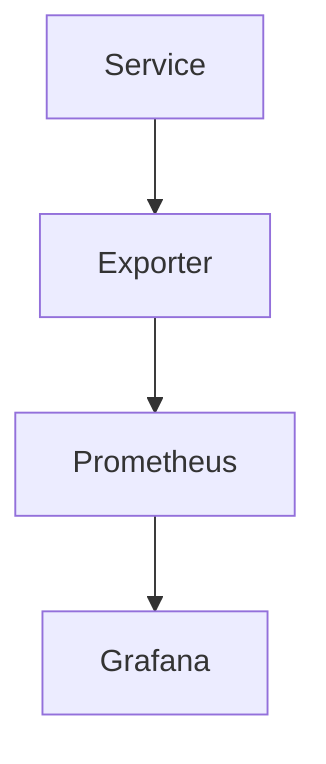

# 07-工程实践与Rust实现

> 本文件系统梳理微服务工程实践与Rust实现，包括核心组件、注册与发现、通信与API设计、配置与监控、Rust开发实践、代码示例与工程结构等，所有内容严格分级编号，包含本地交叉引用、LaTeX公式、Mermaid思维导图、Rust代码示例等多重表达。

## 7.1 微服务核心组件

- 服务注册与发现、API网关、配置中心、服务监控、链路追踪、日志管理等。
- Mermaid 组件结构图：



## 7.2 注册与发现实现

- 典型实现：Consul、etcd、Eureka
- Rust生态：etcd-client、consul-client等
- Rust代码示例：

```rust
use etcd_client::*;
async fn register_service() -> Result<(), Box<dyn std::error::Error>> {
    let mut client = Client::connect(["http://127.0.0.1:2379"], None).await?;
    client.put("/services/myservice", "127.0.0.1:8080", None).await?;
    Ok(())
}
```

## 7.3 通信与API设计

- RESTful API、gRPC、消息队列
- Rust生态：actix-web、tonic、nats等
- Rust代码示例（actix-web）：

```rust
use actix_web::{get, App, HttpServer, Responder};
#[get("/")]
async fn index() -> impl Responder {
    "Hello, Microservice!"
}
#[actix_web::main]
async fn main() -> std::io::Result<()> {
    HttpServer::new(|| App::new().service(index))
        .bind("127.0.0.1:8080")?
        .run()
        .await
}
```

## 7.4 配置与监控

- 配置中心：集中化、动态化配置（如Nacos、etcd）
- 监控与追踪：Prometheus、Jaeger、OpenTelemetry
- Mermaid 监控流程图：



## 7.5 Rust微服务开发实践

- 工程结构：分层架构、模块化、依赖注入
- 测试与CI/CD：cargo test、GitHub Actions、Docker集成
- LaTeX工程结构：
  $$
  \text{Project} = \{ \text{api}, \text{service}, \text{config}, \text{monitor}, \text{tests} \}
  $$

## 7.6 代码示例与工程结构

- 典型Rust微服务工程目录：

```text
my-microservice/
├── api/
├── service/
├── config/
├── monitor/
├── tests/
├── Cargo.toml
```

- 交叉引用：[架构分支-工程实践](../Architecture/05-EngineeringRust.md)

---

## 本地交叉引用

- [微服务分支总览](./00-Overview.md)
- [系统工作原理](./02-Principles.md)
- [配置与监控](./04-Communication.md)
- [架构分支-工程实践](../Architecture/05-EngineeringRust.md)

---

> 本文件为微服务工程实践与Rust实现详细内容，后续将继续推进各主线分支的系统化整理。
