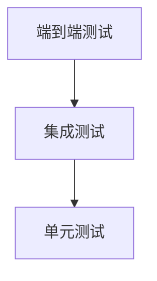
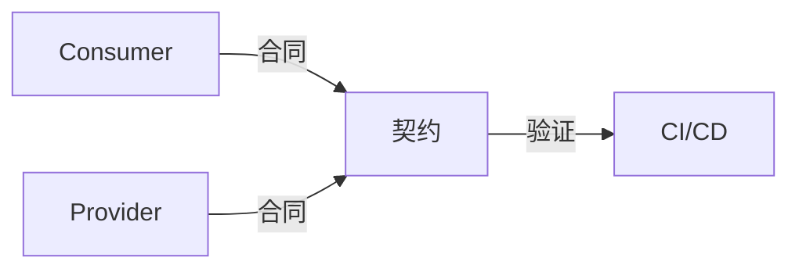
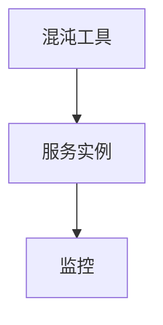
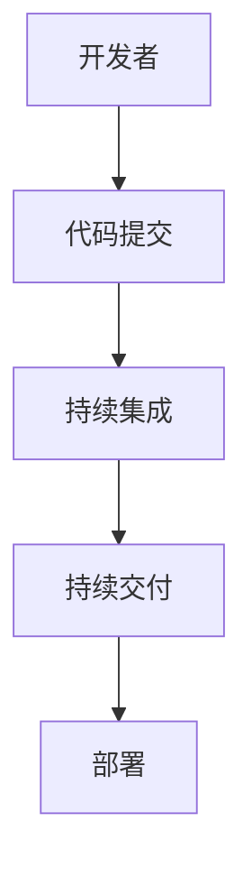

# 08-测试与验证

> 本文件系统梳理微服务架构的测试与验证方法，包括测试金字塔、契约测试、混沌工程、自动化测试与CI/CD、工具与实践案例等，所有内容严格分级编号，包含本地交叉引用、LaTeX公式、Mermaid思维导图等多重表达。

## 8.1 测试金字塔

- 单元测试、集成测试、端到端测试的分层结构。
- Mermaid 测试金字塔：

- LaTeX公式：
  $$
  \text{Test Pyramid} = \{ \text{Unit}, \text{Integration}, \text{E2E} \},~|\text{Unit}| > |\text{Integration}| > |\text{E2E}|
  $$

## 8.2 契约测试

- 验证服务间接口契约的正确性，防止集成失效。
- 典型工具：Pact、Spring Cloud Contract
- Mermaid 契约测试流程：

## 8.3 混沌工程

- 通过故障注入测试系统弹性与鲁棒性。
- 典型工具：Chaos Monkey、Gremlin
- Mermaid 故障注入流程：

## 8.4 自动化测试与CI/CD

- 自动化测试集成于CI/CD流水线，保障持续交付质量。
- 工具：GitHub Actions、GitLab CI、Jenkins、Travis CI
- Mermaid CI/CD流程：

## 8.5 工具与实践案例

- 工具：JUnit、pytest、Postman、Selenium、Testcontainers
- 案例：微服务订单系统的契约测试与混沌工程实践

---

## 本地交叉引用

- [微服务分支总览](./00-Overview.md)
- [工程实践与Rust实现](./07-EngineeringRust.md)
- [架构分支-测试与验证](../Architecture/06-CaseStudies.md)

---

> 本文件为微服务测试与验证详细内容，后续将继续推进各主线分支的系统化整理。
