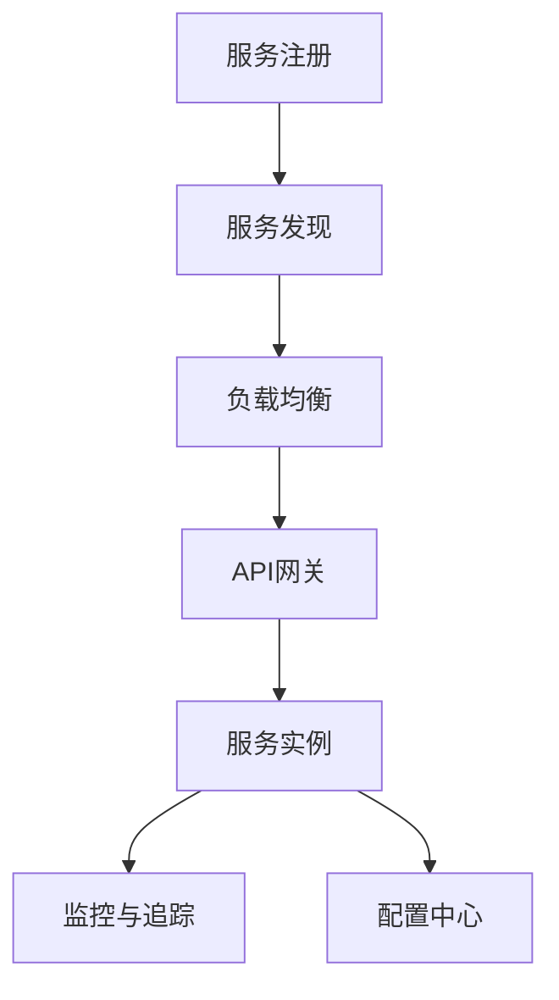

# 09-总结与展望

> 本文件系统总结微服务架构的设计原则、关系模型、发展演进、未来趋势与挑战，并展望研究与实践方向。所有内容严格分级编号，包含本地交叉引用、LaTeX公式、Mermaid思维导图等多重表达。

## 9.1 微服务设计原则

- 高内聚、低耦合、自治性、弹性伸缩、可观测性、自动化运维
- LaTeX表达：
  $$
  \text{Design} = \{ \text{Cohesion}, \text{Decoupling}, \text{Autonomy}, \text{Elasticity}, \text{Observability}, \text{Automation} \}
  $$

## 9.2 关系模型与全局视图

- 服务间依赖、通信、治理的全局关系建模
- Mermaid 全局关系视图：

## 9.3 发展演进路线

- 单体→SOA→微服务→云原生→Serverless
- Mermaid 演进路线：

## 9.4 未来趋势与挑战

- 趋势：智能化、自动化治理、边缘计算、无服务器化
- 挑战：复杂性、跨域治理、安全与合规、可观测性

## 9.5 研究与实践展望

- 形式化建模、智能运维、自动化测试、跨领域集成
- LaTeX表达：
  $$
  \text{Future} = \{ \text{Formalization}, \text{AIOps}, \text{AutoTest}, \text{Integration} \}
  $$

---

## 本地交叉引用

- [微服务分支总览](./00-Overview.md)
- [架构分支-总结与展望](../Architecture/07-SummaryProspect.md)
- [形式化建模分支](../../../../Matter/FormalModel/)

---

> 本文件为微服务分支总结与展望，至此主线内容系统化整理已完成，后续可根据需求扩展专题或深化交叉引用。
