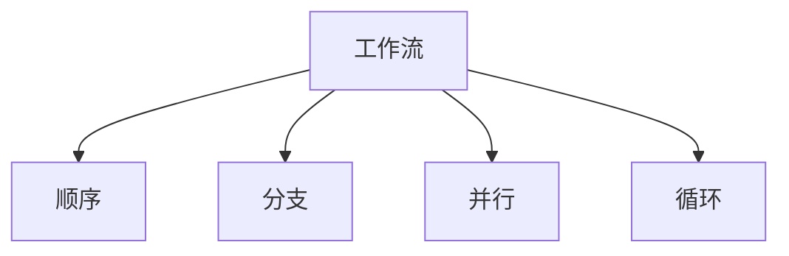

# 01-工作流基础

> 本文件系统梳理工作流的定义、核心概念、发展历程、分类与类型、主要特征，所有内容严格分级编号，包含本地交叉引用、LaTeX公式、Mermaid思维导图等多重表达。

## 1.1 定义

工作流（Workflow）是指一组有序的任务、活动或操作在特定规则下自动流转与执行的过程，旨在实现业务目标的自动化与规范化。

- LaTeX形式化：
  $$
  \text{Workflow} = (T, R, S),~T=\text{任务集},~R=\text{流转规则},~S=\text{状态集}
  $$

## 1.2 核心概念

- 任务（Task）：工作流的基本单元
- 活动（Activity）：可执行的操作或步骤
- 角色（Role）：参与者或责任主体
- 路由（Routing）：任务流转路径
- 触发器（Trigger）：事件驱动流转

## 1.3 发展历程

- 早期：人工流程、纸质审批
- 20世纪80年代：电子化办公与流程自动化
- 90年代：工作流管理系统（WFMS）兴起
- 现代：BPM、智能工作流、云原生工作流

## 1.4 分类与类型

- 基于控制流：顺序、分支、并行、循环
- 基于应用领域：业务流程、数据处理、科学计算、DevOps
- Mermaid 分类示意：

## 1.5 主要特征

- 自动化、规范化、可追溯、可扩展、可集成
- 支持复杂逻辑与多参与者协作

---

## 本地交叉引用

- [工作流分支总览](./Workflow.md)
- [微服务分支总览](./Microservices/00-Overview.md)
- [架构分支总览](./Architecture/00-Overview.md)

---

> 本文件为工作流基础详细内容，后续将继续推进各主线分支的系统化整理。
