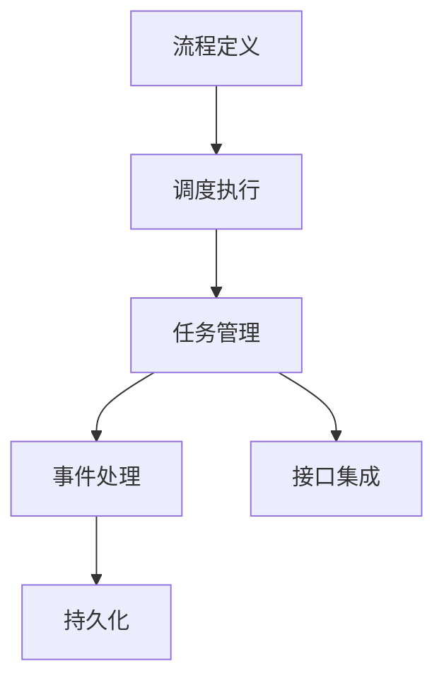
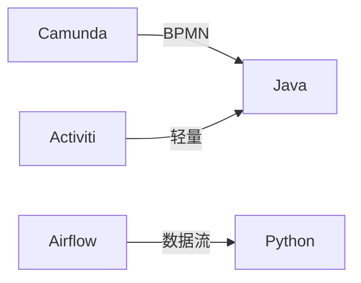

# 03-工作流引擎与实现

> 本文件系统梳理工作流引擎的架构、典型实现、关键技术、扩展与集成、工程实践等，所有内容严格分级编号，包含本地交叉引用、LaTeX公式、Mermaid结构图、代码示例等多重表达。

## 3.1 工作流引擎架构

- 工作流引擎负责解析、调度和执行流程定义，实现任务流转与状态管理。
- 典型架构层次：流程定义、调度执行、任务管理、事件处理、持久化、接口集成
- Mermaid 架构图：



## 3.2 典型引擎

- Camunda：BPMN 2.0标准，Java生态，易于集成
- Activiti：轻量级、开源、灵活扩展
- Airflow：面向数据流的调度与编排，Python生态
- Mermaid 引擎对比：



## 3.3 引擎实现要点

- 流程定义解析与校验
- 任务调度与状态管理
- 并发与事务处理
- 持久化与恢复机制
- 事件驱动与扩展点

## 3.4 扩展与集成

- 与微服务、API网关、消息队列、监控系统集成
- 插件机制与自定义扩展
- LaTeX接口集成表达：
  $$
  \text{Engine} = (Core, API, MQ, Monitor, Plugin)
  $$

## 3.5 工程实践与案例

- 企业审批流、数据处理流、CI/CD自动化等
- 代码示例（Airflow DAG）：

```python
from airflow import DAG
from airflow.operators.dummy import DummyOperator
from datetime import datetime

dag = DAG('example', start_date=datetime(2023,1,1))
start = DummyOperator(task_id='start', dag=dag)
end = DummyOperator(task_id='end', dag=dag)
start >> end
```

---

## 本地交叉引用

- [工作流分支总览](./Workflow.md)
- [工作流建模方法](./Workflow-02-Modeling.md)
- [微服务分支-工程实践](./Microservices/07-EngineeringRust.md)

---

> 本文件为工作流引擎与实现详细内容，后续将继续推进各主线分支的系统化整理。
