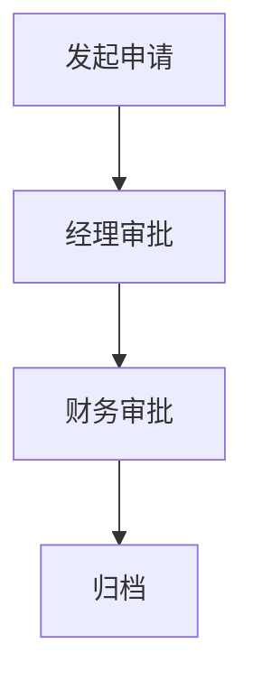
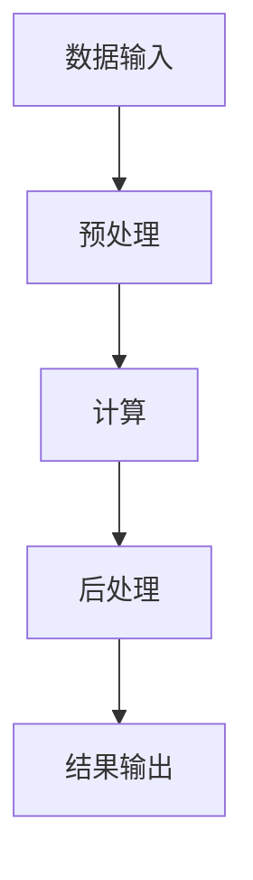
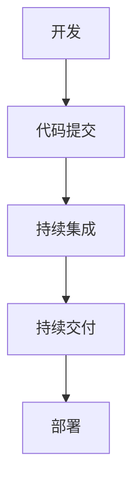

# 05-工作流典型应用与案例

> 本文件系统梳理工作流在企业自动化、数据处理、科学计算、CI/CD与DevOps等领域的典型应用与案例，所有内容严格分级编号，包含本地交叉引用、LaTeX公式、Mermaid结构图、应用流程等多重表达。

## 5.1 企业自动化应用

- 审批流、采购流、合同管理、财务报销等
- Mermaid 企业审批流示意：

## 5.2 数据处理与ETL

- 数据采集、清洗、转换、加载的自动化流程
- 典型工具：Airflow、Luigi、NiFi
- LaTeX流程表达：
  $$
  \text{ETL} = (Extract, Transform, Load)
  $$

## 5.3 科学计算与大数据

- 科学实验流程、分布式计算、批量任务调度
- Mermaid 科学计算流程：

## 5.4 CI/CD与DevOps

- 持续集成、持续交付、自动化测试与部署
- 典型工具：Jenkins、GitLab CI、Argo Workflows
- Mermaid CI/CD流程：

## 5.5 典型案例分析

- 企业级审批流自动化实践
- 基于Airflow的数据管道
- 科学实验流程自动化
- DevOps流水线集成

---

## 本地交叉引用

- [工作流分支总览](./Workflow.md)
- [工作流与微服务/架构/DevOps的关系](./Workflow-04-Relation.md)
- [微服务分支-工程实践](./Microservices/07-EngineeringRust.md)

---

> 本文件为工作流典型应用与案例详细内容，后续将继续推进各主线分支的系统化整理。
