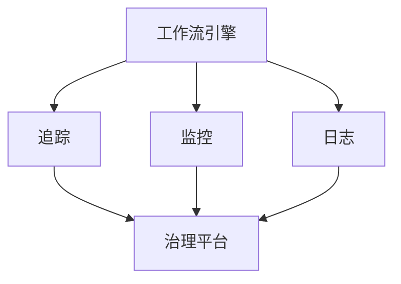
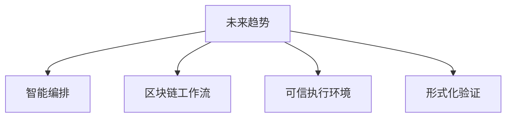

# 06-工作流未来趋势与挑战

> 本文件系统梳理工作流领域的未来趋势与挑战，包括智能化、自动化、可观测性、跨域集成、低代码、安全合规、研究前沿等，所有内容严格分级编号，包含本地交叉引用、LaTeX公式、Mermaid思维导图等多重表达。

## 6.1 智能化与自动化

- AI驱动的流程优化与自适应编排
- 自动化决策、异常检测与自愈
- LaTeX表达：
  $$
  \text{SmartWorkflow} = (AI, Orchestration, Self-Healing)
  $$

## 6.2 可观测性与治理

- 全链路追踪、实时监控、日志分析
- 治理平台与策略自动化
- Mermaid 可观测性结构图：

## 6.3 跨域集成与低代码

- 跨系统、跨组织的流程集成
- 低代码/无代码平台推动业务敏捷创新
- 典型平台：Camunda Cloud、OutSystems、Mendix

## 6.4 安全性与合规性

- 流程安全、数据隐私、访问控制、合规审计
- LaTeX安全表达：
  $$
  \forall t \in T,~\text{Secure}(t) \wedge \text{Compliant}(t)
  $$

## 6.5 研究前沿与展望

- 智能编排、区块链工作流、可信执行环境
- 形式化验证与自动推理
- Mermaid 未来趋势导图：

---

## 本地交叉引用

- [工作流分支总览](./Workflow.md)
- [工作流典型应用与案例](./Workflow-05-Application.md)
- [微服务分支-总结与展望](./Microservices/09-SummaryProspect.md)

---

> 本文件为工作流未来趋势与挑战详细内容，至此主线内容系统化整理已完成，后续可根据需求扩展专题或深化交叉引用。
