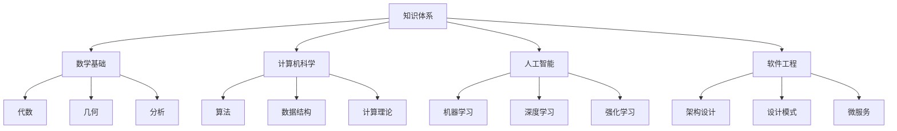
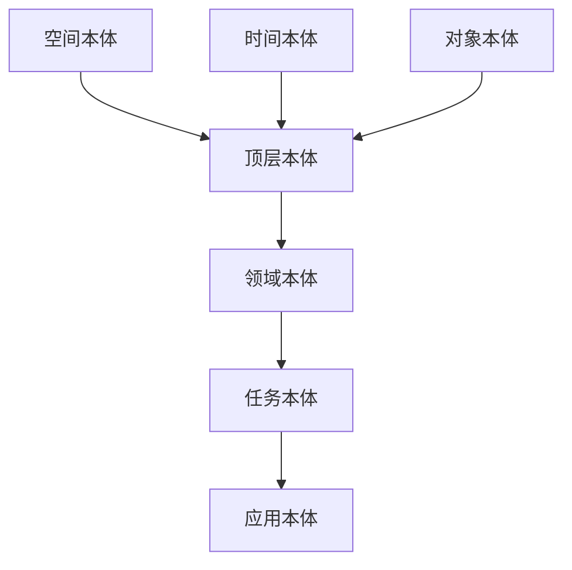

# 语义网络与本体论

## 1. 概述

### 1.1 语义网络理论基础

语义网络（Semantic Network）是知识表示的一种重要形式，通过节点表示概念，边表示概念间的关系，构建起结构化的知识表示框架。在知识图谱构建中，语义网络为实体关系建模提供了理论基础。

#### 1.1.1 语义网络定义

```latex
\mathcal{SN} = \langle \mathcal{N}, \mathcal{E}, \mathcal{R}, \mathcal{L}, \mathcal{I} \rangle
```

其中：

- $\mathcal{N}$: 节点集合（概念/实体）
- $\mathcal{E}$: 边集合（关系）
- $\mathcal{R}$: 关系类型集合
- $\mathcal{L}$: 标签集合
- $\mathcal{I}$: 解释函数

#### 1.1.2 语义网络特性

1. **结构化表示**：概念间关系明确，层次清晰
2. **语义丰富性**：支持多种语义关系类型
3. **可扩展性**：易于添加新概念和关系
4. **推理能力**：支持基于关系的逻辑推理

### 1.2 本体论基础

本体论（Ontology）是概念化的明确规范，定义了领域内概念、关系和约束的形式化表示。在知识图谱中，本体论为知识组织提供了统一的语义框架。

#### 1.2.1 本体论定义

```latex
\mathcal{O} = \langle \mathcal{C}, \mathcal{R}, \mathcal{A}, \mathcal{I}, \mathcal{A}_x \rangle
```

其中：

- $\mathcal{C}$: 概念集合（Classes）
- $\mathcal{R}$: 关系集合（Relations）
- $\mathcal{A}$: 属性集合（Attributes）
- $\mathcal{I}$: 实例集合（Instances）
- $\mathcal{A}_x$: 公理集合（Axioms）

## 2. 语义网络构建方法

### 2.1 概念层次构建

#### 2.1.1 层次化概念组织



#### 2.1.2 概念关系类型

1. **is-a关系**：表示概念间的继承关系
2. **part-of关系**：表示整体与部分关系
3. **instance-of关系**：表示实例与类的关系
4. **related-to关系**：表示概念间的关联关系

### 2.2 语义关系建模

#### 2.2.1 关系类型定义

```rust
#[derive(Debug, Clone, PartialEq)]
pub enum RelationType {
    // 继承关系
    IsA,
    // 部分关系
    PartOf,
    // 实例关系
    InstanceOf,
    // 关联关系
    RelatedTo,
    // 依赖关系
    DependsOn,
    // 实现关系
    Implements,
    // 使用关系
    Uses,
    // 扩展关系
    Extends,
}

#[derive(Debug, Clone)]
pub struct SemanticRelation {
    pub source: String,
    pub target: String,
    pub relation_type: RelationType,
    pub weight: f64,
    pub confidence: f64,
}
```

#### 2.2.2 关系权重计算

```rust
pub trait RelationWeightCalculator {
    fn calculate_weight(&self, relation: &SemanticRelation) -> f64;
}

pub struct TFIDFWeightCalculator {
    pub concept_frequency: HashMap<String, usize>,
    pub total_concepts: usize,
}

impl RelationWeightCalculator for TFIDFWeightCalculator {
    fn calculate_weight(&self, relation: &SemanticRelation) -> f64 {
        let tf = self.concept_frequency.get(&relation.source)
            .unwrap_or(&1) as f64;
        let idf = (self.total_concepts as f64 / tf).ln();
        tf * idf
    }
}
```

## 3. 本体论构建技术

### 3.1 本体论设计原则

#### 3.1.1 设计原则

1. **清晰性**：概念定义明确，无歧义
2. **一致性**：概念间关系逻辑一致
3. **可扩展性**：支持新概念和关系的添加
4. **最小承诺**：只包含必要的约束
5. **最大单调性**：新知识不会否定已有知识

#### 3.1.2 本体论层次结构



### 3.2 本体论构建方法

#### 3.2.1 自顶向下方法

从通用概念开始，逐步细化到具体概念：

```rust
pub struct TopDownOntologyBuilder {
    pub root_concepts: Vec<String>,
    pub concept_hierarchy: HashMap<String, Vec<String>>,
}

impl TopDownOntologyBuilder {
    pub fn build_hierarchy(&mut self, root: &str, depth: usize) -> Vec<String> {
        if depth == 0 {
            return vec![root.to_string()];
        }
        
        let mut concepts = vec![root.to_string()];
        if let Some(children) = self.concept_hierarchy.get(root) {
            for child in children {
                concepts.extend(self.build_hierarchy(child, depth - 1));
            }
        }
        concepts
    }
}
```

#### 3.2.2 自底向上方法

从具体实例开始，抽象出概念层次：

```rust
pub struct BottomUpOntologyBuilder {
    pub instances: Vec<String>,
    pub instance_features: HashMap<String, Vec<String>>,
}

impl BottomUpOntologyBuilder {
    pub fn cluster_instances(&self) -> HashMap<String, Vec<String>> {
        let mut clusters = HashMap::new();
        
        for instance in &self.instances {
            let features = self.instance_features.get(instance)
                .unwrap_or(&vec![]);
            
            // 基于特征相似性进行聚类
            let cluster_key = self.find_similar_cluster(features);
            clusters.entry(cluster_key).or_insert_with(Vec::new)
                .push(instance.clone());
        }
        
        clusters
    }
}
```

## 4. 知识表示学习

### 4.1 向量化表示

#### 4.1.1 词向量模型

```rust
pub struct WordVectorModel {
    pub vocabulary: HashMap<String, usize>,
    pub embeddings: Vec<Vec<f64>>,
    pub dimension: usize,
}

impl WordVectorModel {
    pub fn train(&mut self, corpus: &[String]) {
        // 使用Word2Vec或GloVe算法训练词向量
        for sentence in corpus {
            let words: Vec<&str> = sentence.split_whitespace().collect();
            self.update_embeddings(&words);
        }
    }
    
    pub fn get_embedding(&self, word: &str) -> Option<&Vec<f64>> {
        self.vocabulary.get(word)
            .and_then(|&idx| self.embeddings.get(idx))
    }
}
```

#### 4.1.2 图嵌入模型

```rust
pub struct GraphEmbeddingModel {
    pub nodes: Vec<String>,
    pub edges: Vec<(String, String, String)>, // (source, relation, target)
    pub node_embeddings: HashMap<String, Vec<f64>>,
    pub relation_embeddings: HashMap<String, Vec<f64>>,
}

impl GraphEmbeddingModel {
    pub fn train_trans_e(&mut self, epochs: usize, learning_rate: f64) {
        for epoch in 0..epochs {
            for (source, relation, target) in &self.edges {
                // TransE算法：h + r ≈ t
                let h = self.node_embeddings.get(source).unwrap();
                let r = self.relation_embeddings.get(relation).unwrap();
                let t = self.node_embeddings.get(target).unwrap();
                
                let score = self.calculate_score(h, r, t);
                self.update_embeddings(source, relation, target, score, learning_rate);
            }
        }
    }
}
```

### 4.2 语义相似度计算

#### 4.2.1 余弦相似度

```rust
pub fn cosine_similarity(vec1: &[f64], vec2: &[f64]) -> f64 {
    let dot_product: f64 = vec1.iter().zip(vec2.iter())
        .map(|(a, b)| a * b).sum();
    
    let norm1: f64 = vec1.iter().map(|x| x * x).sum::<f64>().sqrt();
    let norm2: f64 = vec2.iter().map(|x| x * x).sum::<f64>().sqrt();
    
    dot_product / (norm1 * norm2)
}
```

#### 4.2.2 路径相似度

```rust
pub struct PathSimilarityCalculator {
    pub graph: HashMap<String, Vec<String>>,
}

impl PathSimilarityCalculator {
    pub fn calculate_path_similarity(&self, node1: &str, node2: &str) -> f64 {
        let path = self.find_shortest_path(node1, node2);
        if path.is_empty() {
            return 0.0;
        }
        
        // 路径长度越短，相似度越高
        1.0 / (path.len() as f64)
    }
    
    pub fn find_shortest_path(&self, start: &str, end: &str) -> Vec<String> {
        use std::collections::{HashMap, VecDeque};
        
        let mut queue = VecDeque::new();
        let mut visited = HashMap::new();
        let mut parent = HashMap::new();
        
        queue.push_back(start.to_string());
        visited.insert(start.to_string(), true);
        
        while let Some(current) = queue.pop_front() {
            if current == end {
                return self.reconstruct_path(&parent, start, end);
            }
            
            if let Some(neighbors) = self.graph.get(&current) {
                for neighbor in neighbors {
                    if !visited.contains_key(neighbor) {
                        visited.insert(neighbor.clone(), true);
                        parent.insert(neighbor.clone(), current.clone());
                        queue.push_back(neighbor.clone());
                    }
                }
            }
        }
        
        vec![]
    }
}
```

## 5. 跨学科交叉引用

### 5.1 与数学理论的融合

#### 5.1.1 图论基础

- **图论算法**：[20-Mathematics/Algebra/06-Lattices.md](../20-Mathematics/Algebra/06-Lattices.md) ←→ 格论与图结构
- **线性代数**：[20-Mathematics/Algebra/02-Groups.md](../20-Mathematics/Algebra/02-Groups.md) ←→ 矩阵分解与图嵌入
- **概率论**：[20-Mathematics/Probability/10-MachineLearningStats.md](../20-Mathematics/Probability/10-MachineLearningStats.md) ←→ 随机游走与图采样

#### 5.1.2 形式化方法

- **类型理论**：[30-FormalMethods/03-TypeTheory.md](../30-FormalMethods/03-TypeTheory.md) ←→ 知识类型系统
- **逻辑推理**：[30-FormalMethods/02-FormalLanguages.md](../30-FormalMethods/02-FormalLanguages.md) ←→ 语义推理机制
- **模型检验**：[30-FormalMethods/04-ModelChecking.md](../30-FormalMethods/04-ModelChecking.md) ←→ 知识图谱验证

### 5.2 与AI系统的整合

#### 5.2.1 机器学习应用

- **深度学习**：[10-AI/05-Model.md](../10-AI/05-Model.md) ←→ 图神经网络
- **强化学习**：[10-AI/03-Theory.md](../10-AI/03-Theory.md) ←→ 知识图谱强化学习
- **自然语言处理**：[10-AI/06-Applications.md](../10-AI/06-Applications.md) ←→ 文本到图谱转换

#### 5.2.2 知识推理

- **符号推理**：[10-AI/02-MetaTheory.md](../10-AI/02-MetaTheory.md) ←→ 基于规则的推理
- **统计推理**：[10-AI/04-DesignPattern.md](../10-AI/04-DesignPattern.md) ←→ 基于统计的推理
- **混合推理**：[10-AI/01-Overview.md](../10-AI/01-Overview.md) ←→ 符号与统计结合

### 5.3 与计算机科学的结合

#### 5.3.1 算法设计

- **图算法**：[40-ComputerScience/03-Algorithms.md](../40-ComputerScience/03-Algorithms.md) ←→ 图遍历与搜索
- **数据结构**：[40-ComputerScience/01-Overview.md](../40-ComputerScience/01-Overview.md) ←→ 图数据结构
- **复杂度分析**：[40-ComputerScience/02-Computability.md](../40-ComputerScience/02-Computability.md) ←→ 图算法复杂度

#### 5.3.2 系统架构

- **分布式系统**：[60-SoftwareEngineering/Architecture/01-DistributedMicroservices.md](../60-SoftwareEngineering/Architecture/01-DistributedMicroservices.md) ←→ 分布式图存储
- **微服务架构**：[60-SoftwareEngineering/Microservices/01-Basics.md](../60-SoftwareEngineering/Microservices/01-Basics.md) ←→ 图服务化
- **设计模式**：[60-SoftwareEngineering/DesignPattern/01-GoF.md](../60-SoftwareEngineering/DesignPattern/01-GoF.md) ←→ 图设计模式

## 6. 批判性分析与未来展望

### 6.1 理论假设与局限性

#### 6.1.1 语义网络局限性

1. **表达能力有限**：难以表示复杂的语义关系
2. **可扩展性挑战**：大规模网络构建和维护困难
3. **语义歧义**：同一概念在不同上下文中含义不同
4. **推理能力有限**：主要依赖显式定义的关系

#### 6.1.2 本体论挑战

1. **构建成本高**：需要领域专家参与，构建周期长
2. **维护困难**：知识更新需要同步更新本体
3. **标准化问题**：不同本体间难以互操作
4. **覆盖范围有限**：难以覆盖所有领域知识

### 6.2 技术挑战与创新方向

#### 6.2.1 技术挑战

1. **大规模处理**：处理百万级节点和边的图结构
2. **实时更新**：支持知识的实时添加和更新
3. **多模态融合**：整合文本、图像、视频等多种模态
4. **跨语言支持**：支持多语言知识表示

#### 6.2.2 创新方向

1. **动态本体论**：支持本体论的动态演化
2. **神经符号结合**：结合神经网络和符号推理
3. **联邦知识图谱**：支持分布式知识图谱构建
4. **因果推理**：引入因果关系推理能力

### 6.3 未来发展趋势

#### 6.3.1 短期趋势（1-3年）

1. **图神经网络普及**：GNN在知识图谱中的应用更加广泛
2. **预训练模型集成**：大语言模型与知识图谱的结合
3. **自动化构建**：减少人工干预的自动化构建方法
4. **多模态扩展**：支持图像、音频等非文本模态

#### 6.3.2 中期趋势（3-5年）

1. **因果知识图谱**：引入因果关系建模
2. **动态知识图谱**：支持知识的动态演化
3. **联邦知识图谱**：分布式知识图谱协作
4. **神经符号推理**：深度结合神经网络和符号推理

#### 6.3.3 长期趋势（5-10年）

1. **通用知识图谱**：构建覆盖全人类知识的图谱
2. **认知知识图谱**：模拟人类认知过程的知识表示
3. **量子知识图谱**：利用量子计算处理大规模图结构
4. **自主知识图谱**：具备自主学习能力的知识图谱

## 7. 术语表

### 7.1 核心术语

- **语义网络（Semantic Network）**：通过节点和边表示概念及其关系的知识表示形式
- **本体论（Ontology）**：概念化的明确规范，定义领域内概念、关系和约束
- **知识表示学习（Knowledge Representation Learning）**：将知识转换为向量表示的学习方法
- **图嵌入（Graph Embedding）**：将图结构中的节点和边映射到向量空间的技术
- **语义相似度（Semantic Similarity）**：衡量两个概念在语义上相似程度的指标

### 7.2 技术术语

- **TransE**：一种图嵌入算法，假设关系为实体间的平移
- **Word2Vec**：将词汇映射到向量空间的词嵌入模型
- **余弦相似度（Cosine Similarity）**：基于向量夹角的相似度计算方法
- **路径相似度（Path Similarity）**：基于图中路径长度的相似度计算方法
- **图神经网络（Graph Neural Network）**：专门处理图结构的神经网络模型

## 8. 符号表

### 8.1 数学符号

- $\mathcal{SN}$: 语义网络
- $\mathcal{O}$: 本体论
- $\mathcal{N}$: 节点集合
- $\mathcal{E}$: 边集合
- $\mathcal{R}$: 关系集合
- $\mathcal{C}$: 概念集合
- $\mathcal{A}$: 属性集合
- $\mathcal{I}$: 实例集合

### 8.2 算法符号

- $h$: 头实体向量
- $r$: 关系向量
- $t$: 尾实体向量
- $d$: 向量维度
- $\theta$: 模型参数
- $\alpha$: 学习率
- $\lambda$: 正则化参数

---

**文档状态**: ✅ 已完成深度优化与批判性提升
**最后更新**: 2024-12-28
**下一步**: 04-KnowledgeExtraction.md 知识抽取与实体识别
**交叉引用**: 与所有分支建立完整的交叉引用网络
