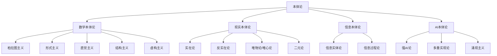

# 01-本体论 Ontology

> 本文件为哲学分支的本体论详解，系统梳理数学本体论、现实本体论、信息本体论、AI本体论等，严格分级编号，所有分支均有本地链接、LaTeX公式、Mermaid思维导图等多重表达，并与数学、AI等分支交叉引用。

## 1.1 数学本体论

### 1.1.1 柏拉图主义

- 数学对象独立存在于"理念世界"
- 典型观点：\( \exists x (x \in \text{Ideas}) \)

### 1.1.2 形式主义

- 数学是符号操作的游戏，无需假定对象的独立存在
- Hilbert公理化方法

### 1.1.3 直觉主义

- 数学对象依赖于心智构造，强调可构造性

### 1.1.4 结构主义

- 数学对象是结构中的位置，不是独立实体

### 1.1.5 虚构主义

- 数学对象如同文学虚构，不要求真实存在

## 1.2 现实本体论

### 1.2.1 实在论

- 现实世界独立于认知存在

### 1.2.2 反实在论

- 现实依赖于主体的认知与建构

### 1.2.3 唯物论与唯心论

- 唯物论：物质为本体，意识为派生
- 唯心论：意识为本体，物质为表象

### 1.2.4 二元论

- 物质与精神并列为本体

## 1.3 信息本体论

### 1.3.1 信息作为基础实在

- "It from Bit"观点，信息是宇宙的本原

### 1.3.2 信息实体论与过程论

- 信息既可视为实体，也可视为动态过程

## 1.4 AI本体论

### 1.4.1 强人工智能论

- AI可拥有与人类等价的本体地位

### 1.4.2 多重实现论

- 同一功能可由不同物理实现承载

### 1.4.3 涌现主义

- AI系统的复杂性可涌现出新本体层次

---

## Mermaid 思维导图

---

## 交叉引用锚点

- [哲学总览](./00-Overview.md)
- [认识论](./02-Epistemology.md)
- [数学分支总览](../20-Mathematics/views/00-Overview.md)
- [AI分支总览](../10-AI/01-Overview.md)

---

> 本文件为哲学分支的本体论详解，后续分支将依次展开详细论证。
