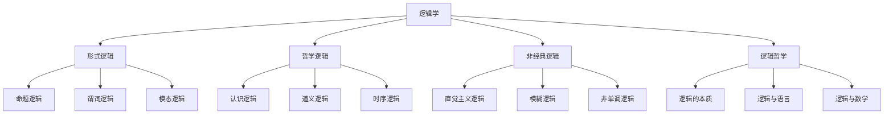

# 04-逻辑学 Logic

> 本文件为哲学分支的逻辑学详解，系统梳理形式逻辑、哲学逻辑、非经典逻辑、逻辑哲学等，严格分级编号，所有分支均有本地链接、LaTeX公式、Mermaid思维导图等多重表达，并与数学、认识论等分支交叉引用。

## 4.1 形式逻辑

### 4.1.1 命题逻辑

- 命题、联结词、真值表
- 典型公式：\( p \rightarrow (q \vee \neg r) \)

### 4.1.2 谓词逻辑

- 个体、谓词、量词、推理规则
- 典型公式：\( \forall x (P(x) \rightarrow Q(x)) \)

### 4.1.3 模态逻辑

- 必然性、可能性、可知性等模态算子
- 典型公式：\( \Box p \rightarrow p \)

## 4.2 哲学逻辑

### 4.2.1 认识逻辑

- 知识、信念的逻辑结构

### 4.2.2 道义逻辑

- 义务、许可、禁止的逻辑表达

### 4.2.3 时序逻辑

- 时间演化中的命题关系

## 4.3 非经典逻辑

### 4.3.1 直觉主义逻辑

- 拒绝排中律，强调构造性证明

### 4.3.2 模糊逻辑

- 真值连续区间，处理不确定性

### 4.3.3 非单调逻辑

- 推理结论可被新信息撤销

## 4.4 逻辑哲学

### 4.4.1 逻辑的本质

- 逻辑是发现还是发明？

### 4.4.2 逻辑与语言

- 逻辑结构与自然语言的关系

### 4.4.3 逻辑与数学

- 逻辑基础、哥德尔不完备定理等

---

## Mermaid 思维导图

---

## 交叉引用锚点

- [哲学总览](./00-Overview.md)
- [认识论](./02-Epistemology.md)
- [数学分支总览](../20-Mathematics/views/00-Overview.md)

---

> 本文件为哲学分支的逻辑学详解，后续分支将依次展开详细论证。
