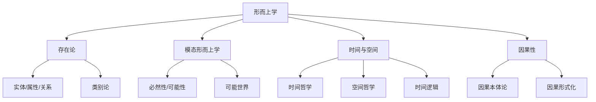

# 05-形而上学 Metaphysics

> 本文件为哲学分支的形而上学详解，系统梳理存在论、模态形而上学、时间与空间、因果性等，严格分级编号，所有分支均有本地链接、LaTeX公式、Mermaid思维导图等多重表达，并与本体论、逻辑学等分支交叉引用。

## 5.1 存在论

### 5.1.1 实体、属性、关系

- 存在的基本单元及其相互关系

### 5.1.2 类别论

- 存在的分类体系（如亚里士多德十范畴）

## 5.2 模态形而上学

### 5.2.1 必然性与可能性

- 可能世界语义学，LaTeX示例：\( \Diamond p \)（可能p）

### 5.2.2 可能世界理论

- 现实世界与可能世界的关系

## 5.3 时间与空间

### 5.3.1 时间哲学

- 现时主义、永恒主义、成长块宇宙理论

### 5.3.2 空间哲学

- 空间的本体地位：绝对论与关系论

### 5.3.3 时间逻辑

- 时间演化中的命题关系，典型公式：\( Gp \)（始终p）

## 5.4 因果性

### 5.4.1 因果关系的本体论分析

- 因果律、决定论与非决定论

### 5.4.2 因果关系的形式化

- 结构方程模型、反事实条件等

---

## Mermaid 思维导图

---

## 交叉引用锚点

- [哲学总览](./00-Overview.md)
- [本体论](./01-Ontology.md)
- [逻辑学](./04-Logic.md)
- [数学分支总览](../20-Mathematics/views/00-Overview.md)

---

> 本文件为哲学分支的形而上学详解，后续分支将依次展开详细论证。
