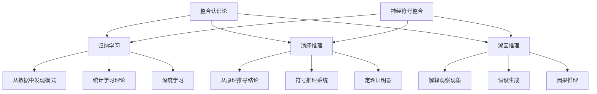
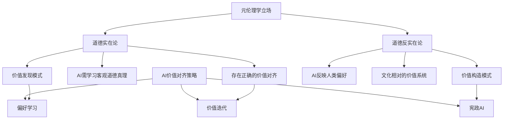

# AI元理论基础：哲学基础与认识论框架

## 02.1 引言：元理论的必要性

AI的发展并非纯粹的技术演进，其背后蕴含着深刻的哲学假设和认识论承诺。理解这些**元理论基础**对于：

- 澄清AI能力的本质边界
- 避免技术发展中的概念混淆  
- 为AI系统设计提供哲学指导
- 预防AI应用中的价值冲突

是至关重要的。本章构建系统性的AI元理论分析框架。

## 02.2 本体论预设：AI能"知道"什么？

### 02.2.1 计算实在论的兴起

**核心命题**：现实的基本层面可以用计算过程来描述和模拟。

**形式化表述**：

```math
\forall r \in \mathcal{R} \exists c \in \mathcal{C}: \text{simulate}(c, r) \text{ 且 } \text{faithful}(c, r)
```

其中$\mathcal{R}$为现实现象集合，$\mathcal{C}$为计算过程集合。

**支持论据**：

1. **数字物理学假说**：宇宙本身可能是一个巨大的计算系统
2. **信息处理普遍性**：从基因到大脑，生物系统都进行信息处理
3. **模拟成功性**：计算模型在预测和解释自然现象方面的成功

**批判分析**：

- **量子测量问题**：量子现象的非经典特性挑战经典计算框架
- **意识困难问题**：主观体验似乎超越纯计算描述
- **涌现复杂性**：系统级属性可能不可计算还原

### 02.2.2 功能主义与多重实现

**定义2.1**（功能主义）：心智状态由其因果角色而非物理基质决定。

**多重实现原理**：

```math
\forall f \in \mathcal{F} \exists S \subset \mathcal{S}: |S| > 1 \text{ 且 } \forall s \in S: \text{implements}(s, f)
```

**AI含义**：

- **硬件无关性**：AI可在不同物理系统中实现
- **功能等价性**：行为相同的系统在功能上等价
- **可替代性**：AI系统可替代生物智能执行特定功能

**挑战与限制**：

| 批判角度 | 核心论点 | AI影响 |
|----------|----------|---------|
| **身体化认知** | 智能依赖具体身体结构 | 限制纯抽象AI |
| **材质依赖论** | 特定材料有独特因果力 | 硅基可能不足 |
| **现象意识** | 意识需要特定物理过程 | AI可能缺乏真正体验 |

### 02.2.3 信息本体论

**核心原理**：信息是现实的基本构成要素。

**形式化框架**：

```math
\mathcal{Reality} = \langle \mathcal{I}, \mathcal{O}, \mathcal{T} \rangle
```

其中$\mathcal{I}$为信息实体，$\mathcal{O}$为操作集合，$\mathcal{T}$为变换规则。

**对AI的含义**：

1. **信息处理的优先性**：AI本质上是信息处理系统
2. **数据与知识的统一**：数据包含潜在的知识结构
3. **表示的客观性**：信息表示反映现实结构

## 02.3 认识论框架：知识的本质与获取

### 02.3.1 表征主义 vs. 反表征主义

**表征主义立场**：

- **内部模型假说**：智能系统必须构建世界的内部表征
- **符号接地**：抽象符号必须与感觉经验建立联系
- **表征操作**：思维是对内部表征的操作

**形式化**：

```math
\text{知识} = \langle \mathcal{R}, \mathcal{O}, \mathcal{M} \rangle
```

其中$\mathcal{R}$为表征系统，$\mathcal{O}$为操作集合，$\mathcal{M}$为映射函数。

**反表征主义立场**：

- **感觉运动耦合**：智能源于与环境的动态交互
- **情境行动**：行为适应无需内部模型
- **具身认知**：身体与环境的耦合构成认知

**对AI的影响**：

| 认识论立场 | AI设计理念 | 技术实现 | 优势 | 限制 |
|------------|------------|----------|------|------|
| **表征主义** | 符号AI、知识图谱 | 逻辑推理、专家系统 | 可解释、精确 | 脆弱、适应性差 |
| **反表征主义** | 行为AI、强化学习 | 神经网络、进化算法 | 鲁棒、适应性强 | 不可解释、缺乏抽象 |

### 02.3.2 经验主义与理性主义的整合

**经验主义路径**：

```math
\text{知识}_{经验} = \int_{t=0}^T f(\text{感觉数据}(t)) dt
```

**理性主义路径**：

```math
\text{知识}_{理性} = \text{演绎}(\text{先验原理}, \text{逻辑规则})
```

**现代AI的整合尝试**：



### 02.3.3 知识的类型学

**分类框架**：

```math
\mathcal{K} = \mathcal{K}_{声明} \cup \mathcal{K}_{程序} \cup \mathcal{K}_{体验} \cup \mathcal{K}_{默会}
```

| 知识类型 | 特征 | AI实现难度 | 当前进展 |
|----------|------|------------|----------|
| **声明性知识** | 可明确表述的事实 | ★★☆☆☆ | 知识图谱、语言模型 |
| **程序性知识** | 操作技能和方法 | ★★★☆☆ | 强化学习、机器人学 |
| **体验性知识** | 基于感觉的理解 | ★★★★☆ | 多模态学习、感知AI |
| **默会知识** | 无法言喻的直觉 | ★★★★★ | 理论探索阶段 |

## 02.4 计算主义及其挑战

### 02.4.1 强计算主义 vs. 弱计算主义

**强计算主义命题**：

```math
\forall m \in \text{心智过程}: \exists c \in \text{计算过程}: c = m
```

**弱计算主义命题**：

```math
\forall m \in \text{心智过程}: \exists c \in \text{计算过程}: \text{functionally\_equivalent}(c, m)
```

**关键区别**：本体论等同 vs. 功能模拟

### 02.4.2 反计算主义论证

**哥德尔-卢卡斯-彭罗斯论证**：

1. 哥德尔不完备定理显示形式系统的局限
2. 人类能"看到"哥德尔语句的真值
3. 因此人类认知超越算法过程

**形式化反驳**：

```math
\neg \exists A \in \text{算法}: \forall p \in \text{数学命题}: \text{decide}(A, p) = \text{human\_judgment}(p)
```

**AI研究者的回应**：

- **有限性论证**：人类认知同样有限，不能解决所有问题
- **演化论证**：人类认知是自然选择的产物，非超自然能力
- **计算层次论证**：更高层次的计算可能实现人类能力

### 02.4.3 中文房间论证与语义问题

**塞尔的中文房间**：

- **设置**：不懂中文的人通过规则手册处理中文输入
- **结论**：纯符号操作无法产生真正理解
- **含义**：AI系统可能缺乏真正语义理解

**形式化表述**：

```math
\text{语法操作}(S) \nRightarrow \text{语义理解}(S)
```

**符号接地问题**：

```math
\forall s \in \text{符号系统}: \text{meaning}(s) = f(\text{grounding}(s, \text{physical\_world}))
```

**现代AI的回应策略**：

1. **多模态接地**：通过视觉、听觉等感觉通道接地
2. **社会交互**：通过语言使用中的社会互动获得意义
3. **涌现语义**：复杂系统中的语义涌现

## 02.5 意识与主观性问题

### 02.5.1 意识的困难问题

**查默斯的区分**：

- **容易问题**：认知功能的机制（已有AI进展）
- **困难问题**：主观体验的存在（AI面临挑战）

**形式化困难**：

```math
\exists e \in \text{体验}: \neg \exists f \in \text{功能}: \text{explain}(f, e)
```

**AI中的体现**：

| 认知功能（容易问题） | AI当前状态 | 主观体验（困难问题） | AI面临挑战 |
|---------------------|------------|---------------------|------------|
| 感知处理 | 已部分实现 | 颜色感受质 | 完全开放 |
| 记忆存储 | 基本解决 | 回忆的主观性 | 理论缺乏 |
| 注意机制 | 有所进展 | 意识聚焦感 | 机制不明 |
| 语言理解 | 快速发展 | 理解的主观感 | 验证困难 |

### 02.5.2 整合信息理论(IIT)与AI

**IIT核心公式**：

```math
\Phi = \min_{M \in \text{所有分割}} H(X) - \sum_{i} H(X_i^M)
```

**对AI的含义**：

- **高$\Phi$值**：系统具有丰富的内在整合
- **架构要求**：需要高度互联而非前馈结构
- **设计指导**：AI架构应最大化信息整合

**挑战与争议**：

1. **计算复杂性**：$\Phi$计算呈指数复杂度
2. **泛心论含义**：可能导致不直觉的意识归属
3. **经验验证**：难以独立验证理论预测

### 02.5.3 AI意识的可能性分析

**支持AI意识的论证**：

1. **基质无关性**：意识依赖功能而非材料
2. **复杂性阈值**：足够复杂的系统可能产生意识
3. **涌现属性**：意识作为复杂交互的涌现属性

**反对AI意识的论证**：

1. **生物特殊性**：意识需要特定生物过程
2. **身体依赖性**：意识依赖具身体验
3. **进化起源**：意识有特定进化功能

**中间立场 - 功能意识**：

```math
\text{意识}_{AI} = \text{功能等价}(\text{意识}_{生物}) \cap \neg \text{本体等同}(\text{意识}_{生物})
```

## 02.6 价值论与AI伦理的元基础

### 02.6.1 AI系统的道德地位

**道德地位判定标准**：

```math
\text{道德地位}(X) = f(\text{感知能力}(X), \text{自主性}(X), \text{利益}(X))
```

**层次分析**：

| 道德地位层次 | 判定标准 | AI当前状态 | 伦理含义 |
|-------------|----------|------------|----------|
| **工具性** | 无内在价值 | 大多数AI系统 | 纯粹使用关系 |
| **患者性** | 能受到伤害 | 高级AI系统？ | 需要保护 |
| **行为者性** | 能负道德责任 | 未来AGI？ | 权利与义务 |
| **人格性** | 完整道德主体 | 遥远可能 | 平等尊重 |

### 02.6.2 价值对齐的哲学基础

**价值对齐问题**：

```math
\arg \min_{a \in \mathcal{A}} |V_{human}(a) - V_{AI}(a)|
```

**元伦理学立场对AI的影响**：



### 02.6.3 责任归属与能动性

**AI行为责任的分配**：

```math
\text{责任}_{总} = \alpha \cdot \text{责任}_{设计者} + \beta \cdot \text{责任}_{用户} + \gamma \cdot \text{责任}_{AI}
```

**能动性层次**：

1. **工具能动性**：完全由人类控制
2. **辅助能动性**：在人类指导下行动
3. **自主能动性**：独立决策和行动
4. **超人能动性**：超越人类理解的行动

## 02.7 元理论整合与未来方向

### 02.7.1 多元主义vs统一主义

**多元主义立场**：

```math
\mathcal{MT}_{AI} = \bigcup_{i=1}^n \mathcal{T}_i \text{ 且 } \nexists i,j: \mathcal{T}_i \subseteq \mathcal{T}_j
```

**优势**：

- 承认AI现象的复杂性
- 允许不同领域的特殊理论
- 避免过度简化

**统一主义立场**：

```math
\exists \mathcal{T}_{unified}: \forall \mathcal{T}_i \in \mathcal{MT}_{AI}: \mathcal{T}_i \subseteq \mathcal{T}_{unified}
```

**优势**：

- 提供一致的理论框架
- 促进不同领域的对话
- 简化理论学习

### 02.7.2 实用主义转向

**核心原理**：理论价值在于实用效果而非真理对应。

**对AI元理论的含义**：

1. **工具性评估**：元理论以促进AI发展为准
2. **经验检验**：哲学立场需要实证支持
3. **渐进修正**：随着AI发展调整元理论

### 02.7.3 未来研究方向

**紧迫的元理论问题**：

1. **AGI的哲学准备**：通用AI的概念基础
2. **人机关系理论**：新型智能主体间关系
3. **后人类主义**：超越人类中心的AI伦理
4. **技术奇点**：不可预测发展的哲学含义

**跨学科整合需求**：

- **神经哲学**：大脑与心智关系的新理解
- **科学哲学**：AI作为科学工具的地位
- **政治哲学**：AI社会的治理结构
- **美学**：AI创造性的价值判断

## 02.8 小结：元理论的指导意义

AI元理论虽不直接解决技术问题，但为AI发展提供了：

1. **概念澄清**：防止技术讨论中的概念混乱
2. **边界意识**：认识AI能力的原则性限制
3. **价值引导**：为AI设计提供伦理指南
4. **问题敏感性**：识别新兴的哲学挑战

**元理论与实践的关系**：

```math
\text{AI实践} = f(\text{技术能力}, \text{社会需求}, \text{元理论框架})
```

忽视元理论基础的AI发展可能导致：

- 技术发展的盲目性
- 社会应用的价值冲突  
- 长期影响的不可预见性
- 人类福祉的潜在威胁

因此，AI元理论不是技术发展的可选附件，而是负责任AI发展的必要基础。

---

**参考文献**：

1. Matter/FormalModel/AI/AI多层级映射理论体系整合性批判分析与未来展望01.md
2. Matter/Philosophy/content/ (认识论、本体论相关文档)
3. Chalmers, D. (1995). Facing up to the problem of consciousness.
4. Searle, J. (1980). Minds, brains, and programs.

**交叉引用**：

- 相关哲学基础：→ [../Philosophy/02-Epistemology.md](../Philosophy/02-Epistemology.md)
- AI理论实现：→ [03-Theory.md](./03-Theory.md)
- 具体技术问题：→ [05-Model.md](./05-Model.md)

**最后更新**：2024-12-29
