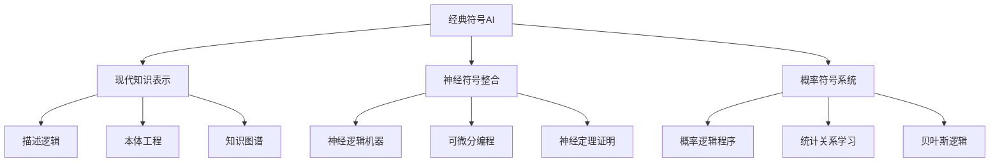
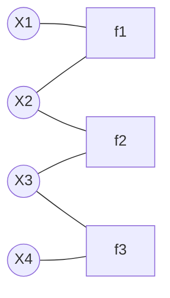

# AI核心理论：范式演进与理论整合

> 本节已完成深度优化与批判性提升，详见[PROGRESS.md](../PROGRESS.md)。

## 03.1 引言：理论层的重要性

AI理论层构成了AI系统设计和实现的概念基础，它介于抽象的元理论哲学与具体的技术实现之间。本章分析AI的核心理论范式，探讨它们的演进脉络、内在逻辑及理论整合的挑战与前景。

**理论层的形式化定义**：

```math
\mathcal{T}_{AI} = \langle \mathcal{P}, \mathcal{M}, \mathcal{A}, \mathcal{E} \rangle
```

其中$\mathcal{P}$为理论范式集合，$\mathcal{M}$为数学基础，$\mathcal{A}$为应用领域，$\mathcal{E}$为评估标准。

## 03.2 符号主义：逻辑与知识表示

### 03.2.1 理论基础与核心原理

**物理符号系统假设**（Newell & Simon, 1976）：

```math
\text{智能} \Leftrightarrow \text{符号系统} + \text{符号操作}
```

**定义3.1**（符号系统）：符号系统$\mathcal{S} = \langle \Sigma, \mathcal{R}, \mathcal{O}, \mathcal{I} \rangle$包含：

- $\Sigma$：符号字母表
- $\mathcal{R}$：表示规则集
- $\mathcal{O}$：操作规则集  
- $\mathcal{I}$：解释函数

**核心假设**：

1. **表示假设**：知识可用符号结构显式表示
2. **计算假设**：思维过程是符号计算过程
3. **组合性假设**：复杂概念由简单概念组合而成

### 03.2.2 知识表示形式

| 表示方法 | 形式化 | 优势 | 局限 | 典型应用 |
|----------|--------|------|------|----------|
| **逻辑表示** | $\mathcal{L} = \langle \Phi, \vdash \rangle$ | 严格推理、可证明 | 完备性限制 | 定理证明、专家系统 |
| **语义网络** | $\mathcal{G} = \langle V, E, L \rangle$ | 关系表达、可视化 | 语义模糊 | 知识图谱、概念建模 |
| **框架系统** | $\mathcal{F} = \langle S, A, D \rangle$ | 结构化、继承 | 灵活性不足 | 面向对象系统 |
| **产生式规则** | $IF\ P\ THEN\ Q$ | 模块化、透明 | 组合爆炸 | 专家系统、决策支持 |

**定理3.1**（表示完备性限制）：对于任何有限符号系统$\mathcal{S}$，存在知识$K$无法在$\mathcal{S}$中充分表示。

**证明概要**：基于哥德尔不完备性定理，任何足够强的形式系统都存在不可判定的陈述。

### 03.2.3 推理机制

**演绎推理**：

```math
\frac{\Gamma \vdash \phi \rightarrow \psi \quad \Gamma \vdash \phi}{\Gamma \vdash \psi} \text{(Modus Ponens)}
```

**归纳推理**：

```math
\text{泛化规则}: \frac{P(a_1), P(a_2), ..., P(a_n)}{\forall x: P(x)} \text{(在某种归纳原理下)}
```

**溯因推理**：

```math
\frac{\text{观察到} \phi \quad \text{假设} \psi \text{能解释} \phi}{\text{接受} \psi \text{作为最佳解释}}
```

### 03.2.4 符号主义的成就与局限

**主要成就**：

- **专家系统**：MYCIN、DENDRAL等在特定领域的成功
- **知识工程**：系统化的知识获取和表示方法
- **逻辑程序设计**：Prolog等声明式编程语言
- **语义网络**：现代知识图谱的基础

**根本局限**：

1. **符号接地问题**：符号与现实世界的连接困难
2. **常识推理困难**：日常知识的形式化极其复杂
3. **脆弱性**：对输入变化过于敏感
4. **学习能力有限**：难以从经验中自动获取知识

**现代发展**：



## 03.3 连接主义：神经网络与分布式表示

### 03.3.1 理论基础与生物启发

**连接主义核心假设**：

1. **分布式表示**：知识分布在网络连接中
2. **并行处理**：多个简单单元并行计算
3. **学习机制**：通过权重调整适应环境
4. **容错性**：局部损坏不影响整体功能

**定义3.2**（人工神经网络）：

```math
\mathcal{N} = \langle \mathcal{U}, \mathcal{W}, \mathcal{A}, \mathcal{L} \rangle
```

其中：

- $\mathcal{U} = \{u_1, u_2, ..., u_n\}$：神经元集合
- $\mathcal{W}$：权重矩阵$w_{ij}$表示$u_j$到$u_i$的连接强度
- $\mathcal{A}$：激活函数$a_i = f(\sum_j w_{ij} \cdot o_j)$
- $\mathcal{L}$：学习规则

### 03.3.2 学习理论基础

**Hebbian学习规则**：

```math
\Delta w_{ij} = \eta \cdot o_i \cdot o_j
```

"一起激发的神经元连接在一起"

**反向传播算法**：

```math
\frac{\partial E}{\partial w_{ij}} = \frac{\partial E}{\partial o_i} \cdot \frac{\partial o_i}{\partial net_i} \cdot \frac{\partial net_i}{\partial w_{ij}}
```

**定理3.2**（万能逼近定理）：具有一个隐层的前馈网络可以以任意精度逼近任何连续函数。

**数学表述**：

```math
\forall f \in C([0,1]^m), \forall \epsilon > 0, \exists \text{网络} N: \sup_{x \in [0,1]^m} |f(x) - N(x)| < \epsilon
```

### 03.3.3 深度学习的突破

**深度架构的优势**：

1. **层次特征学习**：自动学习从低级到高级的特征
2. **表示效率**：深度网络比浅层网络更紧凑
3. **端到端学习**：直接从原始数据到最终目标

**关键架构创新**：

| 架构类型 | 核心机制 | 数学形式 | 主要应用 |
|----------|----------|----------|----------|
| **CNN** | 局部连接+权重共享 | $y_{ij} = \sum_{m,n} w_{mn} \cdot x_{i+m,j+n}$ | 图像处理 |
| **RNN/LSTM** | 循环连接+门控机制 | $h_t = f(W_h h_{t-1} + W_x x_t)$ | 序列建模 |
| **Transformer** | 注意力机制 | $\text{Attention}(Q,K,V) = \text{softmax}(\frac{QK^T}{\sqrt{d_k}})V$ | 语言理解 |
| **GAN** | 对抗训练 | $\min_G \max_D V(D,G) = \mathbb{E}_{x}[\log D(x)] + \mathbb{E}_{z}[\log(1-D(G(z)))]$ | 生成建模 |

### 03.3.4 表示学习理论

**定义3.3**（表示学习）：学习将原始数据映射到有用特征表示的函数$\phi: \mathcal{X} \rightarrow \mathcal{Z}$。

**良好表示的特征**：

1. **平滑性**：相似输入产生相似表示
2. **因子化**：表示的不同维度对应不同变化因子
3. **层次性**：复杂特征由简单特征组合而成
4. **稀疏性**：每个样本只激活少数表示单元
5. **不变性**：对某些变换保持稳定

**信息论视角**：

```math
\mathcal{L} = -\mathbb{E}_{p(x,y)}[\log p(y|x)] + \beta \mathcal{I}(X; Z)
```

平衡预测精度与表示简洁性。

### 03.3.5 连接主义的优势与挑战

**主要优势**：

- **学习能力强**：能从大数据中自动提取特征
- **并行处理**：天然适合并行计算架构
- **容错性好**：对噪声和损坏的鲁棒性
- **泛化能力**：在相似任务间迁移知识

**根本挑战**：

1. **可解释性缺失**：黑盒特性限制理解和调试
2. **数据饥渴**：需要大量标注数据
3. **对抗脆弱性**：对精心设计的攻击敏感
4. **推理能力有限**：在逻辑推理方面表现较弱

## 03.4 概率推理与贝叶斯范式

### 03.4.1 不确定性推理的必要性

现实世界充满不确定性，传统确定性推理无法应对：

- **知识不完整**：掌握的信息有限
- **感知噪声**：传感器数据存在误差
- **环境动态性**：世界状态持续变化
- **决策风险**：行动结果具有不确定性

**定义3.4**（不确定性推理）：在不完整、不精确、不一致信息条件下进行的推理过程。

### 03.4.2 概率论基础

**贝叶斯定理**：

```math
P(H|E) = \frac{P(E|H) \cdot P(H)}{P(E)}
```

**概率推理的三个层次**（Pearl）：

1. **关联层次**：$P(y|x)$ - 观察到相关性
2. **干预层次**：$P(y|do(x))$ - 主动干预的效果
3. **反事实层次**：$P(y_x|x',y')$ - 假设性推理

### 03.4.3 概率图模型

**贝叶斯网络**：

```math
P(X_1, ..., X_n) = \prod_{i=1}^n P(X_i | \text{Parents}(X_i))
```

**马尔可夫随机场**：

```math
P(X) = \frac{1}{Z} \prod_{c} \psi_c(X_c)
```

**因子图表示**：



### 03.4.4 推理算法

**精确推理**：

- **变量消除**：$P(X_Q) = \sum_{X_H} \prod_i \phi_i(X_i)$
- **团树传播**：在团树上进行消息传递

**近似推理**：

- **变分推理**：最小化$\text{KL}(q(x) || p(x))$
- **MCMC采样**：Metropolis-Hastings、Gibbs采样
- **重要性采样**：$\mathbb{E}_p[f] \approx \frac{1}{N}\sum_{i=1}^N \frac{p(x_i)}{q(x_i)}f(x_i)$

### 03.4.5 贝叶斯学习

**参数学习**：

```math
P(\theta|D) = \frac{P(D|\theta)P(\theta)}{P(D)}
```

**结构学习**：

```math
P(G|D) \propto P(D|G)P(G)
```

**预测**：

```math
P(x_{new}|D) = \int P(x_{new}|\theta)P(\theta|D)d\theta
```

### 03.4.6 现代概率AI

**深度概率模型**：

- **变分自编码器**：$\mathcal{L} = \mathbb{E}_{q_\phi(z|x)}[\log p_\theta(x|z)] - \text{KL}(q_\phi(z|x)||p(z))$
- **归一化流**：$p_X(x) = p_Z(f^{-1}(x)) \left| \det \frac{\partial f^{-1}}{\partial x} \right|$
- **概率Transformer**：在注意力机制中引入不确定性

**因果推理**：

```math
\text{因果图} \rightarrow \text{识别} \rightarrow P(Y|do(X)) \rightarrow \text{估计}
```

## 03.5 强化学习：交互与适应

### 03.5.1 马尔可夫决策过程

**定义3.5**（MDP）：强化学习问题可形式化为MDP $\langle \mathcal{S}, \mathcal{A}, \mathcal{P}, \mathcal{R}, \gamma \rangle$：

- $\mathcal{S}$：状态空间
- $\mathcal{A}$：动作空间  
- $\mathcal{P}(s'|s,a)$：状态转移概率
- $\mathcal{R}(s,a,s')$：奖励函数
- $\gamma \in [0,1)$：折扣因子

**最优策略**：

```math
\pi^*(s) = \arg\max_a \sum_{s'} \mathcal{P}(s'|s,a)[\mathcal{R}(s,a,s') + \gamma V^*(s')]
```

### 03.5.2 价值函数与策略

**状态价值函数**：

```math
V^\pi(s) = \mathbb{E}_\pi[\sum_{t=0}^\infty \gamma^t r_{t+1} | s_0 = s]
```

**动作价值函数**：

```math
Q^\pi(s,a) = \mathbb{E}_\pi[\sum_{t=0}^\infty \gamma^t r_{t+1} | s_0 = s, a_0 = a]
```

**Bellman方程**：

```math
V^\pi(s) = \sum_a \pi(a|s) \sum_{s'} \mathcal{P}(s'|s,a)[\mathcal{R}(s,a,s') + \gamma V^\pi(s')]
```

### 03.5.3 学习算法

**基于模型的方法**：

1. 学习环境模型$\hat{\mathcal{P}}, \hat{\mathcal{R}}$
2. 使用动态规划求解最优策略

**无模型方法**：

- **时序差分学习**：$V(s) \leftarrow V(s) + \alpha[r + \gamma V(s') - V(s)]$
- **Q-learning**：$Q(s,a) \leftarrow Q(s,a) + \alpha[r + \gamma \max_{a'} Q(s',a') - Q(s,a)]$
- **策略梯度**：$\nabla_\theta J(\theta) = \mathbb{E}_\pi[\nabla_\theta \log \pi(a|s) Q^\pi(s,a)]$

### 03.5.4 深度强化学习

**深度Q网络(DQN)**：

```math
\mathcal{L}(\theta) = \mathbb{E}[(r + \gamma \max_{a'} Q(s',a';\theta^-) - Q(s,a;\theta))^2]
```

**策略梯度方法**：

- **REINFORCE**：$\nabla_\theta J(\theta) = \mathbb{E}[\sum_t \nabla_\theta \log \pi_\theta(a_t|s_t) G_t]$
- **Actor-Critic**：结合价值函数和策略优化
- **PPO**：$\mathcal{L}(\theta) = \mathbb{E}[\min(r_t(\theta)\hat{A}_t, \text{clip}(r_t(\theta), 1-\epsilon, 1+\epsilon)\hat{A}_t)]$

### 03.5.5 强化学习的扩展

**多智能体强化学习**：

- **独立学习**：每个智能体独立学习
- **联合动作学习**：考虑其他智能体的行为
- **通信协议**：智能体间信息交换

**层次强化学习**：

```math
\pi(a|s) = \sum_{o} \pi_{\text{high}}(o|s) \pi_{\text{low}}(a|s,o)
```

**元学习**：学会如何快速适应新任务

```math
\theta^* = \arg\min_\theta \sum_{\mathcal{T}_i} \mathcal{L}_{\mathcal{T}_i}(f_{\theta_i^*})
```

其中$\theta_i^* = \theta - \alpha \nabla_\theta \mathcal{L}_{\mathcal{T}_i}(f_\theta)$

## 03.6 理论范式的比较与整合

### 03.6.1 范式对比分析

| 特征维度 | 符号主义 | 连接主义 | 概率推理 | 强化学习 |
|----------|----------|----------|----------|----------|
| **知识表示** | 显式符号 | 分布式权重 | 概率分布 | 价值函数/策略 |
| **学习机制** | 规则获取 | 权重调整 | 贝叶斯更新 | 试错探索 |
| **推理方式** | 逻辑演绎 | 激活传播 | 概率计算 | 序贯决策 |
| **数据需求** | 少量专家知识 | 大量标注数据 | 先验+观测 | 环境交互 |
| **可解释性** | 高 | 低 | 中等 | 中等 |
| **处理不确定性** | 弱 | 中等 | 强 | 强 |
| **泛化能力** | 弱 | 强 | 中等 | 强 |

### 03.6.2 理论整合的必要性

**单一范式的局限**：

- 没有单一方法能解决所有AI问题
- 不同任务需要不同的推理机制
- 人类智能是多种机制的综合

**整合的理论基础**：

```math
\text{混合智能} = f(\text{符号推理}, \text{神经计算}, \text{概率推理}, \text{强化学习})
```

### 03.6.3 神经符号整合

**核心思想**：结合神经网络的学习能力与符号系统的推理能力。

**整合方式**：

1. **神经符号翻译**：神经网络输出符号表示
2. **符号监督神经网络**：使用符号知识指导神经网络训练
3. **神经引导符号推理**：神经网络控制符号推理过程
4. **端到端可微分推理**：将符号推理设计为可微分操作

**数学框架**：

```math
\mathcal{NS} = \langle \mathcal{N}, \mathcal{S}, \mathcal{T}, \mathcal{I} \rangle
```

其中$\mathcal{N}$为神经组件，$\mathcal{S}$为符号组件，$\mathcal{T}$为转换函数，$\mathcal{I}$为整合机制。

### 03.6.4 概率神经符号系统

**概率逻辑程序**：

```math
P(\text{结论}|\text{证据}) = \sum_{\text{所有证明}} P(\text{证明}|\text{证据})
```

**神经概率程序**：

- 神经网络学习概率分布参数
- 概率程序定义生成过程
- 变分推理进行近似推理

### 03.6.5 多模态理论整合

**统一表示空间**：

```math
z = \text{Encoder}(x_{\text{text}}, x_{\text{image}}, x_{\text{audio}})
```

**跨模态推理**：

```math
P(y|x_1, x_2, ..., x_n) = \int P(y|z)P(z|x_1, x_2, ..., x_n)dz
```

**注意力融合机制**：

```math
\alpha_i = \frac{\exp(e_i)}{\sum_j \exp(e_j)}, \quad z = \sum_i \alpha_i z_i
```

## 03.7 涌现性与复杂系统理论

### 03.7.1 AI中的涌现现象

**定义3.6**（AI涌现性）：AI系统表现出的整体特性$E$满足：

```math
E \notin \bigcup_{c \in \text{Components}} \text{Properties}(c) \text{ 且 } E \in \text{Properties}(\text{System})
```

**涌现类型**：

1. **规模涌现**：参数量达到临界点时出现新能力
2. **架构涌现**：特定结构设计产生意外功能
3. **训练涌现**：学习过程中出现未预期的行为
4. **交互涌现**：多组件交互产生系统级特性

### 03.7.2 复杂适应系统特征

**AI系统的复杂性特征**：

- **非线性响应**：小的输入变化可能导致大的输出变化
- **适应性**：根据环境反馈调整行为
- **自组织**：无外部控制下形成有序结构
- **层次性**：多层次的组织结构

**复杂网络分析**：

```math
\text{网络} G = \langle V, E \rangle, \quad \text{特征}: \text{度分布}, \text{聚类系数}, \text{路径长度}
```

### 03.7.3 信息论视角

**信息整合理论**：

```math
\Phi = \min_{\text{分割}} \sum_i H(X_i) - H(X)
```

**因果涌现**：

```math
\text{因果力} = \sum_{i,j} \frac{\partial P(X_j^{t+1})}{\partial P(X_i^t)}
```

## 03.8 理论前沿与发展趋势

### 03.8.1 因果推理与AI

**因果层次**：

1. **关联**：$P(Y|X)$ - 统计相关性
2. **干预**：$P(Y|do(X))$ - 操作效果
3. **反事实**：$P(Y_x|X=x', Y=y')$ - 假设推理

**因果发现**：

```math
\text{数据} \rightarrow \text{因果图} \rightarrow \text{因果效应识别} \rightarrow \text{估计}
```

### 03.8.2 元学习理论

**学会学习**：

```math
\phi^* = \arg\min_\phi \mathbb{E}_{\mathcal{T} \sim p(\mathcal{T})} \mathcal{L}_\mathcal{T}(f_{\phi_\mathcal{T}^*})
```

**梯度为基础的元学习**：

```math
\phi_\mathcal{T} = \phi - \alpha \nabla_\phi \mathcal{L}_\mathcal{T}^{\text{train}}(f_\phi)
```

### 03.8.3 量子机器学习

**量子态表示**：

```math
|\psi\rangle = \sum_i \alpha_i |i\rangle, \quad \sum_i |\alpha_i|^2 = 1
```

**量子算法优势**：

- **指数加速**：某些问题的量子算法具有指数优势
- **并行性**：量子叠加实现自然并行计算
- **纠缠特性**：量子纠缠提供新的计算资源

### 03.8.4 持续学习理论

**灾难性遗忘**：

```math
\mathcal{L}_{\text{total}} = \mathcal{L}_{\text{new}} + \lambda \sum_i \Omega_i (\theta_i - \theta_i^*)^2
```

**终身学习架构**：

- **动态网络扩展**：为新任务添加网络容量
- **记忆回放**：保存旧任务样本防止遗忘
- **知识蒸馏**：压缩旧知识到新模型

## 03.9 理论评估与验证

### 03.9.1 理论评估标准

**内在标准**：

1. **一致性**：理论内部无矛盾
2. **完备性**：覆盖目标现象
3. **简洁性**：奥卡姆剃刀原则
4. **可证伪性**：波普尔科学哲学

**外在标准**：

1. **解释力**：解释已知现象
2. **预测力**：预测新现象
3. **实用性**：指导技术开发
4. **统一性**：整合不同领域

### 03.9.2 实证验证方法

**受控实验**：

```math
\text{假设} \rightarrow \text{预测} \rightarrow \text{实验设计} \rightarrow \text{数据收集} \rightarrow \text{统计验证}
```

**基准测试**：

- **标准数据集**：ImageNet、GLUE、Atari等
- **评估指标**：准确率、F1分数、BLEU分数等
- **鲁棒性测试**：对抗样本、分布偏移测试

**消融研究**：

```math
\text{完整模型} - \text{组件} X = \text{简化模型}, \quad \Delta\text{性能} = f(\text{组件}X\text{的贡献})
```

## 03.10 小结：理论整合的未来

### 03.10.1 理论发展方向

**统一理论追求**：

- 寻找更高层次的理论框架统一不同范式
- 开发通用的数学工具描述智能现象
- 建立智能的统一物理基础理论

**多元主义接受**：

- 承认不同理论在不同领域的优势
- 发展理论间的接口和转换机制
- 构建理论生态系统而非单一理论

### 03.10.2 实践指导价值

理论层对AI实践的指导意义：

1. **架构设计**：理论原理指导系统架构选择
2. **算法开发**：理论分析启发新算法设计
3. **性能优化**：理论理解帮助识别瓶颈
4. **安全保障**：理论分析预测系统行为边界

### 03.10.3 跨学科对话

**与认知科学**：

- AI理论验证认知假设
- 认知发现启发AI理论

**与神经科学**：

- 大脑机制启发AI架构
- AI模型解释神经现象

**与物理学**：

- 物理原理约束AI系统
- AI方法解决物理问题

AI理论层作为连接抽象哲学与具体技术的桥梁，其发展将决定AI领域的未来方向。理论的深化与整合不仅是学术追求，更是构建更强大、更可靠、更可理解AI系统的基础。

---

**参考文献**：

1. Matter/FormalModel/AI/AI的结构化知识体系分类理论实现与应用分析01.md
2. Matter/FormalModel/AI/形式化理论与AI人脑意识的综合分析01.md  
3. Matter/FormalModel/AI/AI涌现特征与人类功能替代的分析01.md
4. Newell, A., & Simon, H. A. (1976). Computer science as empirical inquiry: symbols and search.
5. Rumelhart, D. E., Hinton, G. E., & Williams, R. J. (1986). Learning representations by back-propagating errors.

**交叉引用**：

- 哲学基础：→ [02-MetaTheory.md](./02-MetaTheory.md)
- 技术实现：→ [05-Model.md](./05-Model.md)
- 数学基础：→ [../Mathematics/01-Overview.md](../Mathematics/01-Overview.md)

**最后更新**：2024-12-29

## 03.X 各范式批判性分析与未来展望

### 符号主义批判性分析

- **假设与局限**：过度依赖显式知识表示，难以处理模糊、连续、感知类任务，符号接地与常识推理问题突出。
- **创新建议**：推进神经符号整合、概率符号系统，强化与感知、学习机制的结合。
- **交叉引用**：详见 [Matter/批判分析框架.md](../../Matter/批判分析框架.md)、[02-MetaTheory.md](./02-MetaTheory.md)

### 连接主义批判性分析

- **假设与局限**：黑盒特性导致可解释性差，推理与常识建模能力有限，对抗脆弱性与数据依赖性强。
- **创新建议**：发展可解释神经网络、神经符号融合、因果推理机制。
- **交叉引用**：详见 [05-Model.md](./05-Model.md)

### 概率推理批判性分析

- **假设与局限**：概率模型难以表达复杂结构知识，因果推理与反事实推理能力有限。
- **创新建议**：融合符号、神经与概率范式，发展因果推理与结构化概率模型。
- **交叉引用**：详见 [04-MetaModel.md](./04-MetaModel.md)

### 理论整合与前沿展望

- **挑战**：多范式整合的数学基础与工程实现尚不成熟，缺乏统一评估标准。
- **前沿方向**：神经符号AI、因果学习、持续学习、具身智能、多模态推理。
- **交叉引用**：详见 [01-Overview.md](./01-Overview.md)、[02-MetaTheory.md](./02-MetaTheory.md)

---

## 03.Y 术语表

| 术语 | 英文 | 定义 |
|------|------|------|
| 符号主义 | Symbolism | 基于符号表示和逻辑推理的AI范式 |
| 连接主义 | Connectionism | 基于神经网络和分布式表示的AI范式 |
| 概率推理 | Probabilistic Reasoning | 基于概率模型和不确定性推理的AI范式 |
| 神经符号整合 | Neuro-symbolic Integration | 融合神经网络与符号推理的AI方法 |
| 因果推理 | Causal Reasoning | 研究变量间因果关系的推理方法 |

## 03.Z 符号表

| 符号 | 含义 |
|------|------|
| $\mathcal{T}_{AI}$ | AI理论层整体结构 |
| $\mathcal{P}$ | 理论范式集合 |
| $\mathcal{M}$ | 数学基础 |
| $\mathcal{A}$ | 应用领域 |
| $\mathcal{E}$ | 评估标准 |
| $\mathcal{S}$ | 符号系统 |
| $\mathcal{N}$ | 神经网络结构 |
| $\phi$ | 特征映射函数 |

---

> 本文档深度优化与批判性提升已完成，后续如需插入人工批注、暂停或调整优先级，请在[PROGRESS.md](../PROGRESS.md)留言，系统将自动检测并响应。
