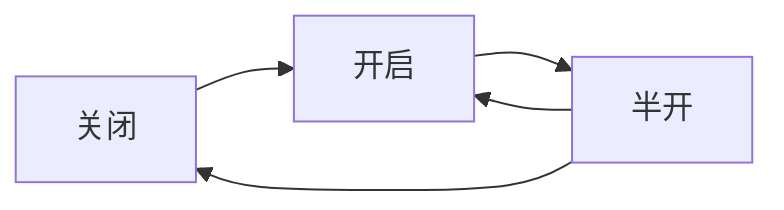
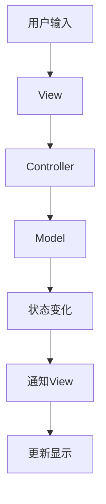

# AI设计模式与数学基础

> 本节已完成深度优化与批判性提升，详见[PROGRESS.md](../PROGRESS.md)。

## 目录

- [AI设计模式与数学基础](#ai设计模式与数学基础)
  - [目录](#目录)
  - [1. 范畴论核心概念](#1-范畴论核心概念)
    - [1.1 基本定义](#11-基本定义)
    - [1.2 函子与单子](#12-函子与单子)
    - [1.3 自然变换与极限](#13-自然变换与极限)
  - [2. 设计模式的范畴论视角](#2-设计模式的范畴论视角)
    - [2.1 GoF设计模式分析](#21-gof设计模式分析)
      - [2.1.1 创建型模式](#211-创建型模式)
      - [2.1.2 结构型模式](#212-结构型模式)
      - [2.1.3 行为型模式](#213-行为型模式)
    - [2.2 面向对象设计原则](#22-面向对象设计原则)
      - [2.2.1 SOLID原则的范畴论解释](#221-solid原则的范畴论解释)
    - [2.3 函数式编程模式](#23-函数式编程模式)
      - [2.3.1 函子（Functor）](#231-函子functor)
      - [2.3.2 应用函子（Applicative Functor）](#232-应用函子applicative-functor)
      - [2.3.3 单子（Monad）](#233-单子monad)
  - [3. 并发与分布式模式](#3-并发与分布式模式)
    - [3.1 并发设计模式](#31-并发设计模式)
      - [3.1.1 Actor模型](#311-actor模型)
      - [3.1.2 Futures/Promises](#312-futurespromises)
      - [3.1.3 CSP（通信顺序进程）](#313-csp通信顺序进程)
    - [3.2 分布式系统模式](#32-分布式系统模式)
      - [3.2.1 断路器模式](#321-断路器模式)
      - [3.2.2 Saga模式](#322-saga模式)
    - [3.3 工作流设计模式](#33-工作流设计模式)
      - [3.3.1 工作流结构](#331-工作流结构)
  - [4. 架构模式与系统设计](#4-架构模式与系统设计)
    - [4.1 MVC与MVVM模式](#41-mvc与mvvm模式)
      - [4.1.1 MVC模式](#411-mvc模式)
      - [4.1.2 MVVM模式](#412-mvvm模式)
    - [4.2 微服务架构](#42-微服务架构)
      - [4.2.1 服务分解](#421-服务分解)
    - [4.3 分层架构](#43-分层架构)
      - [4.3.1 层次结构](#431-层次结构)
  - [5. 数据结构与算法的数学基础](#5-数据结构与算法的数学基础)
    - [5.1 数据结构作为数学对象](#51-数据结构作为数学对象)
      - [5.1.1 集合与映射](#511-集合与映射)
      - [5.1.2 序列与列表](#512-序列与列表)
      - [5.1.3 图与树](#513-图与树)
    - [5.2 算法的数学分析](#52-算法的数学分析)
      - [5.2.1 复杂度分析](#521-复杂度分析)
      - [5.2.2 算法正确性](#522-算法正确性)
    - [5.3 复杂度理论与优化](#53-复杂度理论与优化)
      - [5.3.1 问题复杂度分类](#531-问题复杂度分类)
      - [5.3.2 算法优化策略](#532-算法优化策略)
  - [6. 设计模式的数学理解](#6-设计模式的数学理解)
    - [6.1 抽象结构视角](#61-抽象结构视角)
      - [6.1.1 设计模式作为抽象结构](#611-设计模式作为抽象结构)
      - [6.1.2 代数结构类比](#612-代数结构类比)
    - [6.2 态射与组合规则](#62-态射与组合规则)
      - [6.2.1 态射的组合](#621-态射的组合)
      - [6.2.2 责任链模式](#622-责任链模式)
    - [6.3 问题空间映射](#63-问题空间映射)
      - [6.3.1 模式作为映射函数](#631-模式作为映射函数)
      - [6.3.2 不变量与变化点](#632-不变量与变化点)
  - [7. 综合分析与未来展望](#7-综合分析与未来展望)
    - [7.1 统一抽象语言](#71-统一抽象语言)
      - [7.1.1 范畴论的优势](#711-范畴论的优势)
      - [7.1.2 数学视角的价值](#712-数学视角的价值)
    - [7.2 组合性与结构关系](#72-组合性与结构关系)
      - [7.2.1 强调组合性](#721-强调组合性)
      - [7.2.2 关注结构与关系](#722-关注结构与关系)
    - [7.3 局限性与发展方向](#73-局限性与发展方向)
      - [7.3.1 局限性](#731-局限性)
      - [7.3.2 发展方向](#732-发展方向)
  - [X. 各类别设计模式批判性分析与未来展望](#x-各类别设计模式批判性分析与未来展望)
    - [范畴论视角批判性分析](#范畴论视角批判性分析)
    - [GoF与面向对象模式批判性分析](#gof与面向对象模式批判性分析)
    - [函数式与并发/分布式模式批判性分析](#函数式与并发分布式模式批判性分析)
    - [架构模式与系统设计批判性分析](#架构模式与系统设计批判性分析)
  - [总结](#总结)
  - [Y. 术语表](#y-术语表)
  - [Z. 符号表](#z-符号表)

---

## 1. 范畴论核心概念

### 1.1 基本定义

**定义（范畴）**：一个范畴$\mathcal{C}$由以下组成：

- 对象集合$\text{Ob}(\mathcal{C})$
- 态射集合$\text{Mor}(\mathcal{C})$，每个态射$f: A \to B$连接两个对象
- 组合操作$\circ$，满足结合律
- 单位态射$\text{id}_A: A \to A$，满足单位律

**形式化表达**：

```math
\forall f: A \to B, g: B \to C, h: C \to D: (h \circ g) \circ f = h \circ (g \circ f)
\forall f: A \to B: f \circ \text{id}_A = f = \text{id}_B \circ f
```

### 1.2 函子与单子

**定义（函子）**：函子$F: \mathcal{C} \to \mathcal{D}$是范畴间的映射，保持结构：

- 对象映射：$F: \text{Ob}(\mathcal{C}) \to \text{Ob}(\mathcal{D})$
- 态射映射：$F: \text{Mor}(\mathcal{C}) \to \text{Mor}(\mathcal{D})$
- 保持组合：$F(g \circ f) = F(g) \circ F(f)$
- 保持单位：$F(\text{id}_A) = \text{id}_{F(A)}$

**定义（单子）**：单子是范畴$\mathcal{C}$上的三元组$(T, \eta, \mu)$：

- $T: \mathcal{C} \to \mathcal{C}$是函子
- $\eta: \text{Id} \to T$是单位自然变换
- $\mu: T^2 \to T$是乘法自然变换

### 1.3 自然变换与极限

**定义（自然变换）**：自然变换$\alpha: F \to G$是函子间的态射族：

```math
\alpha_A: F(A) \to G(A) \text{ 使得 } G(f) \circ \alpha_A = \alpha_B \circ F(f)
```

**定义（极限）**：极限是范畴论中描述"通用构造"的概念：

- 乘积（Product）：$A \times B$是最通用的同时拥有A和B的结构
- 余乘积（Coproduct）：$A + B$是最通用的从A或B中选择的结构

---

## 2. 设计模式的范畴论视角

### 2.1 GoF设计模式分析

#### 2.1.1 创建型模式

**工厂模式**：定义如何产生范畴中的"初始对象"或特定结构对象的态射。

**形式化表达**：

```math
\text{Factory}: \text{Type} \to \text{Object}
\text{AbstractFactory}: \text{ProductFamily} \to \text{ProductSet}
```

**单例模式**：确保某个对象（类型）只有一个实例，是全局可访问的"终端对象"的特例。

#### 2.1.2 结构型模式

**组合模式**：体现了树状结构的递归组合，类似于代数结构。

**装饰器模式**：可以看作是一种态射的组合（链式调用）或对象结构的扩展（类似函子/Monad包裹值并提供额外操作）。

**适配器模式**：非常接近自然变换的概念，在不同接口（函子或对象结构）之间进行转换。

#### 2.1.3 行为型模式

**策略模式**：将算法/操作（态射）本身对象化，允许它们被传递和替换，体现了高阶函数或将态射视为对象的思想。

**观察者模式**：定义了一种对象间的广播机制，可以看作是对象状态变化（事件）触发的一系列态射（通知）。

**访问者模式**：将操作（态射）从对象结构中分离，允许在不修改结构的情况下添加新操作，体现了数据结构和作用于其上的操作的分离。

### 2.2 面向对象设计原则

#### 2.2.1 SOLID原则的范畴论解释

**单一职责原则（SRP）**：对象（类）应该只有一个改变的理由，意味着对象应该对应一个内聚的概念，其态射（方法）服务于这个单一目标。

**开闭原则（OCP）**：对扩展开放，对修改关闭。可以通过抽象（接口/基类，范畴论中的抽象对象）和多态（不同的具体实现/态射）来实现。

**里氏替换原则（LSP）**：子类型必须能够替换其基类型。在范畴论中，这关乎态射的保持，即子类型对象（子对象）提供的态射必须符合父类型对象（父对象）定义的"契约"。

**接口隔离原则（ISP）**：不应强迫客户依赖它们不使用的方法。意味着接口（抽象对象）应该小而专，对应于更细粒度的态射集合。

**依赖倒置原则（DIP）**：依赖于抽象而不是具体实现。高层模块（对象）不应依赖于低层模块（对象），两者都应依赖于抽象（接口）。

### 2.3 函数式编程模式

#### 2.3.1 函子（Functor）

直接源自范畴论，提供`map`操作来在上下文中应用函数，是处理容器或上下文的基础模式。

**形式化定义**：

```math
\text{map}: (A \to B) \to F(A) \to F(B)
```

#### 2.3.2 应用函子（Applicative Functor）

函子的扩展，允许将"在上下文中的函数"应用到"在上下文中的值"。

**形式化定义**：

```math
\text{pure}: A \to F(A)
\text{<*>}: F(A \to B) \to F(A) \to F(B)
```

#### 2.3.3 单子（Monad）

应用函子的扩展，提供`flatMap`/`bind`操作来组合产生上下文的计算。

**形式化定义**：

```math
\text{return}: A \to M(A)
\text{bind}: M(A) \to (A \to M(B)) \to M(B)
```

---

## 3. 并发与分布式模式

### 3.1 并发设计模式

#### 3.1.1 Actor模型

Actor是封装状态和行为的对象，通过异步消息（态射）进行通信，避免共享状态，易于组合。

**形式化模型**：

```math
\text{Actor} = \langle \text{State}, \text{Behavior}, \text{Mailbox} \rangle
\text{Message}: \text{Actor} \to \text{Actor} \to \text{Data}
```

#### 3.1.2 Futures/Promises

可以看作是异步计算的Monad，用于组合和管理异步操作流。

**形式化定义**：

```math
\text{Future}[A] = \text{Promise}[A] \to \text{Result}[A]
\text{flatMap}: \text{Future}[A] \to (A \to \text{Future}[B]) \to \text{Future}[B]
```

#### 3.1.3 CSP（通信顺序进程）

关注进程间的通信通道，可以看作是特定类型的态射（通道上的发送/接收）。

### 3.2 分布式系统模式

#### 3.2.1 断路器模式

类似于状态模式，管理对可能失败的远程调用（态射）的访问状态。

**状态转换**：



#### 3.2.2 Saga模式

用于管理分布式事务，通过一系列本地事务（态射）及其补偿操作（补偿态射）来确保最终一致性。

**形式化定义**：

```math
\text{Saga} = \langle \text{Steps}, \text{Compensations}, \text{Orchestration} \rangle
```

### 3.3 工作流设计模式

#### 3.3.1 工作流结构

工作流与范畴论的图结构有天然联系：

- **活动/任务（Activity/Task）**：可以看作是对象或状态
- **流转/转换（Transition）**：可以看作是态射

**形式化定义**：

```math
\text{Workflow} = \langle \text{Activities}, \text{Transitions}, \text{ControlFlow} \rangle
```

---

## 4. 架构模式与系统设计

### 4.1 MVC与MVVM模式

#### 4.1.1 MVC模式

定义了特定类型的对象（Model, View, Controller）以及它们之间的标准交互模式（态射）。

**交互流程**：



#### 4.1.2 MVVM模式

ViewModel作为View和Model之间的中介，提供数据绑定和命令模式。

**形式化定义**：

```math
\text{ViewModel} = \langle \text{DataBinding}, \text{Commands}, \text{State} \rangle
```

### 4.2 微服务架构

#### 4.2.1 服务分解

将大型系统分解为小型、独立部署的服务（对象）。服务之间通过网络API（态射）通信。

**服务间关系**：

```math
\text{Service}_i \xrightarrow{\text{API}} \text{Service}_j
\text{Microservice} = \langle \{\text{Service}_i\}, \{\text{API}_{ij}\}, \text{Orchestration} \rangle
```

### 4.3 分层架构

#### 4.3.1 层次结构

将系统划分为层次（对象），层与层之间通过明确定义的接口（态射）交互。

**分层模型**：

```math
\text{Layer}_i \xrightarrow{\text{Interface}_{i,i+1}} \text{Layer}_{i+1}
```

---

## 5. 数据结构与算法的数学基础

### 5.1 数据结构作为数学对象

#### 5.1.1 集合与映射

**集合（Sets）**：像`Set`这样的数据结构直接模拟了数学中的集合概念。

**哈希表**：可以看作是实现集合或映射（函数）的一种高效方式，利用了哈希函数（一种特殊的映射）和模运算。

**形式化定义**：

```math
\text{HashTable}[K, V] = \text{Array}[\text{List}[\langle K, V \rangle]]
\text{hash}: K \to \mathbb{N}
```

#### 5.1.2 序列与列表

**数组**：提供了基于索引（自然数到元素的映射）的直接访问。

**链表**：通过指针（后继关系）定义了元素的顺序。

**形式化定义**：

```math
\text{Array}[A] = \mathbb{N} \to A
\text{LinkedList}[A] = \text{Node}[A] \text{ where } \text{Node}[A] = A \times \text{Option}[\text{Node}[A]]
```

#### 5.1.3 图与树

**图**：图数据结构（顶点$V$和边$E$）直接对应数学图论中的图$G = (V, E)$。

**树**：树是图的一种特殊形式（无环连通图），在数学中有严格的递归定义。

**形式化定义**：

```math
\text{Tree}[A] = A \times \text{List}[\text{Tree}[A]]
\text{BinaryTree}[A] = \text{Leaf} \mid \text{Node}(A, \text{BinaryTree}[A], \text{BinaryTree}[A])
```

### 5.2 算法的数学分析

#### 5.2.1 复杂度分析

**时间复杂度**：算法执行时间与输入规模的关系。

**空间复杂度**：算法所需内存与输入规模的关系。

**形式化定义**：

```math
T(n) = O(f(n)) \text{ 当且仅当 } \exists c, n_0: \forall n \geq n_0, T(n) \leq c \cdot f(n)
```

#### 5.2.2 算法正确性

**循环不变量**：在循环执行过程中始终保持为真的性质。

**形式化验证**：

```math
\text{Precondition} \land \text{LoopInvariant} \land \text{Termination} \implies \text{Postcondition}
```

### 5.3 复杂度理论与优化

#### 5.3.1 问题复杂度分类

**P类问题**：存在多项式时间算法的问题。

**NP类问题**：存在多项式时间验证算法的问题。

**形式化定义**：

```math
P = \{L \mid \exists \text{TM } M: L = L(M) \text{ 且 } \text{Time}_M(n) = O(n^k)\}
```

#### 5.3.2 算法优化策略

**分治策略**：将问题分解为子问题，递归求解。

**动态规划**：利用子问题的重叠性质，避免重复计算。

**贪心策略**：在每一步选择局部最优解。

---

## 6. 设计模式的数学理解

### 6.1 抽象结构视角

#### 6.1.1 设计模式作为抽象结构

设计模式可以被看作是软件设计领域中的"抽象结构"。它们定义了一组参与者（对象、类、接口，对应数学中的元素）以及它们之间的交互方式和职责分配（方法调用、依赖关系，对应数学中的运算或关系）。

**形式化定义**：

```math
\text{Pattern} = \langle \text{Participants}, \text{Relations}, \text{Constraints} \rangle
```

#### 6.1.2 代数结构类比

某些设计模式的操作可以形成代数结构。例如，列表的连接操作`concat`满足结合律，并有空列表作为单位元，构成一个幺半群（Monoid）。

### 6.2 态射与组合规则

#### 6.2.1 态射的组合

设计模式可以被理解为定义了软件组件（对象）之间特定类型的"态射"（交互、依赖、数据流）以及这些态射如何"组合"以实现整体功能。

**装饰器模式**：是一种态射的组合，它允许将新的行为（一个态射）包装在现有行为（另一个态射）之外，形成一个新的组合态射。

**形式化表达**：

```math
f: A \to A \text{ 被 } g: A \to A \text{ 装饰后变成 } g \circ f: A \to A
```

#### 6.2.2 责任链模式

定义了一系列处理对象（对象）以及它们之间的请求传递（态射）。请求沿着链传递（态射的顺序组合），直到被处理。

### 6.3 问题空间映射

#### 6.3.1 模式作为映射函数

每个设计模式可以看作是一个高阶的"映射函数"。它接收一个特定的、反复出现的设计"问题"作为输入，并提供一个经过验证的、结构化的"解决方案"作为输出。

**形式化定义**：

```math
\text{Pattern}: \text{ProblemSpace} \to \text{SolutionSpace}
```

#### 6.3.2 不变量与变化点

设计模式的核心目标之一是隔离变化。它们通过识别系统中的"变化点"（需要灵活性的地方）和"不变量"（相对稳定的部分），并定义结构来封装变化点，从而保护不变量。

---

## 7. 综合分析与未来展望

### 7.1 统一抽象语言

#### 7.1.1 范畴论的优势

范畴论提供了一种高度抽象的语言（对象、态射、组合、函子、Monad等）来描述和比较这些看似不同的模式。它揭示了模式背后的共性结构和原理。

#### 7.1.2 数学视角的价值

从数学角度理解设计模式的优势：

- **超越语法，关注结构**：不再局限于具体的代码实现，而是理解模式所定义的抽象结构和关系
- **揭示共性**：认识到不同模式之间可能存在的深层联系
- **提升抽象思维**：训练以更结构化、更系统的方式思考软件设计问题

### 7.2 组合性与结构关系

#### 7.2.1 强调组合性

这是范畴论的核心，也是所有设计模式追求的目标。无论是组合小的函数、对象，还是大的组件、服务、工作流步骤，模式都在定义"良好"的组合方式。

#### 7.2.2 关注结构与关系

设计模式定义了软件的结构和组件间的关系。范畴论是研究结构和关系的数学工具，因此能够提供深刻的见解。

### 7.3 局限性与发展方向

#### 7.3.1 局限性

将范畴论严格、形式化地应用到所有模式的所有细节可能非常困难，甚至有些牵强。其价值更多在于提供一个高层次的、统一的思考框架。

#### 7.3.2 发展方向

- **形式化验证**：将设计模式的形式化描述用于程序验证
- **自动生成**：基于模式的形式化描述自动生成代码框架
- **模式组合**：研究不同模式组合的数学性质
- **新模式发现**：基于数学原理发现新的设计模式

---

## X. 各类别设计模式批判性分析与未来展望

### 范畴论视角批判性分析

- **假设与局限**：范畴论抽象性强，实际工程落地难度大，部分映射与组合规则缺乏工程可操作性。
- **创新建议**：推动范畴论与类型理论、代数结构等结合，发展可工程化的抽象设计语言。
- **交叉引用**：详见 [Matter/批判分析框架.md](../../Matter/批判分析框架.md)、[03-Theory.md](./03-Theory.md)

### GoF与面向对象模式批判性分析

- **假设与局限**：GoF模式多基于静态结构，难以适应动态、分布式、异步场景，部分原则与现代函数式/并发范式冲突。
- **创新建议**：融合函数式、并发、分布式思想，发展动态可组合的设计模式。
- **交叉引用**：详见 [05-Model.md](./05-Model.md)

### 函数式与并发/分布式模式批判性分析

- **假设与局限**：高阶抽象虽提升表达力，但对工程实践门槛高，异步/分布式一致性难以形式化刻画。
- **创新建议**：发展可验证的并发/分布式模式库，强化与范畴论、类型理论的结合。
- **交叉引用**：详见 [04-MetaModel.md](./04-MetaModel.md)

### 架构模式与系统设计批判性分析

- **假设与局限**：分层、微服务等架构模式在大规模系统下存在性能瓶颈与复杂性爆炸，缺乏统一的理论评估标准。
- **创新建议**：引入形式化建模与自动化验证，发展跨层级、跨范式的系统架构理论。
- **交叉引用**：详见 [01-Overview.md](./01-Overview.md)

---

## 总结

AI设计模式与数学基础专题系统梳理了范畴论视角下的设计模式分析、数学理解、数据结构与算法等内容，通过形式化分析和数学建模，揭示了设计模式背后的深层结构和原理。

通过范畴论这一强大的数学工具，我们能够统一理解各种设计模式，认识到它们都是对软件设计中普遍存在的结构、组合和抽象问题的不同解决方案，这些方案在更深的层次上共享着相似的数学原理。

这种数学视角不仅有助于我们更好地理解和使用现有的设计模式，也为发现新的设计模式和改进现有模式提供了理论基础。

---

**相关链接**：

- [AI元理论](../../AI/02-MetaTheory.md)
- [软件工程架构](../../SoftwareEngineering/Architecture/01-DistributedMicroservices.md)
- [编程语言理论](../../ProgrammingLanguage/02-LanguageTheory.md)
- [形式化方法理论](../../FormalMethods/02-FormalLanguages.md)

## Y. 术语表

| 术语 | 英文 | 定义 |
|------|------|------|
| 范畴论 | Category Theory | 研究结构与映射的数学理论 |
| 函子 | Functor | 范畴间结构保持的映射 |
| 单子 | Monad | 一类特殊的函子，支持组合与上下文管理 |
| 设计模式 | Design Pattern | 可复用的结构化问题解决方案 |
| 并发模式 | Concurrency Pattern | 解决多任务并行的设计方案 |
| 分布式模式 | Distributed Pattern | 解决分布式系统协作的设计方案 |

## Z. 符号表

| 符号 | 含义 |
|------|------|
| $\mathcal{C}$ | 范畴对象集合 |
| $\text{Ob}(\mathcal{C})$ | 范畴的对象集 |
| $\text{Mor}(\mathcal{C})$ | 范畴的态射集 |
| $F$ | 函子 |
| $T$ | 单子 |
| $\eta, \mu$ | 单子的单位与乘法自然变换 |
| $A, B$ | 对象 |
| $f, g$ | 态射 |

---

> 本文档深度优化与批判性提升已完成，后续如需插入人工批注、暂停或调整优先级，请在[PROGRESS.md](../PROGRESS.md)留言，系统将自动检测并响应。
