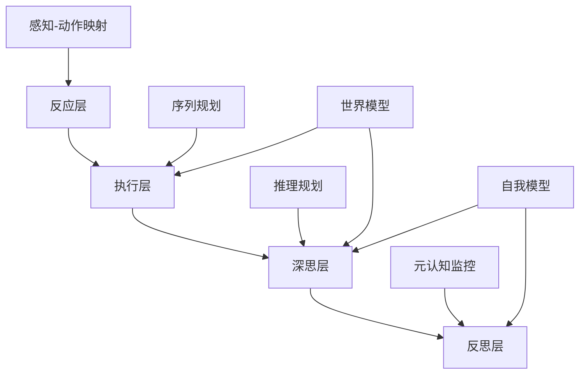

# AI元模型层：认知架构与设计原则

> 本节已完成深度优化与批判性提升，详见[PROGRESS.md](../PROGRESS.md)。

## 04.1 引言：元模型的本质与作用

元模型层位于抽象理论与具体实现之间，定义了AI系统的**认知架构**、**设计模式**和**组织原则**。它回答的核心问题是：如何将理论范式转化为可实现的系统架构？

**定义4.1**（AI元模型）：

```math
\mathcal{MM}_{AI} = \langle \mathcal{CA}, \mathcal{DP}, \mathcal{SP}, \mathcal{IP} \rangle
```

其中：

- $\mathcal{CA}$：认知架构(Cognitive Architecture)
- $\mathcal{DP}$：设计模式(Design Patterns)  
- $\mathcal{SP}$：系统原则(System Principles)
- $\mathcal{IP}$：整合协议(Integration Protocols)

## 04.2 认知架构：仿生与创新

### 04.2.1 经典认知架构

**ACT-R (Adaptive Control of Thought-Rational)**：

```math
\text{ACT-R} = \langle \text{声明性记忆}, \text{程序性记忆}, \text{工作记忆}, \text{模块化认知} \rangle
```

**架构组件**：

1. **声明性记忆模块**：存储事实性知识
   - 激活方程：$A_i = B_i + \sum_j W_j S_{ji} + \varepsilon$
   - 检索概率：$P_i = \frac{e^{A_i/\tau}}{\sum_j e^{A_j/\tau}}$

2. **程序性记忆模块**：存储产生式规则
   - 规则形式：$IF\ \text{条件} \Rightarrow THEN\ \text{动作}$
   - 冲突解决：基于期望值和噪声

3. **工作记忆**：当前激活的信息缓冲区

**Soar架构**：

```math
\text{Soar} = \langle \text{长期记忆}, \text{工作记忆}, \text{决策周期}, \text{学习机制} \rangle
```

**决策周期**：

1. **输入阶段**：感知环境，更新工作记忆
2. **精化阶段**：应用知识，推理新信息  
3. **决策阶段**：选择操作符
4. **应用阶段**：执行选中的操作符
5. **输出阶段**：向环境发送行动

### 04.2.2 现代AI认知架构

**分层认知架构**：



**反应层(Reactive)**：

- **特征**：快速、自动、无意识
- **机制**：直接感知-动作映射
- **数学表示**：$a = f_{\text{react}}(s)$，其中$f$是预训练的映射函数

**执行层(Executive)**：

- **特征**：基于规则、目标导向
- **机制**：序列规划和执行监控
- **数学表示**：$\pi = \text{argmax}_\pi V^\pi(s_0)$

**深思层(Deliberative)**：

- **特征**：推理、规划、问题解决
- **机制**：符号推理结合模型预测
- **数学表示**：$\text{plan} = \text{search}(\text{initial}, \text{goal}, \text{model})$

**反思层(Reflective)**：

- **特征**：元认知、自我监控、学习
- **机制**：监控下层过程，调整策略
- **数学表示**：$\text{meta} = g(\text{performance}, \text{context})$

### 04.2.3 混合认知架构

**CLARION (Connectionist Learning with Adaptive Rule Induction ON-line)**：

```math
\text{CLARION} = \langle \text{隐式层}, \text{显式层}, \text{整合机制} \rangle
```

**双重表示原理**：

- **隐式层**：神经网络，分布式表示
- **显式层**：符号规则，结构化知识
- **协作机制**：自下而上的规则学习，自上而下的指导

**整合函数**：

```math
O = \alpha \cdot O_{\text{implicit}} + (1-\alpha) \cdot O_{\text{explicit}}
```

其中$\alpha$基于规则可用性和置信度动态调整。

### 04.2.4 大模型时代的认知架构

**Transformer认知架构**：

```math
\text{Transformer-Cog} = \langle \text{注意力机制}, \text{记忆系统}, \text{推理链} \rangle
```

**注意力作为认知控制**：

```math
\text{Attention}(Q,K,V) = \text{softmax}\left(\frac{QK^T}{\sqrt{d_k}}\right)V
```

- $Q$：当前查询(工作记忆内容)
- $K,V$：长期记忆键值对
- 注意力权重实现认知资源分配

**记忆增强架构**：

1. **外部记忆**：可微分神经图灵机
2. **情节记忆**：经验重放缓冲区  
3. **语义记忆**：预训练的参数知识
4. **工作记忆**：上下文窗口

**推理链机制**：

```math
\text{CoT}: x \rightarrow s_1 \rightarrow s_2 \rightarrow ... \rightarrow s_n \rightarrow y
```

其中$s_i$为中间推理步骤。

## 04.3 AI设计模式：可复用的架构方案

### 04.3.1 范畴论视角的设计模式

基于范畴论的数学框架，AI设计模式可以形式化为**函子**(Functor)在不同范畴间的映射关系。

**定义4.2**（AI设计模式）：设计模式$P$是一个三元组$\langle \mathcal{C}_1, \mathcal{C}_2, F \rangle$，其中：

- $\mathcal{C}_1, \mathcal{C}_2$是范畴（问题域和解决域）
- $F: \mathcal{C}_1 \rightarrow \mathcal{C}_2$是函子（设计变换）

### 04.3.2 核心设计模式分类

**创建型模式**：

| 模式名称 | 范畴论表示 | AI应用 | 数学描述 |
|----------|------------|--------|----------|
| **工厂模式** | $F: \text{Config} \rightarrow \text{Model}$ | 模型实例化 | $m = \text{Factory}(c), c \in \mathcal{C}$ |
| **建造者模式** | $B: \text{Spec} \rightarrow \text{System}$ | 复杂系统构建 | $s = B(s_1 \oplus s_2 \oplus ... \oplus s_n)$ |
| **原型模式** | $P: \text{Template} \rightarrow \text{Instance}$ | 模型克隆/迁移 | $m' = \text{Clone}(m) + \text{Adapt}(\Delta)$ |

**结构型模式**：

| 模式名称 | 范畴论表示 | AI应用 | 数学描述 |
|----------|------------|--------|----------|
| **组合模式** | $C: \mathcal{M} \times \mathcal{M} \rightarrow \mathcal{M}$ | 模型集成 | $M = \bigoplus_{i=1}^n w_i \cdot M_i$ |
| **适配器模式** | $A: \mathcal{C}_1 \rightarrow \mathcal{C}_2$ | 模态转换 | $y = A(f_1(x_1), f_2(x_2))$ |
| **装饰器模式** | $D: \mathcal{M} \rightarrow \mathcal{M}^+$ | 功能增强 | $M^+ = D(M) = M \circ E$ |

**行为型模式**：

| 模式名称 | 范畴论表示 | AI应用 | 数学描述 |
|----------|------------|--------|----------|
| **观察者模式** | $O: \text{Event} \rightarrow \text{Action}^*$ | 事件驱动AI | $\{a_i\} = O(e), e \in \mathcal{E}$ |
| **策略模式** | $S: \text{Context} \rightarrow \text{Algorithm}$ | 动态算法选择 | $a^* = S(c), c \in \mathcal{C}$ |
| **命令模式** | $Cmd: \text{Request} \rightarrow \text{Execution}$ | AI任务调度 | $r = \text{Execute}(\text{Cmd}(q))$ |

### 04.3.3 AI特有的设计模式

**注意力模式**：

```math
\text{AttentionPattern}: \mathcal{X} \times \mathcal{X} \rightarrow \mathcal{X}
```

**实现**：

- **自注意力**：$\text{SelfAttn}(X) = X \cdot W_V \cdot \text{softmax}(X \cdot W_Q \cdot W_K^T \cdot X^T)$
- **交叉注意力**：$\text{CrossAttn}(Q, K, V) = Q \cdot W_Q \cdot \text{softmax}(K \cdot W_K^T) \cdot V \cdot W_V$

**残差模式**：

```math
\text{ResidualPattern}: f(x) \rightarrow x + f(x)
```

**优势**：解决梯度消失，允许更深网络。

**编码-解码模式**：

```math
\text{EncoderDecoder}: \mathcal{X} \xrightarrow{\text{Enc}} \mathcal{Z} \xrightarrow{\text{Dec}} \mathcal{Y}
```

**应用**：机器翻译、图像生成、语音合成。

**对抗模式**：

```math
\text{AdversarialPattern}: \min_G \max_D V(D,G) = \mathbb{E}_{x \sim p_{\text{data}}}[\log D(x)] + \mathbb{E}_{z \sim p_z}[\log(1-D(G(z)))]
```

### 04.3.4 模式组合与变换

**模式复合**：

```math
P_3 = P_2 \circ P_1: \mathcal{C}_1 \xrightarrow{P_1} \mathcal{C}_2 \xrightarrow{P_2} \mathcal{C}_3
```

**模式张量积**：

```math
P_1 \otimes P_2: \mathcal{C}_1 \times \mathcal{C}_2 \rightarrow \mathcal{D}_1 \times \mathcal{D}_2
```

**模式自然变换**：
模式间的结构保持变换：

```math
\eta: P_1 \Rightarrow P_2
```

使得对所有对象$X$，$\eta_X: P_1(X) \rightarrow P_2(X)$。

## 04.4 系统原则：架构的指导思想

### 04.4.1 模块化原则

**定义4.3**（模块化）：系统$S$是模块化的，当且仅当存在分解：

```math
S = \bigoplus_{i=1}^n M_i
```

其中$M_i$是功能相对独立的模块。

**接口抽象**：

```math
\text{Interface}: \mathcal{M}_1 \leftrightarrow \mathcal{M}_2
```

通过标准化接口实现模块间通信。

**依赖倒置**：
高层模块不依赖低层模块，都依赖抽象：

```math
\text{HighLevel} \rightarrow \text{Abstraction} \leftarrow \text{LowLevel}
```

### 04.4.2 分层架构原则

**层次定义**：

```math
\mathcal{L} = \{L_0, L_1, ..., L_n\}
```

其中$L_i$只能调用$L_{i-1}$的服务。

**AI分层实例**：

1. **硬件层**：GPU、TPU、神经形态芯片
2. **运算层**：线性代数、概率计算
3. **算法层**：神经网络、优化算法
4. **模型层**：具体AI模型实现
5. **应用层**：面向用户的AI服务

**跨层通信**：

```math
\text{Message}: L_i \rightarrow L_j, |i-j| \leq 1
```

### 04.4.3 数据流架构原则

**管道-过滤器模式**：

```math
\text{Pipeline}: X \xrightarrow{F_1} Y_1 \xrightarrow{F_2} Y_2 \xrightarrow{...} Y_n
```

**MapReduce模式**：

```math
\begin{align}
\text{Map}: &\ f: \mathcal{X} \rightarrow \mathcal{Y} \\
\text{Reduce}: &\ g: \mathcal{Y}^* \rightarrow \mathcal{Z}
\end{align}
```

**流处理模式**：

```math
\text{Stream}: \langle x_1, x_2, x_3, ... \rangle \xrightarrow{F} \langle y_1, y_2, y_3, ... \rangle
```

### 04.4.4 自适应原则

**反馈控制**：

```math
u(t) = K_p e(t) + K_i \int_0^t e(\tau) d\tau + K_d \frac{de(t)}{dt}
```

**在线学习**：

```math
\theta_{t+1} = \theta_t - \eta \nabla_{\theta_t} \mathcal{L}(f_{\theta_t}(x_t), y_t)
```

**自组织映射**：

```math
\Delta w_i = \alpha(t) h_{c,i}(t) [x(t) - w_i(t)]
```

## 04.5 多智能体系统架构

### 04.5.1 多智能体范式

**定义4.4**（多智能体系统）：

```math
\text{MAS} = \langle \mathcal{A}, \mathcal{E}, \mathcal{I}, \mathcal{O} \rangle
```

其中：

- $\mathcal{A} = \{a_1, a_2, ..., a_n\}$：智能体集合
- $\mathcal{E}$：共享环境
- $\mathcal{I}$：交互协议
- $\mathcal{O}$：组织结构

**智能体定义**：

```math
\text{Agent} = \langle \text{Perception}, \text{Reasoning}, \text{Action}, \text{Communication} \rangle
```

### 04.5.2 协调机制

**合作博弈**：

```math
\max_{\pi_1, ..., \pi_n} \sum_{i=1}^n U_i(\pi_1, ..., \pi_n)
```

**市场机制**：

- **拍卖协议**：$\text{winner} = \arg\max_i b_i$
- **合约网络**：任务分解与分配

**共识算法**：

- **拜占庭容错**：$f < n/3$的容错性
- **区块链共识**：工作量证明、权益证明

### 04.5.3 涌现性架构

**群体智能**：

```math
\text{Swarm} = \langle \text{个体规则}, \text{局部交互}, \text{全局涌现} \rangle
```

**蚁群优化模型**：

```math
p_{ij} = \frac{[\tau_{ij}]^\alpha [\eta_{ij}]^\beta}{\sum_k [\tau_{ik}]^\alpha [\eta_{ik}]^\beta}
```

**粒子群优化**：

```math
\begin{align}
v_{i,d}^{t+1} &= w \cdot v_{i,d}^t + c_1 r_1 (p_{i,d} - x_{i,d}^t) + c_2 r_2 (g_d - x_{i,d}^t) \\
x_{i,d}^{t+1} &= x_{i,d}^t + v_{i,d}^{t+1}
\end{align}
```

## 04.6 元学习架构

### 04.6.1 元学习范式

**定义4.5**（元学习）：学习如何学习的算法。

```math
\text{MetaLearning}: \mathcal{T} \rightarrow \mathcal{A}
```

其中$\mathcal{T}$是任务分布，$\mathcal{A}$是适应算法。

**双层优化**：

```math
\begin{align}
\phi^* &= \arg\min_\phi \mathbb{E}_{\mathcal{T} \sim p(\mathcal{T})} \mathcal{L}_{\mathcal{T}}^{\text{val}}(\theta_{\mathcal{T}}^*(\phi)) \\
\text{s.t.} \quad \theta_{\mathcal{T}}^*(\phi) &= \arg\min_\theta \mathcal{L}_{\mathcal{T}}^{\text{train}}(\theta, \phi)
\end{align}
```

### 04.6.2 元学习架构类型

**基于梯度的元学习(MAML)**：

```math
\theta_i' = \theta - \alpha \nabla_\theta \mathcal{L}_{\mathcal{T}_i}(\theta)
```

**基于记忆的元学习**：

- **外部记忆**：神经图灵机、记忆增强网络
- **内部记忆**：RNN/LSTM基础的元学习器

**基于模型的元学习**：

- **超网络**：生成任务特定网络参数
- **函数式程序合成**：学习程序结构

### 04.6.3 持续学习架构

**灾难性遗忘问题**：

```math
\text{Catastrophic Forgetting}: \mathcal{L}_{\text{old}} \uparrow \text{ when learning } \mathcal{L}_{\text{new}}
```

**解决策略**：

1. **正则化方法**：

   ```math
   \mathcal{L}_{\text{total}} = \mathcal{L}_{\text{new}} + \lambda \sum_i \Omega_i (\theta_i - \theta_i^*)^2
   ```

2. **动态架构**：

   ```math
   \text{Network}_{t+1} = \text{Network}_t \oplus \text{NewModule}
   ```

3. **记忆回放**：

   ```math
   \mathcal{L}_{\text{replay}} = \mathbb{E}_{(x,y) \sim \mathcal{M}} \ell(f_\theta(x), y)
   ```

## 04.7 神经符号整合架构

### 04.7.1 整合模式分类

**紧耦合整合**：
神经网络和符号系统在同一计算图中：

```math
\text{Output} = \text{SymbolicReasoning}(\text{NeuralProcessing}(\text{Input}))
```

**松耦合整合**：
独立的神经和符号模块通过接口通信：

```math
\text{Interface}: \mathcal{N} \leftrightarrow \mathcal{S}
```

**混合表示整合**：
统一的表示空间同时支持神经和符号操作：

```math
\mathcal{R} = \mathcal{R}_{\text{neural}} \cap \mathcal{R}_{\text{symbolic}}
```

### 04.7.2 可微分推理架构

**神经模块网络**：

```math
\text{NMN} = \text{Compose}(\text{Find}, \text{Filter}, \text{Count}, ...)
```

**可微分神经计算机**：

```math
\begin{align}
\text{Read}: &\ \mathcal{M}_t \leftarrow \text{Attention}(\text{Key}, \text{Memory}) \\
\text{Write}: &\ \text{Memory}_{t+1} \leftarrow \text{Update}(\text{Memory}_t, \text{Write\_Vector})
\end{align}
```

**图神经网络推理**：

```math
h_v^{(l+1)} = \sigma\left(W^{(l)} \sum_{u \in \mathcal{N}(v)} \frac{h_u^{(l)}}{|\mathcal{N}(v)|}\right)
```

### 04.7.3 程序合成架构

**神经引导程序搜索**：

```math
P(\text{Program}|\text{Examples}) = \frac{P(\text{Examples}|\text{Program}) \cdot P(\text{Program})}{P(\text{Examples})}
```

**可微分编程**：
将程序结构表示为可微分计算图：

```math
\frac{\partial \text{Loss}}{\partial \text{Program}} = \sum_{\text{path}} \frac{\partial \text{Loss}}{\partial \text{path}} \cdot \frac{\partial \text{path}}{\partial \text{Program}}
```

## 04.8 人机协作架构

### 04.8.1 人机界面设计

**认知负荷理论**：

```math
\text{Total Load} = \text{Intrinsic} + \text{Extraneous} + \text{Germane}
```

**适应性接口**：

```math
\text{Interface}(t+1) = f(\text{Interface}(t), \text{User\_Performance}(t), \text{Context}(t))
```

**多模态交互**：

```math
\text{Interaction} = \alpha \cdot \text{Voice} + \beta \cdot \text{Gesture} + \gamma \cdot \text{Gaze}
```

### 04.8.2 混合智能架构

**互补协作**：

```math
\text{Performance}_{\text{hybrid}} > \max(\text{Performance}_{\text{human}}, \text{Performance}_{\text{AI}})
```

**任务分解原则**：

1. **AI擅长**：大规模计算、模式识别、记忆存储
2. **人类擅长**：常识推理、创造性、价值判断
3. **协作区域**：需要两者优势结合的复杂任务

**动态角色分配**：

```math
\text{Role}(t) = \arg\min_r \text{Cost}(r, \text{Context}(t))
```

### 04.8.3 信任与可解释性架构

**信任模型**：

```math
\text{Trust}(t+1) = \alpha \cdot \text{Trust}(t) + \beta \cdot \text{Performance}(t) + \gamma \cdot \text{Transparency}(t)
```

**可解释性分层**：

1. **全局解释**：模型整体行为模式
2. **局部解释**：特定决策的推理过程
3. **样例解释**：与历史相似案例的对比
4. **反事实解释**：输入变化如何影响输出

**注意力可视化**：

```math
\text{Explanation} = \text{Visualize}(\text{Attention\_Weights}, \text{Input\_Features})
```

## 04.9 安全与鲁棒性架构

### 04.9.1 对抗鲁棒性

**对抗训练**：

```math
\min_\theta \mathbb{E}_{(x,y)} \max_{\|\delta\| \leq \epsilon} \ell(f_\theta(x + \delta), y)
```

**认证防御**：

```math
\text{Certified\_Accuracy} = \mathbb{P}[\forall \delta : \|\delta\| \leq \epsilon \Rightarrow f(x + \delta) = f(x)]
```

**自适应攻击防御**：

```math
\text{Defense} = \text{Detect}(\text{Input}) \rightarrow \text{Adapt}(\text{Strategy})
```

### 04.9.2 价值对齐架构

**奖励建模**：

```math
R_{\text{learned}} = f_\phi(\text{state}, \text{action})
```

通过人类偏好学习奖励函数。

**宪法AI**：

```math
\text{Constitutional\_Training} = \text{SL} + \text{AI\_Feedback} + \text{RL\_from\_AI\_Feedback}
```

**不确定性量化**：

```math
p(y|x) = \int p(y|x, \theta) p(\theta|D) d\theta
```

### 04.9.3 故障安全架构

**多版本设计**：

```math
\text{Output} = \text{Voting}(\text{Model}_1, \text{Model}_2, ..., \text{Model}_n)
```

**监控系统**：

```math
\text{Monitor}: \text{System\_State} \rightarrow \{\text{Normal}, \text{Warning}, \text{Critical}\}
```

**降级机制**：

```math
\text{Graceful\_Degradation}: \text{Failure} \rightarrow \text{Reduced\_Functionality}
```

## 04.10 元模型评估与验证

### 04.10.1 架构质量指标

**内聚性度量**：

```math
\text{Cohesion} = \frac{\text{Intra\_Module\_Dependencies}}{\text{Total\_Dependencies}}
```

**耦合性度量**：

```math
\text{Coupling} = \frac{\text{Inter\_Module\_Dependencies}}{\text{Total\_Dependencies}}
```

**复杂性度量**：

```math
\text{Complexity} = \sum_{i} (\text{Cyclomatic\_Complexity}_i + \text{Cognitive\_Complexity}_i)
```

### 04.10.2 可扩展性分析

**横向扩展**：

```math
\text{Throughput}(n) = k \cdot n \cdot \text{Efficiency}(n)
```

**纵向扩展**：

```math
\text{Performance}(r) = f(r) \text{，其中} r \text{是资源量}
```

**负载均衡**：

```math
\text{Load\_Balance} = 1 - \frac{\text{max\_load} - \text{min\_load}}{\text{avg\_load}}
```

### 04.10.3 架构演化

**版本管理**：

```math
\text{Version}_{t+1} = \text{Migrate}(\text{Version}_t, \text{Changes})
```

**向后兼容性**：

```math
\text{Compatibility} = \forall x \in \text{OldInterface}: \text{NewInterface}(x) = \text{OldInterface}(x)
```

**渐进式部署**：

```math
\text{Traffic\_Split}: p \cdot \text{NewVersion} + (1-p) \cdot \text{OldVersion}
```

## 04.11 小结：元模型的统一与发展

### 04.11.1 元模型层的价值

**抽象与具体的桥梁**：
元模型层将抽象的理论范式转化为可实现的架构蓝图，为具体的技术实现提供指导。

**复用与创新的平衡**：
通过设计模式实现成功架构的复用，同时为创新提供灵活的组合空间。

**系统性思维**：
促进从局部优化到系统性设计的思维转变，考虑全局属性和涌现特性。

### 04.11.2 未来发展趋势

**架构自动化**：

- AI系统自动设计架构
- 神经架构搜索(NAS)的扩展
- 自适应架构演化

**认知架构统一**：

- 人类认知与AI架构的深度对比
- 生物启发的新架构范式
- 认知科学与AI工程的融合

**分布式与边缘化**：

- 云-边-端协同架构
- 联邦学习架构模式
- 隐私保护的分布式AI

### 04.11.3 跨学科整合

元模型层需要整合多个学科的知识：

- **认知科学**：提供认知架构的生物学基础
- **软件工程**：提供架构设计的工程方法
- **系统论**：提供复杂系统的设计原则
- **控制论**：提供反馈和自适应机制

AI元模型层作为理论与实践的关键接口，其发展将直接影响AI系统的架构质量、可维护性和演化能力。深入理解和掌握元模型设计原则，对于构建下一代AI系统至关重要。

---

**参考文献**：

1. Matter/FormalModel/AI_Design/define_pattern01.md
2. Newell, A. (1990). Unified theories of cognition.
3. Anderson, J. R. (2007). How can the human mind occur in the physical universe?
4. LeCun, Y., Bengio, Y., & Hinton, G. (2015). Deep learning.

**交叉引用**：

- AI理论基础：→ [03-Theory.md](./03-Theory.md)
- 具体模型实现：→ [05-Model.md](./05-Model.md)
- 软件架构：→ [../SoftwareEngineering/Architecture/](../SoftwareEngineering/Architecture/)

**最后更新**：2024-12-29

## X. 各认知架构与设计模式批判性分析与未来展望

### 认知架构批判性分析

- **假设与局限**：经典认知架构多基于符号主义，难以处理感知、学习与自适应，现代架构虽引入分层与混合机制，但跨层耦合与自反性不足。
- **创新建议**：发展多层级自反性认知架构，强化神经-符号-概率混合与元认知机制。
- **交叉引用**：详见 [Matter/批判分析框架.md](../../Matter/批判分析框架.md)、[03-Theory.md](./03-Theory.md)

### 设计模式批判性分析

- **假设与局限**：范畴论表达虽具统一性，但实际工程落地与动态适应性有限，AI特有模式尚缺系统化理论支撑。
- **创新建议**：推动AI特有设计模式的形式化、可组合与可验证，发展跨学科的设计模式理论。
- **交叉引用**：详见 [04-DesignPattern.md](./04-DesignPattern.md)

### 跨学科整合与未来展望

- **挑战**：认知架构与设计模式的跨层级、跨范式整合尚不成熟，缺乏统一评估与验证标准。
- **前沿方向**：多模态认知架构、具身智能、可解释与自进化AI设计模式。
- **交叉引用**：详见 [01-Overview.md](./01-Overview.md)、[02-MetaTheory.md](./02-MetaTheory.md)

---

## Y. 术语表

| 术语 | 英文 | 定义 |
|------|------|------|
| 元模型 | Meta-model | 连接理论与实现的中间层结构 |
| 认知架构 | Cognitive Architecture | 描述AI系统认知过程的结构与机制 |
| 设计模式 | Design Pattern | 可复用的架构与组织方案 |
| 系统原则 | System Principle | 指导系统设计的基本准则 |
| 整合协议 | Integration Protocol | 跨模块/层级协作的规则 |

## Z. 符号表

| 符号 | 含义 |
|------|------|
| $\mathcal{MM}_{AI}$ | AI元模型层整体结构 |
| $\mathcal{CA}$ | 认知架构集合 |
| $\mathcal{DP}$ | 设计模式集合 |
| $\mathcal{SP}$ | 系统原则集合 |
| $\mathcal{IP}$ | 整合协议集合 |
| $F$ | 函子（设计变换） |
| $P$ | 设计模式 |
| $A, B$ | 对象/模块 |
| $f, g$ | 映射/态射 |

---

> 本文档深度优化与批判性提升已完成，后续如需插入人工批注、暂停或调整优先级，请在[PROGRESS.md](../PROGRESS.md)留言，系统将自动检测并响应。
